# Guía de flujos y casos de uso: qué archivos se ejecutan en cada caso

Guía para demostrarle al tutor empresarial **cada caso de uso de negocio** y, en cada uno, **qué archivos `.ts` se ejecutan y en qué orden**: desde la pantalla donde escribe el empleado (`App.tsx`), pasando por los archivos del backend, hasta la base de datos y de vuelta. Complementa a [`Guia-Demostracion-Pasantia.md`](Guia-Demostracion-Pasantia.md), que cubre los objetivos de la pasantía.

Estado verificado contra el código de `main` en **v3.21** (2026-09-25). Todas las rutas son relativas a `src/`.

**Cómo leer cada caso de uso**: *Qué demuestra* → *Precondiciones* → *Cómo ejecutarlo* (comando o prompt literal) → *Qué se espera ver* → **Archivos que se ejecutan** (diagrama + tabla en orden) → *Cómo verificarlo* → *Cuidado en la demo*.

---

## Índice

1. [Preparación](#1-preparación)
2. [Cómo está organizado el código](#2-cómo-está-organizado-el-código)
3. [Los cinco caminos de entrada](#3-los-cinco-caminos-de-entrada)
4. [Mecanismos transversales](#4-mecanismos-transversales)
5. [Casos de uso](#5-casos-de-uso)
6. [Guion sugerido](#6-guion-sugerido)
7. [Problemas conocidos y cómo responderlos](#7-problemas-conocidos-y-cómo-responderlos)

---

## 1. Preparación

### 1.1 Usar una base de demostración, nunca la real

La app **aplica migraciones y escribe** en la base que abre. Para la demo, apuntala a una base propia con la variable `HARNESS_DB_PATH` (la leen la TUI y los CLI). Si el archivo no existe, la app lo crea vacío y migrado.

Todo en **una misma ventana de PowerShell**, desde la raíz del repo:

```powershell
$env:HARNESS_DB_PATH="$PWD\data\demo.db"; echo $env:HARNESS_DB_PATH
```

> **Verificá que se respetó.** En esta pasantía ya pasó dos veces que la TUI terminó escribiendo en `data/harness.db` aunque la variable estaba puesta (causa no investigada; revisá si tu `.env` define `HARNESS_DB_PATH`). Después de arrancar la TUI, confirmá qué archivo cambió:
>
> ```powershell
> Get-Item data\demo.db, data\harness.db-wal -ErrorAction SilentlyContinue | Select-Object Name, LastWriteTime
> ```
>
> Si el que se actualizó es `harness.db-wal`, la TUI está usando la base real: cerrala y corregí antes de seguir.

### 1.2 Sembrar dos empleados

Varios casos exigen **dos personas distintas** (quien vende no puede aprobar su propio reembolso; quien pide no puede aprobar su propia solicitud). Creá un administrador y un vendedor con el CLI (la clave entra por stdin, nunca como argumento):

```powershell
"clave-admin" | npm run empleados:crear -- admin
npm run empleados:crear -- admin --rol administrador
"clave-vende" | npm run empleados:crear -- vendedor
```

Roles existentes: `empleado` (por defecto) y `administrador`.

### 1.3 Canales y variables

| Canal | Cómo se habilita | Dónde |
| --- | --- | --- |
| Chat web (**canal de los empleados**) | `WEB_PORT` > 0 (apagado si falta) | `http://localhost:<WEB_PORT>/chat` (tu último arranque lo levantó en **8090**) |
| TUI (administración y comandos `/`) | Siempre | `npm run dev` |
| A2A entrante | `HARNESS_A2A_ENTRANTE_TOKEN` no vacío | `http://localhost:8888` |
| A2A saliente | `HARNESS_A2A_SALIENTE=on` + `HARNESS_A2A_ENDPOINT_KPI_INCIDENTE` | Sale hacia el agente externo |
| Bot de PRs (webhook) | `GITHUB_WEBHOOK_SECRET` no vacío | `http://localhost:8787/webhooks/github` |

Parámetros de negocio (defaults): `COMISION_PORCENTAJE=0.1`, `REEMBOLSO_UMBRAL=500`, `VENTA_GRANDE_UMBRAL=5000`. Sesión: 480 minutos de tope absoluto y 30 de inactividad.

### 1.4 Tener a mano

- Una segunda ventana con el log en vivo: `Get-Content data\harness.log -Wait -Tail 5`. Cada caso nombra el evento que tiene que aparecer.
- Consultas de solo lectura: `sqlite3 -readonly data\demo.db "<consulta>"`.

---

## 2. Cómo está organizado el código

### 2.1 Tres zonas

El arnés es **un solo programa** en TypeScript con **arquitectura hexagonal**. Los archivos se reparten en tres zonas, y todo recorrido va de afuera hacia el centro y de vuelta:

| Zona | Carpeta | Qué hay | Regla |
| --- | --- | --- | --- |
| **Adaptadores** | `adapters/*` | Lo que toca el mundo exterior: la pantalla (`tui/App.tsx`), el servidor web, SQLite, el email, otros agentes | Nunca hablan entre sí |
| **Cableado** | `build-on-*.ts` (raíz de `src/`) y `main.ts` | Arman, para cada canal, el manejador que conecta un adaptador con el núcleo | `main.ts` es el único archivo que conoce a todos |
| **Núcleo** | `core/*` | Las reglas de negocio: comandos, sesiones, ventas, solicitudes, orquestación de turnos | **Nunca importa nada de `adapters/`** |

**El patrón que se repite en cada caso** (y conviene explicárselo al tutor una vez): el núcleo define un **contrato** (por ejemplo `core/ventas/ventas-contract.ts` dice "necesito poder guardar una venta") y un adaptador lo **implementa** (`adapters/memory/repository.ts` lo hace con SQLite). El núcleo nunca sabe que hay SQLite abajo.

### 2.2 Los archivos que aparecen en los recorridos

| Archivo | Zona | Qué hace |
| --- | --- | --- |
| `main.ts` | Cableado | Arranca todo: abre la base, crea los adaptadores y los conecta |
| `core/startup/bootstrap.ts` | Núcleo | Carga agentes, registra hooks y descubre skills al arrancar |
| `adapters/tui/start-tui.tsx` | Adaptador | Monta la aplicación de terminal (Ink) |
| `adapters/tui/App.tsx` | Adaptador | La pantalla: captura lo que escribe el empleado y muestra las respuestas |
| `build-on-comando-empleado.ts` | Cableado | **El portero de la TUI**: recibe cada línea, decide si es comando `/` o conversación, controla sesión y rol |
| `core/commands/comando-empleado.ts` | Núcleo | El registro de comandos `/`: los reconoce, valida su sintaxis y enmascara claves |
| `core/auth/login.ts` | Núcleo | Resuelve un intento de login |
| `core/auth/sesion.ts` | Núcleo | Crea sesiones y calcula sus vencimientos |
| `core/auth/autorizacion-resolucion.ts` | Núcleo | Decide si alguien es administrador y puede resolver asuntos ajenos |
| `adapters/crypto/password.ts` | Adaptador | Hash y verificación de claves con scrypt |
| `build-on-operaciones-empleado.ts` | Cableado | Prepara una conversación con el agente: crea el caso, arma el prompt y le da las herramientas |
| `core/agents/definitions.ts` | Núcleo | Define los agentes: el de operaciones del empleado y los subagentes |
| `core/turn-selector/handle-turn.ts` | Núcleo | Orquesta un turno completo de conversación |
| `core/turn-selector/resolve-turn.ts` | Núcleo | Elige qué agente atiende el turno |
| `core/turn-selector/assemble-context.ts` | Núcleo | Recupera la memoria del caso para que el agente recuerde lo anterior |
| `core/turn-selector/invoke-model.ts` | Núcleo | Llama al **Claude Agent SDK** con el agente, las skills y las herramientas |
| `core/turn-selector/close-turn.ts` | Núcleo | Guarda el resultado del turno |
| `core/hooks/hook-engine.ts` | Núcleo | Ejecuta los hooks `PRE_TURN` y `POST_TURN` (`log-pre-turn-handler.ts`, `log-post-turn-handler.ts`) |
| `core/skills/skills-habilitadas.ts` | Núcleo | Lista las skills de `.claude/skills/` que el agente puede usar |
| `adapters/operaciones/index.ts` | Adaptador | La herramienta `operacion_negocio` que ve el modelo; recibe su llamada |
| `core/operaciones/validar-operacion.ts` | Núcleo | Valida estrictamente los datos que mandó el modelo |
| `core/operaciones/ejecutar-operacion.ts` | Núcleo | **El despachador de operaciones**: aplica permisos y confirmación en dos turnos, y llama al archivo de dominio correcto |
| `adapters/web/confirmacion-operaciones-store.ts` | Adaptador | Guarda las confirmaciones pendientes (hay una instancia para la TUI y otra para la web) |
| `core/ventas/*.ts` | Núcleo | Un archivo por regla de ventas (ver cada caso) |
| `core/solicitudes/*.ts` | Núcleo | Un archivo por regla de solicitudes |
| `adapters/memory/repository.ts` | Adaptador | **Todas** las lecturas y escrituras en SQLite, incluida la auditoría |
| `adapters/memory/db.ts` | Adaptador | Abre la base y aplica migraciones |
| `adapters/notificaciones/index.ts`, `email-client.ts` | Adaptador | Envían el email al cliente |
| `adapters/knowledge/*.ts` | Adaptador | Consultan la base de conocimiento con Graphify |
| `core/turn-selector/dispatch-delegation-a2a.ts` | Núcleo | Registra y lanza una consulta a un agente externo |
| `adapters/a2a/index.ts`, `client.ts` | Adaptador | Cliente A2A: hablan con agentes externos |
| `adapters/a2a/server-index.ts`, `server.ts` | Adaptador | Servidor A2A: reciben preguntas de agentes externos |
| `build-on-a2a-entrante.ts` | Cableado | Prepara el turno para una pregunta externa |
| `adapters/consultas/index.ts` + `core/agents/consultas-negocio-tool.ts` | Adaptador + Núcleo | Las cuatro consultas de solo lectura para agentes externos |
| `adapters/web/server.ts` | Adaptador | Servidor HTTP del chat web y del link de confirmación |
| `adapters/web/sesion-empleado-store.ts` | Adaptador | Sesiones del chat web |
| `build-on-login-http.ts` | Cableado | Login del chat web |
| `build-on-venta.ts` | Cableado | Conecta el link de confirmación del cliente con el dominio de ventas |
| `core/logging/turn-logger.ts` | Núcleo | Escribe cada evento en `data/harness.log` |

### 2.3 Qué pasa al correr `npm run dev`

`npm run dev` ejecuta `tsx src/main.ts`, y los archivos corren en este orden:

1. `main.ts` llama a `core/startup/bootstrap.ts`, que carga `core/agents/definitions.ts`, registra los hooks en `core/hooks/hook-engine.ts` y descubre las skills con `core/skills/descubrir-skills.ts`.
2. `adapters/memory/config.ts` resuelve la ruta de la base (`HARNESS_DB_PATH`) y `adapters/memory/db.ts` la abre y aplica las migraciones de `adapters/memory/migrations/`.
3. `core/auth/auth-config.ts` y `core/ventas/ventas-config.ts` validan la configuración. Si es inválida, el arranque se aborta.
4. `main.ts` construye los manejadores (`build-on-*.ts`) y levanta los canales: `adapters/tui/start-tui.tsx`, `adapters/webhooks/index.ts`, `adapters/web/index.ts` y `adapters/a2a/server-index.ts`. Si un puerto está ocupado, ese canal queda apagado y registrado en el log, pero **la TUI sigue funcionando**.

### 2.4 Tablas principales (SQLite)

| Tabla | Para qué |
| --- | --- |
| `casos`, `sesiones_agente` | Cada conversación o trámite es un caso; guarda la sesión del agente para recordar turnos anteriores |
| `vendedores`, `ventas`, `comisiones` | Ventas, su estado y la comisión generada al confirmar |
| `registro_acciones_empleado` | **Auditoría**: quién hizo qué y con qué resultado |
| `credenciales_empleado`, `roles_empleado` | Hash de la clave y rol de cada empleado |
| `solicitudes_internas` | Vacaciones y gastos |
| `justificaciones_devolucion` | Motivo de las devoluciones pedidas sin token |
| `delegaciones_a2a`, `solicitudes_a2a_entrantes` | Consultas hechas a agentes externos y preguntas recibidas |
| `propuestas_cambio` | Cambios propuestos por el bot de PRs, pendientes de decisión humana |

---

## 3. Los cinco caminos de entrada

Todo pedido entra por uno de estos caminos. Los casos de uso de la sección 5 reutilizan estos recorridos y agregan sus archivos de dominio.

### Camino A: comando `/` en la TUI (sin IA)

El pedido **nunca llega al modelo**: lo resuelve código determinista.

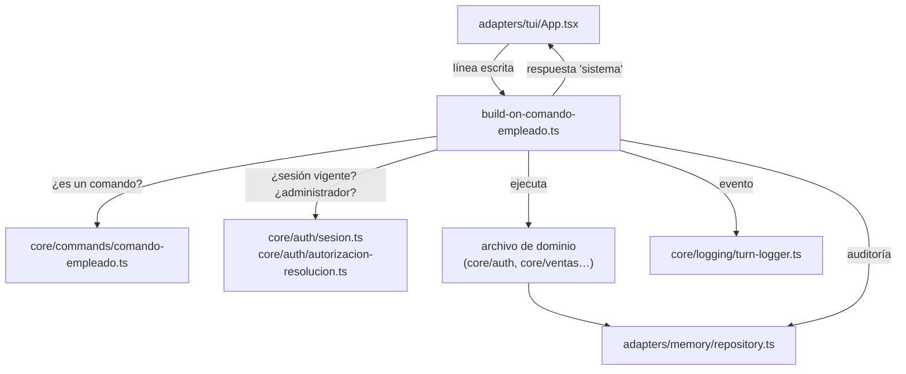

| # | Archivo | Qué hace |
| --- | --- | --- |
| 1 | `adapters/tui/App.tsx` | El empleado presiona Enter; la pantalla le pasa la línea al manejador que le dio `main.ts` |
| 2 | `build-on-comando-empleado.ts` | Revisa si la sesión venció y le pregunta al registro de comandos qué es la línea |
| 3 | `core/commands/comando-empleado.ts` | Reconoce el comando, sus argumentos y qué exige (sesión, administrador, clave secreta) |
| 4 | `core/auth/sesion.ts`, `core/auth/autorizacion-resolucion.ts` | El portero verifica sesión vigente y, si hace falta, rol de administrador |
| 5 | Archivo de dominio del comando | Ejecuta la acción |
| 6 | `adapters/memory/repository.ts` | Lee o escribe en SQLite y guarda la fila de auditoría |
| 7 | `core/logging/turn-logger.ts` | Escribe `comando-empleado-recibido` en el log |
| 8 | `adapters/tui/App.tsx` | Muestra la respuesta como mensaje del emisor `sistema` |

### Camino B: conversación en la TUI (con IA)

Todo lo que **no** empieza con `/`, con sesión abierta. En la operación diaria los empleados conversan desde el **chat web** (camino C); este camino muestra que la TUI también puede hacerlo. Desde `build-on-operaciones-empleado.ts` en adelante, los dos caminos ejecutan exactamente los mismos archivos.

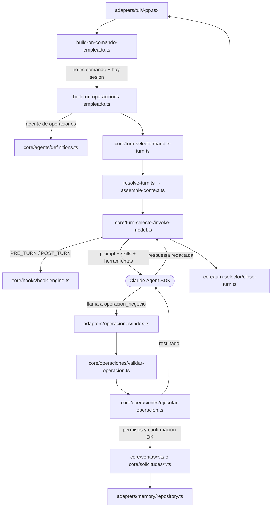

| # | Archivo | Qué hace |
| --- | --- | --- |
| 1 | `adapters/tui/App.tsx` | Le pasa el texto al portero |
| 2 | `build-on-comando-empleado.ts` | `comando-empleado.ts` no lo reconoce como comando y hay sesión: lo deriva a conversación |
| 3 | `build-on-operaciones-empleado.ts` | Crea un **caso**, arma el prompt con la identidad del empleado y prepara las herramientas `operaciones` y `knowledge` |
| 4 | `core/agents/definitions.ts` | Aporta la definición del agente de operaciones del empleado |
| 5 | `core/turn-selector/handle-turn.ts` | Orquesta el turno |
| 6 | `core/turn-selector/resolve-turn.ts` | Confirma qué agente atiende |
| 7 | `core/turn-selector/assemble-context.ts` | Recupera de la base la sesión previa del caso (memoria multi-turno) |
| 8 | `core/turn-selector/invoke-model.ts` | Dispara `PRE_TURN` en `hook-engine.ts` y llama al **Claude Agent SDK** con el agente, las skills de `.claude/skills/` y las herramientas |
| 9 | Claude Agent SDK (externo) | El modelo lee la **skill** del trámite, junta los datos y llama a la herramienta `operacion_negocio` |
| 10 | `adapters/operaciones/index.ts` | Recibe la llamada de la herramienta |
| 11 | `core/operaciones/validar-operacion.ts` | Valida estrictamente los datos |
| 12 | `core/operaciones/ejecutar-operacion.ts` | Toma la identidad **de la sesión, nunca del modelo**, controla el rol, aplica la confirmación en dos turnos si corresponde y llama al archivo de dominio |
| 13 | `core/ventas/*.ts` / `core/solicitudes/*.ts` | Aplica la regla de negocio |
| 14 | `adapters/memory/repository.ts` | Escribe en SQLite y guarda la auditoría |
| 15 | Vuelta | El resultado vuelve al modelo, que redacta la respuesta; `invoke-model.ts` dispara `POST_TURN`, `close-turn.ts` guarda el turno y `App.tsx` lo muestra |

**Para decir**: "El modelo decide *qué* trámite es y arma los datos. `ejecutar-operacion.ts` decide *si se puede*. Identidad, permisos y confirmaciones los controla código, no la IA".

### Camino C: chat web (el canal de los empleados)

Es donde los empleados registran ventas, piden devoluciones, resuelven reembolsos y gestionan solicitudes. Los recorridos completos, archivo por archivo, están en cada caso de uso de la sección 5.

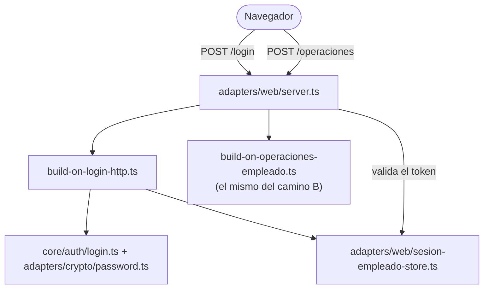

`adapters/web/server.ts` valida el token de sesión y le entrega el mensaje **al mismo `build-on-operaciones-empleado.ts`** que usa la TUI. Desde ahí, los archivos que se ejecutan son idénticos al camino B.

**Qué se comparte y qué no**: la TUI y el chat web comparten **la base de datos** (`repository.ts`). **No** comparten la conversación: el chat web guarda la suya en `adapters/web/conversacion-empleado-store.ts`, en memoria.

### Camino D: A2A entrante (otro agente le pregunta al arnés)

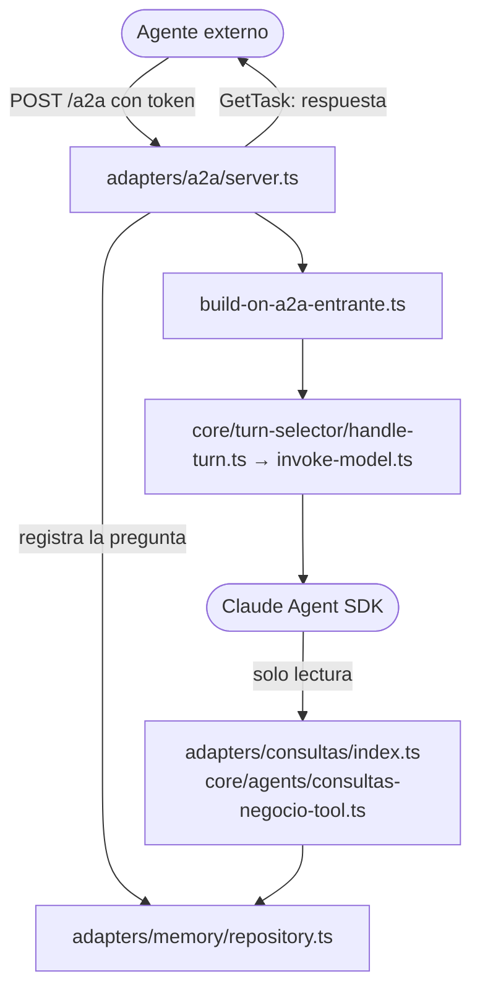

`build-on-a2a-entrante.ts` le da al agente **solo** la herramienta de consultas, que no puede escribir.

### Camino E: webhook de GitHub

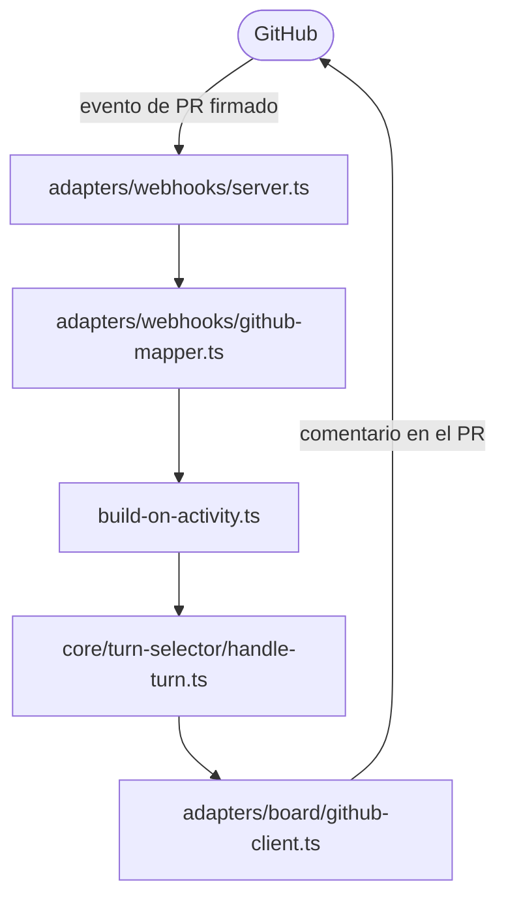

---

## 4. Mecanismos transversales

| Mecanismo | Archivo | Cómo funciona |
| --- | --- | --- |
| **Sesión** | `core/auth/sesion.ts` | Dos vencimientos: tope absoluto (480 min) e inactividad (30 min, se renueva con cada uso). Hacen falta los dos vigentes |
| **Clave** | `adapters/crypto/password.ts`, `core/commands/comando-empleado.ts` | Se guarda como hash (scrypt). En la TUI se muestra con `*` y no queda en el historial (ADR 300) |
| **Roles** | `core/auth/autorizacion-resolucion.ts` | `empleado` o `administrador`. Resolver asuntos ajenos y consultar KPIs exige administrador |
| **Autoaprobación prohibida** | `core/ventas/resolver-escalacion-reembolso.ts`, `core/solicitudes/resolver-solicitud-interna.ts` | Nadie aprueba lo propio, **aunque sea administrador** |
| **Confirmación en dos turnos** | `core/operaciones/ejecutar-operacion.ts` + `adapters/web/confirmacion-operaciones-store.ts` | Las operaciones delicadas primero muestran qué van a hacer y **esperan un mensaje nuevo** del empleado. El modelo no puede confirmar solo |
| **Auditoría** | `adapters/memory/repository.ts` | Cada acción queda en `registro_acciones_empleado`, que solo admite agregar filas |
| **Log** | `core/logging/turn-logger.ts` | Una línea JSON por evento en `data/harness.log` |
| **Skills** | `.claude/skills/*/SKILL.md`, `core/skills/` | 14 procedimientos: qué datos pedir, qué no inventar, cuándo confirmar |
| **Hooks** | `core/hooks/hook-engine.ts` | Dos puntos propios del arnés: `PRE_TURN` y `POST_TURN` (no son los hooks nativos del SDK) |
| **Subagentes** | `core/agents/definitions.ts`, `core/turn-selector/dispatch-delegation.ts` | `planner`, `developer`, `reviewer` y `validador-solicitudes`, lanzados por el despachador del arnés |
| **Concurrencia** | `adapters/memory/repository.ts` | Los cambios de estado solo se aplican si el estado es el esperado: si dos personas actúan a la vez, gana una y la otra recibe "no aplicable" |

---

## 5. Casos de uso

Cada caso lista **todos** los archivos que se ejecutan, en orden, sin abreviar. **Los empleados trabajan en el chat web**, así que ventas, devoluciones, reembolsos, solicitudes y consultas se muestran entrando por el navegador (`adapters/web/chat-client.ts` → `adapters/web/server.ts`). La TUI queda para los comandos `/` de administración (CU-01, `/reporte-comisiones`, `/consultar-kpi`, `/ver-solicitudes-a2a`, `/estado-bot-prs`). Los mismos pedidos conversacionales también funcionan escritos sin `/` en la TUI: desde `build-on-operaciones-empleado.ts` en adelante se ejecutan exactamente los mismos archivos.

Los casos conversacionales comparten el tramo de ida (de `chat-client.ts` a `validar-operacion.ts`) y el de vuelta (de `adapters/operaciones/index.ts` a `chat-client.ts`); igual se repiten completos en cada caso para que cada uno se lea solo.

### CU-01 · Ingreso, alta de empleados y roles

**Qué demuestra**: autenticación, autorización por rol, auditoría y enmascarado de la clave. No interviene la IA.

**Precondiciones**: empleados sembrados (1.2).

**Cómo ejecutarlo**:

1. `/login vendedor clave-vende`. Mientras tipeás, la clave aparece con `*`.
2. `/crear-empleado nuevo clave-nuevo`. **Esperado**: rechazo, porque `vendedor` no es administrador.
3. `/logout`, luego `/login admin clave-admin`.
4. `/crear-empleado nuevo clave-nuevo` y `/asignar-rol nuevo administrador`. **Esperado**: los dos exitosos.
5. `/ayuda`: lista los comandos disponibles.

**Qué se espera ver**: "Sesión abierta como vendedor. Vence …" en el paso 1; rechazo en el paso 2; éxito en el paso 4.

**Qué pasa, en palabras simples**: el comando nunca pasa por la IA. La pantalla le entrega la línea al portero de la TUI, que reconoce que es `/login` gracias al registro de comandos. El portero le pide al servicio de login que busque la clave guardada y la compare; si coincide, se crea una sesión con fecha de vencimiento y se deja constancia en la auditoría. Si el comando exige ser administrador (como `/crear-empleado`), el portero consulta el rol antes de hacer nada y corta si no corresponde.

**Componentes que se ejecutan — `/login` (paso 1)**:

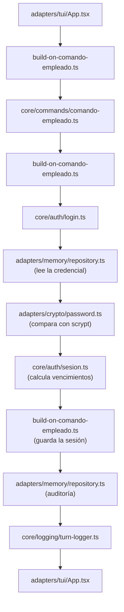

**1. `adapters/tui/App.tsx`**
- *Qué es*: la pantalla de la terminal, un componente hecho con Ink (React para consola). Dibuja la conversación y la línea donde escribe el empleado. No contiene reglas de negocio.
- *Qué ejecuta en este paso*: Captura `/login vendedor clave-vende`. Como el comando está marcado como secreto en `comando-empleado.ts`, muestra la clave con `*` y la guarda enmascarada en el historial
- *Cómo sigue*: Llama a `onSubmit`, la función que le inyectó `main.ts`, con el texto crudo

**2. `build-on-comando-empleado.ts`**
- *Qué es*: el portero de la TUI. Es un archivo de cableado que arma `main.ts` al arrancar: recibe cada línea que escribe el empleado y decide si es un comando `/` o una conversación, controlando sesión y rol.
- *Qué ejecuta en este paso*: El portero: descarta la sesión anterior si venció
- *Cómo sigue*: Le pasa el texto a `parsearComando`

**3. `core/commands/comando-empleado.ts`**
- *Qué es*: el registro de comandos del núcleo. Contiene la lista `COMANDOS` con cada comando `/`, su sintaxis y lo que exige (sesión, administrador, clave secreta). Convierte texto en un comando estructurado.
- *Qué ejecuta en este paso*: Reconoce `/login` en su registro `COMANDOS` y separa usuario y clave
- *Cómo sigue*: Devuelve al portero un objeto `{ tipo: "login", empleadoId, password }`

**4. `build-on-comando-empleado.ts`**
- *Qué es*: el portero de la TUI. Es un archivo de cableado que arma `main.ts` al arrancar: recibe cada línea que escribe el empleado y decide si es un comando `/` o una conversación, controlando sesión y rol.
- *Qué ejecuta en este paso*: Ve que es un login
- *Cómo sigue*: Llama a `resolverLogin` de `login.ts`, dándole usuario, clave y las herramientas que necesita: el acceso a credenciales (implementado por `repository.ts`) y el verificador de claves (`password.ts`)

**5. `core/auth/login.ts`**
- *Qué es*: la regla de login del núcleo. Coordina la búsqueda de la credencial y la verificación de la clave sin saber que abajo hay SQLite.
- *Qué ejecuta en este paso*: Coordina el intento de login. No sabe que abajo hay SQLite: pide la credencial a través del contrato `credenciales-contract.ts`
- *Cómo sigue*: Pide la credencial al acceso a datos

**6. `adapters/memory/repository.ts`**
- *Qué es*: el adaptador de base de datos (bloque "Memoria Compartida" del arc42). Implementa todos los contratos del núcleo con consultas SQL sobre SQLite, incluida la auditoría.
- *Qué ejecuta en este paso*: Lee el hash de la clave en `credenciales_empleado`
- *Cómo sigue*: Devuelve el hash (o nada, si el usuario no existe) a `login.ts`

**7. `adapters/crypto/password.ts`**
- *Qué es*: el adaptador criptográfico: calcula y verifica hashes de claves con el algoritmo scrypt.
- *Qué ejecuta en este paso*: Compara la clave con el hash usando scrypt. Si el usuario no existía, compara contra un hash de relleno para que el tiempo de respuesta no revele qué usuarios existen
- *Cómo sigue*: Devuelve verdadero o falso a `login.ts`

**8. `core/auth/sesion.ts`**
- *Qué es*: las reglas de sesión: cuándo vence por tiempo total y por inactividad.
- *Qué ejecuta en este paso*: Calcula los dos vencimientos: tope absoluto (480 min) e inactividad (30 min)
- *Cómo sigue*: `login.ts` devuelve la sesión nueva al portero

**9. `build-on-comando-empleado.ts`**
- *Qué es*: el portero de la TUI. Es un archivo de cableado que arma `main.ts` al arrancar: recibe cada línea que escribe el empleado y decide si es un comando `/` o una conversación, controlando sesión y rol.
- *Qué ejecuta en este paso*: Guarda la sesión en la memoria del proceso de la TUI (no en la base)
- *Cómo sigue*: Llama a `repository.ts` para la auditoría

**10. `adapters/memory/repository.ts`**
- *Qué es*: el adaptador de base de datos (bloque "Memoria Compartida" del arc42). Implementa todos los contratos del núcleo con consultas SQL sobre SQLite, incluida la auditoría.
- *Qué ejecuta en este paso*: Inserta una fila en `registro_acciones_empleado`
- *Cómo sigue*: Devuelve el control al portero

**11. `core/logging/turn-logger.ts`**
- *Qué es*: el registro de eventos: escribe una línea JSON por evento en `data/harness.log`.
- *Qué ejecuta en este paso*: Escribe `login-exitoso` en `data/harness.log`
- *Cómo sigue*: El portero devuelve el mensaje a la pantalla

**12. `adapters/tui/App.tsx`**
- *Qué es*: la pantalla de la terminal, un componente hecho con Ink (React para consola). Dibuja la conversación y la línea donde escribe el empleado. No contiene reglas de negocio.
- *Qué ejecuta en este paso*: Muestra "Sesión abierta como vendedor. Vence …"
- *Cómo sigue*: Fin

**Componentes que se ejecutan — `/crear-empleado` sin ser administrador (paso 2)**:

**1. `adapters/tui/App.tsx`**
- *Qué es*: la pantalla de la terminal, un componente hecho con Ink (React para consola). Dibuja la conversación y la línea donde escribe el empleado. No contiene reglas de negocio.
- *Qué ejecuta en este paso*: Captura `/crear-empleado nuevo ****`
- *Cómo sigue*: Llama a `onSubmit` con el texto

**2. `build-on-comando-empleado.ts`**
- *Qué es*: el portero de la TUI. Es un archivo de cableado que arma `main.ts` al arrancar: recibe cada línea que escribe el empleado y decide si es un comando `/` o una conversación, controlando sesión y rol.
- *Qué ejecuta en este paso*: El portero
- *Cómo sigue*: Le pasa el texto a `parsearComando`

**3. `core/commands/comando-empleado.ts`**
- *Qué es*: el registro de comandos del núcleo. Contiene la lista `COMANDOS` con cada comando `/`, su sintaxis y lo que exige (sesión, administrador, clave secreta). Convierte texto en un comando estructurado.
- *Qué ejecuta en este paso*: Reconoce el comando e informa que es **privilegiado** y **requiere administrador**
- *Cómo sigue*: Devuelve el comando al portero

**4. `core/auth/sesion.ts`**
- *Qué es*: las reglas de sesión: cuándo vence por tiempo total y por inactividad.
- *Qué ejecuta en este paso*: El portero verifica que haya sesión vigente: la hay
- *Cómo sigue*: El portero pasa a la segunda guarda

**5. `core/auth/autorizacion-resolucion.ts`**
- *Qué es*: la regla de autorización: responde si un empleado es administrador y puede resolver asuntos de otros.
- *Qué ejecuta en este paso*: Pregunta si el empleado de la sesión es administrador
- *Cómo sigue*: Consulta el rol a `repository.ts`

**6. `adapters/memory/repository.ts`**
- *Qué es*: el adaptador de base de datos (bloque "Memoria Compartida" del arc42). Implementa todos los contratos del núcleo con consultas SQL sobre SQLite, incluida la auditoría.
- *Qué ejecuta en este paso*: Lee `roles_empleado`: `vendedor` no es administrador
- *Cómo sigue*: Devuelve el rol; la guarda responde "no" al portero

**7. `core/logging/turn-logger.ts`**
- *Qué es*: el registro de eventos: escribe una línea JSON por evento en `data/harness.log`.
- *Qué ejecuta en este paso*: Escribe `comando-administrativo-no-autorizado`
- *Cómo sigue*: El portero corta acá: **nunca** llega a crear nada

**8. `adapters/tui/App.tsx`**
- *Qué es*: la pantalla de la terminal, un componente hecho con Ink (React para consola). Dibuja la conversación y la línea donde escribe el empleado. No contiene reglas de negocio.
- *Qué ejecuta en este paso*: Muestra el rechazo
- *Cómo sigue*: Fin

**Cómo verificarlo**:

```powershell
sqlite3 -readonly data\demo.db "SELECT empleado_id, comando, resultado, ocurrido_at FROM registro_acciones_empleado ORDER BY ocurrido_at DESC LIMIT 5"
```

**Cuidado**: un login fallido no deja fila de auditoría (solo `login-fallido` en el log). Con 30 minutos sin uso, la sesión vence.

---

### CU-02 · Registrar una venta

**Qué demuestra**: el flujo conversacional completo, de la pantalla a la base y al email del cliente.

**Precondiciones**: sesión iniciada en el chat web como `vendedor` (el login web recorre `adapters/web/server.ts` → `build-on-login-http.ts` → `core/auth/login.ts`, ver CU-13).

**Cómo ejecutarlo**:

En el **chat web** (`http://localhost:<WEB_PORT>/chat`), con sesión iniciada como `vendedor`:

> Registrame una venta: cliente Gómez, email gomez@ejemplo.com, plan Básico, monto 1500, la vendí yo, a nombre de Laura Vendedora.

Si falta un dato, el agente lo pide antes de actuar. El identificador del vendedor **no se pide**: sale de la sesión.

**Qué se espera ver**: "Venta registrada: vendedor …, cliente … (venta …, caso …). Notificación al cliente: … Link de confirmación: …/confirmar/<token>". **Anotá el token** para CU-03 y CU-05.

**Qué pasa, en palabras simples**: el empleado escribe en lenguaje natural. El chat web valida su sesión y le entrega el mensaje al preparador de conversaciones, que arma el turno del agente. El modelo lee el procedimiento de la skill, se asegura de tener todos los datos y llama a la herramienta de operaciones. A partir de ahí manda el código: `ejecutar-operacion.ts` toma la identidad del vendedor de la sesión (no del texto) y `registrar-venta.ts` crea la venta en espera de que el cliente confirme, con un token que vence. Se guarda todo en la base, se le envía el email al cliente y, si la venta es grande, se consulta en segundo plano a un agente externo de riesgo. El resultado vuelve al modelo, que redacta la respuesta.

**Componentes que se ejecutan**:

```mermaid
flowchart TD
  N0["Navegador: adapters/web/chat-client.ts"]
  N1["adapters/web/server.ts<br/>(POST /operaciones)"]
  N2["adapters/web/sesion-empleado-store.ts<br/>(valida el token)"]
  N3["adapters/web/payloads.ts"]
  N4["build-on-operaciones-empleado.ts"]
  N5["core/turn-selector/handle-turn.ts"]
  N6["core/turn-selector/resolve-turn.ts"]
  N7["core/turn-selector/assemble-context.ts"]
  N8["core/turn-selector/invoke-model.ts"]
  N9["Claude Agent SDK (modelo)"]
  N10["adapters/operaciones/index.ts"]
  N11["core/operaciones/validar-operacion.ts"]
  N12["core/operaciones/ejecutar-operacion.ts"]
  N13["core/ventas/registrar-venta.ts"]
  N14["core/ventas/token-confirmacion.ts"]
  N15["adapters/memory/repository.ts<br/>(guarda la venta)"]
  N16["adapters/notificaciones/index.ts"]
  N17["adapters/notificaciones/email-client.ts"]
  N18["adapters/memory/repository.ts<br/>(auditoría)"]
  N19["Claude Agent SDK (redacta)"]
  N20["core/turn-selector/invoke-model.ts"]
  N21["close-turn.ts"]
  N22["adapters/web/server.ts<br/>(responde JSON)"]
  N23["adapters/web/chat-client.ts"]
  N0 --> N1
  N1 --> N2
  N2 --> N3
  N3 --> N4
  N4 --> N5
  N5 --> N6
  N6 --> N7
  N7 --> N8
  N8 --> N9
  N9 --> N10
  N10 --> N11
  N11 --> N12
  N12 --> N13
  N13 --> N14
  N14 --> N15
  N15 --> N16
  N16 --> N17
  N17 --> N18
  N18 --> N19
  N19 --> N20
  N20 --> N21
  N21 --> N22
  N22 --> N23
```

**1. `adapters/web/chat-client.ts`**
- *Qué es*: el código JavaScript del chat que corre en el navegador del empleado. Lo sirve el propio servidor web junto con la página (`chat-page.ts`). Guarda el token de sesión y envía cada mensaje al servidor.
- *Qué ejecuta en este paso*: El empleado escribe en el chat y presiona Enviar
- *Cómo sigue*: Hace `fetch` a `POST /operaciones` con el cuerpo JSON `{ consulta }` y el encabezado `Authorization: Bearer <token>` que recibió al iniciar sesión

**2. `adapters/web/server.ts`**
- *Qué es*: el servidor HTTP del chat web, sin framework (módulo `node:http` de Node). Atiende el login, los mensajes, el link del cliente y la página del chat.
- *Qué ejecuta en este paso*: Recibe el `POST /operaciones` y lee el cuerpo de la petición
- *Cómo sigue*: Le pide a `sesion-empleado-store.ts` la sesión que corresponde al token

**3. `adapters/web/sesion-empleado-store.ts`**
- *Qué es*: el almacén de sesiones del chat web. Guarda en memoria, por token, la sesión de cada empleado que inició sesión en el navegador. Es independiente de la sesión de la TUI.
- *Qué ejecuta en este paso*: Busca el token y verifica con `core/auth/sesion.ts` que la sesión no haya vencido
- *Cómo sigue*: Devuelve la sesión (con el id del empleado) al servidor; si no hay sesión válida, el servidor responde 401 y termina

**4. `adapters/web/payloads.ts`**
- *Qué es*: el validador de los cuerpos JSON que llegan al servidor web: revisa que cada pedido tenga la forma esperada antes de procesarlo.
- *Qué ejecuta en este paso*: Valida que el JSON tenga la forma `{ consulta }`
- *Cómo sigue*: Devuelve el mensaje validado al servidor; si es inválido, el servidor responde 400

**5. `adapters/web/server.ts`**
- *Qué es*: el servidor HTTP del chat web, sin framework (módulo `node:http` de Node). Atiende el login, los mensajes, el link del cliente y la página del chat.
- *Qué ejecuta en este paso*: Toma la ranura de confirmaciones **de ese empleado** (`confirmacion-operaciones-store.ts`, instancia web) y la memoria de conversación **de ese token** (`conversacion-empleado-store.ts`)
- *Cómo sigue*: Llama a `onOperacionesEmpleado` (el manejador que armó `build-on-operaciones-empleado.ts`) con el mensaje, la sesión, las confirmaciones y la memoria, con un tiempo límite

**6. `build-on-operaciones-empleado.ts`**
- *Qué es*: el preparador de conversaciones. Es un archivo de cableado que, para cada mensaje, crea el caso y le arma al agente su prompt y sus herramientas. Lo usan la TUI y el chat web por igual.
- *Qué ejecuta en este paso*: Crea un **caso nuevo** para este mensaje (vía `repository.ts`), arma el prompt, toma el agente de operaciones de `core/agents/definitions.ts` y crea las herramientas del turno: `adapters/operaciones/index.ts` (con la sesión guardada adentro, así el modelo nunca tiene que decir quién es el empleado) y `adapters/knowledge/index.ts`
- *Cómo sigue*: Llama a `handleTurn` de `handle-turn.ts` con el caso, el prompt, el agente y las herramientas

**7. `core/turn-selector/handle-turn.ts`**
- *Qué es*: el orquestador de turnos del núcleo (bloque "Selector de Turno" del arc42). Ejecuta siempre los mismos pasos en orden: elegir agente, armar contexto, invocar al modelo y cerrar el turno.
- *Qué ejecuta en este paso*: Orquesta el turno en pasos fijos
- *Cómo sigue*: Llama a `resolve-turn.ts`

**8. `core/turn-selector/resolve-turn.ts`**
- *Qué es*: la parte del orquestador que decide qué agente atiende el turno entre los candidatos que recibió.
- *Qué ejecuta en este paso*: Confirma qué agente atiende el turno
- *Cómo sigue*: Devuelve el agente a `handle-turn.ts`, que llama a `assemble-context.ts`

**9. `core/turn-selector/assemble-context.ts`**
- *Qué es*: la parte del orquestador que arma el contexto: busca en la base la sesión anterior del agente para que la conversación continúe con memoria.
- *Qué ejecuta en este paso*: Busca en `sesiones_agente` (vía `repository.ts`) la sesión del SDK del mensaje anterior de esta conversación: así el agente **recuerda** lo que se habló
- *Cómo sigue*: Devuelve el id de sesión a retomar; `handle-turn.ts` llama a `invoke-model.ts`

**10. `core/turn-selector/invoke-model.ts`**
- *Qué es*: la parte del orquestador que habla con el Claude Agent SDK. Traduce la definición del agente a las opciones del SDK y dispara los hooks antes y después del turno.
- *Qué ejecuta en este paso*: Dispara el hook `PRE_TURN` en `core/hooks/hook-engine.ts` (que ejecuta `log-pre-turn-handler.ts`) y obtiene la lista de skills de `core/skills/skills-habilitadas.ts`
- *Cómo sigue*: Llama a `query()` del **Claude Agent SDK** con el agente, las skills, las herramientas y la sesión a retomar

**11. Claude Agent SDK (modelo)**
- *Qué es*: el motor de agentes de Anthropic (librería `@anthropic-ai/claude-agent-sdk`). Envía el pedido al modelo Claude, le ofrece las herramientas y las skills, y ejecuta las herramientas que el modelo decide usar. Es la única parte donde decide la IA.
- *Qué ejecuta en este paso*: Lee la skill `registrar-venta-conversacional` y verifica que estén cliente, email, plan, monto y nombre y decide llamar a la herramienta `operacion_negocio` con la operación `registrar_venta`
- *Cómo sigue*: El SDK ejecuta el manejador de la herramienta que `adapters/operaciones/index.ts` registró con `createSdkMcpServer`

**12. `adapters/operaciones/index.ts`**
- *Qué es*: el adaptador de la herramienta `operacion_negocio`. Es un servidor MCP que se crea para cada turno con la sesión del empleado guardada adentro; es la única puerta del modelo hacia las operaciones de negocio.
- *Qué ejecuta en este paso*: Recibe los argumentos que armó el modelo
- *Cómo sigue*: Se los pasa a `validarOperacion`

**13. `core/operaciones/validar-operacion.ts`**
- *Qué es*: el validador del núcleo: revisa campo por campo que los datos que armó el modelo tengan la forma exacta que espera cada operación.
- *Qué ejecuta en este paso*: Valida estrictamente campos y tipos. Si algo falta o sobra, devuelve el error al modelo **sin ejecutar nada**
- *Cómo sigue*: Devuelve la operación validada; `adapters/operaciones/index.ts` llama a `ejecutarOperacion` con la sesión del turno

**14. `core/operaciones/ejecutar-operacion.ts`**
- *Qué es*: el despachador de operaciones del núcleo. Tiene una rama por cada una de las 13 operaciones; en cada una aplica permisos, confirmación en dos mensajes y auditoría, y llama al archivo de dominio que corresponde.
- *Qué ejecuta en este paso*: Elige la rama `registrar_venta` y fija el vendedor con el id **de la sesión**
- *Cómo sigue*: Llama a `registrarVenta` de `registrar-venta.ts` con los datos y las herramientas que necesita (acceso a datos, notificador, reloj, generador de tokens)

**15. `core/ventas/registrar-venta.ts`**
- *Qué es*: la regla de negocio de alta de ventas: crea la venta pendiente, dispara el aviso al cliente y, si corresponde, la consulta de riesgo.
- *Qué ejecuta en este paso*: Genera el token de confirmación
- *Cómo sigue*: Le pide a `token-confirmacion.ts` la fecha de vencimiento

**16. `core/ventas/token-confirmacion.ts`**
- *Qué es*: las reglas del token de confirmación: cuándo vence y cuándo es válido.
- *Qué ejecuta en este paso*: Calcula cuándo vence el token
- *Cómo sigue*: Devuelve la fecha a `registrar-venta.ts`

**17. `core/ventas/registrar-venta.ts`**
- *Qué es*: la regla de negocio de alta de ventas: crea la venta pendiente, dispara el aviso al cliente y, si corresponde, la consulta de riesgo.
- *Qué ejecuta en este paso*: Arma la venta en estado `pendiente_confirmacion`
- *Cómo sigue*: La manda a guardar a través del contrato `ventas-contract.ts`, que implementa `repository.ts`

**18. `adapters/memory/repository.ts`**
- *Qué es*: el adaptador de base de datos (bloque "Memoria Compartida" del arc42). Implementa todos los contratos del núcleo con consultas SQL sobre SQLite, incluida la auditoría.
- *Qué ejecuta en este paso*: En **una sola transacción** inserta o actualiza el vendedor, crea el caso y crea la venta
- *Cómo sigue*: Devuelve los ids a `registrar-venta.ts`

**19. `build-on-venta.ts` → `core/turn-selector/dispatch-delegation-a2a.ts` → `adapters/a2a/client.ts`**
- *Qué es*: archivo de cableado del dominio de ventas: conecta el link de confirmación del cliente y la consulta de riesgo con el núcleo.
- *Qué ejecuta en este paso*: **Solo si el monto es ≥ 5000** y el A2A saliente está activo: registran y envían una consulta a `riesgo-credito`
- *Cómo sigue*: `registrar-venta.ts` la lanza **sin esperar** la respuesta: la venta nunca se bloquea

**20. `adapters/notificaciones/index.ts`**
- *Qué es*: el adaptador de notificaciones: implementa el contrato de aviso al cliente que define el núcleo.
- *Qué ejecuta en este paso*: Recibe el pedido de avisarle al cliente (el contrato está en `ventas-contract.ts`)
- *Cómo sigue*: Llama a `email-client.ts`

**21. `adapters/notificaciones/email-client.ts`**
- *Qué es*: el cliente HTTP del proveedor de correo.
- *Qué ejecuta en este paso*: Envía el email con el link por HTTP al proveedor de correo. Si no hay proveedor configurado, lo omite sin fallar
- *Cómo sigue*: Devuelve si se envió; `registrar-venta.ts` devuelve el resultado a `ejecutar-operacion.ts`

**22. `core/operaciones/ejecutar-operacion.ts`**
- *Qué es*: el despachador de operaciones del núcleo. Tiene una rama por cada una de las 13 operaciones; en cada una aplica permisos, confirmación en dos mensajes y auditoría, y llama al archivo de dominio que corresponde.
- *Qué ejecuta en este paso*: Registra la acción en la auditoría y arma el texto "Venta registrada …"
- *Cómo sigue*: Devuelve el texto a `adapters/operaciones/index.ts`

**23. `adapters/operaciones/index.ts`**
- *Qué es*: el adaptador de la herramienta `operacion_negocio`. Es un servidor MCP que se crea para cada turno con la sesión del empleado guardada adentro; es la única puerta del modelo hacia las operaciones de negocio.
- *Qué ejecuta en este paso*: Recibe el texto del resultado
- *Cómo sigue*: Se lo devuelve al SDK como resultado de la herramienta

**24. Claude Agent SDK (modelo)**
- *Qué es*: el motor de agentes de Anthropic (librería `@anthropic-ai/claude-agent-sdk`). Envía el pedido al modelo Claude, le ofrece las herramientas y las skills, y ejecuta las herramientas que el modelo decide usar. Es la única parte donde decide la IA.
- *Qué ejecuta en este paso*: Redacta la respuesta final para el empleado a partir del resultado
- *Cómo sigue*: Termina la consulta y le devuelve el control a `invoke-model.ts`

**25. `core/turn-selector/invoke-model.ts`**
- *Qué es*: la parte del orquestador que habla con el Claude Agent SDK. Traduce la definición del agente a las opciones del SDK y dispara los hooks antes y después del turno.
- *Qué ejecuta en este paso*: Dispara el hook `POST_TURN` (`log-post-turn-handler.ts`)
- *Cómo sigue*: Devuelve la respuesta a `handle-turn.ts`, que llama a `close-turn.ts`

**26. `core/turn-selector/close-turn.ts`**
- *Qué es*: la parte del orquestador que cierra el turno: guarda en la base la sesión del agente para poder retomarla después.
- *Qué ejecuta en este paso*: Guarda en `sesiones_agente` (vía `repository.ts`) la sesión del SDK de este turno, para que el próximo mensaje pueda retomarla
- *Cómo sigue*: Devuelve el control a `build-on-operaciones-empleado.ts`

**27. `build-on-operaciones-empleado.ts`**
- *Qué es*: el preparador de conversaciones. Es un archivo de cableado que, para cada mensaje, crea el caso y le arma al agente su prompt y sus herramientas. Lo usan la TUI y el chat web por igual.
- *Qué ejecuta en este paso*: Anota este caso en la memoria de la conversación del empleado
- *Cómo sigue*: Devuelve la respuesta a `adapters/web/server.ts`

**28. `adapters/web/server.ts`**
- *Qué es*: el servidor HTTP del chat web, sin framework (módulo `node:http` de Node). Atiende el login, los mensajes, el link del cliente y la página del chat.
- *Qué ejecuta en este paso*: Responde el `POST` con un JSON que trae la respuesta del agente (o 504 si se venció el tiempo límite)
- *Cómo sigue*: El navegador recibe la respuesta

**29. `adapters/web/chat-client.ts`**
- *Qué es*: el código JavaScript del chat que corre en el navegador del empleado. Lo sirve el propio servidor web junto con la página (`chat-page.ts`). Guarda el token de sesión y envía cada mensaje al servidor.
- *Qué ejecuta en este paso*: Muestra la respuesta del agente en el chat
- *Cómo sigue*: Fin del turno

**Cómo verificarlo**:

```powershell
sqlite3 -readonly data\demo.db "SELECT id, estado, monto, expires_at FROM ventas ORDER BY created_at DESC LIMIT 1"
```

Log: `venta-creada`, `email-enviado` (o `email-omitido`).

**Cuidado**: el email del cliente **no** se guarda en `ventas` (privacidad). La venta **todavía no genera comisión**.

---

### CU-03 · El cliente confirma (o rechaza) la venta

**Qué demuestra**: token de confirmación, cálculo de comisión y control de concurrencia.

**Precondiciones**: venta en `pendiente_confirmacion` y su token (CU-02).

**Cómo ejecutarlo**:

- **Como cliente**: abrir `http://localhost:<WEB_PORT>/confirmar/<token>` y elegir confirmar. **No pasa por la IA.**
- **Como empleado** (el cliente avisó por teléfono), en el chat web:

  > El cliente de la venta con token `<token>` confirmó la compra por teléfono.

**Qué se espera ver**: `confirmada`, con la comisión y el período. Con rechazo: `rechazada`, sin comisión. Token vencido o ya usado: `no_aplicable`.

**Qué pasa, en palabras simples**: el cliente abre el link que le llegó por email. El servidor web recibe su decisión y se la pasa al dominio de ventas, que primero comprueba que el token sea válido, no esté vencido y no se haya usado. Si confirma, se calcula la comisión y el mes al que corresponde, y la venta pasa a confirmada en una sola operación que solo se aplica si seguía pendiente. Si es el empleado quien avisa, el pedido entra por la conversación y termina en los mismos archivos de ventas.

**Componentes que se ejecutan — el cliente usa el link**:

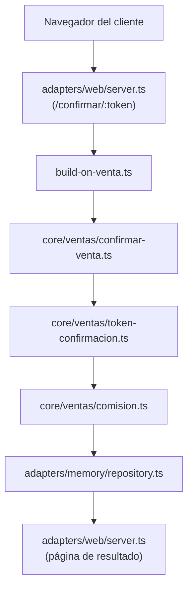

**1. `adapters/web/server.ts`**
- *Qué es*: el servidor HTTP del chat web, sin framework (módulo `node:http` de Node). Atiende el login, los mensajes, el link del cliente y la página del chat.
- *Qué ejecuta en este paso*: Recibe `GET /confirmar/<token>` y devuelve el formulario; después recibe el `POST` con la decisión del cliente
- *Cómo sigue*: Llama al manejador de confirmación que armó `build-on-venta.ts`

**2. `build-on-venta.ts`**
- *Qué es*: archivo de cableado del dominio de ventas: conecta el link de confirmación del cliente y la consulta de riesgo con el núcleo.
- *Qué ejecuta en este paso*: Conecta el formulario con el dominio de ventas
- *Cómo sigue*: Llama a `resolverDecisionVenta` de `confirmar-venta.ts` con el token y la decisión

**3. `core/ventas/confirmar-venta.ts`**
- *Qué es*: la regla de negocio de la decisión del cliente: confirma (con comisión) o rechaza una venta pendiente.
- *Qué ejecuta en este paso*: Busca la venta del token (a través de `ventas-contract.ts`)
- *Cómo sigue*: Le pasa el token y la venta a `token-confirmacion.ts`

**4. `core/ventas/token-confirmacion.ts`**
- *Qué es*: las reglas del token de confirmación: cuándo vence y cuándo es válido.
- *Qué ejecuta en este paso*: Verifica que el token exista, no esté vencido y la venta siga pendiente
- *Cómo sigue*: Devuelve "válido" o el motivo del rechazo a `confirmar-venta.ts`

**5. `core/ventas/comision.ts`**
- *Qué es*: el cálculo de la comisión y del período (mes) al que pertenece.
- *Qué ejecuta en este paso*: Solo si confirma: calcula la comisión (monto × 10 %, redondeada a 2 decimales) y el período (año-mes)
- *Cómo sigue*: Devuelve monto y período a `confirmar-venta.ts`

**6. `adapters/memory/repository.ts`**
- *Qué es*: el adaptador de base de datos (bloque "Memoria Compartida" del arc42). Implementa todos los contratos del núcleo con consultas SQL sobre SQLite, incluida la auditoría.
- *Qué ejecuta en este paso*: Pasa la venta a `confirmada` **solo si seguía en `pendiente_confirmacion`** e inserta la fila en `comisiones`. Si otro lo hizo antes, no cambia nada
- *Cómo sigue*: Devuelve si se aplicó; `confirmar-venta.ts` devuelve el resultado

**7. `adapters/web/server.ts`**
- *Qué es*: el servidor HTTP del chat web, sin framework (módulo `node:http` de Node). Atiende el login, los mensajes, el link del cliente y la página del chat.
- *Qué ejecuta en este paso*: Muestra al cliente la página con el resultado
- *Cómo sigue*: Fin

**Componentes que se ejecutan — el empleado lo informa conversando**:

**1. `adapters/web/chat-client.ts`**
- *Qué es*: el código JavaScript del chat que corre en el navegador del empleado. Lo sirve el propio servidor web junto con la página (`chat-page.ts`). Guarda el token de sesión y envía cada mensaje al servidor.
- *Qué ejecuta en este paso*: El empleado escribe en el chat y presiona Enviar
- *Cómo sigue*: Hace `fetch` a `POST /operaciones` con el cuerpo JSON `{ consulta }` y el encabezado `Authorization: Bearer <token>` que recibió al iniciar sesión

**2. `adapters/web/server.ts`**
- *Qué es*: el servidor HTTP del chat web, sin framework (módulo `node:http` de Node). Atiende el login, los mensajes, el link del cliente y la página del chat.
- *Qué ejecuta en este paso*: Recibe el `POST /operaciones` y lee el cuerpo de la petición
- *Cómo sigue*: Le pide a `sesion-empleado-store.ts` la sesión que corresponde al token

**3. `adapters/web/sesion-empleado-store.ts`**
- *Qué es*: el almacén de sesiones del chat web. Guarda en memoria, por token, la sesión de cada empleado que inició sesión en el navegador. Es independiente de la sesión de la TUI.
- *Qué ejecuta en este paso*: Busca el token y verifica con `core/auth/sesion.ts` que la sesión no haya vencido
- *Cómo sigue*: Devuelve la sesión (con el id del empleado) al servidor; si no hay sesión válida, el servidor responde 401 y termina

**4. `adapters/web/payloads.ts`**
- *Qué es*: el validador de los cuerpos JSON que llegan al servidor web: revisa que cada pedido tenga la forma esperada antes de procesarlo.
- *Qué ejecuta en este paso*: Valida que el JSON tenga la forma `{ consulta }`
- *Cómo sigue*: Devuelve el mensaje validado al servidor; si es inválido, el servidor responde 400

**5. `adapters/web/server.ts`**
- *Qué es*: el servidor HTTP del chat web, sin framework (módulo `node:http` de Node). Atiende el login, los mensajes, el link del cliente y la página del chat.
- *Qué ejecuta en este paso*: Toma la ranura de confirmaciones **de ese empleado** (`confirmacion-operaciones-store.ts`, instancia web) y la memoria de conversación **de ese token** (`conversacion-empleado-store.ts`)
- *Cómo sigue*: Llama a `onOperacionesEmpleado` (el manejador que armó `build-on-operaciones-empleado.ts`) con el mensaje, la sesión, las confirmaciones y la memoria, con un tiempo límite

**6. `build-on-operaciones-empleado.ts`**
- *Qué es*: el preparador de conversaciones. Es un archivo de cableado que, para cada mensaje, crea el caso y le arma al agente su prompt y sus herramientas. Lo usan la TUI y el chat web por igual.
- *Qué ejecuta en este paso*: Crea un **caso nuevo** para este mensaje (vía `repository.ts`), arma el prompt, toma el agente de operaciones de `core/agents/definitions.ts` y crea las herramientas del turno: `adapters/operaciones/index.ts` (con la sesión guardada adentro, así el modelo nunca tiene que decir quién es el empleado) y `adapters/knowledge/index.ts`
- *Cómo sigue*: Llama a `handleTurn` de `handle-turn.ts` con el caso, el prompt, el agente y las herramientas

**7. `core/turn-selector/handle-turn.ts`**
- *Qué es*: el orquestador de turnos del núcleo (bloque "Selector de Turno" del arc42). Ejecuta siempre los mismos pasos en orden: elegir agente, armar contexto, invocar al modelo y cerrar el turno.
- *Qué ejecuta en este paso*: Orquesta el turno en pasos fijos
- *Cómo sigue*: Llama a `resolve-turn.ts`

**8. `core/turn-selector/resolve-turn.ts`**
- *Qué es*: la parte del orquestador que decide qué agente atiende el turno entre los candidatos que recibió.
- *Qué ejecuta en este paso*: Confirma qué agente atiende el turno
- *Cómo sigue*: Devuelve el agente a `handle-turn.ts`, que llama a `assemble-context.ts`

**9. `core/turn-selector/assemble-context.ts`**
- *Qué es*: la parte del orquestador que arma el contexto: busca en la base la sesión anterior del agente para que la conversación continúe con memoria.
- *Qué ejecuta en este paso*: Busca en `sesiones_agente` (vía `repository.ts`) la sesión del SDK del mensaje anterior de esta conversación: así el agente **recuerda** lo que se habló
- *Cómo sigue*: Devuelve el id de sesión a retomar; `handle-turn.ts` llama a `invoke-model.ts`

**10. `core/turn-selector/invoke-model.ts`**
- *Qué es*: la parte del orquestador que habla con el Claude Agent SDK. Traduce la definición del agente a las opciones del SDK y dispara los hooks antes y después del turno.
- *Qué ejecuta en este paso*: Dispara el hook `PRE_TURN` en `core/hooks/hook-engine.ts` (que ejecuta `log-pre-turn-handler.ts`) y obtiene la lista de skills de `core/skills/skills-habilitadas.ts`
- *Cómo sigue*: Llama a `query()` del **Claude Agent SDK** con el agente, las skills, las herramientas y la sesión a retomar

**11. Claude Agent SDK (modelo)**
- *Qué es*: el motor de agentes de Anthropic (librería `@anthropic-ai/claude-agent-sdk`). Envía el pedido al modelo Claude, le ofrece las herramientas y las skills, y ejecuta las herramientas que el modelo decide usar. Es la única parte donde decide la IA.
- *Qué ejecuta en este paso*: Lee la skill `venta-decision` y decide llamar a la herramienta `operacion_negocio` con la operación `resolver_decision_venta`
- *Cómo sigue*: El SDK ejecuta el manejador de la herramienta que `adapters/operaciones/index.ts` registró con `createSdkMcpServer`

**12. `adapters/operaciones/index.ts`**
- *Qué es*: el adaptador de la herramienta `operacion_negocio`. Es un servidor MCP que se crea para cada turno con la sesión del empleado guardada adentro; es la única puerta del modelo hacia las operaciones de negocio.
- *Qué ejecuta en este paso*: Recibe los argumentos que armó el modelo
- *Cómo sigue*: Se los pasa a `validarOperacion`

**13. `core/operaciones/validar-operacion.ts`**
- *Qué es*: el validador del núcleo: revisa campo por campo que los datos que armó el modelo tengan la forma exacta que espera cada operación.
- *Qué ejecuta en este paso*: Valida estrictamente campos y tipos. Si algo falta o sobra, devuelve el error al modelo **sin ejecutar nada**
- *Cómo sigue*: Devuelve la operación validada; `adapters/operaciones/index.ts` llama a `ejecutarOperacion` con la sesión del turno

**14. `core/operaciones/ejecutar-operacion.ts`**
- *Qué es*: el despachador de operaciones del núcleo. Tiene una rama por cada una de las 13 operaciones; en cada una aplica permisos, confirmación en dos mensajes y auditoría, y llama al archivo de dominio que corresponde.
- *Qué ejecuta en este paso*: Elige la rama `resolver_decision_venta`
- *Cómo sigue*: Llama a `resolverDecisionVenta` de `confirmar-venta.ts`

**15. `core/ventas/confirmar-venta.ts` → `token-confirmacion.ts` → `comision.ts` → `repository.ts`**
- *Qué es*: la regla de negocio de la decisión del cliente: confirma (con comisión) o rechaza una venta pendiente.
- *Qué ejecuta en este paso*: Los mismos pasos que en la tabla anterior
- *Cómo sigue*: Devuelven el resultado a `ejecutar-operacion.ts`

**16. `core/operaciones/ejecutar-operacion.ts`**
- *Qué es*: el despachador de operaciones del núcleo. Tiene una rama por cada una de las 13 operaciones; en cada una aplica permisos, confirmación en dos mensajes y auditoría, y llama al archivo de dominio que corresponde.
- *Qué ejecuta en este paso*: Registra la auditoría y arma el texto del resultado
- *Cómo sigue*: Lo devuelve a `adapters/operaciones/index.ts`

**17. `adapters/operaciones/index.ts`**
- *Qué es*: el adaptador de la herramienta `operacion_negocio`. Es un servidor MCP que se crea para cada turno con la sesión del empleado guardada adentro; es la única puerta del modelo hacia las operaciones de negocio.
- *Qué ejecuta en este paso*: Recibe el texto del resultado
- *Cómo sigue*: Se lo devuelve al SDK como resultado de la herramienta

**18. Claude Agent SDK (modelo)**
- *Qué es*: el motor de agentes de Anthropic (librería `@anthropic-ai/claude-agent-sdk`). Envía el pedido al modelo Claude, le ofrece las herramientas y las skills, y ejecuta las herramientas que el modelo decide usar. Es la única parte donde decide la IA.
- *Qué ejecuta en este paso*: Redacta la respuesta final para el empleado a partir del resultado
- *Cómo sigue*: Termina la consulta y le devuelve el control a `invoke-model.ts`

**19. `core/turn-selector/invoke-model.ts`**
- *Qué es*: la parte del orquestador que habla con el Claude Agent SDK. Traduce la definición del agente a las opciones del SDK y dispara los hooks antes y después del turno.
- *Qué ejecuta en este paso*: Dispara el hook `POST_TURN` (`log-post-turn-handler.ts`)
- *Cómo sigue*: Devuelve la respuesta a `handle-turn.ts`, que llama a `close-turn.ts`

**20. `core/turn-selector/close-turn.ts`**
- *Qué es*: la parte del orquestador que cierra el turno: guarda en la base la sesión del agente para poder retomarla después.
- *Qué ejecuta en este paso*: Guarda en `sesiones_agente` (vía `repository.ts`) la sesión del SDK de este turno, para que el próximo mensaje pueda retomarla
- *Cómo sigue*: Devuelve el control a `build-on-operaciones-empleado.ts`

**21. `build-on-operaciones-empleado.ts`**
- *Qué es*: el preparador de conversaciones. Es un archivo de cableado que, para cada mensaje, crea el caso y le arma al agente su prompt y sus herramientas. Lo usan la TUI y el chat web por igual.
- *Qué ejecuta en este paso*: Anota este caso en la memoria de la conversación del empleado
- *Cómo sigue*: Devuelve la respuesta a `adapters/web/server.ts`

**22. `adapters/web/server.ts`**
- *Qué es*: el servidor HTTP del chat web, sin framework (módulo `node:http` de Node). Atiende el login, los mensajes, el link del cliente y la página del chat.
- *Qué ejecuta en este paso*: Responde el `POST` con un JSON que trae la respuesta del agente (o 504 si se venció el tiempo límite)
- *Cómo sigue*: El navegador recibe la respuesta

**23. `adapters/web/chat-client.ts`**
- *Qué es*: el código JavaScript del chat que corre en el navegador del empleado. Lo sirve el propio servidor web junto con la página (`chat-page.ts`). Guarda el token de sesión y envía cada mensaje al servidor.
- *Qué ejecuta en este paso*: Muestra la respuesta del agente en el chat
- *Cómo sigue*: Fin del turno

**Cómo verificarlo**:

```powershell
sqlite3 -readonly data\demo.db "SELECT v.estado, c.monto, c.periodo FROM ventas v LEFT JOIN comisiones c ON c.venta_id = v.id ORDER BY v.created_at DESC LIMIT 1"
```

Con 1500 y 10 %: comisión **150.00**. Log: `venta-confirmada`, `comision-calculada`.

**Para decir**: "La comisión nace cuando el cliente confirma, no cuando se registra la venta. Y si dos personas confirman a la vez, solo una gana".

---

### CU-04 · Consultar una venta propia

**Qué demuestra**: lectura aislada por vendedor.

**Cómo ejecutarlo**:

En el **chat web** (`http://localhost:<WEB_PORT>/chat`), con sesión iniciada: `¿Cómo van mis ventas?` o `¿En qué estado está la venta <id>?`

**Qué se espera ver**: el estado de cada venta propia. Si pedís una venta de otro vendedor, lo dice explícitamente.

**Qué pasa, en palabras simples**: el empleado pregunta por sus ventas; el modelo sigue la skill de consulta y llama a la operación de lectura. `ejecutar-operacion.ts` le pasa al dominio el vendedor de la sesión, así que la consulta solo puede ver las ventas de quien está logueado. No se escribe nada.

**Componentes que se ejecutan**:

**1. `adapters/web/chat-client.ts`**
- *Qué es*: el código JavaScript del chat que corre en el navegador del empleado. Lo sirve el propio servidor web junto con la página (`chat-page.ts`). Guarda el token de sesión y envía cada mensaje al servidor.
- *Qué ejecuta en este paso*: El empleado escribe en el chat y presiona Enviar
- *Cómo sigue*: Hace `fetch` a `POST /operaciones` con el cuerpo JSON `{ consulta }` y el encabezado `Authorization: Bearer <token>` que recibió al iniciar sesión

**2. `adapters/web/server.ts`**
- *Qué es*: el servidor HTTP del chat web, sin framework (módulo `node:http` de Node). Atiende el login, los mensajes, el link del cliente y la página del chat.
- *Qué ejecuta en este paso*: Recibe el `POST /operaciones` y lee el cuerpo de la petición
- *Cómo sigue*: Le pide a `sesion-empleado-store.ts` la sesión que corresponde al token

**3. `adapters/web/sesion-empleado-store.ts`**
- *Qué es*: el almacén de sesiones del chat web. Guarda en memoria, por token, la sesión de cada empleado que inició sesión en el navegador. Es independiente de la sesión de la TUI.
- *Qué ejecuta en este paso*: Busca el token y verifica con `core/auth/sesion.ts` que la sesión no haya vencido
- *Cómo sigue*: Devuelve la sesión (con el id del empleado) al servidor; si no hay sesión válida, el servidor responde 401 y termina

**4. `adapters/web/payloads.ts`**
- *Qué es*: el validador de los cuerpos JSON que llegan al servidor web: revisa que cada pedido tenga la forma esperada antes de procesarlo.
- *Qué ejecuta en este paso*: Valida que el JSON tenga la forma `{ consulta }`
- *Cómo sigue*: Devuelve el mensaje validado al servidor; si es inválido, el servidor responde 400

**5. `adapters/web/server.ts`**
- *Qué es*: el servidor HTTP del chat web, sin framework (módulo `node:http` de Node). Atiende el login, los mensajes, el link del cliente y la página del chat.
- *Qué ejecuta en este paso*: Toma la ranura de confirmaciones **de ese empleado** (`confirmacion-operaciones-store.ts`, instancia web) y la memoria de conversación **de ese token** (`conversacion-empleado-store.ts`)
- *Cómo sigue*: Llama a `onOperacionesEmpleado` (el manejador que armó `build-on-operaciones-empleado.ts`) con el mensaje, la sesión, las confirmaciones y la memoria, con un tiempo límite

**6. `build-on-operaciones-empleado.ts`**
- *Qué es*: el preparador de conversaciones. Es un archivo de cableado que, para cada mensaje, crea el caso y le arma al agente su prompt y sus herramientas. Lo usan la TUI y el chat web por igual.
- *Qué ejecuta en este paso*: Crea un **caso nuevo** para este mensaje (vía `repository.ts`), arma el prompt, toma el agente de operaciones de `core/agents/definitions.ts` y crea las herramientas del turno: `adapters/operaciones/index.ts` (con la sesión guardada adentro, así el modelo nunca tiene que decir quién es el empleado) y `adapters/knowledge/index.ts`
- *Cómo sigue*: Llama a `handleTurn` de `handle-turn.ts` con el caso, el prompt, el agente y las herramientas

**7. `core/turn-selector/handle-turn.ts`**
- *Qué es*: el orquestador de turnos del núcleo (bloque "Selector de Turno" del arc42). Ejecuta siempre los mismos pasos en orden: elegir agente, armar contexto, invocar al modelo y cerrar el turno.
- *Qué ejecuta en este paso*: Orquesta el turno en pasos fijos
- *Cómo sigue*: Llama a `resolve-turn.ts`

**8. `core/turn-selector/resolve-turn.ts`**
- *Qué es*: la parte del orquestador que decide qué agente atiende el turno entre los candidatos que recibió.
- *Qué ejecuta en este paso*: Confirma qué agente atiende el turno
- *Cómo sigue*: Devuelve el agente a `handle-turn.ts`, que llama a `assemble-context.ts`

**9. `core/turn-selector/assemble-context.ts`**
- *Qué es*: la parte del orquestador que arma el contexto: busca en la base la sesión anterior del agente para que la conversación continúe con memoria.
- *Qué ejecuta en este paso*: Busca en `sesiones_agente` (vía `repository.ts`) la sesión del SDK del mensaje anterior de esta conversación: así el agente **recuerda** lo que se habló
- *Cómo sigue*: Devuelve el id de sesión a retomar; `handle-turn.ts` llama a `invoke-model.ts`

**10. `core/turn-selector/invoke-model.ts`**
- *Qué es*: la parte del orquestador que habla con el Claude Agent SDK. Traduce la definición del agente a las opciones del SDK y dispara los hooks antes y después del turno.
- *Qué ejecuta en este paso*: Dispara el hook `PRE_TURN` en `core/hooks/hook-engine.ts` (que ejecuta `log-pre-turn-handler.ts`) y obtiene la lista de skills de `core/skills/skills-habilitadas.ts`
- *Cómo sigue*: Llama a `query()` del **Claude Agent SDK** con el agente, las skills, las herramientas y la sesión a retomar

**11. Claude Agent SDK (modelo)**
- *Qué es*: el motor de agentes de Anthropic (librería `@anthropic-ai/claude-agent-sdk`). Envía el pedido al modelo Claude, le ofrece las herramientas y las skills, y ejecuta las herramientas que el modelo decide usar. Es la única parte donde decide la IA.
- *Qué ejecuta en este paso*: Lee la skill `consultar-venta` y decide llamar a la herramienta `operacion_negocio` con la operación `consultar_venta`
- *Cómo sigue*: El SDK ejecuta el manejador de la herramienta que `adapters/operaciones/index.ts` registró con `createSdkMcpServer`

**12. `adapters/operaciones/index.ts`**
- *Qué es*: el adaptador de la herramienta `operacion_negocio`. Es un servidor MCP que se crea para cada turno con la sesión del empleado guardada adentro; es la única puerta del modelo hacia las operaciones de negocio.
- *Qué ejecuta en este paso*: Recibe los argumentos que armó el modelo
- *Cómo sigue*: Se los pasa a `validarOperacion`

**13. `core/operaciones/validar-operacion.ts`**
- *Qué es*: el validador del núcleo: revisa campo por campo que los datos que armó el modelo tengan la forma exacta que espera cada operación.
- *Qué ejecuta en este paso*: Valida estrictamente campos y tipos. Si algo falta o sobra, devuelve el error al modelo **sin ejecutar nada**
- *Cómo sigue*: Devuelve la operación validada; `adapters/operaciones/index.ts` llama a `ejecutarOperacion` con la sesión del turno

**14. `core/operaciones/ejecutar-operacion.ts`**
- *Qué es*: el despachador de operaciones del núcleo. Tiene una rama por cada una de las 13 operaciones; en cada una aplica permisos, confirmación en dos mensajes y auditoría, y llama al archivo de dominio que corresponde.
- *Qué ejecuta en este paso*: Elige la rama `consultar_venta` y toma el vendedor de la sesión
- *Cómo sigue*: Llama a `consultar-venta-propia.ts`

**15. `core/ventas/consultar-venta-propia.ts`**
- *Qué es*: la regla de consulta de ventas propias: solo muestra las del vendedor de la sesión.
- *Qué ejecuta en este paso*: Pide las ventas de ese vendedor y distingue "no existe" de "no es tuya"
- *Cómo sigue*: Consulta a través de `consulta-venta-contract.ts`, que implementa `repository.ts`

**16. `adapters/memory/repository.ts`**
- *Qué es*: el adaptador de base de datos (bloque "Memoria Compartida" del arc42). Implementa todos los contratos del núcleo con consultas SQL sobre SQLite, incluida la auditoría.
- *Qué ejecuta en este paso*: Lee `ventas` filtrando por `vendedor_id`. Solo lectura, **sin auditoría**
- *Cómo sigue*: Devuelve las filas a `consultar-venta-propia.ts`, que devuelve el texto a `ejecutar-operacion.ts`

**17. `core/operaciones/ejecutar-operacion.ts`**
- *Qué es*: el despachador de operaciones del núcleo. Tiene una rama por cada una de las 13 operaciones; en cada una aplica permisos, confirmación en dos mensajes y auditoría, y llama al archivo de dominio que corresponde.
- *Qué ejecuta en este paso*: Devuelve el texto
- *Cómo sigue*: A `adapters/operaciones/index.ts`

**18. `adapters/operaciones/index.ts`**
- *Qué es*: el adaptador de la herramienta `operacion_negocio`. Es un servidor MCP que se crea para cada turno con la sesión del empleado guardada adentro; es la única puerta del modelo hacia las operaciones de negocio.
- *Qué ejecuta en este paso*: Recibe el texto del resultado
- *Cómo sigue*: Se lo devuelve al SDK como resultado de la herramienta

**19. Claude Agent SDK (modelo)**
- *Qué es*: el motor de agentes de Anthropic (librería `@anthropic-ai/claude-agent-sdk`). Envía el pedido al modelo Claude, le ofrece las herramientas y las skills, y ejecuta las herramientas que el modelo decide usar. Es la única parte donde decide la IA.
- *Qué ejecuta en este paso*: Redacta la respuesta final para el empleado a partir del resultado
- *Cómo sigue*: Termina la consulta y le devuelve el control a `invoke-model.ts`

**20. `core/turn-selector/invoke-model.ts`**
- *Qué es*: la parte del orquestador que habla con el Claude Agent SDK. Traduce la definición del agente a las opciones del SDK y dispara los hooks antes y después del turno.
- *Qué ejecuta en este paso*: Dispara el hook `POST_TURN` (`log-post-turn-handler.ts`)
- *Cómo sigue*: Devuelve la respuesta a `handle-turn.ts`, que llama a `close-turn.ts`

**21. `core/turn-selector/close-turn.ts`**
- *Qué es*: la parte del orquestador que cierra el turno: guarda en la base la sesión del agente para poder retomarla después.
- *Qué ejecuta en este paso*: Guarda en `sesiones_agente` (vía `repository.ts`) la sesión del SDK de este turno, para que el próximo mensaje pueda retomarla
- *Cómo sigue*: Devuelve el control a `build-on-operaciones-empleado.ts`

**22. `build-on-operaciones-empleado.ts`**
- *Qué es*: el preparador de conversaciones. Es un archivo de cableado que, para cada mensaje, crea el caso y le arma al agente su prompt y sus herramientas. Lo usan la TUI y el chat web por igual.
- *Qué ejecuta en este paso*: Anota este caso en la memoria de la conversación del empleado
- *Cómo sigue*: Devuelve la respuesta a `adapters/web/server.ts`

**23. `adapters/web/server.ts`**
- *Qué es*: el servidor HTTP del chat web, sin framework (módulo `node:http` de Node). Atiende el login, los mensajes, el link del cliente y la página del chat.
- *Qué ejecuta en este paso*: Responde el `POST` con un JSON que trae la respuesta del agente (o 504 si se venció el tiempo límite)
- *Cómo sigue*: El navegador recibe la respuesta

**24. `adapters/web/chat-client.ts`**
- *Qué es*: el código JavaScript del chat que corre en el navegador del empleado. Lo sirve el propio servidor web junto con la página (`chat-page.ts`). Guarda el token de sesión y envía cada mensaje al servidor.
- *Qué ejecuta en este paso*: Muestra la respuesta del agente en el chat
- *Cómo sigue*: Fin del turno

---

### CU-05 · Devolución con token

**Qué demuestra**: una regla de negocio por umbral: aprobación automática o escalación a una persona.

**Precondiciones**: venta `confirmada` y su token.

**Cómo ejecutarlo**:

En el **chat web** (`http://localhost:<WEB_PORT>/chat`), con sesión iniciada:

> Procesá la devolución de la venta con token `<token>`, motivo: el cliente no quedó conforme.

**Qué se espera ver**: monto **menor a 500**: `reembolsada` al instante. Monto **500 o más**: `escalada`; la venta queda en `reembolso_pendiente`.

**Qué pasa, en palabras simples**: con el token, el modelo pide la devolución. El dominio busca la venta, exige que esté confirmada y compara su monto con el umbral: por debajo de 500 se reembolsa en el momento; desde 500 queda en espera de que un administrador la apruebe. La decisión la toma el código con una regla fija, no el modelo.

**Componentes que se ejecutan**:

```mermaid
flowchart TD
  N0["Navegador: adapters/web/chat-client.ts"]
  N1["adapters/web/server.ts<br/>(POST /operaciones)"]
  N2["adapters/web/sesion-empleado-store.ts<br/>(valida el token)"]
  N3["adapters/web/payloads.ts"]
  N4["build-on-operaciones-empleado.ts"]
  N5["core/turn-selector/handle-turn.ts"]
  N6["core/turn-selector/resolve-turn.ts"]
  N7["core/turn-selector/assemble-context.ts"]
  N8["core/turn-selector/invoke-model.ts"]
  N9["Claude Agent SDK (modelo)"]
  N10["adapters/operaciones/index.ts"]
  N11["core/operaciones/validar-operacion.ts"]
  N12["core/operaciones/ejecutar-operacion.ts"]
  N13["core/ventas/procesar-devolucion.ts"]
  N14["core/ventas/reembolso.ts<br/>(¿monto < 500?)"]
  N15["adapters/memory/repository.ts"]
  N16["Claude Agent SDK (redacta)"]
  N17["core/turn-selector/invoke-model.ts"]
  N18["close-turn.ts"]
  N19["adapters/web/server.ts<br/>(responde JSON)"]
  N20["adapters/web/chat-client.ts"]
  N0 --> N1
  N1 --> N2
  N2 --> N3
  N3 --> N4
  N4 --> N5
  N5 --> N6
  N6 --> N7
  N7 --> N8
  N8 --> N9
  N9 --> N10
  N10 --> N11
  N11 --> N12
  N12 --> N13
  N13 --> N14
  N14 --> N15
  N15 --> N16
  N16 --> N17
  N17 --> N18
  N18 --> N19
  N19 --> N20
```

**1. `adapters/web/chat-client.ts`**
- *Qué es*: el código JavaScript del chat que corre en el navegador del empleado. Lo sirve el propio servidor web junto con la página (`chat-page.ts`). Guarda el token de sesión y envía cada mensaje al servidor.
- *Qué ejecuta en este paso*: El empleado escribe en el chat y presiona Enviar
- *Cómo sigue*: Hace `fetch` a `POST /operaciones` con el cuerpo JSON `{ consulta }` y el encabezado `Authorization: Bearer <token>` que recibió al iniciar sesión

**2. `adapters/web/server.ts`**
- *Qué es*: el servidor HTTP del chat web, sin framework (módulo `node:http` de Node). Atiende el login, los mensajes, el link del cliente y la página del chat.
- *Qué ejecuta en este paso*: Recibe el `POST /operaciones` y lee el cuerpo de la petición
- *Cómo sigue*: Le pide a `sesion-empleado-store.ts` la sesión que corresponde al token

**3. `adapters/web/sesion-empleado-store.ts`**
- *Qué es*: el almacén de sesiones del chat web. Guarda en memoria, por token, la sesión de cada empleado que inició sesión en el navegador. Es independiente de la sesión de la TUI.
- *Qué ejecuta en este paso*: Busca el token y verifica con `core/auth/sesion.ts` que la sesión no haya vencido
- *Cómo sigue*: Devuelve la sesión (con el id del empleado) al servidor; si no hay sesión válida, el servidor responde 401 y termina

**4. `adapters/web/payloads.ts`**
- *Qué es*: el validador de los cuerpos JSON que llegan al servidor web: revisa que cada pedido tenga la forma esperada antes de procesarlo.
- *Qué ejecuta en este paso*: Valida que el JSON tenga la forma `{ consulta }`
- *Cómo sigue*: Devuelve el mensaje validado al servidor; si es inválido, el servidor responde 400

**5. `adapters/web/server.ts`**
- *Qué es*: el servidor HTTP del chat web, sin framework (módulo `node:http` de Node). Atiende el login, los mensajes, el link del cliente y la página del chat.
- *Qué ejecuta en este paso*: Toma la ranura de confirmaciones **de ese empleado** (`confirmacion-operaciones-store.ts`, instancia web) y la memoria de conversación **de ese token** (`conversacion-empleado-store.ts`)
- *Cómo sigue*: Llama a `onOperacionesEmpleado` (el manejador que armó `build-on-operaciones-empleado.ts`) con el mensaje, la sesión, las confirmaciones y la memoria, con un tiempo límite

**6. `build-on-operaciones-empleado.ts`**
- *Qué es*: el preparador de conversaciones. Es un archivo de cableado que, para cada mensaje, crea el caso y le arma al agente su prompt y sus herramientas. Lo usan la TUI y el chat web por igual.
- *Qué ejecuta en este paso*: Crea un **caso nuevo** para este mensaje (vía `repository.ts`), arma el prompt, toma el agente de operaciones de `core/agents/definitions.ts` y crea las herramientas del turno: `adapters/operaciones/index.ts` (con la sesión guardada adentro, así el modelo nunca tiene que decir quién es el empleado) y `adapters/knowledge/index.ts`
- *Cómo sigue*: Llama a `handleTurn` de `handle-turn.ts` con el caso, el prompt, el agente y las herramientas

**7. `core/turn-selector/handle-turn.ts`**
- *Qué es*: el orquestador de turnos del núcleo (bloque "Selector de Turno" del arc42). Ejecuta siempre los mismos pasos en orden: elegir agente, armar contexto, invocar al modelo y cerrar el turno.
- *Qué ejecuta en este paso*: Orquesta el turno en pasos fijos
- *Cómo sigue*: Llama a `resolve-turn.ts`

**8. `core/turn-selector/resolve-turn.ts`**
- *Qué es*: la parte del orquestador que decide qué agente atiende el turno entre los candidatos que recibió.
- *Qué ejecuta en este paso*: Confirma qué agente atiende el turno
- *Cómo sigue*: Devuelve el agente a `handle-turn.ts`, que llama a `assemble-context.ts`

**9. `core/turn-selector/assemble-context.ts`**
- *Qué es*: la parte del orquestador que arma el contexto: busca en la base la sesión anterior del agente para que la conversación continúe con memoria.
- *Qué ejecuta en este paso*: Busca en `sesiones_agente` (vía `repository.ts`) la sesión del SDK del mensaje anterior de esta conversación: así el agente **recuerda** lo que se habló
- *Cómo sigue*: Devuelve el id de sesión a retomar; `handle-turn.ts` llama a `invoke-model.ts`

**10. `core/turn-selector/invoke-model.ts`**
- *Qué es*: la parte del orquestador que habla con el Claude Agent SDK. Traduce la definición del agente a las opciones del SDK y dispara los hooks antes y después del turno.
- *Qué ejecuta en este paso*: Dispara el hook `PRE_TURN` en `core/hooks/hook-engine.ts` (que ejecuta `log-pre-turn-handler.ts`) y obtiene la lista de skills de `core/skills/skills-habilitadas.ts`
- *Cómo sigue*: Llama a `query()` del **Claude Agent SDK** con el agente, las skills, las herramientas y la sesión a retomar

**11. Claude Agent SDK (modelo)**
- *Qué es*: el motor de agentes de Anthropic (librería `@anthropic-ai/claude-agent-sdk`). Envía el pedido al modelo Claude, le ofrece las herramientas y las skills, y ejecuta las herramientas que el modelo decide usar. Es la única parte donde decide la IA.
- *Qué ejecuta en este paso*: Lee la skill `devolucion-conversacional` y decide llamar a la herramienta `operacion_negocio` con la operación `procesar_devolucion`
- *Cómo sigue*: El SDK ejecuta el manejador de la herramienta que `adapters/operaciones/index.ts` registró con `createSdkMcpServer`

**12. `adapters/operaciones/index.ts`**
- *Qué es*: el adaptador de la herramienta `operacion_negocio`. Es un servidor MCP que se crea para cada turno con la sesión del empleado guardada adentro; es la única puerta del modelo hacia las operaciones de negocio.
- *Qué ejecuta en este paso*: Recibe los argumentos que armó el modelo
- *Cómo sigue*: Se los pasa a `validarOperacion`

**13. `core/operaciones/validar-operacion.ts`**
- *Qué es*: el validador del núcleo: revisa campo por campo que los datos que armó el modelo tengan la forma exacta que espera cada operación.
- *Qué ejecuta en este paso*: Valida estrictamente campos y tipos. Si algo falta o sobra, devuelve el error al modelo **sin ejecutar nada**
- *Cómo sigue*: Devuelve la operación validada; `adapters/operaciones/index.ts` llama a `ejecutarOperacion` con la sesión del turno

**14. `core/operaciones/ejecutar-operacion.ts`**
- *Qué es*: el despachador de operaciones del núcleo. Tiene una rama por cada una de las 13 operaciones; en cada una aplica permisos, confirmación en dos mensajes y auditoría, y llama al archivo de dominio que corresponde.
- *Qué ejecuta en este paso*: Elige la rama `procesar_devolucion`
- *Cómo sigue*: Llama a `procesarDevolucion` de `procesar-devolucion.ts` con el token

**15. `core/ventas/procesar-devolucion.ts`**
- *Qué es*: la regla de devolución con token: exige venta confirmada y decide entre reembolsar o escalar.
- *Qué ejecuta en este paso*: Busca la venta por token y exige que esté `confirmada`
- *Cómo sigue*: Le pasa el monto a `reembolso.ts` junto con el umbral de `ventas-config.ts`

**16. `core/ventas/reembolso.ts`**
- *Qué es*: la regla del umbral de reembolso: compara el monto contra el límite configurado (500 por defecto).
- *Qué ejecuta en este paso*: Compara: menor a 500 → aprobar; 500 o más → escalar
- *Cómo sigue*: Devuelve la decisión a `procesar-devolucion.ts`

**17. `adapters/memory/repository.ts`**
- *Qué es*: el adaptador de base de datos (bloque "Memoria Compartida" del arc42). Implementa todos los contratos del núcleo con consultas SQL sobre SQLite, incluida la auditoría.
- *Qué ejecuta en este paso*: Pasa la venta a `reembolsada`, o a `reembolso_pendiente` con el caso esperando aprobación humana. Solo si seguía `confirmada`
- *Cómo sigue*: Devuelve el resultado; `procesar-devolucion.ts` lo devuelve a `ejecutar-operacion.ts`

**18. `core/operaciones/ejecutar-operacion.ts`**
- *Qué es*: el despachador de operaciones del núcleo. Tiene una rama por cada una de las 13 operaciones; en cada una aplica permisos, confirmación en dos mensajes y auditoría, y llama al archivo de dominio que corresponde.
- *Qué ejecuta en este paso*: Registra la auditoría y arma el texto
- *Cómo sigue*: Lo devuelve a `adapters/operaciones/index.ts`

**19. `adapters/operaciones/index.ts`**
- *Qué es*: el adaptador de la herramienta `operacion_negocio`. Es un servidor MCP que se crea para cada turno con la sesión del empleado guardada adentro; es la única puerta del modelo hacia las operaciones de negocio.
- *Qué ejecuta en este paso*: Recibe el texto del resultado
- *Cómo sigue*: Se lo devuelve al SDK como resultado de la herramienta

**20. Claude Agent SDK (modelo)**
- *Qué es*: el motor de agentes de Anthropic (librería `@anthropic-ai/claude-agent-sdk`). Envía el pedido al modelo Claude, le ofrece las herramientas y las skills, y ejecuta las herramientas que el modelo decide usar. Es la única parte donde decide la IA.
- *Qué ejecuta en este paso*: Redacta la respuesta final para el empleado a partir del resultado
- *Cómo sigue*: Termina la consulta y le devuelve el control a `invoke-model.ts`

**21. `core/turn-selector/invoke-model.ts`**
- *Qué es*: la parte del orquestador que habla con el Claude Agent SDK. Traduce la definición del agente a las opciones del SDK y dispara los hooks antes y después del turno.
- *Qué ejecuta en este paso*: Dispara el hook `POST_TURN` (`log-post-turn-handler.ts`)
- *Cómo sigue*: Devuelve la respuesta a `handle-turn.ts`, que llama a `close-turn.ts`

**22. `core/turn-selector/close-turn.ts`**
- *Qué es*: la parte del orquestador que cierra el turno: guarda en la base la sesión del agente para poder retomarla después.
- *Qué ejecuta en este paso*: Guarda en `sesiones_agente` (vía `repository.ts`) la sesión del SDK de este turno, para que el próximo mensaje pueda retomarla
- *Cómo sigue*: Devuelve el control a `build-on-operaciones-empleado.ts`

**23. `build-on-operaciones-empleado.ts`**
- *Qué es*: el preparador de conversaciones. Es un archivo de cableado que, para cada mensaje, crea el caso y le arma al agente su prompt y sus herramientas. Lo usan la TUI y el chat web por igual.
- *Qué ejecuta en este paso*: Anota este caso en la memoria de la conversación del empleado
- *Cómo sigue*: Devuelve la respuesta a `adapters/web/server.ts`

**24. `adapters/web/server.ts`**
- *Qué es*: el servidor HTTP del chat web, sin framework (módulo `node:http` de Node). Atiende el login, los mensajes, el link del cliente y la página del chat.
- *Qué ejecuta en este paso*: Responde el `POST` con un JSON que trae la respuesta del agente (o 504 si se venció el tiempo límite)
- *Cómo sigue*: El navegador recibe la respuesta

**25. `adapters/web/chat-client.ts`**
- *Qué es*: el código JavaScript del chat que corre en el navegador del empleado. Lo sirve el propio servidor web junto con la página (`chat-page.ts`). Guarda el token de sesión y envía cada mensaje al servidor.
- *Qué ejecuta en este paso*: Muestra la respuesta del agente en el chat
- *Cómo sigue*: Fin del turno

**Cómo verificarlo**:

Log: `reembolso-aprobado` o `reembolso-escalado`.

**Cuidado**: la devolución **no borra la comisión** de la tabla `comisiones`; el reporte la descuenta al leer (CU-08). Para mostrar la escalación, usá una venta de 500 o más.

---

### CU-06 · Devolución sin token (dos personas)

**Qué demuestra**: control por dos personas y confirmación en dos mensajes.

**Precondiciones**: logueado como el **vendedor de esa venta**; venta `confirmada`.

**Cómo ejecutarlo**:

En el **chat web** (`http://localhost:<WEB_PORT>/chat`), con sesión iniciada como el vendedor, en mensajes separados:

1. `Quiero iniciar la devolución de una venta mía, no tengo el token.`
2. El agente pide el **motivo** (obligatorio, nunca lo inventa): `El cliente se arrepintió.`
3. Si no diste el id, lista tus ventas; elegí una.
4. El agente repite los datos y pide confirmación. **Mensaje nuevo**: `Sí, confirmo.`

**Qué se espera ver**: `escalada`, "queda pendiente de aprobación de un administrador distinto". **Siempre** escala, sea cual sea el monto.

**Qué pasa, en palabras simples**: sin token, la devolución necesita dos mensajes y dos personas. En el primer mensaje el sistema muestra qué va a hacer y anota que falta la confirmación, sin tocar la base. Cuando el empleado manda un mensaje nuevo confirmando, se verifica que sea el vendedor, se guarda el motivo y la venta queda en espera de un administrador distinto. Nunca se aprueba sola.

**Componentes que se ejecutan — primer mensaje (pide confirmación)**:

**1. `adapters/web/chat-client.ts`**
- *Qué es*: el código JavaScript del chat que corre en el navegador del empleado. Lo sirve el propio servidor web junto con la página (`chat-page.ts`). Guarda el token de sesión y envía cada mensaje al servidor.
- *Qué ejecuta en este paso*: El empleado escribe en el chat y presiona Enviar
- *Cómo sigue*: Hace `fetch` a `POST /operaciones` con el cuerpo JSON `{ consulta }` y el encabezado `Authorization: Bearer <token>` que recibió al iniciar sesión

**2. `adapters/web/server.ts`**
- *Qué es*: el servidor HTTP del chat web, sin framework (módulo `node:http` de Node). Atiende el login, los mensajes, el link del cliente y la página del chat.
- *Qué ejecuta en este paso*: Recibe el `POST /operaciones` y lee el cuerpo de la petición
- *Cómo sigue*: Le pide a `sesion-empleado-store.ts` la sesión que corresponde al token

**3. `adapters/web/sesion-empleado-store.ts`**
- *Qué es*: el almacén de sesiones del chat web. Guarda en memoria, por token, la sesión de cada empleado que inició sesión en el navegador. Es independiente de la sesión de la TUI.
- *Qué ejecuta en este paso*: Busca el token y verifica con `core/auth/sesion.ts` que la sesión no haya vencido
- *Cómo sigue*: Devuelve la sesión (con el id del empleado) al servidor; si no hay sesión válida, el servidor responde 401 y termina

**4. `adapters/web/payloads.ts`**
- *Qué es*: el validador de los cuerpos JSON que llegan al servidor web: revisa que cada pedido tenga la forma esperada antes de procesarlo.
- *Qué ejecuta en este paso*: Valida que el JSON tenga la forma `{ consulta }`
- *Cómo sigue*: Devuelve el mensaje validado al servidor; si es inválido, el servidor responde 400

**5. `adapters/web/server.ts`**
- *Qué es*: el servidor HTTP del chat web, sin framework (módulo `node:http` de Node). Atiende el login, los mensajes, el link del cliente y la página del chat.
- *Qué ejecuta en este paso*: Toma la ranura de confirmaciones **de ese empleado** (`confirmacion-operaciones-store.ts`, instancia web) y la memoria de conversación **de ese token** (`conversacion-empleado-store.ts`)
- *Cómo sigue*: Llama a `onOperacionesEmpleado` (el manejador que armó `build-on-operaciones-empleado.ts`) con el mensaje, la sesión, las confirmaciones y la memoria, con un tiempo límite

**6. `build-on-operaciones-empleado.ts`**
- *Qué es*: el preparador de conversaciones. Es un archivo de cableado que, para cada mensaje, crea el caso y le arma al agente su prompt y sus herramientas. Lo usan la TUI y el chat web por igual.
- *Qué ejecuta en este paso*: Crea un **caso nuevo** para este mensaje (vía `repository.ts`), arma el prompt, toma el agente de operaciones de `core/agents/definitions.ts` y crea las herramientas del turno: `adapters/operaciones/index.ts` (con la sesión guardada adentro, así el modelo nunca tiene que decir quién es el empleado) y `adapters/knowledge/index.ts`
- *Cómo sigue*: Llama a `handleTurn` de `handle-turn.ts` con el caso, el prompt, el agente y las herramientas

**7. `core/turn-selector/handle-turn.ts`**
- *Qué es*: el orquestador de turnos del núcleo (bloque "Selector de Turno" del arc42). Ejecuta siempre los mismos pasos en orden: elegir agente, armar contexto, invocar al modelo y cerrar el turno.
- *Qué ejecuta en este paso*: Orquesta el turno en pasos fijos
- *Cómo sigue*: Llama a `resolve-turn.ts`

**8. `core/turn-selector/resolve-turn.ts`**
- *Qué es*: la parte del orquestador que decide qué agente atiende el turno entre los candidatos que recibió.
- *Qué ejecuta en este paso*: Confirma qué agente atiende el turno
- *Cómo sigue*: Devuelve el agente a `handle-turn.ts`, que llama a `assemble-context.ts`

**9. `core/turn-selector/assemble-context.ts`**
- *Qué es*: la parte del orquestador que arma el contexto: busca en la base la sesión anterior del agente para que la conversación continúe con memoria.
- *Qué ejecuta en este paso*: Busca en `sesiones_agente` (vía `repository.ts`) la sesión del SDK del mensaje anterior de esta conversación: así el agente **recuerda** lo que se habló
- *Cómo sigue*: Devuelve el id de sesión a retomar; `handle-turn.ts` llama a `invoke-model.ts`

**10. `core/turn-selector/invoke-model.ts`**
- *Qué es*: la parte del orquestador que habla con el Claude Agent SDK. Traduce la definición del agente a las opciones del SDK y dispara los hooks antes y después del turno.
- *Qué ejecuta en este paso*: Dispara el hook `PRE_TURN` en `core/hooks/hook-engine.ts` (que ejecuta `log-pre-turn-handler.ts`) y obtiene la lista de skills de `core/skills/skills-habilitadas.ts`
- *Cómo sigue*: Llama a `query()` del **Claude Agent SDK** con el agente, las skills, las herramientas y la sesión a retomar

**11. Claude Agent SDK (modelo)**
- *Qué es*: el motor de agentes de Anthropic (librería `@anthropic-ai/claude-agent-sdk`). Envía el pedido al modelo Claude, le ofrece las herramientas y las skills, y ejecuta las herramientas que el modelo decide usar. Es la única parte donde decide la IA.
- *Qué ejecuta en este paso*: Lee la skill `solicitar-devolucion` y ya tiene el motivo y la venta y decide llamar a la herramienta `operacion_negocio` con la operación `solicitar_devolucion`
- *Cómo sigue*: El SDK ejecuta el manejador de la herramienta que `adapters/operaciones/index.ts` registró con `createSdkMcpServer`

**12. `adapters/operaciones/index.ts`**
- *Qué es*: el adaptador de la herramienta `operacion_negocio`. Es un servidor MCP que se crea para cada turno con la sesión del empleado guardada adentro; es la única puerta del modelo hacia las operaciones de negocio.
- *Qué ejecuta en este paso*: Recibe los argumentos que armó el modelo
- *Cómo sigue*: Se los pasa a `validarOperacion`

**13. `core/operaciones/validar-operacion.ts`**
- *Qué es*: el validador del núcleo: revisa campo por campo que los datos que armó el modelo tengan la forma exacta que espera cada operación.
- *Qué ejecuta en este paso*: Valida estrictamente campos y tipos. Si algo falta o sobra, devuelve el error al modelo **sin ejecutar nada**
- *Cómo sigue*: Devuelve la operación validada; `adapters/operaciones/index.ts` llama a `ejecutarOperacion` con la sesión del turno

**14. `core/operaciones/ejecutar-operacion.ts`**
- *Qué es*: el despachador de operaciones del núcleo. Tiene una rama por cada una de las 13 operaciones; en cada una aplica permisos, confirmación en dos mensajes y auditoría, y llama al archivo de dominio que corresponde.
- *Qué ejecuta en este paso*: Elige la rama `solicitar_devolucion`, lee la venta para armar el resumen y pregunta al almacén de confirmaciones si este pedido ya estaba confirmado: **no lo está**
- *Cómo sigue*: Llama a `marcarPendiente` de `confirmacion-operaciones-store.ts`

**15. `adapters/web/confirmacion-operaciones-store.ts`**
- *Qué es*: el almacén de confirmaciones pendientes. Guarda en memoria (no en la base) qué operación está esperando que el empleado la confirme. Hay una instancia para la TUI y otra para el chat web.
- *Qué ejecuta en este paso*: Anota en memoria: empleado, venta, acción y **el caso de este mensaje**. No toca la base
- *Cómo sigue*: Devuelve el control; `ejecutar-operacion.ts` devuelve el resumen con el pedido de confirmación

**16. `adapters/operaciones/index.ts`**
- *Qué es*: el adaptador de la herramienta `operacion_negocio`. Es un servidor MCP que se crea para cada turno con la sesión del empleado guardada adentro; es la única puerta del modelo hacia las operaciones de negocio.
- *Qué ejecuta en este paso*: Recibe el texto del resultado
- *Cómo sigue*: Se lo devuelve al SDK como resultado de la herramienta

**17. Claude Agent SDK (modelo)**
- *Qué es*: el motor de agentes de Anthropic (librería `@anthropic-ai/claude-agent-sdk`). Envía el pedido al modelo Claude, le ofrece las herramientas y las skills, y ejecuta las herramientas que el modelo decide usar. Es la única parte donde decide la IA.
- *Qué ejecuta en este paso*: Redacta la respuesta final para el empleado a partir del resultado
- *Cómo sigue*: Termina la consulta y le devuelve el control a `invoke-model.ts`

**18. `core/turn-selector/invoke-model.ts`**
- *Qué es*: la parte del orquestador que habla con el Claude Agent SDK. Traduce la definición del agente a las opciones del SDK y dispara los hooks antes y después del turno.
- *Qué ejecuta en este paso*: Dispara el hook `POST_TURN` (`log-post-turn-handler.ts`)
- *Cómo sigue*: Devuelve la respuesta a `handle-turn.ts`, que llama a `close-turn.ts`

**19. `core/turn-selector/close-turn.ts`**
- *Qué es*: la parte del orquestador que cierra el turno: guarda en la base la sesión del agente para poder retomarla después.
- *Qué ejecuta en este paso*: Guarda en `sesiones_agente` (vía `repository.ts`) la sesión del SDK de este turno, para que el próximo mensaje pueda retomarla
- *Cómo sigue*: Devuelve el control a `build-on-operaciones-empleado.ts`

**20. `build-on-operaciones-empleado.ts`**
- *Qué es*: el preparador de conversaciones. Es un archivo de cableado que, para cada mensaje, crea el caso y le arma al agente su prompt y sus herramientas. Lo usan la TUI y el chat web por igual.
- *Qué ejecuta en este paso*: Anota este caso en la memoria de la conversación del empleado
- *Cómo sigue*: Devuelve la respuesta a `adapters/web/server.ts`

**21. `adapters/web/server.ts`**
- *Qué es*: el servidor HTTP del chat web, sin framework (módulo `node:http` de Node). Atiende el login, los mensajes, el link del cliente y la página del chat.
- *Qué ejecuta en este paso*: Responde el `POST` con un JSON que trae la respuesta del agente (o 504 si se venció el tiempo límite)
- *Cómo sigue*: El navegador recibe la respuesta

**22. `adapters/web/chat-client.ts`**
- *Qué es*: el código JavaScript del chat que corre en el navegador del empleado. Lo sirve el propio servidor web junto con la página (`chat-page.ts`). Guarda el token de sesión y envía cada mensaje al servidor.
- *Qué ejecuta en este paso*: Muestra la respuesta del agente en el chat
- *Cómo sigue*: Fin del turno

**Componentes que se ejecutan — segundo mensaje ("Sí, confirmo")**:

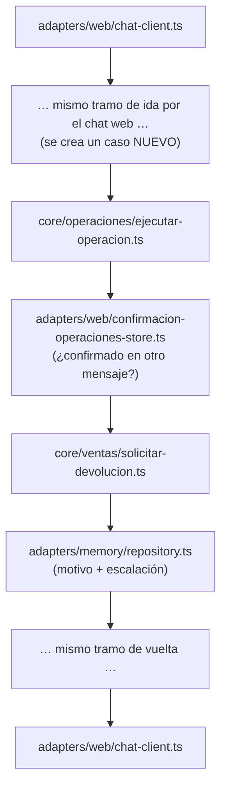

**1. `adapters/web/chat-client.ts`**
- *Qué es*: el código JavaScript del chat que corre en el navegador del empleado. Lo sirve el propio servidor web junto con la página (`chat-page.ts`). Guarda el token de sesión y envía cada mensaje al servidor.
- *Qué ejecuta en este paso*: El empleado escribe en el chat y presiona Enviar
- *Cómo sigue*: Hace `fetch` a `POST /operaciones` con el cuerpo JSON `{ consulta }` y el encabezado `Authorization: Bearer <token>` que recibió al iniciar sesión

**2. `adapters/web/server.ts`**
- *Qué es*: el servidor HTTP del chat web, sin framework (módulo `node:http` de Node). Atiende el login, los mensajes, el link del cliente y la página del chat.
- *Qué ejecuta en este paso*: Recibe el `POST /operaciones` y lee el cuerpo de la petición
- *Cómo sigue*: Le pide a `sesion-empleado-store.ts` la sesión que corresponde al token

**3. `adapters/web/sesion-empleado-store.ts`**
- *Qué es*: el almacén de sesiones del chat web. Guarda en memoria, por token, la sesión de cada empleado que inició sesión en el navegador. Es independiente de la sesión de la TUI.
- *Qué ejecuta en este paso*: Busca el token y verifica con `core/auth/sesion.ts` que la sesión no haya vencido
- *Cómo sigue*: Devuelve la sesión (con el id del empleado) al servidor; si no hay sesión válida, el servidor responde 401 y termina

**4. `adapters/web/payloads.ts`**
- *Qué es*: el validador de los cuerpos JSON que llegan al servidor web: revisa que cada pedido tenga la forma esperada antes de procesarlo.
- *Qué ejecuta en este paso*: Valida que el JSON tenga la forma `{ consulta }`
- *Cómo sigue*: Devuelve el mensaje validado al servidor; si es inválido, el servidor responde 400

**5. `adapters/web/server.ts`**
- *Qué es*: el servidor HTTP del chat web, sin framework (módulo `node:http` de Node). Atiende el login, los mensajes, el link del cliente y la página del chat.
- *Qué ejecuta en este paso*: Toma la ranura de confirmaciones **de ese empleado** (`confirmacion-operaciones-store.ts`, instancia web) y la memoria de conversación **de ese token** (`conversacion-empleado-store.ts`)
- *Cómo sigue*: Llama a `onOperacionesEmpleado` (el manejador que armó `build-on-operaciones-empleado.ts`) con el mensaje, la sesión, las confirmaciones y la memoria, con un tiempo límite

**6. `build-on-operaciones-empleado.ts`**
- *Qué es*: el preparador de conversaciones. Es un archivo de cableado que, para cada mensaje, crea el caso y le arma al agente su prompt y sus herramientas. Lo usan la TUI y el chat web por igual.
- *Qué ejecuta en este paso*: Crea un **caso nuevo** para este mensaje (vía `repository.ts`), arma el prompt, toma el agente de operaciones de `core/agents/definitions.ts` y crea las herramientas del turno: `adapters/operaciones/index.ts` (con la sesión guardada adentro, así el modelo nunca tiene que decir quién es el empleado) y `adapters/knowledge/index.ts`
- *Cómo sigue*: Llama a `handleTurn` de `handle-turn.ts` con el caso, el prompt, el agente y las herramientas

**7. `core/turn-selector/handle-turn.ts`**
- *Qué es*: el orquestador de turnos del núcleo (bloque "Selector de Turno" del arc42). Ejecuta siempre los mismos pasos en orden: elegir agente, armar contexto, invocar al modelo y cerrar el turno.
- *Qué ejecuta en este paso*: Orquesta el turno en pasos fijos
- *Cómo sigue*: Llama a `resolve-turn.ts`

**8. `core/turn-selector/resolve-turn.ts`**
- *Qué es*: la parte del orquestador que decide qué agente atiende el turno entre los candidatos que recibió.
- *Qué ejecuta en este paso*: Confirma qué agente atiende el turno
- *Cómo sigue*: Devuelve el agente a `handle-turn.ts`, que llama a `assemble-context.ts`

**9. `core/turn-selector/assemble-context.ts`**
- *Qué es*: la parte del orquestador que arma el contexto: busca en la base la sesión anterior del agente para que la conversación continúe con memoria.
- *Qué ejecuta en este paso*: Busca en `sesiones_agente` (vía `repository.ts`) la sesión del SDK del mensaje anterior de esta conversación: así el agente **recuerda** lo que se habló
- *Cómo sigue*: Devuelve el id de sesión a retomar; `handle-turn.ts` llama a `invoke-model.ts`

**10. `core/turn-selector/invoke-model.ts`**
- *Qué es*: la parte del orquestador que habla con el Claude Agent SDK. Traduce la definición del agente a las opciones del SDK y dispara los hooks antes y después del turno.
- *Qué ejecuta en este paso*: Dispara el hook `PRE_TURN` en `core/hooks/hook-engine.ts` (que ejecuta `log-pre-turn-handler.ts`) y obtiene la lista de skills de `core/skills/skills-habilitadas.ts`
- *Cómo sigue*: Llama a `query()` del **Claude Agent SDK** con el agente, las skills, las herramientas y la sesión a retomar

**11. Claude Agent SDK (modelo)**
- *Qué es*: el motor de agentes de Anthropic (librería `@anthropic-ai/claude-agent-sdk`). Envía el pedido al modelo Claude, le ofrece las herramientas y las skills, y ejecuta las herramientas que el modelo decide usar. Es la única parte donde decide la IA.
- *Qué ejecuta en este paso*: Lee la skill `solicitar-devolucion` y ve que el empleado confirmó y decide llamar a la herramienta `operacion_negocio` con la operación `solicitar_devolucion`
- *Cómo sigue*: El SDK ejecuta el manejador de la herramienta que `adapters/operaciones/index.ts` registró con `createSdkMcpServer`

**12. `adapters/operaciones/index.ts`**
- *Qué es*: el adaptador de la herramienta `operacion_negocio`. Es un servidor MCP que se crea para cada turno con la sesión del empleado guardada adentro; es la única puerta del modelo hacia las operaciones de negocio.
- *Qué ejecuta en este paso*: Recibe los argumentos que armó el modelo
- *Cómo sigue*: Se los pasa a `validarOperacion`

**13. `core/operaciones/validar-operacion.ts`**
- *Qué es*: el validador del núcleo: revisa campo por campo que los datos que armó el modelo tengan la forma exacta que espera cada operación.
- *Qué ejecuta en este paso*: Valida estrictamente campos y tipos. Si algo falta o sobra, devuelve el error al modelo **sin ejecutar nada**
- *Cómo sigue*: Devuelve la operación validada; `adapters/operaciones/index.ts` llama a `ejecutarOperacion` con la sesión del turno

**14. `core/operaciones/ejecutar-operacion.ts`**
- *Qué es*: el despachador de operaciones del núcleo. Tiene una rama por cada una de las 13 operaciones; en cada una aplica permisos, confirmación en dos mensajes y auditoría, y llama al archivo de dominio que corresponde.
- *Qué ejecuta en este paso*: Vuelve a preguntar al almacén si el pedido está confirmado
- *Cómo sigue*: Llama a `estaConfirmada` de `confirmacion-operaciones-store.ts`

**15. `adapters/web/confirmacion-operaciones-store.ts`**
- *Qué es*: el almacén de confirmaciones pendientes. Guarda en memoria (no en la base) qué operación está esperando que el empleado la confirme. Hay una instancia para la TUI y otra para el chat web.
- *Qué ejecuta en este paso*: Responde **sí** solo si coinciden empleado, venta y acción **y** el caso es distinto del que anotó: es decir, si la confirmación llegó en **otro mensaje**. Por eso el modelo no puede confirmar solo en el mismo turno
- *Cómo sigue*: `ejecutar-operacion.ts` consume la confirmación (la borra) y llama a `solicitar-devolucion.ts`

**16. `core/ventas/solicitar-devolucion.ts`**
- *Qué es*: la regla de devolución sin token: solo el vendedor puede pedirla y siempre queda escalada a otra persona.
- *Qué ejecuta en este paso*: Verifica que el empleado sea el vendedor de la venta (si no, `no_autorizada`)
- *Cómo sigue*: Manda a guardar el motivo a través de `justificacion-devolucion-contract.ts`

**17. `adapters/memory/repository.ts`**
- *Qué es*: el adaptador de base de datos (bloque "Memoria Compartida" del arc42). Implementa todos los contratos del núcleo con consultas SQL sobre SQLite, incluida la auditoría.
- *Qué ejecuta en este paso*: Inserta el motivo en `justificaciones_devolucion` y pasa la venta a `reembolso_pendiente` (solo si seguía `confirmada`)
- *Cómo sigue*: Devuelve el resultado; `solicitar-devolucion.ts` lo devuelve a `ejecutar-operacion.ts`

**18. `core/operaciones/ejecutar-operacion.ts`**
- *Qué es*: el despachador de operaciones del núcleo. Tiene una rama por cada una de las 13 operaciones; en cada una aplica permisos, confirmación en dos mensajes y auditoría, y llama al archivo de dominio que corresponde.
- *Qué ejecuta en este paso*: Registra la auditoría y arma el texto "escalada …"
- *Cómo sigue*: Lo devuelve a `adapters/operaciones/index.ts`

**19. `adapters/operaciones/index.ts`**
- *Qué es*: el adaptador de la herramienta `operacion_negocio`. Es un servidor MCP que se crea para cada turno con la sesión del empleado guardada adentro; es la única puerta del modelo hacia las operaciones de negocio.
- *Qué ejecuta en este paso*: Recibe el texto del resultado
- *Cómo sigue*: Se lo devuelve al SDK como resultado de la herramienta

**20. Claude Agent SDK (modelo)**
- *Qué es*: el motor de agentes de Anthropic (librería `@anthropic-ai/claude-agent-sdk`). Envía el pedido al modelo Claude, le ofrece las herramientas y las skills, y ejecuta las herramientas que el modelo decide usar. Es la única parte donde decide la IA.
- *Qué ejecuta en este paso*: Redacta la respuesta final para el empleado a partir del resultado
- *Cómo sigue*: Termina la consulta y le devuelve el control a `invoke-model.ts`

**21. `core/turn-selector/invoke-model.ts`**
- *Qué es*: la parte del orquestador que habla con el Claude Agent SDK. Traduce la definición del agente a las opciones del SDK y dispara los hooks antes y después del turno.
- *Qué ejecuta en este paso*: Dispara el hook `POST_TURN` (`log-post-turn-handler.ts`)
- *Cómo sigue*: Devuelve la respuesta a `handle-turn.ts`, que llama a `close-turn.ts`

**22. `core/turn-selector/close-turn.ts`**
- *Qué es*: la parte del orquestador que cierra el turno: guarda en la base la sesión del agente para poder retomarla después.
- *Qué ejecuta en este paso*: Guarda en `sesiones_agente` (vía `repository.ts`) la sesión del SDK de este turno, para que el próximo mensaje pueda retomarla
- *Cómo sigue*: Devuelve el control a `build-on-operaciones-empleado.ts`

**23. `build-on-operaciones-empleado.ts`**
- *Qué es*: el preparador de conversaciones. Es un archivo de cableado que, para cada mensaje, crea el caso y le arma al agente su prompt y sus herramientas. Lo usan la TUI y el chat web por igual.
- *Qué ejecuta en este paso*: Anota este caso en la memoria de la conversación del empleado
- *Cómo sigue*: Devuelve la respuesta a `adapters/web/server.ts`

**24. `adapters/web/server.ts`**
- *Qué es*: el servidor HTTP del chat web, sin framework (módulo `node:http` de Node). Atiende el login, los mensajes, el link del cliente y la página del chat.
- *Qué ejecuta en este paso*: Responde el `POST` con un JSON que trae la respuesta del agente (o 504 si se venció el tiempo límite)
- *Cómo sigue*: El navegador recibe la respuesta

**25. `adapters/web/chat-client.ts`**
- *Qué es*: el código JavaScript del chat que corre en el navegador del empleado. Lo sirve el propio servidor web junto con la página (`chat-page.ts`). Guarda el token de sesión y envía cada mensaje al servidor.
- *Qué ejecuta en este paso*: Muestra la respuesta del agente en el chat
- *Cómo sigue*: Fin del turno

**Cómo verificarlo**:

```powershell
sqlite3 -readonly data\demo.db "SELECT venta_id, motivo FROM justificaciones_devolucion ORDER BY solicitada_at DESC LIMIT 1"
```

Log: `devolucion-solicitud-escalada`.

**Cuidado**: si intentás hacer todo en un solo mensaje, **no se ejecuta, a propósito**. Si no sos el vendedor: `no_autorizada`.

---

### CU-07 · Resolver un reembolso (aprobar, rechazar, reabrir)

**Qué demuestra**: rol de administrador, autoaprobación prohibida y confirmación en dos mensajes.

**Precondiciones**: venta en `reembolso_pendiente` (CU-05 con monto ≥ 500, o CU-06). Logueado como **`admin`**, que **no** es quien vendió.

**Cómo ejecutarlo**:

En el **chat web** (`http://localhost:<WEB_PORT>/chat`), con sesión iniciada como `admin`:

1. `¿Qué reembolsos hay pendientes?`
2. `Aprobá el reembolso de la venta <id>.`
3. El agente muestra monto y estado, y pide confirmar. **Mensaje nuevo**: `Confirmado.`

**Qué se espera ver**: "estado reembolsada, caso resuelto". Con rechazar: `reembolso_rechazado`. Reabrir uno rechazado lo vuelve a `reembolso_pendiente`.

**Qué pasa, en palabras simples**: el administrador pide resolver un reembolso pendiente. En el primer mensaje el sistema muestra monto y estado y espera la confirmación. En el segundo, el dominio hace dos controles en orden: que quien resuelve sea administrador y que no sea el vendedor de esa venta. Si pasa los dos, cambia el estado de la venta y del caso, siempre que nadie lo haya cambiado antes.

**Componentes que se ejecutan — segundo mensaje (el primero es igual al de CU-06: anota la confirmación pendiente y muestra el resumen)**:

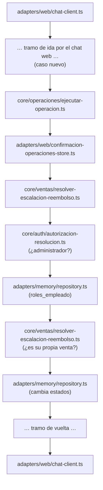

**1. `adapters/web/chat-client.ts`**
- *Qué es*: el código JavaScript del chat que corre en el navegador del empleado. Lo sirve el propio servidor web junto con la página (`chat-page.ts`). Guarda el token de sesión y envía cada mensaje al servidor.
- *Qué ejecuta en este paso*: El empleado escribe en el chat y presiona Enviar
- *Cómo sigue*: Hace `fetch` a `POST /operaciones` con el cuerpo JSON `{ consulta }` y el encabezado `Authorization: Bearer <token>` que recibió al iniciar sesión

**2. `adapters/web/server.ts`**
- *Qué es*: el servidor HTTP del chat web, sin framework (módulo `node:http` de Node). Atiende el login, los mensajes, el link del cliente y la página del chat.
- *Qué ejecuta en este paso*: Recibe el `POST /operaciones` y lee el cuerpo de la petición
- *Cómo sigue*: Le pide a `sesion-empleado-store.ts` la sesión que corresponde al token

**3. `adapters/web/sesion-empleado-store.ts`**
- *Qué es*: el almacén de sesiones del chat web. Guarda en memoria, por token, la sesión de cada empleado que inició sesión en el navegador. Es independiente de la sesión de la TUI.
- *Qué ejecuta en este paso*: Busca el token y verifica con `core/auth/sesion.ts` que la sesión no haya vencido
- *Cómo sigue*: Devuelve la sesión (con el id del empleado) al servidor; si no hay sesión válida, el servidor responde 401 y termina

**4. `adapters/web/payloads.ts`**
- *Qué es*: el validador de los cuerpos JSON que llegan al servidor web: revisa que cada pedido tenga la forma esperada antes de procesarlo.
- *Qué ejecuta en este paso*: Valida que el JSON tenga la forma `{ consulta }`
- *Cómo sigue*: Devuelve el mensaje validado al servidor; si es inválido, el servidor responde 400

**5. `adapters/web/server.ts`**
- *Qué es*: el servidor HTTP del chat web, sin framework (módulo `node:http` de Node). Atiende el login, los mensajes, el link del cliente y la página del chat.
- *Qué ejecuta en este paso*: Toma la ranura de confirmaciones **de ese empleado** (`confirmacion-operaciones-store.ts`, instancia web) y la memoria de conversación **de ese token** (`conversacion-empleado-store.ts`)
- *Cómo sigue*: Llama a `onOperacionesEmpleado` (el manejador que armó `build-on-operaciones-empleado.ts`) con el mensaje, la sesión, las confirmaciones y la memoria, con un tiempo límite

**6. `build-on-operaciones-empleado.ts`**
- *Qué es*: el preparador de conversaciones. Es un archivo de cableado que, para cada mensaje, crea el caso y le arma al agente su prompt y sus herramientas. Lo usan la TUI y el chat web por igual.
- *Qué ejecuta en este paso*: Crea un **caso nuevo** para este mensaje (vía `repository.ts`), arma el prompt, toma el agente de operaciones de `core/agents/definitions.ts` y crea las herramientas del turno: `adapters/operaciones/index.ts` (con la sesión guardada adentro, así el modelo nunca tiene que decir quién es el empleado) y `adapters/knowledge/index.ts`
- *Cómo sigue*: Llama a `handleTurn` de `handle-turn.ts` con el caso, el prompt, el agente y las herramientas

**7. `core/turn-selector/handle-turn.ts`**
- *Qué es*: el orquestador de turnos del núcleo (bloque "Selector de Turno" del arc42). Ejecuta siempre los mismos pasos en orden: elegir agente, armar contexto, invocar al modelo y cerrar el turno.
- *Qué ejecuta en este paso*: Orquesta el turno en pasos fijos
- *Cómo sigue*: Llama a `resolve-turn.ts`

**8. `core/turn-selector/resolve-turn.ts`**
- *Qué es*: la parte del orquestador que decide qué agente atiende el turno entre los candidatos que recibió.
- *Qué ejecuta en este paso*: Confirma qué agente atiende el turno
- *Cómo sigue*: Devuelve el agente a `handle-turn.ts`, que llama a `assemble-context.ts`

**9. `core/turn-selector/assemble-context.ts`**
- *Qué es*: la parte del orquestador que arma el contexto: busca en la base la sesión anterior del agente para que la conversación continúe con memoria.
- *Qué ejecuta en este paso*: Busca en `sesiones_agente` (vía `repository.ts`) la sesión del SDK del mensaje anterior de esta conversación: así el agente **recuerda** lo que se habló
- *Cómo sigue*: Devuelve el id de sesión a retomar; `handle-turn.ts` llama a `invoke-model.ts`

**10. `core/turn-selector/invoke-model.ts`**
- *Qué es*: la parte del orquestador que habla con el Claude Agent SDK. Traduce la definición del agente a las opciones del SDK y dispara los hooks antes y después del turno.
- *Qué ejecuta en este paso*: Dispara el hook `PRE_TURN` en `core/hooks/hook-engine.ts` (que ejecuta `log-pre-turn-handler.ts`) y obtiene la lista de skills de `core/skills/skills-habilitadas.ts`
- *Cómo sigue*: Llama a `query()` del **Claude Agent SDK** con el agente, las skills, las herramientas y la sesión a retomar

**11. Claude Agent SDK (modelo)**
- *Qué es*: el motor de agentes de Anthropic (librería `@anthropic-ai/claude-agent-sdk`). Envía el pedido al modelo Claude, le ofrece las herramientas y las skills, y ejecuta las herramientas que el modelo decide usar. Es la única parte donde decide la IA.
- *Qué ejecuta en este paso*: Lee la skill `resolver-reembolso` e indica la acción (aprobar, rechazar o reabrir) y decide llamar a la herramienta `operacion_negocio` con la operación `resolver_reembolso`
- *Cómo sigue*: El SDK ejecuta el manejador de la herramienta que `adapters/operaciones/index.ts` registró con `createSdkMcpServer`

**12. `adapters/operaciones/index.ts`**
- *Qué es*: el adaptador de la herramienta `operacion_negocio`. Es un servidor MCP que se crea para cada turno con la sesión del empleado guardada adentro; es la única puerta del modelo hacia las operaciones de negocio.
- *Qué ejecuta en este paso*: Recibe los argumentos que armó el modelo
- *Cómo sigue*: Se los pasa a `validarOperacion`

**13. `core/operaciones/validar-operacion.ts`**
- *Qué es*: el validador del núcleo: revisa campo por campo que los datos que armó el modelo tengan la forma exacta que espera cada operación.
- *Qué ejecuta en este paso*: Valida estrictamente campos y tipos. Si algo falta o sobra, devuelve el error al modelo **sin ejecutar nada**
- *Cómo sigue*: Devuelve la operación validada; `adapters/operaciones/index.ts` llama a `ejecutarOperacion` con la sesión del turno

**14. `core/operaciones/ejecutar-operacion.ts`**
- *Qué es*: el despachador de operaciones del núcleo. Tiene una rama por cada una de las 13 operaciones; en cada una aplica permisos, confirmación en dos mensajes y auditoría, y llama al archivo de dominio que corresponde.
- *Qué ejecuta en este paso*: Elige la rama `resolver_reembolso` y verifica la confirmación
- *Cómo sigue*: Llama a `estaConfirmada` de `confirmacion-operaciones-store.ts`

**15. `adapters/web/confirmacion-operaciones-store.ts`**
- *Qué es*: el almacén de confirmaciones pendientes. Guarda en memoria (no en la base) qué operación está esperando que el empleado la confirme. Hay una instancia para la TUI y otra para el chat web.
- *Qué ejecuta en este paso*: Confirma que el pedido se aprobó en un mensaje anterior
- *Cómo sigue*: `ejecutar-operacion.ts` consume la confirmación y llama a `resolver-escalacion-reembolso.ts`

**16. `core/ventas/resolver-escalacion-reembolso.ts`**
- *Qué es*: la regla de resolución de reembolsos: aprobar, rechazar o reabrir, con control de rol y de autoaprobación.
- *Qué ejecuta en este paso*: Primer control: el rol
- *Cómo sigue*: Pregunta a `autorizacion-resolucion.ts`

**17. `core/auth/autorizacion-resolucion.ts`**
- *Qué es*: la regla de autorización: responde si un empleado es administrador y puede resolver asuntos de otros.
- *Qué ejecuta en este paso*: ¿El empleado de la sesión es administrador?
- *Cómo sigue*: Consulta `roles_empleado` en `repository.ts`; si no es administrador devuelve `no_autorizado` y el flujo termina acá

**18. `core/ventas/resolver-escalacion-reembolso.ts`**
- *Qué es*: la regla de resolución de reembolsos: aprobar, rechazar o reabrir, con control de rol y de autoaprobación.
- *Qué ejecuta en este paso*: Segundo control: compara el vendedor de la venta con el empleado de la sesión. Si son el mismo, `autoaprobacion_prohibida`, **aunque sea administrador**
- *Cómo sigue*: Si pasa, manda a aplicar el cambio

**19. `adapters/memory/repository.ts`**
- *Qué es*: el adaptador de base de datos (bloque "Memoria Compartida" del arc42). Implementa todos los contratos del núcleo con consultas SQL sobre SQLite, incluida la auditoría.
- *Qué ejecuta en este paso*: Cambia el estado de la venta y del caso **solo si seguía pendiente**
- *Cómo sigue*: Devuelve si se aplicó; el resultado vuelve a `ejecutar-operacion.ts`

**20. `core/operaciones/ejecutar-operacion.ts`**
- *Qué es*: el despachador de operaciones del núcleo. Tiene una rama por cada una de las 13 operaciones; en cada una aplica permisos, confirmación en dos mensajes y auditoría, y llama al archivo de dominio que corresponde.
- *Qué ejecuta en este paso*: Registra la auditoría y arma el texto
- *Cómo sigue*: Lo devuelve a `adapters/operaciones/index.ts`

**21. `adapters/operaciones/index.ts`**
- *Qué es*: el adaptador de la herramienta `operacion_negocio`. Es un servidor MCP que se crea para cada turno con la sesión del empleado guardada adentro; es la única puerta del modelo hacia las operaciones de negocio.
- *Qué ejecuta en este paso*: Recibe el texto del resultado
- *Cómo sigue*: Se lo devuelve al SDK como resultado de la herramienta

**22. Claude Agent SDK (modelo)**
- *Qué es*: el motor de agentes de Anthropic (librería `@anthropic-ai/claude-agent-sdk`). Envía el pedido al modelo Claude, le ofrece las herramientas y las skills, y ejecuta las herramientas que el modelo decide usar. Es la única parte donde decide la IA.
- *Qué ejecuta en este paso*: Redacta la respuesta final para el empleado a partir del resultado
- *Cómo sigue*: Termina la consulta y le devuelve el control a `invoke-model.ts`

**23. `core/turn-selector/invoke-model.ts`**
- *Qué es*: la parte del orquestador que habla con el Claude Agent SDK. Traduce la definición del agente a las opciones del SDK y dispara los hooks antes y después del turno.
- *Qué ejecuta en este paso*: Dispara el hook `POST_TURN` (`log-post-turn-handler.ts`)
- *Cómo sigue*: Devuelve la respuesta a `handle-turn.ts`, que llama a `close-turn.ts`

**24. `core/turn-selector/close-turn.ts`**
- *Qué es*: la parte del orquestador que cierra el turno: guarda en la base la sesión del agente para poder retomarla después.
- *Qué ejecuta en este paso*: Guarda en `sesiones_agente` (vía `repository.ts`) la sesión del SDK de este turno, para que el próximo mensaje pueda retomarla
- *Cómo sigue*: Devuelve el control a `build-on-operaciones-empleado.ts`

**25. `build-on-operaciones-empleado.ts`**
- *Qué es*: el preparador de conversaciones. Es un archivo de cableado que, para cada mensaje, crea el caso y le arma al agente su prompt y sus herramientas. Lo usan la TUI y el chat web por igual.
- *Qué ejecuta en este paso*: Anota este caso en la memoria de la conversación del empleado
- *Cómo sigue*: Devuelve la respuesta a `adapters/web/server.ts`

**26. `adapters/web/server.ts`**
- *Qué es*: el servidor HTTP del chat web, sin framework (módulo `node:http` de Node). Atiende el login, los mensajes, el link del cliente y la página del chat.
- *Qué ejecuta en este paso*: Responde el `POST` con un JSON que trae la respuesta del agente (o 504 si se venció el tiempo límite)
- *Cómo sigue*: El navegador recibe la respuesta

**27. `adapters/web/chat-client.ts`**
- *Qué es*: el código JavaScript del chat que corre en el navegador del empleado. Lo sirve el propio servidor web junto con la página (`chat-page.ts`). Guarda el token de sesión y envía cada mensaje al servidor.
- *Qué ejecuta en este paso*: Muestra la respuesta del agente en el chat
- *Cómo sigue*: Fin del turno

**Cómo verificarlo**:

Log: `reembolso-escalacion-aprobada`, `reembolso-autoaprobacion-rechazada`.

**Para mostrar las negativas**: como `vendedor`, pedí aprobar → `no_autorizado`. Si `admin` fue quien vendió → `autoaprobacion_prohibida`.

**Cuidado**: `/aprobar-reembolso` y sus hermanos **ya no existen** (se retiraron en v3.10). Todo es conversacional.

---

### CU-08 · Reporte de comisiones

**Qué demuestra**: el mismo cálculo servido por tres canales, neto de reembolsos (ADR 301).

**Cómo ejecutarlo**:

- Empleado, en el chat web: `Mostrame el reporte de comisiones de 2026-09.`
- Administración, en la TUI: `/reporte-comisiones 2026-09` (sin período, usa el mes actual).
- CLI, sin sesión: `npm run reporte:mensual -- --periodo 2026-09`

**Qué se espera ver**: tabla por vendedor (Ventas, Monto vendido, Total comisionado, Con reembolso), fila **TOTAL** neta, una **leyenda** de dos líneas y la sección "Reembolsos pendientes de aprobación" con su nota.

**Qué pasa, en palabras simples**: hay tres puertas de entrada (el comando, la conversación y el CLI) y las tres terminan en el mismo archivo, `reporte.ts`. Ese archivo pide a la base las comisiones del mes junto con el estado actual de cada venta, descuenta las ventas ya reembolsadas y arma la tabla con el total y la leyenda. Por eso los tres canales muestran exactamente lo mismo.

**Componentes que se ejecutan — con el comando `/reporte-comisiones`**:

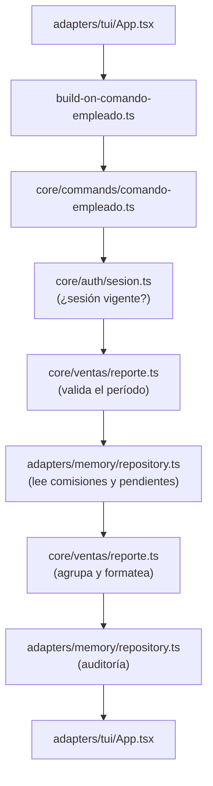

**1. `adapters/tui/App.tsx`**
- *Qué es*: la pantalla de la terminal, un componente hecho con Ink (React para consola). Dibuja la conversación y la línea donde escribe el empleado. No contiene reglas de negocio.
- *Qué ejecuta en este paso*: Captura `/reporte-comisiones 2026-09`
- *Cómo sigue*: Llama a `onSubmit` con el texto

**2. `build-on-comando-empleado.ts`**
- *Qué es*: el portero de la TUI. Es un archivo de cableado que arma `main.ts` al arrancar: recibe cada línea que escribe el empleado y decide si es un comando `/` o una conversación, controlando sesión y rol.
- *Qué ejecuta en este paso*: El portero
- *Cómo sigue*: Le pasa el texto a `parsearComando`

**3. `core/commands/comando-empleado.ts`**
- *Qué es*: el registro de comandos del núcleo. Contiene la lista `COMANDOS` con cada comando `/`, su sintaxis y lo que exige (sesión, administrador, clave secreta). Convierte texto en un comando estructurado.
- *Qué ejecuta en este paso*: Reconoce el comando y su período; informa que es privilegiado (exige sesión)
- *Cómo sigue*: Devuelve `{ tipo: "reporte_comisiones", periodo }`

**4. `core/auth/sesion.ts`**
- *Qué es*: las reglas de sesión: cuándo vence por tiempo total y por inactividad.
- *Qué ejecuta en este paso*: El portero verifica que la sesión esté vigente
- *Cómo sigue*: El portero llama a su manejador del reporte

**5. `core/ventas/reporte.ts`**
- *Qué es*: la lógica del reporte de comisiones: valida el período, agrupa por vendedor descontando reembolsos y da formato a la tabla. Son funciones puras, fáciles de probar.
- *Qué ejecuta en este paso*: `resolverPeriodoReporte` valida el formato `AAAA-MM`
- *Cómo sigue*: Pide los datos a través de `reporte-contract.ts`, que implementa `repository.ts`

**6. `adapters/memory/repository.ts`**
- *Qué es*: el adaptador de base de datos (bloque "Memoria Compartida" del arc42). Implementa todos los contratos del núcleo con consultas SQL sobre SQLite, incluida la auditoría.
- *Qué ejecuta en este paso*: Lee `comisiones` unida con el estado **actual** de cada venta, y las ventas en `reembolso_pendiente`
- *Cómo sigue*: Devuelve las filas

**7. `core/ventas/reporte.ts`**
- *Qué es*: la lógica del reporte de comisiones: valida el período, agrupa por vendedor descontando reembolsos y da formato a la tabla. Son funciones puras, fáciles de probar.
- *Qué ejecuta en este paso*: `agruparReporteMensual` descuenta las ventas `reembolsada`, ordena y calcula el TOTAL; `formatearReporteMensual` arma la tabla, la leyenda y la sección de pendientes
- *Cómo sigue*: Devuelve el texto al portero

**8. `adapters/memory/repository.ts`**
- *Qué es*: el adaptador de base de datos (bloque "Memoria Compartida" del arc42). Implementa todos los contratos del núcleo con consultas SQL sobre SQLite, incluida la auditoría.
- *Qué ejecuta en este paso*: El portero registra la consulta en la auditoría
- *Cómo sigue*: El portero devuelve el texto a la pantalla

**9. `adapters/tui/App.tsx`**
- *Qué es*: la pantalla de la terminal, un componente hecho con Ink (React para consola). Dibuja la conversación y la línea donde escribe el empleado. No contiene reglas de negocio.
- *Qué ejecuta en este paso*: Muestra la tabla
- *Cómo sigue*: Fin

**Componentes que se ejecutan — conversando en el chat web**:

**1. `adapters/web/chat-client.ts`**
- *Qué es*: el código JavaScript del chat que corre en el navegador del empleado. Lo sirve el propio servidor web junto con la página (`chat-page.ts`). Guarda el token de sesión y envía cada mensaje al servidor.
- *Qué ejecuta en este paso*: El empleado escribe en el chat y presiona Enviar
- *Cómo sigue*: Hace `fetch` a `POST /operaciones` con el cuerpo JSON `{ consulta }` y el encabezado `Authorization: Bearer <token>` que recibió al iniciar sesión

**2. `adapters/web/server.ts`**
- *Qué es*: el servidor HTTP del chat web, sin framework (módulo `node:http` de Node). Atiende el login, los mensajes, el link del cliente y la página del chat.
- *Qué ejecuta en este paso*: Recibe el `POST /operaciones` y lee el cuerpo de la petición
- *Cómo sigue*: Le pide a `sesion-empleado-store.ts` la sesión que corresponde al token

**3. `adapters/web/sesion-empleado-store.ts`**
- *Qué es*: el almacén de sesiones del chat web. Guarda en memoria, por token, la sesión de cada empleado que inició sesión en el navegador. Es independiente de la sesión de la TUI.
- *Qué ejecuta en este paso*: Busca el token y verifica con `core/auth/sesion.ts` que la sesión no haya vencido
- *Cómo sigue*: Devuelve la sesión (con el id del empleado) al servidor; si no hay sesión válida, el servidor responde 401 y termina

**4. `adapters/web/payloads.ts`**
- *Qué es*: el validador de los cuerpos JSON que llegan al servidor web: revisa que cada pedido tenga la forma esperada antes de procesarlo.
- *Qué ejecuta en este paso*: Valida que el JSON tenga la forma `{ consulta }`
- *Cómo sigue*: Devuelve el mensaje validado al servidor; si es inválido, el servidor responde 400

**5. `adapters/web/server.ts`**
- *Qué es*: el servidor HTTP del chat web, sin framework (módulo `node:http` de Node). Atiende el login, los mensajes, el link del cliente y la página del chat.
- *Qué ejecuta en este paso*: Toma la ranura de confirmaciones **de ese empleado** (`confirmacion-operaciones-store.ts`, instancia web) y la memoria de conversación **de ese token** (`conversacion-empleado-store.ts`)
- *Cómo sigue*: Llama a `onOperacionesEmpleado` (el manejador que armó `build-on-operaciones-empleado.ts`) con el mensaje, la sesión, las confirmaciones y la memoria, con un tiempo límite

**6. `build-on-operaciones-empleado.ts`**
- *Qué es*: el preparador de conversaciones. Es un archivo de cableado que, para cada mensaje, crea el caso y le arma al agente su prompt y sus herramientas. Lo usan la TUI y el chat web por igual.
- *Qué ejecuta en este paso*: Crea un **caso nuevo** para este mensaje (vía `repository.ts`), arma el prompt, toma el agente de operaciones de `core/agents/definitions.ts` y crea las herramientas del turno: `adapters/operaciones/index.ts` (con la sesión guardada adentro, así el modelo nunca tiene que decir quién es el empleado) y `adapters/knowledge/index.ts`
- *Cómo sigue*: Llama a `handleTurn` de `handle-turn.ts` con el caso, el prompt, el agente y las herramientas

**7. `core/turn-selector/handle-turn.ts`**
- *Qué es*: el orquestador de turnos del núcleo (bloque "Selector de Turno" del arc42). Ejecuta siempre los mismos pasos en orden: elegir agente, armar contexto, invocar al modelo y cerrar el turno.
- *Qué ejecuta en este paso*: Orquesta el turno en pasos fijos
- *Cómo sigue*: Llama a `resolve-turn.ts`

**8. `core/turn-selector/resolve-turn.ts`**
- *Qué es*: la parte del orquestador que decide qué agente atiende el turno entre los candidatos que recibió.
- *Qué ejecuta en este paso*: Confirma qué agente atiende el turno
- *Cómo sigue*: Devuelve el agente a `handle-turn.ts`, que llama a `assemble-context.ts`

**9. `core/turn-selector/assemble-context.ts`**
- *Qué es*: la parte del orquestador que arma el contexto: busca en la base la sesión anterior del agente para que la conversación continúe con memoria.
- *Qué ejecuta en este paso*: Busca en `sesiones_agente` (vía `repository.ts`) la sesión del SDK del mensaje anterior de esta conversación: así el agente **recuerda** lo que se habló
- *Cómo sigue*: Devuelve el id de sesión a retomar; `handle-turn.ts` llama a `invoke-model.ts`

**10. `core/turn-selector/invoke-model.ts`**
- *Qué es*: la parte del orquestador que habla con el Claude Agent SDK. Traduce la definición del agente a las opciones del SDK y dispara los hooks antes y después del turno.
- *Qué ejecuta en este paso*: Dispara el hook `PRE_TURN` en `core/hooks/hook-engine.ts` (que ejecuta `log-pre-turn-handler.ts`) y obtiene la lista de skills de `core/skills/skills-habilitadas.ts`
- *Cómo sigue*: Llama a `query()` del **Claude Agent SDK** con el agente, las skills, las herramientas y la sesión a retomar

**11. Claude Agent SDK (modelo)**
- *Qué es*: el motor de agentes de Anthropic (librería `@anthropic-ai/claude-agent-sdk`). Envía el pedido al modelo Claude, le ofrece las herramientas y las skills, y ejecuta las herramientas que el modelo decide usar. Es la única parte donde decide la IA.
- *Qué ejecuta en este paso*: Lee la skill `reporte-comisiones-conversacional` y decide llamar a la herramienta `operacion_negocio` con la operación `consultar_reporte_comisiones`
- *Cómo sigue*: El SDK ejecuta el manejador de la herramienta que `adapters/operaciones/index.ts` registró con `createSdkMcpServer`

**12. `adapters/operaciones/index.ts`**
- *Qué es*: el adaptador de la herramienta `operacion_negocio`. Es un servidor MCP que se crea para cada turno con la sesión del empleado guardada adentro; es la única puerta del modelo hacia las operaciones de negocio.
- *Qué ejecuta en este paso*: Recibe los argumentos que armó el modelo
- *Cómo sigue*: Se los pasa a `validarOperacion`

**13. `core/operaciones/validar-operacion.ts`**
- *Qué es*: el validador del núcleo: revisa campo por campo que los datos que armó el modelo tengan la forma exacta que espera cada operación.
- *Qué ejecuta en este paso*: Valida estrictamente campos y tipos. Si algo falta o sobra, devuelve el error al modelo **sin ejecutar nada**
- *Cómo sigue*: Devuelve la operación validada; `adapters/operaciones/index.ts` llama a `ejecutarOperacion` con la sesión del turno

**14. `core/operaciones/ejecutar-operacion.ts`**
- *Qué es*: el despachador de operaciones del núcleo. Tiene una rama por cada una de las 13 operaciones; en cada una aplica permisos, confirmación en dos mensajes y auditoría, y llama al archivo de dominio que corresponde.
- *Qué ejecuta en este paso*: Elige la rama `consultar_reporte_comisiones`
- *Cómo sigue*: Llama a las mismas funciones de `reporte.ts`

**15. `core/ventas/reporte.ts` → `repository.ts` → `reporte.ts`**
- *Qué es*: la lógica del reporte de comisiones: valida el período, agrupa por vendedor descontando reembolsos y da formato a la tabla. Son funciones puras, fáciles de probar.
- *Qué ejecuta en este paso*: Los mismos pasos que con el comando
- *Cómo sigue*: Devuelven el texto a `ejecutar-operacion.ts`, que registra la auditoría

**16. `core/operaciones/ejecutar-operacion.ts`**
- *Qué es*: el despachador de operaciones del núcleo. Tiene una rama por cada una de las 13 operaciones; en cada una aplica permisos, confirmación en dos mensajes y auditoría, y llama al archivo de dominio que corresponde.
- *Qué ejecuta en este paso*: Devuelve el texto
- *Cómo sigue*: A `adapters/operaciones/index.ts`

**17. `adapters/operaciones/index.ts`**
- *Qué es*: el adaptador de la herramienta `operacion_negocio`. Es un servidor MCP que se crea para cada turno con la sesión del empleado guardada adentro; es la única puerta del modelo hacia las operaciones de negocio.
- *Qué ejecuta en este paso*: Recibe el texto del resultado
- *Cómo sigue*: Se lo devuelve al SDK como resultado de la herramienta

**18. Claude Agent SDK (modelo)**
- *Qué es*: el motor de agentes de Anthropic (librería `@anthropic-ai/claude-agent-sdk`). Envía el pedido al modelo Claude, le ofrece las herramientas y las skills, y ejecuta las herramientas que el modelo decide usar. Es la única parte donde decide la IA.
- *Qué ejecuta en este paso*: Redacta la respuesta final para el empleado a partir del resultado
- *Cómo sigue*: Termina la consulta y le devuelve el control a `invoke-model.ts`

**19. `core/turn-selector/invoke-model.ts`**
- *Qué es*: la parte del orquestador que habla con el Claude Agent SDK. Traduce la definición del agente a las opciones del SDK y dispara los hooks antes y después del turno.
- *Qué ejecuta en este paso*: Dispara el hook `POST_TURN` (`log-post-turn-handler.ts`)
- *Cómo sigue*: Devuelve la respuesta a `handle-turn.ts`, que llama a `close-turn.ts`

**20. `core/turn-selector/close-turn.ts`**
- *Qué es*: la parte del orquestador que cierra el turno: guarda en la base la sesión del agente para poder retomarla después.
- *Qué ejecuta en este paso*: Guarda en `sesiones_agente` (vía `repository.ts`) la sesión del SDK de este turno, para que el próximo mensaje pueda retomarla
- *Cómo sigue*: Devuelve el control a `build-on-operaciones-empleado.ts`

**21. `build-on-operaciones-empleado.ts`**
- *Qué es*: el preparador de conversaciones. Es un archivo de cableado que, para cada mensaje, crea el caso y le arma al agente su prompt y sus herramientas. Lo usan la TUI y el chat web por igual.
- *Qué ejecuta en este paso*: Anota este caso en la memoria de la conversación del empleado
- *Cómo sigue*: Devuelve la respuesta a `adapters/web/server.ts`

**22. `adapters/web/server.ts`**
- *Qué es*: el servidor HTTP del chat web, sin framework (módulo `node:http` de Node). Atiende el login, los mensajes, el link del cliente y la página del chat.
- *Qué ejecuta en este paso*: Responde el `POST` con un JSON que trae la respuesta del agente (o 504 si se venció el tiempo límite)
- *Cómo sigue*: El navegador recibe la respuesta

**23. `adapters/web/chat-client.ts`**
- *Qué es*: el código JavaScript del chat que corre en el navegador del empleado. Lo sirve el propio servidor web junto con la página (`chat-page.ts`). Guarda el token de sesión y envía cada mensaje al servidor.
- *Qué ejecuta en este paso*: Muestra la respuesta del agente en el chat
- *Cómo sigue*: Fin del turno

**Componentes que se ejecutan — por CLI**:

**1. `reporte-mensual.ts`**
- *Qué es*: el programa de línea de comandos del reporte mensual (`npm run reporte:mensual`). No necesita la TUI ni sesión.
- *Qué ejecuta en este paso*: Lee `--periodo` de la línea de comandos
- *Cómo sigue*: Abre la base con `adapters/memory/db.ts`

**2. `adapters/memory/db.ts`**
- *Qué es*: el adaptador que abre el archivo SQLite y aplica las migraciones pendientes.
- *Qué ejecuta en este paso*: Abre SQLite en `HARNESS_DB_PATH`
- *Cómo sigue*: Devuelve la conexión

**3. `core/ventas/reporte.ts` → `repository.ts` → `reporte.ts`**
- *Qué es*: la lógica del reporte de comisiones: valida el período, agrupa por vendedor descontando reembolsos y da formato a la tabla. Son funciones puras, fáciles de probar.
- *Qué ejecuta en este paso*: Los mismos pasos que con el comando
- *Cómo sigue*: Devuelven el texto

**4. `reporte-mensual.ts`**
- *Qué es*: el programa de línea de comandos del reporte mensual (`npm run reporte:mensual`). No necesita la TUI ni sesión.
- *Qué ejecuta en este paso*: Imprime el reporte en la consola
- *Cómo sigue*: Fin

**Cómo verificarlo**:

```powershell
sqlite3 -readonly data\demo.db "SELECT SUM(c.monto) FROM comisiones c JOIN ventas v ON v.id = c.venta_id WHERE c.periodo = '2026-09' AND v.estado <> 'reembolsada'"
```

Tiene que coincidir con la comisión del TOTAL.

**Para decir**: "La tabla `comisiones` nunca se modifica: guarda lo generado. El reporte muestra lo neto al leer. Por eso aprobar un reembolso cambia el reporte sin tocar el histórico".

**Cuidado**: el reporte conversacional es siempre **de toda la empresa**.

---

### CU-09 · Solicitudes internas

**Qué demuestra**: circuito de aprobación entre personas.

**Precondiciones**: `vendedor` crea; `admin` resuelve.

**Cómo ejecutarlo**:

En el **chat web** (`http://localhost:<WEB_PORT>/chat`), con sesión iniciada:

1. Como `vendedor`: `Quiero pedir vacaciones del 10 al 20 de octubre.` **Esperado**: solicitud creada, pendiente.
2. `¿En qué quedó mi solicitud?` (solo lectura).
3. Como `admin`: `¿Tengo solicitudes para revisar?` → `Aprobá la solicitud <id>.` → mensaje nuevo: `Confirmo.`
4. Alternativa: como `vendedor`, `Quiero cancelar mi solicitud <id>.` → mensaje nuevo: `Sí.`

**Qué se espera ver**: solicitud creada; luego aprobada o cancelada.

**Qué pasa, en palabras simples**: el empleado pide vacaciones conversando; el dominio de solicitudes valida el tipo y guarda la solicitud pendiente. Para resolverla, un administrador la aprueba en dos mensajes, y el dominio controla que tenga el rol y que no sea su propia solicitud. Cancelar solo puede hacerlo el dueño.

**Componentes que se ejecutan — crear la solicitud (paso 1)**:

**1. `adapters/web/chat-client.ts`**
- *Qué es*: el código JavaScript del chat que corre en el navegador del empleado. Lo sirve el propio servidor web junto con la página (`chat-page.ts`). Guarda el token de sesión y envía cada mensaje al servidor.
- *Qué ejecuta en este paso*: El empleado escribe en el chat y presiona Enviar
- *Cómo sigue*: Hace `fetch` a `POST /operaciones` con el cuerpo JSON `{ consulta }` y el encabezado `Authorization: Bearer <token>` que recibió al iniciar sesión

**2. `adapters/web/server.ts`**
- *Qué es*: el servidor HTTP del chat web, sin framework (módulo `node:http` de Node). Atiende el login, los mensajes, el link del cliente y la página del chat.
- *Qué ejecuta en este paso*: Recibe el `POST /operaciones` y lee el cuerpo de la petición
- *Cómo sigue*: Le pide a `sesion-empleado-store.ts` la sesión que corresponde al token

**3. `adapters/web/sesion-empleado-store.ts`**
- *Qué es*: el almacén de sesiones del chat web. Guarda en memoria, por token, la sesión de cada empleado que inició sesión en el navegador. Es independiente de la sesión de la TUI.
- *Qué ejecuta en este paso*: Busca el token y verifica con `core/auth/sesion.ts` que la sesión no haya vencido
- *Cómo sigue*: Devuelve la sesión (con el id del empleado) al servidor; si no hay sesión válida, el servidor responde 401 y termina

**4. `adapters/web/payloads.ts`**
- *Qué es*: el validador de los cuerpos JSON que llegan al servidor web: revisa que cada pedido tenga la forma esperada antes de procesarlo.
- *Qué ejecuta en este paso*: Valida que el JSON tenga la forma `{ consulta }`
- *Cómo sigue*: Devuelve el mensaje validado al servidor; si es inválido, el servidor responde 400

**5. `adapters/web/server.ts`**
- *Qué es*: el servidor HTTP del chat web, sin framework (módulo `node:http` de Node). Atiende el login, los mensajes, el link del cliente y la página del chat.
- *Qué ejecuta en este paso*: Toma la ranura de confirmaciones **de ese empleado** (`confirmacion-operaciones-store.ts`, instancia web) y la memoria de conversación **de ese token** (`conversacion-empleado-store.ts`)
- *Cómo sigue*: Llama a `onOperacionesEmpleado` (el manejador que armó `build-on-operaciones-empleado.ts`) con el mensaje, la sesión, las confirmaciones y la memoria, con un tiempo límite

**6. `build-on-operaciones-empleado.ts`**
- *Qué es*: el preparador de conversaciones. Es un archivo de cableado que, para cada mensaje, crea el caso y le arma al agente su prompt y sus herramientas. Lo usan la TUI y el chat web por igual.
- *Qué ejecuta en este paso*: Crea un **caso nuevo** para este mensaje (vía `repository.ts`), arma el prompt, toma el agente de operaciones de `core/agents/definitions.ts` y crea las herramientas del turno: `adapters/operaciones/index.ts` (con la sesión guardada adentro, así el modelo nunca tiene que decir quién es el empleado) y `adapters/knowledge/index.ts`
- *Cómo sigue*: Llama a `handleTurn` de `handle-turn.ts` con el caso, el prompt, el agente y las herramientas

**7. `core/turn-selector/handle-turn.ts`**
- *Qué es*: el orquestador de turnos del núcleo (bloque "Selector de Turno" del arc42). Ejecuta siempre los mismos pasos en orden: elegir agente, armar contexto, invocar al modelo y cerrar el turno.
- *Qué ejecuta en este paso*: Orquesta el turno en pasos fijos
- *Cómo sigue*: Llama a `resolve-turn.ts`

**8. `core/turn-selector/resolve-turn.ts`**
- *Qué es*: la parte del orquestador que decide qué agente atiende el turno entre los candidatos que recibió.
- *Qué ejecuta en este paso*: Confirma qué agente atiende el turno
- *Cómo sigue*: Devuelve el agente a `handle-turn.ts`, que llama a `assemble-context.ts`

**9. `core/turn-selector/assemble-context.ts`**
- *Qué es*: la parte del orquestador que arma el contexto: busca en la base la sesión anterior del agente para que la conversación continúe con memoria.
- *Qué ejecuta en este paso*: Busca en `sesiones_agente` (vía `repository.ts`) la sesión del SDK del mensaje anterior de esta conversación: así el agente **recuerda** lo que se habló
- *Cómo sigue*: Devuelve el id de sesión a retomar; `handle-turn.ts` llama a `invoke-model.ts`

**10. `core/turn-selector/invoke-model.ts`**
- *Qué es*: la parte del orquestador que habla con el Claude Agent SDK. Traduce la definición del agente a las opciones del SDK y dispara los hooks antes y después del turno.
- *Qué ejecuta en este paso*: Dispara el hook `PRE_TURN` en `core/hooks/hook-engine.ts` (que ejecuta `log-pre-turn-handler.ts`) y obtiene la lista de skills de `core/skills/skills-habilitadas.ts`
- *Cómo sigue*: Llama a `query()` del **Claude Agent SDK** con el agente, las skills, las herramientas y la sesión a retomar

**11. Claude Agent SDK (modelo)**
- *Qué es*: el motor de agentes de Anthropic (librería `@anthropic-ai/claude-agent-sdk`). Envía el pedido al modelo Claude, le ofrece las herramientas y las skills, y ejecuta las herramientas que el modelo decide usar. Es la única parte donde decide la IA.
- *Qué ejecuta en este paso*: Lee la skill `solicitud-interna` y junta el tipo y el detalle y decide llamar a la herramienta `operacion_negocio` con la operación `crear_solicitud_interna`
- *Cómo sigue*: El SDK ejecuta el manejador de la herramienta que `adapters/operaciones/index.ts` registró con `createSdkMcpServer`

**12. `adapters/operaciones/index.ts`**
- *Qué es*: el adaptador de la herramienta `operacion_negocio`. Es un servidor MCP que se crea para cada turno con la sesión del empleado guardada adentro; es la única puerta del modelo hacia las operaciones de negocio.
- *Qué ejecuta en este paso*: Recibe los argumentos que armó el modelo
- *Cómo sigue*: Se los pasa a `validarOperacion`

**13. `core/operaciones/validar-operacion.ts`**
- *Qué es*: el validador del núcleo: revisa campo por campo que los datos que armó el modelo tengan la forma exacta que espera cada operación.
- *Qué ejecuta en este paso*: Valida estrictamente campos y tipos. Si algo falta o sobra, devuelve el error al modelo **sin ejecutar nada**
- *Cómo sigue*: Devuelve la operación validada; `adapters/operaciones/index.ts` llama a `ejecutarOperacion` con la sesión del turno

**14. `core/operaciones/ejecutar-operacion.ts`**
- *Qué es*: el despachador de operaciones del núcleo. Tiene una rama por cada una de las 13 operaciones; en cada una aplica permisos, confirmación en dos mensajes y auditoría, y llama al archivo de dominio que corresponde.
- *Qué ejecuta en este paso*: Elige la rama `crear_solicitud_interna` y toma al solicitante de la sesión
- *Cómo sigue*: Llama a `crear-solicitud-interna.ts`

**15. `core/solicitudes/crear-solicitud-interna.ts`**
- *Qué es*: la regla de alta de solicitudes internas: valida el tipo y guarda la solicitud pendiente.
- *Qué ejecuta en este paso*: Valida que el tipo sea `vacaciones` o `gasto` (lista de `solicitudes-contract.ts`) **antes** de escribir
- *Cómo sigue*: Manda a guardar a través del contrato, implementado por `repository.ts`

**16. `adapters/memory/repository.ts`**
- *Qué es*: el adaptador de base de datos (bloque "Memoria Compartida" del arc42). Implementa todos los contratos del núcleo con consultas SQL sobre SQLite, incluida la auditoría.
- *Qué ejecuta en este paso*: Inserta la solicitud en `solicitudes_internas`, pendiente
- *Cómo sigue*: Devuelve el id; el resultado vuelve a `ejecutar-operacion.ts`

**17. `core/operaciones/ejecutar-operacion.ts`**
- *Qué es*: el despachador de operaciones del núcleo. Tiene una rama por cada una de las 13 operaciones; en cada una aplica permisos, confirmación en dos mensajes y auditoría, y llama al archivo de dominio que corresponde.
- *Qué ejecuta en este paso*: Registra la auditoría y arma el texto
- *Cómo sigue*: Lo devuelve a `adapters/operaciones/index.ts`

**18. `adapters/operaciones/index.ts`**
- *Qué es*: el adaptador de la herramienta `operacion_negocio`. Es un servidor MCP que se crea para cada turno con la sesión del empleado guardada adentro; es la única puerta del modelo hacia las operaciones de negocio.
- *Qué ejecuta en este paso*: Recibe el texto del resultado
- *Cómo sigue*: Se lo devuelve al SDK como resultado de la herramienta

**19. Claude Agent SDK (modelo)**
- *Qué es*: el motor de agentes de Anthropic (librería `@anthropic-ai/claude-agent-sdk`). Envía el pedido al modelo Claude, le ofrece las herramientas y las skills, y ejecuta las herramientas que el modelo decide usar. Es la única parte donde decide la IA.
- *Qué ejecuta en este paso*: Redacta la respuesta final para el empleado a partir del resultado
- *Cómo sigue*: Termina la consulta y le devuelve el control a `invoke-model.ts`

**20. `core/turn-selector/invoke-model.ts`**
- *Qué es*: la parte del orquestador que habla con el Claude Agent SDK. Traduce la definición del agente a las opciones del SDK y dispara los hooks antes y después del turno.
- *Qué ejecuta en este paso*: Dispara el hook `POST_TURN` (`log-post-turn-handler.ts`)
- *Cómo sigue*: Devuelve la respuesta a `handle-turn.ts`, que llama a `close-turn.ts`

**21. `core/turn-selector/close-turn.ts`**
- *Qué es*: la parte del orquestador que cierra el turno: guarda en la base la sesión del agente para poder retomarla después.
- *Qué ejecuta en este paso*: Guarda en `sesiones_agente` (vía `repository.ts`) la sesión del SDK de este turno, para que el próximo mensaje pueda retomarla
- *Cómo sigue*: Devuelve el control a `build-on-operaciones-empleado.ts`

**22. `build-on-operaciones-empleado.ts`**
- *Qué es*: el preparador de conversaciones. Es un archivo de cableado que, para cada mensaje, crea el caso y le arma al agente su prompt y sus herramientas. Lo usan la TUI y el chat web por igual.
- *Qué ejecuta en este paso*: Anota este caso en la memoria de la conversación del empleado
- *Cómo sigue*: Devuelve la respuesta a `adapters/web/server.ts`

**23. `adapters/web/server.ts`**
- *Qué es*: el servidor HTTP del chat web, sin framework (módulo `node:http` de Node). Atiende el login, los mensajes, el link del cliente y la página del chat.
- *Qué ejecuta en este paso*: Responde el `POST` con un JSON que trae la respuesta del agente (o 504 si se venció el tiempo límite)
- *Cómo sigue*: El navegador recibe la respuesta

**24. `adapters/web/chat-client.ts`**
- *Qué es*: el código JavaScript del chat que corre en el navegador del empleado. Lo sirve el propio servidor web junto con la página (`chat-page.ts`). Guarda el token de sesión y envía cada mensaje al servidor.
- *Qué ejecuta en este paso*: Muestra la respuesta del agente en el chat
- *Cómo sigue*: Fin del turno

**Componentes que se ejecutan — aprobar (paso 3, segundo mensaje)**:

**1. `adapters/web/chat-client.ts`**
- *Qué es*: el código JavaScript del chat que corre en el navegador del empleado. Lo sirve el propio servidor web junto con la página (`chat-page.ts`). Guarda el token de sesión y envía cada mensaje al servidor.
- *Qué ejecuta en este paso*: El empleado escribe en el chat y presiona Enviar
- *Cómo sigue*: Hace `fetch` a `POST /operaciones` con el cuerpo JSON `{ consulta }` y el encabezado `Authorization: Bearer <token>` que recibió al iniciar sesión

**2. `adapters/web/server.ts`**
- *Qué es*: el servidor HTTP del chat web, sin framework (módulo `node:http` de Node). Atiende el login, los mensajes, el link del cliente y la página del chat.
- *Qué ejecuta en este paso*: Recibe el `POST /operaciones` y lee el cuerpo de la petición
- *Cómo sigue*: Le pide a `sesion-empleado-store.ts` la sesión que corresponde al token

**3. `adapters/web/sesion-empleado-store.ts`**
- *Qué es*: el almacén de sesiones del chat web. Guarda en memoria, por token, la sesión de cada empleado que inició sesión en el navegador. Es independiente de la sesión de la TUI.
- *Qué ejecuta en este paso*: Busca el token y verifica con `core/auth/sesion.ts` que la sesión no haya vencido
- *Cómo sigue*: Devuelve la sesión (con el id del empleado) al servidor; si no hay sesión válida, el servidor responde 401 y termina

**4. `adapters/web/payloads.ts`**
- *Qué es*: el validador de los cuerpos JSON que llegan al servidor web: revisa que cada pedido tenga la forma esperada antes de procesarlo.
- *Qué ejecuta en este paso*: Valida que el JSON tenga la forma `{ consulta }`
- *Cómo sigue*: Devuelve el mensaje validado al servidor; si es inválido, el servidor responde 400

**5. `adapters/web/server.ts`**
- *Qué es*: el servidor HTTP del chat web, sin framework (módulo `node:http` de Node). Atiende el login, los mensajes, el link del cliente y la página del chat.
- *Qué ejecuta en este paso*: Toma la ranura de confirmaciones **de ese empleado** (`confirmacion-operaciones-store.ts`, instancia web) y la memoria de conversación **de ese token** (`conversacion-empleado-store.ts`)
- *Cómo sigue*: Llama a `onOperacionesEmpleado` (el manejador que armó `build-on-operaciones-empleado.ts`) con el mensaje, la sesión, las confirmaciones y la memoria, con un tiempo límite

**6. `build-on-operaciones-empleado.ts`**
- *Qué es*: el preparador de conversaciones. Es un archivo de cableado que, para cada mensaje, crea el caso y le arma al agente su prompt y sus herramientas. Lo usan la TUI y el chat web por igual.
- *Qué ejecuta en este paso*: Crea un **caso nuevo** para este mensaje (vía `repository.ts`), arma el prompt, toma el agente de operaciones de `core/agents/definitions.ts` y crea las herramientas del turno: `adapters/operaciones/index.ts` (con la sesión guardada adentro, así el modelo nunca tiene que decir quién es el empleado) y `adapters/knowledge/index.ts`
- *Cómo sigue*: Llama a `handleTurn` de `handle-turn.ts` con el caso, el prompt, el agente y las herramientas

**7. `core/turn-selector/handle-turn.ts`**
- *Qué es*: el orquestador de turnos del núcleo (bloque "Selector de Turno" del arc42). Ejecuta siempre los mismos pasos en orden: elegir agente, armar contexto, invocar al modelo y cerrar el turno.
- *Qué ejecuta en este paso*: Orquesta el turno en pasos fijos
- *Cómo sigue*: Llama a `resolve-turn.ts`

**8. `core/turn-selector/resolve-turn.ts`**
- *Qué es*: la parte del orquestador que decide qué agente atiende el turno entre los candidatos que recibió.
- *Qué ejecuta en este paso*: Confirma qué agente atiende el turno
- *Cómo sigue*: Devuelve el agente a `handle-turn.ts`, que llama a `assemble-context.ts`

**9. `core/turn-selector/assemble-context.ts`**
- *Qué es*: la parte del orquestador que arma el contexto: busca en la base la sesión anterior del agente para que la conversación continúe con memoria.
- *Qué ejecuta en este paso*: Busca en `sesiones_agente` (vía `repository.ts`) la sesión del SDK del mensaje anterior de esta conversación: así el agente **recuerda** lo que se habló
- *Cómo sigue*: Devuelve el id de sesión a retomar; `handle-turn.ts` llama a `invoke-model.ts`

**10. `core/turn-selector/invoke-model.ts`**
- *Qué es*: la parte del orquestador que habla con el Claude Agent SDK. Traduce la definición del agente a las opciones del SDK y dispara los hooks antes y después del turno.
- *Qué ejecuta en este paso*: Dispara el hook `PRE_TURN` en `core/hooks/hook-engine.ts` (que ejecuta `log-pre-turn-handler.ts`) y obtiene la lista de skills de `core/skills/skills-habilitadas.ts`
- *Cómo sigue*: Llama a `query()` del **Claude Agent SDK** con el agente, las skills, las herramientas y la sesión a retomar

**11. Claude Agent SDK (modelo)**
- *Qué es*: el motor de agentes de Anthropic (librería `@anthropic-ai/claude-agent-sdk`). Envía el pedido al modelo Claude, le ofrece las herramientas y las skills, y ejecuta las herramientas que el modelo decide usar. Es la única parte donde decide la IA.
- *Qué ejecuta en este paso*: Lee la skill `resolver-solicitud` e indica aprobar o rechazar y decide llamar a la herramienta `operacion_negocio` con la operación `resolver_solicitud`
- *Cómo sigue*: El SDK ejecuta el manejador de la herramienta que `adapters/operaciones/index.ts` registró con `createSdkMcpServer`

**12. `adapters/operaciones/index.ts`**
- *Qué es*: el adaptador de la herramienta `operacion_negocio`. Es un servidor MCP que se crea para cada turno con la sesión del empleado guardada adentro; es la única puerta del modelo hacia las operaciones de negocio.
- *Qué ejecuta en este paso*: Recibe los argumentos que armó el modelo
- *Cómo sigue*: Se los pasa a `validarOperacion`

**13. `core/operaciones/validar-operacion.ts`**
- *Qué es*: el validador del núcleo: revisa campo por campo que los datos que armó el modelo tengan la forma exacta que espera cada operación.
- *Qué ejecuta en este paso*: Valida estrictamente campos y tipos. Si algo falta o sobra, devuelve el error al modelo **sin ejecutar nada**
- *Cómo sigue*: Devuelve la operación validada; `adapters/operaciones/index.ts` llama a `ejecutarOperacion` con la sesión del turno

**14. `core/operaciones/ejecutar-operacion.ts`**
- *Qué es*: el despachador de operaciones del núcleo. Tiene una rama por cada una de las 13 operaciones; en cada una aplica permisos, confirmación en dos mensajes y auditoría, y llama al archivo de dominio que corresponde.
- *Qué ejecuta en este paso*: Elige la rama `resolver_solicitud` y verifica la confirmación
- *Cómo sigue*: Llama a `estaConfirmada` de `confirmacion-operaciones-store.ts`

**15. `adapters/web/confirmacion-operaciones-store.ts`**
- *Qué es*: el almacén de confirmaciones pendientes. Guarda en memoria (no en la base) qué operación está esperando que el empleado la confirme. Hay una instancia para la TUI y otra para el chat web.
- *Qué ejecuta en este paso*: Confirma que se pidió en un mensaje anterior
- *Cómo sigue*: `ejecutar-operacion.ts` consume la confirmación y llama a `resolver-solicitud-interna.ts`

**16. `core/solicitudes/resolver-solicitud-interna.ts`**
- *Qué es*: la regla de resolución de solicitudes: aprobar o rechazar exige administrador y prohíbe resolver lo propio; cancelar solo lo puede hacer el dueño.
- *Qué ejecuta en este paso*: Aprobar es una acción sobre algo **ajeno**: exige administrador
- *Cómo sigue*: Pregunta a `autorizacion-resolucion.ts`

**17. `core/auth/autorizacion-resolucion.ts`**
- *Qué es*: la regla de autorización: responde si un empleado es administrador y puede resolver asuntos de otros.
- *Qué ejecuta en este paso*: Consulta el rol en `roles_empleado` vía `repository.ts`
- *Cómo sigue*: Devuelve sí o no a `resolver-solicitud-interna.ts`

**18. `core/solicitudes/resolver-solicitud-interna.ts`**
- *Qué es*: la regla de resolución de solicitudes: aprobar o rechazar exige administrador y prohíbe resolver lo propio; cancelar solo lo puede hacer el dueño.
- *Qué ejecuta en este paso*: Compara al solicitante con el empleado de la sesión: si es la misma persona, `autoaprobacion_prohibida`
- *Cómo sigue*: Si pasa, manda a aplicar el cambio

**19. `adapters/memory/repository.ts`**
- *Qué es*: el adaptador de base de datos (bloque "Memoria Compartida" del arc42). Implementa todos los contratos del núcleo con consultas SQL sobre SQLite, incluida la auditoría.
- *Qué ejecuta en este paso*: Cambia el estado de la solicitud y registra quién la resolvió, solo si seguía pendiente
- *Cómo sigue*: El resultado vuelve a `ejecutar-operacion.ts`

**20. `core/operaciones/ejecutar-operacion.ts`**
- *Qué es*: el despachador de operaciones del núcleo. Tiene una rama por cada una de las 13 operaciones; en cada una aplica permisos, confirmación en dos mensajes y auditoría, y llama al archivo de dominio que corresponde.
- *Qué ejecuta en este paso*: Registra la auditoría y arma el texto
- *Cómo sigue*: Lo devuelve a `adapters/operaciones/index.ts`

**21. `adapters/operaciones/index.ts`**
- *Qué es*: el adaptador de la herramienta `operacion_negocio`. Es un servidor MCP que se crea para cada turno con la sesión del empleado guardada adentro; es la única puerta del modelo hacia las operaciones de negocio.
- *Qué ejecuta en este paso*: Recibe el texto del resultado
- *Cómo sigue*: Se lo devuelve al SDK como resultado de la herramienta

**22. Claude Agent SDK (modelo)**
- *Qué es*: el motor de agentes de Anthropic (librería `@anthropic-ai/claude-agent-sdk`). Envía el pedido al modelo Claude, le ofrece las herramientas y las skills, y ejecuta las herramientas que el modelo decide usar. Es la única parte donde decide la IA.
- *Qué ejecuta en este paso*: Redacta la respuesta final para el empleado a partir del resultado
- *Cómo sigue*: Termina la consulta y le devuelve el control a `invoke-model.ts`

**23. `core/turn-selector/invoke-model.ts`**
- *Qué es*: la parte del orquestador que habla con el Claude Agent SDK. Traduce la definición del agente a las opciones del SDK y dispara los hooks antes y después del turno.
- *Qué ejecuta en este paso*: Dispara el hook `POST_TURN` (`log-post-turn-handler.ts`)
- *Cómo sigue*: Devuelve la respuesta a `handle-turn.ts`, que llama a `close-turn.ts`

**24. `core/turn-selector/close-turn.ts`**
- *Qué es*: la parte del orquestador que cierra el turno: guarda en la base la sesión del agente para poder retomarla después.
- *Qué ejecuta en este paso*: Guarda en `sesiones_agente` (vía `repository.ts`) la sesión del SDK de este turno, para que el próximo mensaje pueda retomarla
- *Cómo sigue*: Devuelve el control a `build-on-operaciones-empleado.ts`

**25. `build-on-operaciones-empleado.ts`**
- *Qué es*: el preparador de conversaciones. Es un archivo de cableado que, para cada mensaje, crea el caso y le arma al agente su prompt y sus herramientas. Lo usan la TUI y el chat web por igual.
- *Qué ejecuta en este paso*: Anota este caso en la memoria de la conversación del empleado
- *Cómo sigue*: Devuelve la respuesta a `adapters/web/server.ts`

**26. `adapters/web/server.ts`**
- *Qué es*: el servidor HTTP del chat web, sin framework (módulo `node:http` de Node). Atiende el login, los mensajes, el link del cliente y la página del chat.
- *Qué ejecuta en este paso*: Responde el `POST` con un JSON que trae la respuesta del agente (o 504 si se venció el tiempo límite)
- *Cómo sigue*: El navegador recibe la respuesta

**27. `adapters/web/chat-client.ts`**
- *Qué es*: el código JavaScript del chat que corre en el navegador del empleado. Lo sirve el propio servidor web junto con la página (`chat-page.ts`). Guarda el token de sesión y envía cada mensaje al servidor.
- *Qué ejecuta en este paso*: Muestra la respuesta del agente en el chat
- *Cómo sigue*: Fin del turno

Consultar (paso 2) sigue el mismo tramo de ida con la skill `consultar-solicitud` y termina en `core/solicitudes/consultar-solicitud-propia.ts` → `repository.ts`, solo lectura. Cancelar (paso 4) es como aprobar, pero `resolver-solicitud-interna.ts` exige que seas el **dueño** en lugar de administrador.

**Cómo verificarlo**:

```powershell
sqlite3 -readonly data\demo.db "SELECT id, tipo, estado, solicitante_id FROM solicitudes_internas ORDER BY created_at DESC LIMIT 3"
```

Log: `solicitud-creada`, `solicitud-aprobada`, `solicitud-autoaprobacion-rechazada`.

**Cuidado**: no demostrar "reclamo de comisión": la skill lo ofrece, pero `crear-solicitud-interna.ts` solo acepta `vacaciones` y `gasto`, así que termina en `tipo_desconocido`. Es una inconsistencia conocida.

---

### CU-10 · Preguntas a la base de conocimiento, con citas

**Qué demuestra**: respuestas con fuentes y control de alucinaciones. **No pasa por `ejecutar-operacion.ts`.**

**Cómo ejecutarlo**:

En el **chat web** (`http://localhost:<WEB_PORT>/chat`), con sesión iniciada:

- Una pregunta cubierta: `¿Cómo se registra una venta en el arnés?`
- Una pregunta fuera de la base: `¿Cuál es la política de viáticos de la empresa?`

**Qué se espera ver**: en la primera, afirmaciones con su cita `(archivo, línea)`. En la segunda: "No encontré información … en la base de conocimiento interna", **sin inventar**.

**Qué pasa, en palabras simples**: esta consulta no pasa por las operaciones de negocio. El modelo usa la herramienta de conocimiento, que ejecuta Graphify sobre el grafo del proyecto y devuelve fragmentos con su archivo y línea. La skill obliga al modelo a citar solo esos fragmentos y a decir que no encontró nada si no hay resultados.

**Componentes que se ejecutan**:

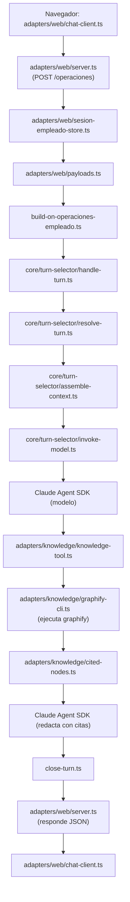

**1. `adapters/web/chat-client.ts`**
- *Qué es*: el código JavaScript del chat que corre en el navegador del empleado. Lo sirve el propio servidor web junto con la página (`chat-page.ts`). Guarda el token de sesión y envía cada mensaje al servidor.
- *Qué ejecuta en este paso*: El empleado escribe en el chat y presiona Enviar
- *Cómo sigue*: Hace `fetch` a `POST /operaciones` con el cuerpo JSON `{ consulta }` y el encabezado `Authorization: Bearer <token>` que recibió al iniciar sesión

**2. `adapters/web/server.ts`**
- *Qué es*: el servidor HTTP del chat web, sin framework (módulo `node:http` de Node). Atiende el login, los mensajes, el link del cliente y la página del chat.
- *Qué ejecuta en este paso*: Recibe el `POST /operaciones` y lee el cuerpo de la petición
- *Cómo sigue*: Le pide a `sesion-empleado-store.ts` la sesión que corresponde al token

**3. `adapters/web/sesion-empleado-store.ts`**
- *Qué es*: el almacén de sesiones del chat web. Guarda en memoria, por token, la sesión de cada empleado que inició sesión en el navegador. Es independiente de la sesión de la TUI.
- *Qué ejecuta en este paso*: Busca el token y verifica con `core/auth/sesion.ts` que la sesión no haya vencido
- *Cómo sigue*: Devuelve la sesión (con el id del empleado) al servidor; si no hay sesión válida, el servidor responde 401 y termina

**4. `adapters/web/payloads.ts`**
- *Qué es*: el validador de los cuerpos JSON que llegan al servidor web: revisa que cada pedido tenga la forma esperada antes de procesarlo.
- *Qué ejecuta en este paso*: Valida que el JSON tenga la forma `{ consulta }`
- *Cómo sigue*: Devuelve el mensaje validado al servidor; si es inválido, el servidor responde 400

**5. `adapters/web/server.ts`**
- *Qué es*: el servidor HTTP del chat web, sin framework (módulo `node:http` de Node). Atiende el login, los mensajes, el link del cliente y la página del chat.
- *Qué ejecuta en este paso*: Toma la ranura de confirmaciones **de ese empleado** (`confirmacion-operaciones-store.ts`, instancia web) y la memoria de conversación **de ese token** (`conversacion-empleado-store.ts`)
- *Cómo sigue*: Llama a `onOperacionesEmpleado` (el manejador que armó `build-on-operaciones-empleado.ts`) con el mensaje, la sesión, las confirmaciones y la memoria, con un tiempo límite

**6. `build-on-operaciones-empleado.ts`**
- *Qué es*: el preparador de conversaciones. Es un archivo de cableado que, para cada mensaje, crea el caso y le arma al agente su prompt y sus herramientas. Lo usan la TUI y el chat web por igual.
- *Qué ejecuta en este paso*: Crea un **caso nuevo** para este mensaje (vía `repository.ts`), arma el prompt, toma el agente de operaciones de `core/agents/definitions.ts` y crea las herramientas del turno: `adapters/operaciones/index.ts` (con la sesión guardada adentro, así el modelo nunca tiene que decir quién es el empleado) y `adapters/knowledge/index.ts`
- *Cómo sigue*: Llama a `handleTurn` de `handle-turn.ts` con el caso, el prompt, el agente y las herramientas

**7. `core/turn-selector/handle-turn.ts`**
- *Qué es*: el orquestador de turnos del núcleo (bloque "Selector de Turno" del arc42). Ejecuta siempre los mismos pasos en orden: elegir agente, armar contexto, invocar al modelo y cerrar el turno.
- *Qué ejecuta en este paso*: Orquesta el turno en pasos fijos
- *Cómo sigue*: Llama a `resolve-turn.ts`

**8. `core/turn-selector/resolve-turn.ts`**
- *Qué es*: la parte del orquestador que decide qué agente atiende el turno entre los candidatos que recibió.
- *Qué ejecuta en este paso*: Confirma qué agente atiende el turno
- *Cómo sigue*: Devuelve el agente a `handle-turn.ts`, que llama a `assemble-context.ts`

**9. `core/turn-selector/assemble-context.ts`**
- *Qué es*: la parte del orquestador que arma el contexto: busca en la base la sesión anterior del agente para que la conversación continúe con memoria.
- *Qué ejecuta en este paso*: Busca en `sesiones_agente` (vía `repository.ts`) la sesión del SDK del mensaje anterior de esta conversación: así el agente **recuerda** lo que se habló
- *Cómo sigue*: Devuelve el id de sesión a retomar; `handle-turn.ts` llama a `invoke-model.ts`

**10. `core/turn-selector/invoke-model.ts`**
- *Qué es*: la parte del orquestador que habla con el Claude Agent SDK. Traduce la definición del agente a las opciones del SDK y dispara los hooks antes y después del turno.
- *Qué ejecuta en este paso*: Dispara el hook `PRE_TURN` en `core/hooks/hook-engine.ts` (que ejecuta `log-pre-turn-handler.ts`) y obtiene la lista de skills de `core/skills/skills-habilitadas.ts`
- *Cómo sigue*: Llama a `query()` del **Claude Agent SDK** con el agente, las skills, las herramientas y la sesión a retomar

**11. Claude Agent SDK (modelo)**
- *Qué es*: el motor de agentes de Anthropic (librería `@anthropic-ai/claude-agent-sdk`). Envía el pedido al modelo Claude, le ofrece las herramientas y las skills, y ejecuta las herramientas que el modelo decide usar. Es la única parte donde decide la IA.
- *Qué ejecuta en este paso*: Decide consultar la base de conocimiento
- *Cómo sigue*: El SDK ejecuta la herramienta que `adapters/knowledge/index.ts` registró para este turno

**12. `adapters/knowledge/knowledge-tool.ts`**
- *Qué es*: la herramienta de conocimiento que ve el modelo.
- *Qué ejecuta en este paso*: Recibe la consulta del modelo
- *Cómo sigue*: Llama a `graphify-cli.ts`

**13. `adapters/knowledge/graphify-cli.ts`**
- *Qué es*: el adaptador que ejecuta el programa Graphify como proceso aparte y recoge su salida.
- *Qué ejecuta en este paso*: Lanza el programa `graphify query` sobre `graphify-out/graph.json`, con un límite de tamaño y de tiempo
- *Cómo sigue*: Devuelve la salida de texto (líneas `NODE … [src=… loc=…]`)

**14. `adapters/knowledge/cited-nodes.ts`**
- *Qué es*: el intérprete de la salida de Graphify: extrae los nodos citables del texto.
- *Qué ejecuta en este paso*: Lee esas líneas y acumula qué nodos se devolvieron en el turno
- *Cómo sigue*: `knowledge-tool.ts` le devuelve los nodos al SDK como resultado de la herramienta

**15. Claude Agent SDK (modelo)**
- *Qué es*: el motor de agentes de Anthropic (librería `@anthropic-ai/claude-agent-sdk`). Envía el pedido al modelo Claude, le ofrece las herramientas y las skills, y ejecuta las herramientas que el modelo decide usar. Es la única parte donde decide la IA.
- *Qué ejecuta en este paso*: Sigue la skill `citar-conocimiento`: cita solo esos nodos, y si no hay ninguno dice que no encontró
- *Cómo sigue*: Termina y le devuelve el control a `invoke-model.ts`

**16. `core/turn-selector/invoke-model.ts`**
- *Qué es*: la parte del orquestador que habla con el Claude Agent SDK. Traduce la definición del agente a las opciones del SDK y dispara los hooks antes y después del turno.
- *Qué ejecuta en este paso*: Dispara `POST_TURN`
- *Cómo sigue*: `handle-turn.ts` llama a `close-turn.ts`

**17. `core/turn-selector/close-turn.ts`**
- *Qué es*: la parte del orquestador que cierra el turno: guarda en la base la sesión del agente para poder retomarla después.
- *Qué ejecuta en este paso*: Guarda la sesión del turno
- *Cómo sigue*: La respuesta vuelve por `build-on-operaciones-empleado.ts` a `adapters/web/server.ts`

**18. `adapters/web/server.ts`**
- *Qué es*: el servidor HTTP del chat web, sin framework (módulo `node:http` de Node). Atiende el login, los mensajes, el link del cliente y la página del chat.
- *Qué ejecuta en este paso*: Responde el `POST` con un JSON que trae la respuesta
- *Cómo sigue*: El navegador recibe la respuesta

**19. `adapters/web/chat-client.ts`**
- *Qué es*: el código JavaScript del chat que corre en el navegador del empleado. Lo sirve el propio servidor web junto con la página (`chat-page.ts`). Guarda el token de sesión y envía cada mensaje al servidor.
- *Qué ejecuta en este paso*: Muestra la respuesta con sus citas
- *Cómo sigue*: Fin

---

### CU-11 · Consulta de KPIs a un agente externo (A2A saliente)

**Qué demuestra**: el arnés como **cliente** de otro agente.

**Precondiciones**: `HARNESS_A2A_SALIENTE=on`, `HARNESS_A2A_ENDPOINT_KPI_INCIDENTE` configurado y sesión de **administrador**. Sin agente real hay un simulador en `docs/progreso/v3.16-consulta-kpi-a2a-chat/mock-a2a-kpi.cjs` (ensayalo antes).

**Cómo ejecutarlo**:

En el **chat web** (`http://localhost:<WEB_PORT>/chat`), con sesión iniciada como administrador: `¿Cuáles son los KPIs del mes?`. En la TUI también existe el comando `/consultar-kpi kpis_del_mes`. Solo hay cuatro consultas: `kpis_del_mes`, `incidentes_abiertos`, `incidentes_criticos`, `estado_general`.

**Qué se espera ver**: la respuesta del agente externo, presentada como **dato externo no confiable**.

**Qué pasa, en palabras simples**: el administrador pide un indicador. El sistema verifica el rol, traduce el pedido a una de las cuatro consultas permitidas, deja registrada la delegación en la base y el cliente A2A se la envía al agente externo. La respuesta vuelve y el modelo la presenta aclarando que es un dato externo.

**Componentes que se ejecutan — conversando en el chat web**:

```mermaid
flowchart TD
  N0["Navegador: adapters/web/chat-client.ts"]
  N1["adapters/web/server.ts<br/>(POST /operaciones)"]
  N2["adapters/web/sesion-empleado-store.ts<br/>(valida el token)"]
  N3["adapters/web/payloads.ts"]
  N4["build-on-operaciones-empleado.ts"]
  N5["core/turn-selector/handle-turn.ts"]
  N6["core/turn-selector/resolve-turn.ts"]
  N7["core/turn-selector/assemble-context.ts"]
  N8["core/turn-selector/invoke-model.ts"]
  N9["Claude Agent SDK (modelo)"]
  N10["adapters/operaciones/index.ts"]
  N11["core/operaciones/validar-operacion.ts"]
  N12["core/operaciones/ejecutar-operacion.ts"]
  N13["core/auth/autorizacion-resolucion.ts<br/>(¿administrador?)"]
  N14["core/agents/consultas-kpi-catalogo.ts"]
  N15["core/turn-selector/dispatch-delegation-a2a.ts"]
  N16["adapters/memory/repository.ts<br/>(delegaciones_a2a)"]
  N17["adapters/a2a/index.ts"]
  N18["adapters/a2a/client.ts"]
  N19["Agente externo de KPIs"]
  N20["core/agents/texto-externo.ts"]
  N21["Claude Agent SDK (redacta)"]
  N22["core/turn-selector/invoke-model.ts"]
  N23["close-turn.ts"]
  N24["adapters/web/server.ts<br/>(responde JSON)"]
  N25["adapters/web/chat-client.ts"]
  N0 --> N1
  N1 --> N2
  N2 --> N3
  N3 --> N4
  N4 --> N5
  N5 --> N6
  N6 --> N7
  N7 --> N8
  N8 --> N9
  N9 --> N10
  N10 --> N11
  N11 --> N12
  N12 --> N13
  N13 --> N14
  N14 --> N15
  N15 --> N16
  N16 --> N17
  N17 --> N18
  N18 --> N19
  N19 --> N20
  N20 --> N21
  N21 --> N22
  N22 --> N23
  N23 --> N24
  N24 --> N25
```

**1. `adapters/web/chat-client.ts`**
- *Qué es*: el código JavaScript del chat que corre en el navegador del empleado. Lo sirve el propio servidor web junto con la página (`chat-page.ts`). Guarda el token de sesión y envía cada mensaje al servidor.
- *Qué ejecuta en este paso*: El empleado escribe en el chat y presiona Enviar
- *Cómo sigue*: Hace `fetch` a `POST /operaciones` con el cuerpo JSON `{ consulta }` y el encabezado `Authorization: Bearer <token>` que recibió al iniciar sesión

**2. `adapters/web/server.ts`**
- *Qué es*: el servidor HTTP del chat web, sin framework (módulo `node:http` de Node). Atiende el login, los mensajes, el link del cliente y la página del chat.
- *Qué ejecuta en este paso*: Recibe el `POST /operaciones` y lee el cuerpo de la petición
- *Cómo sigue*: Le pide a `sesion-empleado-store.ts` la sesión que corresponde al token

**3. `adapters/web/sesion-empleado-store.ts`**
- *Qué es*: el almacén de sesiones del chat web. Guarda en memoria, por token, la sesión de cada empleado que inició sesión en el navegador. Es independiente de la sesión de la TUI.
- *Qué ejecuta en este paso*: Busca el token y verifica con `core/auth/sesion.ts` que la sesión no haya vencido
- *Cómo sigue*: Devuelve la sesión (con el id del empleado) al servidor; si no hay sesión válida, el servidor responde 401 y termina

**4. `adapters/web/payloads.ts`**
- *Qué es*: el validador de los cuerpos JSON que llegan al servidor web: revisa que cada pedido tenga la forma esperada antes de procesarlo.
- *Qué ejecuta en este paso*: Valida que el JSON tenga la forma `{ consulta }`
- *Cómo sigue*: Devuelve el mensaje validado al servidor; si es inválido, el servidor responde 400

**5. `adapters/web/server.ts`**
- *Qué es*: el servidor HTTP del chat web, sin framework (módulo `node:http` de Node). Atiende el login, los mensajes, el link del cliente y la página del chat.
- *Qué ejecuta en este paso*: Toma la ranura de confirmaciones **de ese empleado** (`confirmacion-operaciones-store.ts`, instancia web) y la memoria de conversación **de ese token** (`conversacion-empleado-store.ts`)
- *Cómo sigue*: Llama a `onOperacionesEmpleado` (el manejador que armó `build-on-operaciones-empleado.ts`) con el mensaje, la sesión, las confirmaciones y la memoria, con un tiempo límite

**6. `build-on-operaciones-empleado.ts`**
- *Qué es*: el preparador de conversaciones. Es un archivo de cableado que, para cada mensaje, crea el caso y le arma al agente su prompt y sus herramientas. Lo usan la TUI y el chat web por igual.
- *Qué ejecuta en este paso*: Crea un **caso nuevo** para este mensaje (vía `repository.ts`), arma el prompt, toma el agente de operaciones de `core/agents/definitions.ts` y crea las herramientas del turno: `adapters/operaciones/index.ts` (con la sesión guardada adentro, así el modelo nunca tiene que decir quién es el empleado) y `adapters/knowledge/index.ts`
- *Cómo sigue*: Llama a `handleTurn` de `handle-turn.ts` con el caso, el prompt, el agente y las herramientas

**7. `core/turn-selector/handle-turn.ts`**
- *Qué es*: el orquestador de turnos del núcleo (bloque "Selector de Turno" del arc42). Ejecuta siempre los mismos pasos en orden: elegir agente, armar contexto, invocar al modelo y cerrar el turno.
- *Qué ejecuta en este paso*: Orquesta el turno en pasos fijos
- *Cómo sigue*: Llama a `resolve-turn.ts`

**8. `core/turn-selector/resolve-turn.ts`**
- *Qué es*: la parte del orquestador que decide qué agente atiende el turno entre los candidatos que recibió.
- *Qué ejecuta en este paso*: Confirma qué agente atiende el turno
- *Cómo sigue*: Devuelve el agente a `handle-turn.ts`, que llama a `assemble-context.ts`

**9. `core/turn-selector/assemble-context.ts`**
- *Qué es*: la parte del orquestador que arma el contexto: busca en la base la sesión anterior del agente para que la conversación continúe con memoria.
- *Qué ejecuta en este paso*: Busca en `sesiones_agente` (vía `repository.ts`) la sesión del SDK del mensaje anterior de esta conversación: así el agente **recuerda** lo que se habló
- *Cómo sigue*: Devuelve el id de sesión a retomar; `handle-turn.ts` llama a `invoke-model.ts`

**10. `core/turn-selector/invoke-model.ts`**
- *Qué es*: la parte del orquestador que habla con el Claude Agent SDK. Traduce la definición del agente a las opciones del SDK y dispara los hooks antes y después del turno.
- *Qué ejecuta en este paso*: Dispara el hook `PRE_TURN` en `core/hooks/hook-engine.ts` (que ejecuta `log-pre-turn-handler.ts`) y obtiene la lista de skills de `core/skills/skills-habilitadas.ts`
- *Cómo sigue*: Llama a `query()` del **Claude Agent SDK** con el agente, las skills, las herramientas y la sesión a retomar

**11. Claude Agent SDK (modelo)**
- *Qué es*: el motor de agentes de Anthropic (librería `@anthropic-ai/claude-agent-sdk`). Envía el pedido al modelo Claude, le ofrece las herramientas y las skills, y ejecuta las herramientas que el modelo decide usar. Es la única parte donde decide la IA.
- *Qué ejecuta en este paso*: Lee la skill `consultar-kpi` y elige una de las cuatro consultas y decide llamar a la herramienta `operacion_negocio` con la operación `consultar_kpi`
- *Cómo sigue*: El SDK ejecuta el manejador de la herramienta que `adapters/operaciones/index.ts` registró con `createSdkMcpServer`

**12. `adapters/operaciones/index.ts`**
- *Qué es*: el adaptador de la herramienta `operacion_negocio`. Es un servidor MCP que se crea para cada turno con la sesión del empleado guardada adentro; es la única puerta del modelo hacia las operaciones de negocio.
- *Qué ejecuta en este paso*: Recibe los argumentos que armó el modelo
- *Cómo sigue*: Se los pasa a `validarOperacion`

**13. `core/operaciones/validar-operacion.ts`**
- *Qué es*: el validador del núcleo: revisa campo por campo que los datos que armó el modelo tengan la forma exacta que espera cada operación.
- *Qué ejecuta en este paso*: Valida estrictamente campos y tipos. Si algo falta o sobra, devuelve el error al modelo **sin ejecutar nada**
- *Cómo sigue*: Devuelve la operación validada; `adapters/operaciones/index.ts` llama a `ejecutarOperacion` con la sesión del turno

**14. `core/operaciones/ejecutar-operacion.ts`**
- *Qué es*: el despachador de operaciones del núcleo. Tiene una rama por cada una de las 13 operaciones; en cada una aplica permisos, confirmación en dos mensajes y auditoría, y llama al archivo de dominio que corresponde.
- *Qué ejecuta en este paso*: Elige la rama `consultar_kpi`
- *Cómo sigue*: Pregunta a `autorizacion-resolucion.ts` si es administrador; si no, corta con un rechazo

**15. `core/agents/consultas-kpi-catalogo.ts`**
- *Qué es*: el catálogo cerrado de las cuatro consultas de KPIs permitidas.
- *Qué ejecuta en este paso*: Traduce la consulta elegida al pedido fijo que se envía (no hay consulta libre)
- *Cómo sigue*: `ejecutar-operacion.ts` llama a `dispatch-delegation-a2a.ts`

**16. `core/turn-selector/dispatch-delegation-a2a.ts`**
- *Qué es*: el despachador de delegaciones a agentes externos: registra cada consulta en la base y la lanza por el cliente A2A.
- *Qué ejecuta en este paso*: Registra la delegación
- *Cómo sigue*: Inserta la fila en `delegaciones_a2a` vía `repository.ts` y llama al cliente A2A

**17. `adapters/a2a/index.ts`**
- *Qué es*: el adaptador A2A saliente: elige el destino y aplica los tiempos límite.
- *Qué ejecuta en este paso*: Elige el destino y la configuración (tiempos límite)
- *Cómo sigue*: Llama a `client.ts`

**18. `adapters/a2a/client.ts`**
- *Qué es*: el cliente del protocolo A2A: habla JSON-RPC por HTTP con el agente externo.
- *Qué ejecuta en este paso*: Envía `SendMessage` por HTTP (JSON-RPC) al agente externo y consulta el estado de la tarea hasta que termine o venza el tiempo (30 s en el chat, 120 s en la TUI)
- *Cómo sigue*: Devuelve el texto de la respuesta

**19. `core/agents/texto-externo.ts`**
- *Qué es*: la regla que marca un texto como dato externo no confiable antes de mostrárselo al modelo.
- *Qué ejecuta en este paso*: Enmarca el texto como dato externo no confiable, para que el modelo no obedezca instrucciones que vengan adentro
- *Cómo sigue*: `ejecutar-operacion.ts` devuelve el texto a `adapters/operaciones/index.ts`

**20. `adapters/operaciones/index.ts`**
- *Qué es*: el adaptador de la herramienta `operacion_negocio`. Es un servidor MCP que se crea para cada turno con la sesión del empleado guardada adentro; es la única puerta del modelo hacia las operaciones de negocio.
- *Qué ejecuta en este paso*: Recibe el texto del resultado
- *Cómo sigue*: Se lo devuelve al SDK como resultado de la herramienta

**21. Claude Agent SDK (modelo)**
- *Qué es*: el motor de agentes de Anthropic (librería `@anthropic-ai/claude-agent-sdk`). Envía el pedido al modelo Claude, le ofrece las herramientas y las skills, y ejecuta las herramientas que el modelo decide usar. Es la única parte donde decide la IA.
- *Qué ejecuta en este paso*: Redacta la respuesta final para el empleado a partir del resultado
- *Cómo sigue*: Termina la consulta y le devuelve el control a `invoke-model.ts`

**22. `core/turn-selector/invoke-model.ts`**
- *Qué es*: la parte del orquestador que habla con el Claude Agent SDK. Traduce la definición del agente a las opciones del SDK y dispara los hooks antes y después del turno.
- *Qué ejecuta en este paso*: Dispara el hook `POST_TURN` (`log-post-turn-handler.ts`)
- *Cómo sigue*: Devuelve la respuesta a `handle-turn.ts`, que llama a `close-turn.ts`

**23. `core/turn-selector/close-turn.ts`**
- *Qué es*: la parte del orquestador que cierra el turno: guarda en la base la sesión del agente para poder retomarla después.
- *Qué ejecuta en este paso*: Guarda en `sesiones_agente` (vía `repository.ts`) la sesión del SDK de este turno, para que el próximo mensaje pueda retomarla
- *Cómo sigue*: Devuelve el control a `build-on-operaciones-empleado.ts`

**24. `build-on-operaciones-empleado.ts`**
- *Qué es*: el preparador de conversaciones. Es un archivo de cableado que, para cada mensaje, crea el caso y le arma al agente su prompt y sus herramientas. Lo usan la TUI y el chat web por igual.
- *Qué ejecuta en este paso*: Anota este caso en la memoria de la conversación del empleado
- *Cómo sigue*: Devuelve la respuesta a `adapters/web/server.ts`

**25. `adapters/web/server.ts`**
- *Qué es*: el servidor HTTP del chat web, sin framework (módulo `node:http` de Node). Atiende el login, los mensajes, el link del cliente y la página del chat.
- *Qué ejecuta en este paso*: Responde el `POST` con un JSON que trae la respuesta del agente (o 504 si se venció el tiempo límite)
- *Cómo sigue*: El navegador recibe la respuesta

**26. `adapters/web/chat-client.ts`**
- *Qué es*: el código JavaScript del chat que corre en el navegador del empleado. Lo sirve el propio servidor web junto con la página (`chat-page.ts`). Guarda el token de sesión y envía cada mensaje al servidor.
- *Qué ejecuta en este paso*: Muestra la respuesta del agente en el chat
- *Cómo sigue*: Fin del turno

**Variante automática**: en CU-02, `registrar-venta.ts` dispara, para ventas de 5000 o más, una consulta a `riesgo-credito` a través de `build-on-venta.ts` → `dispatch-delegation-a2a.ts` → `adapters/a2a/index.ts` → `client.ts`, sin esperar la respuesta. Log `a2a-riesgo-credito-disparada`.

---

### CU-12 · Otro agente le pregunta al arnés (A2A entrante)

**Qué demuestra**: el arnés como **servidor** de otros agentes, solo lectura.

**Precondiciones**: `HARNESS_A2A_ENTRANTE_TOKEN` definido, arnés corriendo.

**Cómo ejecutarlo**:

PowerShell, en otra ventana:

```powershell
Invoke-RestMethod http://localhost:8888/.well-known/agent-card.json
```

```powershell
$h = @{ Authorization = "Bearer $env:HARNESS_A2A_ENTRANTE_TOKEN" }
$body = @{ jsonrpc = "2.0"; id = 1; method = "SendMessage"; params = @{ message = @{ messageId = "demo-1"; role = "ROLE_USER"; parts = @(@{ text = "¿Cuál fue el total comisionado en 2026-09?" }) } } } | ConvertTo-Json -Depth 8
$r = Invoke-RestMethod -Method Post -Uri http://localhost:8888/a2a -Headers $h -ContentType "application/json" -Body $body
$r.result.task.id
```

```powershell
$get = @{ jsonrpc = "2.0"; id = 2; method = "GetTask"; params = @{ id = $r.result.task.id } } | ConvertTo-Json -Depth 5
Invoke-RestMethod -Method Post -Uri http://localhost:8888/a2a -Headers $h -ContentType "application/json" -Body $get | ConvertTo-Json -Depth 10
```

Repetí `GetTask` hasta que la tarea esté completada. Después, en la TUI como administrador: `/ver-solicitudes-a2a`.

**Qué se espera ver**: la tarjeta del agente; una tarea que termina con un **agregado** (totales, sin nombres de vendedores); el pedido listado en `/ver-solicitudes-a2a`. Con un token incorrecto: 401.

**Qué pasa, en palabras simples**: acá el arnés es el que responde. Un agente externo consulta la tarjeta pública para saber qué puede preguntar y después envía su pregunta con un token. El servidor A2A la registra y contesta enseguida que la está procesando. En paralelo, un turno del agente con una única herramienta de solo lectura calcula el agregado. El agente externo vuelve a preguntar por la tarea hasta recibir la respuesta.

**Componentes que se ejecutan**:

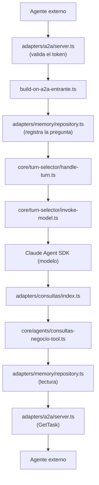

**1. `adapters/a2a/server.ts`**
- *Qué es*: el servidor A2A entrante: un servidor HTTP que expone la tarjeta del agente y los métodos JSON-RPC.
- *Qué ejecuta en este paso*: `GET /.well-known/agent-card.json`: devuelve la tarjeta pública que arma `adapters/a2a/agent-card.ts`, sin pedir token
- *Cómo sigue*: Fin de ese pedido

**2. `adapters/a2a/server.ts`**
- *Qué es*: el servidor A2A entrante: un servidor HTTP que expone la tarjeta del agente y los métodos JSON-RPC.
- *Qué ejecuta en este paso*: `POST /a2a`: compara el token `Bearer`, lee el JSON-RPC y ve que el método es `SendMessage`
- *Cómo sigue*: Llama al manejador que armó `build-on-a2a-entrante.ts`

**3. `build-on-a2a-entrante.ts`**
- *Qué es*: archivo de cableado que prepara los turnos pedidos por agentes externos, solo con herramientas de lectura.
- *Qué ejecuta en este paso*: Registra la pregunta
- *Cómo sigue*: Inserta la fila en `solicitudes_a2a_entrantes` vía `repository.ts`; el servidor responde de inmediato con la tarea en estado "enviada"

**4. `build-on-a2a-entrante.ts`**
- *Qué es*: archivo de cableado que prepara los turnos pedidos por agentes externos, solo con herramientas de lectura.
- *Qué ejecuta en este paso*: Prepara un turno con **solo** la herramienta de consultas (`adapters/consultas/index.ts`), que no puede escribir
- *Cómo sigue*: Llama a `handle-turn.ts`

**5. `core/turn-selector/handle-turn.ts` → `invoke-model.ts`**
- *Qué es*: el orquestador de turnos del núcleo (bloque "Selector de Turno" del arc42). Ejecuta siempre los mismos pasos en orden: elegir agente, armar contexto, invocar al modelo y cerrar el turno.
- *Qué ejecuta en este paso*: Orquestan el turno igual que en la TUI
- *Cómo sigue*: Llaman al Claude Agent SDK

**6. Claude Agent SDK (modelo)**
- *Qué es*: el motor de agentes de Anthropic (librería `@anthropic-ai/claude-agent-sdk`). Envía el pedido al modelo Claude, le ofrece las herramientas y las skills, y ejecuta las herramientas que el modelo decide usar. Es la única parte donde decide la IA.
- *Qué ejecuta en este paso*: Interpreta la pregunta y elige la consulta `reporte_comisiones` con el período
- *Cómo sigue*: Ejecuta la herramienta `consultar_negocio`

**7. `adapters/consultas/index.ts`**
- *Qué es*: el adaptador de la herramienta `consultar_negocio`, un servidor MCP de solo lectura para agentes externos.
- *Qué ejecuta en este paso*: Recibe la llamada
- *Cómo sigue*: Se la pasa a `consultas-negocio-tool.ts`

**8. `core/agents/consultas-negocio-tool.ts`**
- *Qué es*: la lógica de las cuatro consultas agregadas que puede hacer un agente externo, con su lista cerrada de campos.
- *Qué ejecuta en este paso*: Valida con una lista cerrada de campos (rechaza campos extra y textos largos) y ejecuta la consulta
- *Cómo sigue*: Lee a través de los contratos que implementa `repository.ts`

**9. `adapters/memory/repository.ts`**
- *Qué es*: el adaptador de base de datos (bloque "Memoria Compartida" del arc42). Implementa todos los contratos del núcleo con consultas SQL sobre SQLite, incluida la auditoría.
- *Qué ejecuta en este paso*: Lee las comisiones del período. Solo lectura
- *Cómo sigue*: Devuelve las filas; la herramienta arma **solo totales**, sin nombres

**10. Claude Agent SDK → `invoke-model.ts` → `build-on-a2a-entrante.ts`**
- *Qué es*: el motor de agentes de Anthropic (librería `@anthropic-ai/claude-agent-sdk`). Envía el pedido al modelo Claude, le ofrece las herramientas y las skills, y ejecuta las herramientas que el modelo decide usar. Es la única parte donde decide la IA.
- *Qué ejecuta en este paso*: El modelo redacta la respuesta y se guarda como resultado de la tarea
- *Cómo sigue*: Se actualiza el estado de la pregunta en `repository.ts`

**11. `adapters/a2a/server.ts`**
- *Qué es*: el servidor A2A entrante: un servidor HTTP que expone la tarjeta del agente y los métodos JSON-RPC.
- *Qué ejecuta en este paso*: Cuando el agente externo pide `GetTask` con el id de la tarea, devuelve el estado y la respuesta
- *Cómo sigue*: Fin

**Para decir**: "Hacia afuera exponemos cuatro consultas agregadas y ninguna escritura. Ningún parámetro acepta identidad, así que un agente externo no puede preguntar por una persona".

**Cuidado**: la forma del mensaje está tomada del test de integración (`src/test/integration/a2a-server.integration.test.ts`); ensayala antes.

---

### CU-13 · Estado compartido entre canales

**Qué demuestra**: la TUI y el chat web escriben y leen la misma base.

**Cómo ejecutarlo**:

1. TUI, como `admin`: `/crear-empleado vendedor2 clave-v2`.
2. Chat web: entrar como `vendedor2`.
3. Chat web: registrar una venta (CU-02) y confirmarla (CU-03).
4. TUI, como `admin`: `/reporte-comisiones`. **Esperado**: aparece la comisión de esa venta.

**Qué se espera ver**: el empleado creado en la TUI entra al chat web, y la venta del chat web aparece en el reporte de la TUI.

**Qué pasa, en palabras simples**: los dos canales tienen sus propios archivos de entrada, pero todos terminan escribiendo y leyendo en el mismo `repository.ts` y la misma base. Por eso un empleado creado en la TUI puede entrar al chat web, y una venta del chat web aparece en el reporte de la TUI.

**Componentes que se ejecutan**:

**1. `adapters/tui/App.tsx` → `build-on-comando-empleado.ts` → `core/commands/comando-empleado.ts`**
- *Qué es*: la pantalla de la terminal, un componente hecho con Ink (React para consola). Dibuja la conversación y la línea donde escribe el empleado. No contiene reglas de negocio.
- *Qué ejecuta en este paso*: Paso 1: reconocen `/crear-empleado`
- *Cómo sigue*: El portero verifica sesión y rol

**2. `core/auth/autorizacion-resolucion.ts`**
- *Qué es*: la regla de autorización: responde si un empleado es administrador y puede resolver asuntos de otros.
- *Qué ejecuta en este paso*: Confirma que `admin` es administrador
- *Cómo sigue*: El portero crea la credencial

**3. `adapters/crypto/password.ts`**
- *Qué es*: el adaptador criptográfico: calcula y verifica hashes de claves con el algoritmo scrypt.
- *Qué ejecuta en este paso*: Genera el hash de la clave nueva
- *Cómo sigue*: Se lo pasa a `repository.ts`

**4. `adapters/memory/repository.ts`**
- *Qué es*: el adaptador de base de datos (bloque "Memoria Compartida" del arc42). Implementa todos los contratos del núcleo con consultas SQL sobre SQLite, incluida la auditoría.
- *Qué ejecuta en este paso*: Inserta el empleado en `credenciales_empleado`
- *Cómo sigue*: Fin del paso 1

**5. `adapters/web/server.ts`**
- *Qué es*: el servidor HTTP del chat web, sin framework (módulo `node:http` de Node). Atiende el login, los mensajes, el link del cliente y la página del chat.
- *Qué ejecuta en este paso*: Paso 2: recibe `POST /login` del navegador
- *Cómo sigue*: Llama a `build-on-login-http.ts`

**6. `build-on-login-http.ts` → `core/auth/login.ts` → `repository.ts` → `password.ts`**
- *Qué es*: archivo de cableado del login del chat web.
- *Qué ejecuta en este paso*: Validan la clave contra **la misma** tabla que escribió la TUI
- *Cómo sigue*: Crean la sesión web en `adapters/web/sesion-empleado-store.ts` y devuelven un token al navegador

**7. `adapters/web/server.ts`**
- *Qué es*: el servidor HTTP del chat web, sin framework (módulo `node:http` de Node). Atiende el login, los mensajes, el link del cliente y la página del chat.
- *Qué ejecuta en este paso*: Paso 3: recibe `POST /operaciones` con el token
- *Cómo sigue*: Valida la sesión en `sesion-empleado-store.ts` y llama a `build-on-operaciones-empleado.ts`, **el mismo archivo** que usa la TUI

**8. `build-on-operaciones-empleado.ts` → … → `registrar-venta.ts` / `confirmar-venta.ts` → `repository.ts`**
- *Qué es*: el preparador de conversaciones. Es un archivo de cableado que, para cada mensaje, crea el caso y le arma al agente su prompt y sus herramientas. Lo usan la TUI y el chat web por igual.
- *Qué ejecuta en este paso*: La venta recorre los mismos archivos que en CU-02 y CU-03
- *Cómo sigue*: Queda guardada en la misma base

**9. `adapters/tui/App.tsx` → `build-on-comando-empleado.ts` → `core/ventas/reporte.ts` → `repository.ts`**
- *Qué es*: la pantalla de la terminal, un componente hecho con Ink (React para consola). Dibuja la conversación y la línea donde escribe el empleado. No contiene reglas de negocio.
- *Qué ejecuta en este paso*: Paso 4: el reporte lee las comisiones, incluida la que generó el chat web
- *Cómo sigue*: La TUI la muestra

**Para decir**: "Lo que se hace por un canal se ve en el otro porque los dos pasan por el mismo `repository.ts` y la misma base. La conversación, en cambio, es propia de cada canal".

---

### CU-14 · Bot de revisión de PRs

**Qué demuestra**: el arnés reaccionando a eventos externos.

**Cómo ejecutarlo**:

`/estado-bot-prs` en la TUI muestra si el listener está activo y si hay `GITHUB_TOKEN`, sin mostrar valores. Para un recorrido completo hace falta exponer el puerto 8787 con un túnel y un repositorio de prueba.

**Qué se espera ver**: el estado del bot; con el recorrido completo, un comentario de revisión en el PR.

**Qué pasa, en palabras simples**: GitHub avisa que hay un PR nuevo. El webhook verifica que el aviso sea legítimo, lo convierte en una tarea de revisión y el agente revisa el código en una copia aislada del repositorio. El resultado se publica como comentario en el PR, y cualquier cambio que proponga espera la decisión de una persona.

**Componentes que se ejecutan**:

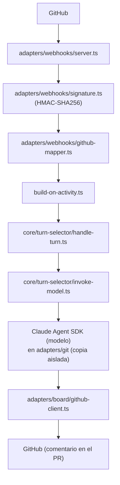

**1. `adapters/webhooks/server.ts`**
- *Qué es*: el servidor HTTP que recibe los avisos (webhooks) de GitHub.
- *Qué ejecuta en este paso*: Recibe el `POST` de GitHub y lee el cuerpo completo (hasta 1 MiB)
- *Cómo sigue*: Le pasa el cuerpo y la firma a `signature.ts`

**2. `adapters/webhooks/signature.ts`**
- *Qué es*: la verificación de la firma de los avisos de GitHub.
- *Qué ejecuta en este paso*: Calcula `HMAC-SHA256` del cuerpo con `GITHUB_WEBHOOK_SECRET` y lo compara en tiempo constante con la firma recibida
- *Cómo sigue*: Si no coincide, el servidor responde error y no sigue

**3. `adapters/webhooks/github-mapper.ts`**
- *Qué es*: el traductor de eventos de GitHub a actividades del arnés.
- *Qué ejecuta en este paso*: Traduce el evento (PR abierto, actualizado, comentario) a una actividad de revisión del arnés
- *Cómo sigue*: El servidor se la entrega al manejador de `build-on-activity.ts`

**4. `build-on-activity.ts`**
- *Qué es*: archivo de cableado que prepara el trabajo del agente para una actividad de GitHub.
- *Qué ejecuta en este paso*: Registra la actividad y prepara el trabajo del agente, con una copia aislada del repositorio (`adapters/git/`)
- *Cómo sigue*: Llama a `handle-turn.ts`

**5. `core/turn-selector/handle-turn.ts` → `invoke-model.ts`**
- *Qué es*: el orquestador de turnos del núcleo (bloque "Selector de Turno" del arc42). Ejecuta siempre los mismos pasos en orden: elegir agente, armar contexto, invocar al modelo y cerrar el turno.
- *Qué ejecuta en este paso*: Orquestan el turno
- *Cómo sigue*: Llaman al Claude Agent SDK

**6. Claude Agent SDK (modelo)**
- *Qué es*: el motor de agentes de Anthropic (librería `@anthropic-ai/claude-agent-sdk`). Envía el pedido al modelo Claude, le ofrece las herramientas y las skills, y ejecuta las herramientas que el modelo decide usar. Es la única parte donde decide la IA.
- *Qué ejecuta en este paso*: Revisa el código del PR
- *Cómo sigue*: Devuelve la revisión

**7. `adapters/board/github-client.ts`**
- *Qué es*: el cliente de la API de GitHub que publica comentarios y etiquetas.
- *Qué ejecuta en este paso*: Publica la revisión como comentario en el PR usando la API de GitHub con `GITHUB_TOKEN`
- *Cómo sigue*: Fin

**8. `adapters/memory/repository.ts`**
- *Qué es*: el adaptador de base de datos (bloque "Memoria Compartida" del arc42). Implementa todos los contratos del núcleo con consultas SQL sobre SQLite, incluida la auditoría.
- *Qué ejecuta en este paso*: Si el bot propone un cambio, lo guarda en `propuestas_cambio`
- *Cómo sigue*: Una persona decide con `/ver-propuesta`, `/aplicar-propuesta` o `/descartar-propuesta`

---

## 6. Guion sugerido

Unos 30 minutos, contando una historia continua con los mismos datos:

1. **Organización del código** (sección 2.1): las tres zonas y la regla de que el núcleo no conoce a los adaptadores.
2. **CU-01**: login con la clave enmascarada y el rechazo por rol (camino A).
3. **CU-02 + CU-03** en el **chat web** como `vendedor`: venta de 1500, confirmación, comisión de 150. Mostrar el diagrama de CU-02 mientras corre y abrir `ejecutar-operacion.ts` si el tutor quiere ver código.
4. **CU-08**: el mismo reporte pedido en el chat web, con `/reporte-comisiones` en la TUI de administración y por CLI; los tres terminan en `reporte.ts`.
5. **CU-05** en el chat web, con una venta de 800: queda escalada.
6. **CU-07** en el chat web como `admin`: aprobar con confirmación en dos turnos, mostrar `autoaprobacion_prohibida` y repetir CU-08: la venta ya no suma.
7. **CU-09** en el chat web: vacaciones pedidas por `vendedor` y aprobadas por `admin`.
8. **CU-10** en el chat web: una pregunta con citas y otra sin respuesta.
9. **CU-13**: un empleado creado en la TUI de administración trabaja en el chat web.
10. **CU-12** (y CU-11 si hay agente externo): A2A en las dos direcciones.
11. **Cierre**: `registro_acciones_empleado` y el log con todo lo que pasó.

---

## 7. Problemas conocidos y cómo responderlos

| Problema | Qué pasa | Qué hacer o decir |
| --- | --- | --- |
| `HARNESS_DB_PATH` ignorada | La TUI escribió en `data/harness.db` dos veces pese a la variable | Verificar con 1.1 antes de empezar; causa pendiente |
| "Reclamo de comisión" | La skill lo ofrece, `crear-solicitud-interna.ts` lo rechaza | No demostrarlo; inconsistencia conocida |
| Sesión vencida a mitad de la demo | 30 minutos sin uso cierran la sesión | Volver a hacer `/login`; es un control de seguridad |
| Comandos viejos (`/aprobar-*`) | "No conozco …" | Se retiraron en v3.10; todo es conversacional |
| Conversación no compartida entre TUI y web | Cada canal tiene su memoria de chat | Lo compartido es la base, no la charla (CU-13) |
| El modelo redacta distinto cada vez | Respuestas no deterministas | Lo determinista son las reglas: estados, permisos, montos |
| Log sin rotación | `data/harness.log` crece y tiene datos de sesiones previas | No proyectarlo entero; filtrar por evento |
| `Guia-Demostracion-Pasantia.md:436` | Dice que las operaciones van "solo en el chat web" | Desactualizado: también funcionan en la TUI sin `/` |
| Puerto del chat web | Esa guía dice 8080; tu último arranque usó 8090 | Usar el puerto de `WEB_PORT` |
