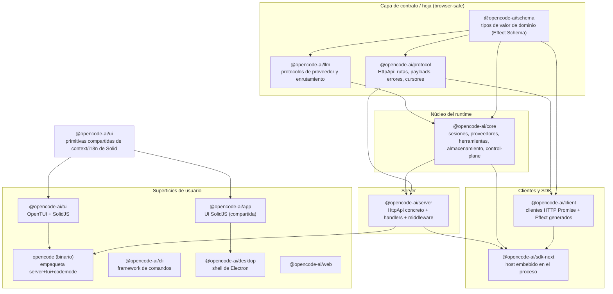
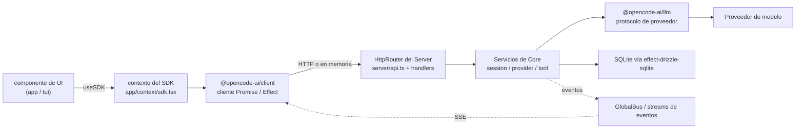
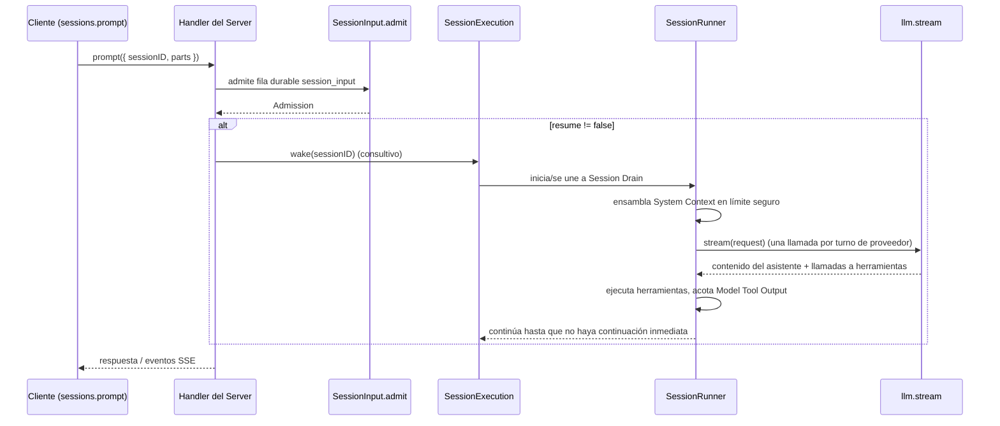

# Arquitectura de OpenCode

> El agente de codificación con IA de código abierto — un monorepo de ~32 paquetes que
> abarca un runtime de sesión durable, una API HTTP pública, un SDK multi-runtime
> generado y varias superficies de usuario (CLI, interfaz de terminal, escritorio y web).

Este documento se ensambló a partir de tres fuentes primarias, en orden de prioridad:

1. El grafo de conocimiento en `graphify-out/` (35.588 nodos / 56.677 aristas / 3.317 comunidades).
2. El código fuente real bajo `packages/` (cada afirmación no obvia se confirma contra un archivo real).
3. Meta-documentos raíz: `README.md`, `AGENTS.md`, `CONTEXT.md` y `specs/`.

Cuando una señal del grafo resultó ruidosa o hubo una colisión de nombres, se la
**marca** en lugar de presentarla como un hecho. Ver [Notas sobre la calidad del grafo](#12-notas-sobre-la-calidad-del-grafo-sección-de-honestidad).

---

## Tabla de contenidos

1. [Propósito y descripción general](#1-propósito-y-descripción-general)
2. [Arquitectura de alto nivel](#2-arquitectura-de-alto-nivel)
3. [La columna vertebral del runtime Effect-TS](#3-la-columna-vertebral-del-runtime-effect-ts)
4. [Desglose paquete por paquete](#4-desglose-paquete-por-paquete)
5. [Abstracciones centrales (los god nodes)](#5-abstracciones-centrales-los-god-nodes)
6. [Relaciones entre componentes y flujo de datos](#6-relaciones-entre-componentes-y-flujo-de-datos)
7. [Ciclo de vida de la sesión (V2)](#7-ciclo-de-vida-de-la-sesión-v2)
8. [El contrato del SDK y los tipos generados](#8-el-contrato-del-sdk-y-los-tipos-generados)
9. [El bus global y los eventos](#9-el-bus-global-y-los-eventos)
10. [CodeMode: ejecución confinada de herramientas](#10-codemode-ejecución-confinada-de-herramientas)
11. [Aspectos transversales](#11-aspectos-transversales)
12. [Notas sobre la calidad del grafo (sección de honestidad)](#12-notas-sobre-la-calidad-del-grafo-sección-de-honestidad)
13. [Fuentes y método](#13-fuentes-y-método)

---

## 1. Propósito y descripción general

OpenCode es "El agente de codificación con IA de código abierto" (`README.md:10`). Ejecuta
un agente de IA que lee, edita y ejecuta código en un proyecto, y distribuye ese agente a
través de múltiples front-ends: una interfaz de terminal, una app de escritorio, una app
web, una CLI y un SDK/servidor programático.

Por defecto se incluyen dos agentes integrados (`README.md:100-111`):

- **build** — agente de acceso completo para trabajo de desarrollo.
- **plan** — agente de solo lectura que rechaza ediciones y pregunta antes de ejecutar bash.
- Más un subagente **general** para búsquedas de varios pasos, invocado con `@general`.

Arquitectónicamente, OpenCode es un **sistema cliente/servidor con un núcleo embebible**
(`CONTEXT.md:73-83`, `AGENTS.md:2-3`). Una única API HTTP autoritativa describe cada
capacidad; la misma API puede servirse sobre la red *o* ejecutarse dentro del proceso
("Embedded OpenCode"). Todas las superficies hablan con esa API a través de un cliente
generado, de modo que la CLI, la TUI, el escritorio y las apps web son todos simplemente
clientes del mismo contrato.

El código actual está a mitad de una migración hacia un **núcleo de sesión V2** construido
sobre Effect-TS, cuyo diseño está documentado en detalle en `CONTEXT.md` y `specs/v2/`. El
núcleo V2 separa la *admisión durable de prompts* de la *ejecución del modelo* y ensambla un
"System Context" estructurado por cada turno de proveedor (`CONTEXT.md:151-161`).

---

## 2. Arquitectura de alto nivel

Las reglas de dependencia se enuncian explícitamente en `AGENTS.md:2-3`:

> Mantener las dependencias de runtime dirigidas desde **Schema** hacia **Core** y **Protocol**,
> luego desde Core y Protocol hacia **Server**. El código de runtime del cliente puede depender de Schema
> y Protocol pero **nunca** de Core o Server; **sdk-next** compone Client, Core y Server.

Esto se verificó contra cada `package.json` (ver la tabla en §4). El resultado es un grafo
por capas limpio:



Entonces, tres niveles amplios:

- **Nivel de contrato / hoja** — `schema`, `protocol`, `llm`. Puros, sin bases de datos, sin
  ejecución de Session, sin módulos nativos (`CONTEXT.md:209`). Esto es lo que mantiene a
  `@opencode-ai/client` como browser-safe.
- **Nivel de runtime** — `core` (el motor del agente) y `server` (el host HTTP).
- **Nivel de cliente / superficie** — el `client` generado, el `sdk-next` embebible y las
  superficies orientadas al usuario (el binario `opencode`, `cli`, `tui`, `app`, `desktop`, `web`).

### División cliente/servidor y "Embedded OpenCode"

El `HttpApi` público es autoritativo para cada capacidad compartida (`CONTEXT.md:139-144`).
Los clientes en red y los embebidos usan el **mismo** cliente y el **mismo** límite de
enrutamiento/middleware/códec — solo difiere el transporte (`CONTEXT.md:139-141`). Embedded
OpenCode ejecuta el router ensamblado del Server **en memoria** sin listener y sin I/O de red
(`CONTEXT.md:162`), y vive en `@opencode-ai/sdk-next`, que compone Client + Core + Server
(`AGENTS.md:3`, dependencias de `packages/sdk-next/package.json`).

---

## 3. La columna vertebral del runtime Effect-TS

El núcleo del runtime está construido sobre **Effect-TS** `ManagedRuntime`. Esta es la
comunidad "Effect Runtime & Jobs" en el grafo y está confirmada en el código fuente:

| Concepto | Dónde | Qué es |
| --- | --- | --- |
| Factory de runtime genérico | `packages/core/src/effect/runtime.ts:6-8` | Construye de forma perezosa un `ManagedRuntime` a partir de un Layer, fusionado con un `Observability.layer`. |
| Bootstrap runtime | `packages/opencode/src/effect/bootstrap-runtime.ts:19` | `BootstrapRuntime = ManagedRuntime.make(BootstrapLayer, { memoMap })` — el runtime más temprano usado durante el arranque del proceso. |
| App runtime | `packages/opencode/src/effect/app-runtime.ts:83,111,115` | `AppLayer` compuesto con `RuntimeFlags.node`; `rt = ManagedRuntime.make(AppLayer, { memoMap })`; exporta `AppServices`. |
| Runtime flags | `packages/opencode/src/effect/runtime-flags.ts` (importado en `app-runtime.ts:52`) | Flags de feature/entorno (p. ej. `RuntimeFlags.node`) que seleccionan qué layers aplican. |
| Instance state | `packages/opencode/src/effect/instance-state.ts:7-9` | `InstanceState<A,E,R>` (TypeId `~opencode/InstanceState`) — estado con alcance de proceso transportado a través del runtime. |
| Runtime por servicio | `packages/opencode/src/effect/run-service.ts:34-35` | Factory memoizada de `ManagedRuntime` para servicios individuales. |

Un `memoMap` compartido se enhebra a través de los runtimes para que los Layers se
construyan una sola vez y se reutilicen entre los runtimes de bootstrap y de app. Los
servicios son Effect Layers; la guía de estilo del código incluso exige idiomas de Effect
("En generadores de Effect, vincular servicios a variables con nombre antes de llamar a sus
métodos", `AGENTS.md:33`).

---

## 4. Desglose paquete por paquete

Las responsabilidades a continuación se derivan de las comunidades del grafo más una lectura
de confirmación del layout de `src/` de cada paquete y de las dependencias de su
`package.json`. Se omite el prefijo `@opencode-ai/` por brevedad.

| Paquete | Responsabilidad | Módulos clave (confirmados) | Depende de (interno) |
| --- | --- | --- | --- |
| **schema** | Tipos de valor de dominio hoja construidos con Effect Schema. La única fuente de las formas de registro compartidas. | `agent.ts`, `catalog.ts`, `permission.ts`, `prompt.ts`, `provider.ts`, `models-dev.ts`, `pty.ts`, `event*.ts` (`packages/schema/src`) | *(ninguna — hoja verdadera)* |
| **protocol** | El `HttpApi` autoritativo: grupos de rutas, payloads, errores, cursores, streams. `makeDefaultApi(...)` es el builder. | `api.ts`, `errors.ts`, `groups/`, `middleware/` | schema |
| **llm** | Protocolos de proveedor, enrutamiento, runtime de herramientas, política de caché. Habla con los proveedores de modelos. | `llm.ts`, `provider.ts`, `protocols/`, `providers/`, `route/`, `tool-runtime.ts` | schema |
| **core** | El motor del agente: sesiones (V2), proveedores, herramientas, permisos, almacenamiento, control-plane, plugins, configuración, catálogo. | `session/` (execution, runner, compaction, context-epoch, projector), `control-plane/move-session.ts`, `agent.ts`, `catalog.ts`, `effect/runtime.ts`, `database/`, `plugin/` | effect-drizzle-sqlite, effect-sqlite-node, llm, schema, plugin |
| **server** | Hospeda el `HttpApi` de Protocol con middleware + handlers **concretos**. | `api.ts` (`makeDefaultApi` con middleware real), `handlers/`, `middleware/`, `routes.ts`, `pty-environment.ts` | core, protocol |
| **client** | Clientes de **red** generados a partir del contrato: un cliente Promise sin Effect y un cliente Effect, detrás de exports aislados. Browser-safe. | `contract.ts` (`ClientApi`, `groupNames`), `generated/` (Promise), `generated-effect/` (Effect), `effect.ts`, `index.ts` | schema, protocol |
| **sdk-next** | **Host embebido con alcance**, nativo de Effect ("Embedded OpenCode"). Ejecuta el router del Server en memoria. Heredará el nombre `sdk` tras la migración. | `opencode.ts`, `tool.ts`, `index.ts` | client, core, server |
| **sdk** | SDK JS heredado (regenerado vía `packages/sdk/js/script/build.ts`, `AGENTS.md:1`). Consumido por el binario `opencode`. | salida generada en `js/` | *(generado)* |
| **opencode** | El **binario** distribuible principal (`bin: opencode`). Empaqueta el servidor embebido, la TUI, CodeMode, ACP, LSP, MCP, sync y sharing. Hogar del Global Bus y del bootstrap de la CLI. | `index.ts`, `bus/global.ts`, `server/`, `session/`, `cli/`, `control-plane/`, `mcp/`, `lsp/`, `acp/`, `effect/*runtime.ts` | codemode, llm, plugin, protocol, schema, script, sdk, server, tui |
| **cli** | Framework de comandos más nuevo (commands, framework, services, daemon). | `commands/`, `framework/` (spec.ts, runtime.ts), `services/daemon.ts`, `tui.ts`, `index.ts` | *(superficie)* |
| **tui** | Interfaz de terminal renderizada con **OpenTUI + SolidJS**. Hogar de `useDialog()`. | `app.tsx`, `index.tsx`, `runtime.tsx`, `ui/dialog.tsx`, `component/`, `keymap.tsx`, `theme/` | ui (Solid); `@opentui/core`, `@opentui/solid`, `@opentui/keymap` |
| **app** | La aplicación **SolidJS** compartida (usada por desktop y web). Hogar de los hooks de contexto de producción (`useSDK`, `useLanguage`, `usePlatform`, ...). | `context/*.tsx` (language, sdk, platform, terminal, permission, prompt), `pages/`, `components/`, `index.ts` | ui, client; `solid-js`, `@solidjs/router`, `@tanstack/solid-query` |
| **ui** | Primitivas compartidas de Solid: `createSimpleContext`, `useI18n`, schema de theming, componentes de input. | `context/i18n.tsx` (`useI18n` en L72), `context/` (`createSimpleContext`), `theme/desktop-theme.schema.json`, `v2/components/` | *(librería de UI compartida)* |
| **desktop** | Shell de Electron que envuelve a `app`. | `electron.vite.config.ts`, `electron-builder.config.ts`, `src/` | app (vía build) |
| **web** | Superficie web de marketing/documentación. | `src/assets/`, rutas | ui |
| **codemode** | **Ejecución confinada de código** nativa de Effect sobre herramientas descritas por schema. Contiene un intérprete JS desde cero. | `src/interpreter/runtime.ts` (`Interpreter`), `src/interpreter/model.ts` (`AstNode`), `tool-runtime.ts` | schema, effect |
| **plugin** | Superficie de la API de plugins / contratos del host. | tipos de plugin | *(casi-hoja)* |
| **console** | La app de consola/dashboard hospedada (facturación con Stripe, auth). "GitHub Action & Handler" y la facturación viven cerca de aquí. | `app/src/routes/stripe/webhook.ts`, assets/logos | *(app)* |
| **enterprise / identity / function / slack** | Servicios hospedados/enterprise: identidad, funciones serverless, integración con Slack. | `src/` por servicio | varía |
| **effect-drizzle-sqlite / effect-sqlite-node** | Wrappers de Effect sobre Drizzle + SQLite para almacenamiento durable. | adaptadores de SQLite para Effect | *(hoja de almacenamiento)* |
| **httpapi-codegen** | Codegen que refleja el `HttpApi` público hacia el IR del contrato del SDK y emite los clientes. | codegen | protocol |
| **http-recorder** | Grabar/reproducir el tráfico del cliente HTTP de Effect con cassettes deterministas (para tests). | recorder | *(infra de tests)* |
| **protocol/session-ui/storybook/stats/containers/script/docs** | De soporte: widgets de UI de sesión, Storybook (con **mocks** — ver §12), sitio de stats, imágenes de contenedor, scripts de build, docs. | por paquete | varía |

`sdks/vscode` (fuera de `packages/`) es la superficie de la extensión de VS Code.

---

## 5. Abstracciones centrales (los god nodes)

Los "god nodes" del grafo son los símbolos más conectados. **Aclaración importante de
honestidad:** varias *definiciones* de god-node a las que apunta el grafo son **mocks de
Storybook**, no el código de producción, porque muchos archivos `.stories.tsx` importan el
mock. Las definiciones reales de producción están en otra parte y se citan a continuación.

| God node | Def. del grafo (según se reporta) | **Definición real de producción** | Qué es |
| --- | --- | --- | --- |
| `useLanguage()` (323) | `packages/storybook/.storybook/mocks/app/context/language.ts:138` *(mock)* | `packages/app/src/context/language.tsx:166` (vía `createSimpleContext`), re-exportado desde `packages/app/src/index.ts:11` | Hook de contexto de Solid para el locale activo + el diccionario de traducción. El símbolo importado más transversalmente en la UI. |
| `useI18n()` (207) | `packages/ui/src/context/i18n.tsx:72` *(real)* | igual | El hook i18n compartido; cableado a lo largo de prácticamente toda la UI (ver §11). |
| `v2Overrides` (190) | `packages/ui/src/theme/desktop-theme.schema.json:158` *(el nodo homónimo que resuelve la CLI tiene grado 4)* | Clave de override de tema en el schema del tema de escritorio + la comunidad "Theme Overrides" | Mapa de overrides por tema para el tema de escritorio V2. **Nota:** la CLI `explain` resuelve un homónimo de JSON-schema de bajo grado; el nodo de grado 190 es el clúster de theme-overrides, no esa única propiedad. Marcado. |
| `useSDK()` (112) | `packages/storybook/.storybook/mocks/app/context/sdk.ts:25` *(mock)* | `packages/app/src/context/sdk.tsx:7` (`createSimpleContext`, exporta `useSDK` + `SDKProvider`) | Contexto de Solid que expone el cliente de OpenCode generado a la UI. Todo componente que hace data-fetching obtiene el SDK desde aquí. |
| `SessionID` (87) | *(el `explain` matcheó un homónimo de test de grado 1)* | Identificador en `packages/schema` + usado de forma generalizada en `core/session` y `server` | El identificador de sesión con marca. `SessionExecution` es global al proceso y basado en Session-ID (`CONTEXT.md:155`). Central porque casi toda operación de sesión se indexa por él. |
| `Interpreter` (83) | `packages/codemode/src/interpreter/runtime.ts:602` *(real)* | igual | Un **intérprete de AST** de JS escrito a mano que evalúa programas autorizados por el modelo (ver §10). Sus 83 aristas son sus propios métodos `evaluate*`. |
| `AstNode` (73) | `packages/codemode/src/interpreter/model.ts:14` *(real)* | igual | El tipo de nodo de AST del intérprete, referenciado por cada método `evaluate*`. |
| `usePlatform()` (75) | `packages/storybook/.storybook/mocks/app/context/platform.ts:11` *(mock)* | `packages/app/src/context/*.tsx` (`createSimpleContext`) | Contexto de Solid que describe la plataforma host (web / escritorio / etc.), usado para comportamiento y persistencia específicos de plataforma. |
| `useDialog()` (70) | `packages/tui/src/ui/dialog.tsx:225` *(real)* | igual | El contexto de diálogos de la TUI; cada `dialog-*.tsx` en la TUI lo consume. |

**El patrón de contexto compartido.** `useLanguage`, `useSDK`, `usePlatform`, `useTerminal`,
`usePrompt`, `usePermission`, `useHighlights` (y más) son todos producidos por un único
factory, `createSimpleContext` de `@opencode-ai/ui/context`, que devuelve `{ use, provider }`
(confirmado en `packages/app/src/context/language.tsx:4,166`, `terminal.tsx:457`,
`prompt.tsx:73`, `permission.tsx:55`, `highlights.tsx:140`). Por eso estos hooks dominan la
lista de god-nodes: son las costuras de inyección de dependencias de la app, importadas por
casi todos los componentes.

---

## 6. Relaciones entre componentes y flujo de datos

### El contrato de la API es el hub

Tanto Server como Client construyen su API a partir de **un** único builder,
`makeDefaultApi(...)` en `@opencode-ai/protocol/api`:

- **Server** (`packages/server/src/api.ts:5-8`) provee middleware **concreto**
  (`LocationMiddleware`, `SessionLocationMiddleware`) con implementaciones reales.
- **Client** (`packages/client/src/contract.ts:14-17`) provee stubs de middleware
  **solo-transporte** que no importan nada de Core ni de Server, manteniendo al cliente browser-safe.

El contrato del cliente también declara los namespaces públicos del consumidor
(`packages/client/src/contract.ts:19-38`) — las comunidades "API Route Groups" / "SDK Client
Methods" en el grafo:

```
server.session   -> sessions      server.message   -> messages
server.agent     -> agents        server.model     -> models
server.provider  -> providers     server.permission-> permissions
server.fs        -> files         server.command   -> commands
server.skill     -> skills        server.event     -> events
server.pty       -> ptys          server.question  -> questions
server.credential-> credentials   server.integration-> integrations
server.reference -> references    server.projectCopy-> projectCopies
server.health/location -> health/location
```

### Flujo de solicitud de alto nivel



En modo **en red**, la arista "HTTP o en memoria" es una llamada HTTP real; en modo
**embebido** (`sdk-next`) es un `HttpClient` en memoria contra el mismo router
(`CONTEXT.md:73-83,139-141,162`).

---

## 7. Ciclo de vida de la sesión (V2)

El núcleo de sesión V2 está documentado en `CONTEXT.md` y gobernado por reglas duras en
`AGENTS.md:151-161`. La forma esencial:

- **La admisión durable está separada de la ejecución.** `SessionV2.prompt(...)` admite una
  fila durable `session_input`, luego programa un `SessionExecution.wake(sessionID)` consultivo
  a menos que `resume: false` solicite comportamiento de solo-admisión (`AGENTS.md:153`, `CONTEXT.md:180-181`).
- **La ejecución es global al proceso, basada en Session-ID.** `SessionExecution` es dueño del
  coordinador local al proceso y descubre la ubicación vía `SessionStore` +
  `LocationServiceMap.get(session.location)` (`AGENTS.md:155`,
  `packages/core/src/location-service-map.ts`).
- **Un Session Drain** es un span de ejecución local al proceso que promueve el input elegible
  y ejecuta turnos de proveedor hasta que no queda continuación; no tiene identidad durable
  (`CONTEXT.md:51-52,104`).
- **El System Context** se ensambla por cada turno de proveedor a partir de "Context Sources"
  observadas de forma independiente, admitidas en un "Safe Provider-Turn Boundary", con un
  "Context Epoch" que acota la línea base inmutable de la caché del proveedor (`CONTEXT.md:7-52,105-118`).
- **Mover una sesión** (`control_plane_move_session`) lo maneja
  `packages/core/src/control-plane/move-session.ts`. Mover limpia el Context Epoch activo, de
  modo que el destino debe inicializar una línea base fresca antes de que otro prompt pueda
  promover (`CONTEXT.md:117-118`).



> El runner recarga el historial proyectado antes de la continuación durable y preserva
> exactamente un `llm.stream(request)` por turno de proveedor — **no** debe puentear a través
> del `SessionPrompt.loop(...)` heredado (`AGENTS.md:157`). Esta es una restricción viva de V2,
> y todavía existen rutas de código heredadas en `packages/opencode/src/session/`.

---

## 8. El contrato del SDK y los tipos generados

Las dos comunidades más grandes del grafo son "Generated SDK Types" (1.135 nodos) y "JS SDK
Generated Types" (427 nodos). Estas son **generadas**, no escritas a mano:

- `AGENTS.md:2`: tras cambiar el `HttpApi` público de Protocol o Server, ejecutar
  `bun run generate` desde `packages/client`. **No edites `src/generated` ni
  `src/generated-effect` directamente.**
- El `HttpApi` público se refleja una vez hacia un **SDK Contract IR** (`CONTEXT.md:145`), a
  partir del cual emisores independientes producen:
  - un cliente **Promise** (export raíz, sin Effect, browser-safe) — rechaza con errores de
    dominio etiquetados o un único `ClientError` (`CONTEXT.md:149-153`);
  - un cliente **Effect** (export `/effect`) — valores Effect decodificados, `Stream` para SSE,
    interrupción de fibras para la cancelación (`CONTEXT.md:154-158`).
- `packages/httpapi-codegen` es el paquete de codegen; `packages/client/src/contract.ts` es la
  proyección solo-Protocol contra la que compila.

Este esquema de capas es la razón por la que `@opencode-ai/client` puede depender solo de
`schema` + `protocol` (verificado) y seguir siendo seguro de empaquetar en un navegador
(`CONTEXT.md:209,160`).

---

## 9. El bus global y los eventos

`bus_global` resuelve a `packages/opencode/src/bus/global.ts`. La implementación real es un
pequeño singleton `EventEmitter` global al proceso:

```ts
// packages/opencode/src/bus/global.ts:11-22
class GlobalBusEmitter extends EventEmitter<{ event: [GlobalEvent] }> {
  override emit(eventName, event) {
    if (event.payload && typeof event.payload === "object" && !("id" in event.payload)) {
      event.payload.id = event.payload.syncEvent?.id ?? Identifier.create("evt", "ascending")
    }
    return super.emit(eventName, event)
  }
}
export const GlobalBus = new GlobalBusEmitter()
```

Etiqueta cada payload con un identificador `evt` ascendente y es importado por
`workspace.ts`, `event-v2-bridge.ts`, `instance-store.ts`, `project.ts` (aristas
`imports_from` del grafo, EXTRACTED). Es el fan-out local al proceso para la actividad
entre workspaces. Nótese que esto es distinto de las superficies de eventos **públicas**
descritas en `CONTEXT.md`:

- `sessions.events({ sessionID, after })` — stream durable y reproducible por sesión (SSE).
- `events.subscribe()` — stream en vivo a nivel de instancia, sin garantía de replay
  (`CONTEXT.md:165-169`).

---

## 10. CodeMode: ejecución confinada de herramientas

`@opencode-ai/codemode` es "ejecución confinada de código nativa de Effect sobre herramientas
explícitas descritas por schema" (`packages/codemode/README.md:1-5`). Permite que un modelo
escriba un pequeño programa JavaScript que puede llamar **solo** a las herramientas provistas
por el host — sin autoridad ambiental de filesystem, proceso, red, módulos ni aplicación.

Para lograr ese confinamiento **no** usa `eval` ni el motor JS del host. En su lugar, incluye
un **intérprete de AST desde cero**:

- `Interpreter` (`packages/codemode/src/interpreter/runtime.ts:602`) con los métodos
  `evaluateExpression`, `evaluateStatement`, `evaluateCallExpression`,
  `evaluateForOfStatement`, `invokeIntrinsic`, etc. (sus 83 aristas del grafo).
- `AstNode` (`packages/codemode/src/interpreter/model.ts:14`), el tipo de nodo que cada
  método `evaluate*` referencia (73 aristas).
- Los tipos de valor bajo `interpreter/` (`value.ts`, `object.ts`, `regexp.ts`, `date.ts`,
  `url.ts`) implementan una librería estándar controlada.

Por esto `Interpreter`/`AstNode` son god nodes a pesar de vivir en un paquete pequeño: un
intérprete es intrínsecamente un hub denso de auto-referencias.

---

## 11. Aspectos transversales

### Internacionalización (i18n)

i18n es el aspecto más transversal en la UI. `useI18n()` (`packages/ui/src/context/i18n.tsx:72`,
207 aristas) y `useLanguage()` (`packages/app/src/context/language.tsx:166`, 323 aristas) son
importados en prácticamente toda página y componente (`stats`, `app`, `web`, `console` los
consumen todos según las aristas `imports` EXTRACTED del grafo). El repo también mantiene
más de 20 READMEs traducidos (`README.md:17-40`) y glosarios por locale y flujos de traducción
(hyperedges del grafo "Translation command and locale glossary system", "Do Not Translate
Identifier Convention"). Las utilidades de carga de locales (`loadLocaleDict`,
`normalizeLocale`, `Locale`) se exportan junto a `useLanguage` (`packages/app/src/index.ts:11`).

### Theming

El theming se centra en la comunidad "Theme Overrides" y en la clave `v2Overrides` en
`packages/ui/src/theme/desktop-theme.schema.json`. El schema del tema de escritorio define un
tema base más un mapa `v2Overrides` para overrides de tokens específicos de V2. (Ver la marca
en §5 sobre el grado reportado vs. el real de este nodo.)

### Tipos de SDK generados

Cubierto en §8 — las dos comunidades más grandes son artefactos enteramente generados. Son un
aspecto transversal en el sentido de que se consumen en todas partes donde se usa un cliente,
pero deben tratarse como **salida de build**, no como código mantenido a mano.

### Manejo de errores

El grafo nombra a `errorMessage()` como el puente de mayor betweenness (0.152, "conectando 14
comunidades"). **Esto es un artefacto de colisión de nombres — marcado.** No existe una única
abstracción `errorMessage`; hay muchos helpers locales independientes con ese nombre:

- `packages/app/src/context/file.tsx:49`
- `packages/app/src/pages/layout/helpers.ts:110`
- `packages/app/src/components/prompt-input/submit.ts:249`
- `packages/tui/src/util/error.ts:125`, `packages/tui/src/app.tsx:154`
- `packages/core/src/repository-cache.ts:249`
- `packages/opencode/src/plugin/loader.ts:65`
- `packages/console/app/src/routes/stripe/webhook.ts:306`

El manejo de errores estructurado *real* vive en la capa de errores tipados:
`@opencode-ai/protocol/errors` (`InvalidRequestError`, `SessionNotFoundError`,
`MessageNotFoundError`, ...), expuesto como fallos de dominio etiquetados a través del cliente
y como un único `ClientError` para fallos de infraestructura (`CONTEXT.md:150-153`). Tratá el
"puente" de `errorMessage` como ruido del grafo, no como arquitectura.

---

## 12. Notas sobre la calidad del grafo (sección de honestidad)

El grafo es 98% EXTRACTED / 2% INFERRED (`GRAPH_REPORT.md:8`). Las aristas EXTRACTED
(imports, contains, method, references) resultaron confiables. Lo siguiente **no** debe
tomarse como hecho:

- **Los "calls" cross-file INFERRED suelen estar mal.** Las propias "Surprising Connections"
  del reporte (`GRAPH_REPORT.md:3121-3131`) están todas mal enlazadas:
  - `Screen() -> dim()` enlaza un `.tsx` de plugin con `cli/cmd/account.ts` — espurio.
  - `GLM52Rise() -> interpolate()` enlaza un artefacto de video con `cli/commands/handlers/api.ts` — espurio.
  - `useField() -> useContext()` y `useSegmentedControlContext() -> useContext()` ambos
    resuelven `useContext` a `github/index.ts` — espurio; el `useContext` real es el de Solid.
    Cualquier arista INFERRED que apunte a `github/index.ts` es sospechosa.
- **Las definiciones de god-node pueden ser mocks de Storybook.** `useLanguage`, `useSDK`,
  `usePlatform` resuelven a `packages/storybook/.storybook/mocks/...`, no al código de
  producción. Las definiciones reales están en `packages/app/src/context/*.tsx` (ver §5).
- **`explain` puede elegir homónimos de bajo grado.** `graphify explain "v2Overrides"`,
  `"SessionID"`, `"errorMessage"` y `"bootstrap"` devolvieron cada uno un símbolo de bajo grado
  que comparte el nombre con el nodo de alto grado buscado. Cruzá la lista de god-nodes y el
  código fuente antes de confiar en un único `explain`.
- **El betweenness de `errorMessage()` es una colisión de nombres** (ver §11) — no una
  abstracción central.
- **Los "import cycles" de 1 archivo** (`GRAPH_REPORT.md:3134-3153`) son auto-aristas
  (`status.ts -> status.ts`), es decir referencias intra-archivo, no imports circulares
  genuinos.

Los hechos estructurales EXTRACTED usados en este documento (layouts de paquetes, aristas de
dependencia, relaciones `imports`/`contains`/`method`, membresía en comunidades) fueron cada
uno confirmados contra una lectura de archivo real antes de ser afirmados.

---

## 13. Fuentes y método

**Consultas al grafo ejecutadas** (vía la CLI `graphify` contra `graphify-out/graph.json`):

- `graphify query "overall architecture packages layers"`
- `graphify query "language context useLanguage definition"`
- `graphify explain "useSDK" | "useI18n" | "SessionID" | "Interpreter" | "AstNode" | "usePlatform" | "useDialog" | "v2Overrides"`
- `graphify explain "useLanguage" | "errorMessage" | "Bus" | "bootstrap"`
- Lectura de secciones de `graphify-out/GRAPH_REPORT.md`: God Nodes (L3109), Surprising
  Connections (L3121), Import Cycles (L3133), Hyperedges (L3155), Communities (L3244+).

**Archivos clave leídos para confirmar el grafo:**

- Meta-docs: `README.md`, `AGENTS.md`, `CONTEXT.md`; listado de `specs/` (`project.md`,
  `storage/`, `tui-package.md`, `v2/`).
- Dirección de dependencias: `package.json` de `schema, protocol, llm, core, server, client,
  sdk-next, opencode`.
- Contrato/API: `packages/server/src/api.ts`, `packages/client/src/contract.ts`.
- Runtime: `packages/core/src/effect/runtime.ts`,
  `packages/opencode/src/effect/{bootstrap-runtime,app-runtime,run-service,instance-state}.ts`.
- Abstracciones: `packages/app/src/context/{language,sdk,terminal,prompt,permission,highlights}.tsx`,
  `packages/ui/src/context/i18n.tsx`, `packages/tui/src/ui/dialog.tsx`.
- Subsistemas: `packages/opencode/src/bus/global.ts`,
  `packages/core/src/control-plane/move-session.ts` (existencia/rol),
  `packages/codemode/README.md` + `interpreter/{runtime,model}.ts`.
- Layouts de código fuente de `core/`, `server/`, `protocol/`, `schema/`, `client/`, `sdk-next/`,
  `opencode/`, `llm/`, `tui/`, `cli/`, `app/`, `desktop/`.

**Ubicación.** Este archivo vive en la raíz del repo como `ARCHITECTURE.md`, respetando la
convención existente de meta-docs raíz (`AGENTS.md`, `CONTEXT.md`, `CONTRIBUTING.md`).
