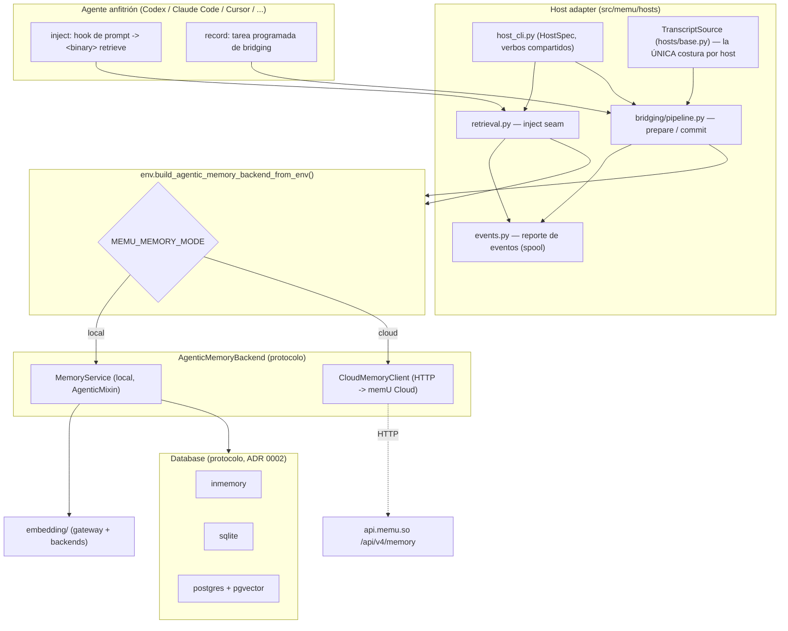

# Arquitectura de memU

> Documento de arquitectura basado en el código real de `src/memu/`, los Architecture
> Decision Records de `docs/adr/`, la documentación de nivel superior (`README.md`) y el
> grafo de conocimiento en `graphify-out/`. Cada afirmación no trivial cita su fuente como
> ruta relativa al repo. Cuando el código y un ADR discrepan, **el código es la verdad**:
> varios ADRs (0001, 0005, 0007, 0008) describen diseños anteriores o *propuestos* que no
> coinciden con lo que hoy está en `src/memu/`; esas divergencias se señalan de forma
> explícita.

---

## 1. Qué es memU y para qué sirve

memU es un sistema de memoria persistente y liviano para agentes de IA. Da a un usuario una
"wiki" de memoria compartida **a través de sesiones, agentes y dispositivos**, y destila
automáticamente *skills* reutilizables a partir del historial del agente (`README.md` L1-L23).

El problema que resuelve: los agentes de escritorio (Codex, Claude Code, Cursor, OpenClaw,
Hermes, WorkBuddy, Cola, …) no recuerdan nada entre sesiones ni comparten conocimiento entre
sí. memU se instala como *sidecar* de esos agentes y expone dos "costuras" (seams): **record**
(capturar y destilar el historial en memoria/skills) e **inject** (traer memoria relevante
antes de que el agente responda) (`README.md` L114-L142).

Una decisión de diseño define todo lo demás: **memU no tiene LLM propio**. `MemoryService`
"no hace ninguna llamada a LLM ni de chat; almacena, embebe y recupera el Markdown que el
agente preparó" (`README.md` L96). Las únicas llamadas a modelo son *embeddings* para indexar
y para búsqueda vectorial (`src/memu/app/service.py` L24-L32; `src/memu/env.py` L148-L153, que
afirma literalmente "There is no LLM in memU"). El juicio y la síntesis viven dentro del
agente anfitrión; memU solo persiste, vectoriza y recupera.

---

## 2. Visión general de la arquitectura

memU se organiza en cuatro grandes capas:

1. **Superficie agéntica** (`AgenticMemoryBackend`): tres operaciones —`list_all_recall_files`,
   `progressive_retrieve`, `commit_results`— que consumen las CLIs y los host adapters
   (`src/memu/agentic_backend.py`).
2. **Dos implementaciones intercambiables** de esa superficie: `MemoryService` (local, en
   proceso) y `CloudMemoryClient` (HTTP contra memU Cloud). Un único selector las elige
   (`src/memu/env.py` L196-L222; ADR 0012).
3. **Capa de almacenamiento** pluggable detrás del protocolo `Database`: `inmemory`, `sqlite`,
   `postgres` (`src/memu/database/interfaces.py`, `src/memu/database/factory.py`; ADR 0002).
4. **Capa de hosts**: un binario por agente (`memu-codex`, `memu-claude-code`, …), un pipeline
   de *bridging* compartido, scheduling y reporte de eventos (`src/memu/hosts/**`; ADRs
   0009/0010/0011).

Los "god nodes" del grafo confirman dónde está la gravedad del sistema: `DatabaseState`,
`Database`, `DatabaseConfig` (almacenamiento), `SessionManager`, `SQLiteRepoBase` (repos),
`HostSpec` (host adapters) y `_Posted` (tests de eventos) son los nodos más conectados
(`graphify-out/GRAPH_REPORT.md` L139-L149).

---

## 3. Componentes principales

### 3.1 MemoryService y la capa agéntica (`AgenticMixin`)

`AgenticMemoryBackend` es un `Protocol` estructural con exactamente tres métodos asíncronos:
`list_all_recall_files`, `progressive_retrieve` y `commit_results`
(`src/memu/agentic_backend.py` L6-L41). Es el contrato que separa "qué operaciones existen"
de "quién las ejecuta" (ADR 0012).

`MemoryService` es la implementación local. Es "embedding-only": compone un `Database`
pluggable y un pool de clientes de embedding, y hereda la superficie pública de `AgenticMixin`
(`src/memu/app/service.py` L24-L56). Valida los filtros `where` contra el modelo de usuario
configurado (scope de usuario como campos de primera clase, ADR 0003) en `_normalize_where`
(`src/memu/app/service.py` L64-L81).

La lógica real de las tres operaciones vive en `AgenticMixin` (`src/memu/app/agentic.py`):

- **`progressive_retrieve`** (L85-L128): recuperación de un solo paso, **sin LLM**. Embebe la
  query **una vez** y rankea por similitud coseno. Tres capas: (a) `segments` —slices L2 de
  `RecallFileSegment` rankeados por embedding; (b) `files` —los `RecallFile` a los que apuntan
  esos segmentos (no es una búsqueda rankeada de archivos, es un *roll-up*: el score del
  archivo es el máximo de sus segmentos); (c) `resources` —recursos de track `workspace`
  rankeados por embedding. No hay routing de intención, ni sufficiency checks, ni
  summarization.
- **`commit_results`** (L225-L258): persiste recursos y recall files ya sintetizados
  *fuera* del servicio (por el agente en el pipeline de bridging). No corre ningún paso de
  ingest/preprocess/LLM. Los recursos se crean-o-actualizan por `url`; los recall files por
  `name` dentro de su `track` (`memory`/`skill`), regenerando los segmentos L2 por diferencia
  (drop-and-add) y re-embebiendo la descripción solo si cambió (L300-L409).
- **`list_all_recall_files`** (L60-L83): devuelve **una página keyset** ordenada por
  `(track, name, id)` con un `next_cursor` opaco; el llamador sigue el cursor para reensamblar
  todo el conjunto (ADR 0014). No fuerza filtro de `track`, así que los skills salen junto a
  la memoria (ADR 0006).

> **Divergencia con ADR 0001.** El ADR 0001 describe un motor de workflow (`PipelineManager`,
> `WorkflowRunner`, `WorkflowStep`). El código agéntico enviado **no** usa ese motor: ejecuta
> las etapas *inline* (lo confirma la corrección explícita del ADR 0009 L94-L102:
> "`progressive_retrieve` executes the stages inline rather than through the workflow engine").

### 3.2 Capa de almacenamiento y repositorios

El contrato es `Database`, un `Protocol` runtime-checkable que expone tres repositorios
—`resource_repo`, `recall_file_repo`, `recall_file_segment_repo`— más caches en memoria y un
`close()` (`src/memu/database/interfaces.py` L15-L27). `build_database` despacha por provider
a `inmemory` / `postgres` / `sqlite` con imports perezosos para no exigir dependencias que no
se usan (`src/memu/database/factory.py` L28-L43).

Los tres backends existen por tres footprints distintos (ADR 0002):

| Provider | DSN | Búsqueda vectorial | Uso |
| --- | --- | --- | --- |
| `inmemory` | — | coseno brute-force | tests, sesiones desechables |
| `sqlite` | `sqlite:///path` | coseno brute-force (embeddings como texto JSON) | local por defecto, un solo escritor |
| `postgres` | `postgresql://…` | pgvector cuando está habilitado | acceso concurrente, stores grandes |

(`README.md` L183-L195; ADR 0002 L18-L29). El código confirma repos por backend en
`src/memu/database/{inmemory,sqlite,postgres}/repositories/`, con clases base como
`SQLiteRepoBase` y `PostgresRepoBase` (god nodes en `graphify-out/GRAPH_REPORT.md` L146-L149).

**Modelo de datos** (`src/memu/database/models.py`), todos heredando `BaseRecord`
(`id`/`created_at`/`updated_at`, L11-L16):

- `Resource` (L19-L27): `url`, `local_path`, `caption`, `embedding`, `track` (`commit_results`
  escribe `"workspace"`).
- `RecallFile` (L29-L36): `name`, `track` (`"memory"` o `"skill"`, default `"memory"`),
  `description`, `embedding`, `content`.
- `RecallFileSegment` (L39-L56): la slice buscable (item L2) de un `RecallFile`. `text` es la
  unidad de embed/búsqueda; `track` está denormalizado desde el archivo dueño para filtrar por
  columna sin join.

Los modelos se construyen *con scope de usuario* mediante `build_scoped_models` /
`merge_scope_model`, que mezclan el modelo de usuario con el modelo core (ADR 0003;
`src/memu/database/models.py` L62-L95).

> **Divergencia con ADR 0007.** El ADR 0007 (estado *Proposed*) proponía eliminar la columna
> `track`, separar tres stores independientes y usar recuperación híbrida embedding+BM25. El
> código enviado **conserva** `RecallFile` con columna `track` en un store único y usa
> **solo coseno** (`src/memu/app/agentic.py`, `src/memu/vector.py:cosine_topk`); no hay BM25
> ni grafo. `RecallFileSegment` sí adopta la nomenclatura "L2 item" del ADR 0007.

### 3.3 Host adapters

Un host adapter es el puente entre un agente de escritorio concreto y el pipeline
host-agnóstico. La idea central (ADR 0010): "un segundo host es un `TranscriptSource` y una CLI
delgada, y nada más" (`src/memu/hosts/base.py` L1-L11).

- **`TranscriptSource`** (`src/memu/hosts/base.py`) es *la única* abstracción que varía por
  host. Declara dónde vive el log de sesiones (`root`), cómo descubrir sesiones
  (`discover`, newest-first), cómo leer un registro y —la costura real— cómo clasificarlo con
  `classify` en `MESSAGE` / `TOOL` / `OTHER` (`RecordKind`, L23-L39). Cada sesión se corta en
  dos transcripts porque el job de *memory* lee solo la conversación y el de *skill* necesita
  además las tool calls (L24-L30).
- **`HostSpec`** (`src/memu/hosts/host_cli.py` L48-L163) es "todo lo específico del host como
  **datos, no código**": id del host, nombre del binario, dónde vive el log, qué archivo de
  instrucción parchear, directorio de skills, comando de scheduling, la variable de entorno
  del session id, etc.
- **`host_cli.build_parser`** (L713-L797) construye **una sola vez** el parser con los verbos
  compartidos por todos los hosts: `retrieve`, `install-instruction`, `remove-instruction`,
  `prepare`, `commit`, `verify-resources`, `doctor`, `docs`, `report` y (solo Windows)
  `schedule`. Cada `cli.py` de host se reduce a su `HostSpec` más un `main`.

Hosts implementados (cada uno con `sessions.py` + `cli.py`): `codex`, `claude_code`, `cursor`,
`openclaw`, `hermes`, `workbuddy`, `cola` y el genérico `generic` (`memu-agent`), que detecta
por sniffing el dialecto JSONL de cualquier agente sin binario propio
(`README.md` L114-L142; ADR 0010 L23-L39; ADR 0011). El seam **record** difiere por host; el
seam **inject** es idéntico y vive una sola vez en `src/memu/hosts/retrieval.py`, registrado
por cada CLI bajo su propio binario (ADR 0009 L104-L107).

El árbol de trabajo es por host: cada host usa `~/.memu/hosts/<host>/` para que dos runs no se
pisen; **Codex conserva `~/.memu`** por compatibilidad histórica (ADR 0010 L78-L92;
`src/memu/hosts/host_cli.py` L12-L18). Lo que **sí** se comparte es `~/.memu/config.env` y el
store: lo que una sesión de un host enseñó, otro host lo recupera.

### 3.4 Pipeline de bridging y scheduling

El pipeline de *record* es "prepare -> (el agente se auto-evoluciona) -> commit": tres pasos,
de los que solo el primero y el último son código; el del medio es trabajo real del agente
—leer transcripts, decidir, escribir Markdown— (`src/memu/hosts/bridging/pipeline.py` L1-L10).

- **`prepare`** (L33-L136): regenera los archivos de job desde lo que el host haya loggeado
  desde el último run. Corta transcripts nuevos por sesión (`prepare_transcripts`, con cursor
  *staged*), **espeja** los recall files del store a disco paginando por `next_cursor`
  (ADR 0014), y escribe los archivos de instrucción de job (memory/skill) resolviendo
  plantillas server-first (ADR 0013). Devuelve cuántas sesiones preparó; **cero es un
  resultado correcto y común**.
- **`commit`** (L139-L175): submite lo que el agente dejó en disco. Difunde (`diff_tracked`
  por hash de contenido) los recall files cambiados, lee los recursos, llama a
  `backend.commit_results(...)`, y **solo entonces** promueve el cursor de sesión y re-toma el
  snapshot de memoria. "El estado avanza en el éxito durable, no en la intención" (#518): un
  run que muere antes deja todo re-ofrecible la próxima vez.

El *layout* de estado de trabajo está centralizado en un solo objeto para que `prepare` y
`commit` coincidan en cada ruta (`src/memu/hosts/bridging/layout.py`): `sessions/`, `jobs/`,
`memory/`, `skill/`, los manifiestos de sesión (`.session_manifest.<host>.json` promovido y su
`.pending`), el `run_marker` del ciclo, `.self_sessions.<host>.json` y el `.memory_manifest`
por hash.

**Regla anti-auto-minado** (ADR 0015, #606): el run de bridging corre *como una sesión del
propio host*, que la loggea justo donde memU descubre sesiones. Sin protección, cada run
alimenta al siguiente con "contenido nuevo" que es su propia contabilidad. La solución
(`src/memu/hosts/bridging/self_sessions.py`, y su orquestación en `host_cli._cmd_prepare`
L191-L247): la identidad de la sesión propia viene del host vía la variable
`HostSpec.session_id_env` (p. ej. `CLAUDE_CODE_SESSION_ID`), **nunca** del contenido del
transcript; y solo el run *programado* puede reclamar una sesión —el gate es el lanzamiento
(`MEMU_BRIDGING_RUN` o el working directory), no el comando `prepare`—, así una persona que
corre `prepare` a mano mantiene su conversación minable. Se saltea con `continue`, nunca con
`break`, porque las sesiones propias son las más nuevas (ADR 0015 L92-L96).

**Scheduling**: en Windows, `memu-<host> schedule install|uninstall|status|verify` automatiza
el Task Scheduler (`src/memu/hosts/host_cli.py` L591-L617; módulo `src/memu/hosts/scheduling/`),
solo para hosts que declaran `schedule_command`. En macOS/Linux el registro sigue siendo
cron/launchd guiado por `BRIDGING_TASK.md`.

### 3.5 Backend cloud

`CloudMemoryClient` (`src/memu/cloud.py`) implementa el mismo protocolo `AgenticMemoryBackend`
sobre HTTP contra la API v4 de memU (`GET /api/v4/memory/`, `POST …/search`, `POST …/`)
(L94-L152; ADR 0012 L24-L37). Encapsula autenticación Bearer, timeouts explícitos, una
taxonomía de errores estructurados (`CloudAuthenticationError`, `CloudRateLimitError`,
`CloudTransportError`, …) y reintentos acotados con backoff que respeta `Retry-After`
(L240-L254). Nada de eso entra en `memu.app`.

El scope cloud es más estrecho a propósito: solo acepta filtros exactos `user_id`/`agent_id`;
valores ausentes o vacíos se vuelven el literal `"default"`; filtros no soportados fallan en
vez de ampliar el scope silenciosamente (L154-L185; ADR 0012 L64-L70). La API cloud acepta el
campo `resource` por compatibilidad de cable pero **no persiste** recursos de workspace todavía
(ADR 0012 L71-L77), lo que `doctor` reporta explícitamente (`src/memu/hosts/host_cli.py`
L541-L543).

La selección local-vs-cloud está en un único punto: `build_agentic_memory_backend_from_env`
(`src/memu/env.py` L196-L222) despacha por `MEMU_MEMORY_MODE` (`local` por defecto, para no
romper instalaciones existentes). Todos los entrypoints —CLI principal, retrieval de host,
prepare/commit del bridging, doctor— pasan por ese selector (ADR 0012 L40-L45).

### 3.6 Paquetes embedding / (llm / vlm)

**Solo existe `src/memu/embedding/`.** No hay paquetes `src/memu/llm/` ni `src/memu/vlm/` en el
código actual (verificado: `Glob src/memu/{llm,vlm}/**` no devuelve archivos, y `env.py`
L148-L153 afirma que no hay LLM en memU). El ADR 0005 y el hyperedge del grafo "Isomorphic
Capability Packages (llm/vlm/embedding)" describen una estructura hermana `memu.llm` / `memu.vlm`
que **no está presente**; es diseño histórico/aspiracional, no código enviado.

El paquete `embedding/` está organizado así:

- **`gateway.build_embedding_client(cfg)`** (`src/memu/embedding/gateway.py`): selecciona el
  cliente de transporte por `client_backend` desde un registro (`sdk` -> OpenAI SDK,
  `httpx` -> cliente HTTP genérico). Agregar un transporte es registrar un builder aquí, sin
  tocar el composition root.
- **`backends/`**: forma de request/response por proveedor —`openai`, `jina`, `voyage`,
  `doubao` (incluye multimodal), `openrouter`— sobre la interfaz `EmbeddingBackend`
  (`src/memu/embedding/backends/base.py`). Cualquier otro proveedor cae al backend
  OpenAI-compatible.
- **`http_client` / `openai_sdk`**: clientes de transporte; `embed()` devuelve
  `(vectors, raw_response)` para preservar metadata de uso (`src/memu/app/agentic.py` L38-L48).
- **`http_client`** además maneja bypass de proxies para targets loopback
  (`proxy_bypass_mounts`, `is_loopback_url`), reutilizado por `cloud.py` (L196-L208).

`MemoryService` cachea un cliente por perfil de embedding vía `ClientPool`
(`src/memu/app/service.py` L54-L56; `src/memu/app/client_pool.py`). El proveedor por defecto es
`openai`, configurable por `MEMU_EMBED_PROVIDER` (`src/memu/env.py` L148-L162; `README.md`
L171-L178). Este desacople embedding-de-chat es lo que ADR 0005 defiende, aunque su premisa
sobre `memu.llm`/`memu.vlm` ya no aplica.

### 3.7 Reporte de eventos (event reporting)

`src/memu/events.py` implementa telemetría de ciclo de vida (ADR 0016). memU es "ciega a su
propia operación": una tarea de bridging que deja silenciosamente de producir memoria se ve
igual que una que no tenía nada que minar; los eventos hacen distinguibles esos dos casos
(`src/memu/events.py` L1-L7).

Dos reglas gobiernan todo (L8-L24):

1. **Nunca es una dependencia.** Cada función traga cada fallo: un `retrieve` que no puede
   registrar un evento sigue siendo un `retrieve` exitoso; nada aquí cambia el exit code, la
   salida ni la latencia de un comando.
2. **El hook por-turno nunca drena el spool.** `record()` normalmente **solo agrega una línea**
   a un spool local (`~/.memu/events.jsonl`) y retorna. La entrega ocurre después, desde los
   puntos de flush de baja frecuencia (`prepare`, `commit`, `report uninstall/flush`, el
   handler de error de la CLI). La única excepción es `retrieve`, que entrega **su propio único
   sobre** inline (`record(deliver=True)`) porque el backend pidió ese evento pronto —pero
   jamás hace `flush()`, que drenaría todo el spool (hasta `MAX_FLUSH_POSTS`=200 POSTs seriales)
   en el path más caliente del producto (`src/memu/hosts/retrieval.py` L120-L170).

Propiedades clave: **solo salen conteos, nunca contenido** —sin query, sin memoria, sin nombres
de recall files, sin DSN, sin paths absolutos, sin transcripts—; `_ALLOWED_PROPERTIES` es una
allowlist por evento para que agregar una fuga requiera una edición deliberada (L252-L286). El
vocabulario de eventos está fijado y acordado con el backend: `memory_search_*`,
`memory_list_*`, `memory_commit_*`, `memory_update_*` (el ciclo de bridging completo),
`cli_install_*`, `cli_uninstall_*`, `agent_error_reported`, `cli_error`, `cli_events_dropped`
(L80-L169). El `event_id` client-generado + el spool que sobrevive a un laptop offline dan
idempotencia por reintento (L30-L37). Se apaga con `MEMU_TELEMETRY=0`, `DO_NOT_TRACK=1` o
`MEMU_EVENTS_BASE_URL` vacío (L44-L47).

Los eventos que el código no puede observar por sí mismo (fin de instalación, desinstalación,
errores que el modelo juzga) llegan por el verbo `report` (`src/memu/hosts/host_cli.py`
L620-L676; ADR 0016 §4-§5).

---

## 4. Cómo funciona de punta a punta

### 4.1 Un turno de retrieval (inject)

1. El hook de prompt del agente anfitrión ejecuta `memu-<host> retrieve "<query>"`. El verbo
   está registrado por `retrieval.register` en la CLI compartida (`src/memu/hosts/retrieval.py`
   L173-L186).
2. `retrieve()` construye el backend con `build_agentic_memory_backend_from_env()` (local o
   cloud según `MEMU_MEMORY_MODE`) y llama `progressive_retrieve(query)`
   (`src/memu/hosts/retrieval.py` L32-L42).
3. En modo local, `AgenticMixin.progressive_retrieve` embebe la query una vez, rankea segmentos
   por coseno, los agrupa (roll-up) a sus archivos, y rankea los recursos `workspace`
   (`src/memu/app/agentic.py` L85-L211).
4. `_shape_for_agent` reescribe los registros crudos a la forma "ubicación + resumen" que
   promete la instrucción: los `files` sueltan su `content` por un `path` (espejando el archivo
   a `~/.memu/<track>/<name>.md`), los `segments` cambian el UUID por `source_file =
   <track>/<name>`, y los `resources` colapsan `url`/`local_path` a un `path`
   (`src/memu/hosts/retrieval.py` L59-L117).
5. Se imprime el JSON y **después** se registra el evento `memory_search_succeeded` con
   `deliver=True` (un solo POST), midiendo `latency_ms` solo del retrieval
   (`src/memu/hosts/retrieval.py` L120-L170).

### 4.2 Un ciclo de bridging (record: memorize -> store)

1. La tarea programada corre `memu-<host> prepare`. Se marca el inicio del ciclo (`run_marker`,
   evento `memory_update_started`) y se resuelve si esta es la sesión propia para saltearla
   (ADR 0015) (`src/memu/hosts/host_cli.py` L191-L247).
2. `prepare` (`src/memu/hosts/bridging/pipeline.py` L33-L136) corta las sesiones nuevas del
   `TranscriptSource` en transcripts numerados (cursor staged), espeja el store a disco
   paginando `list_all_recall_files`, y escribe archivos de job de memory/skill para el agente.
3. **El agente se auto-evoluciona**: lee los jobs, decide no hacer nada / parchear un skill
   existente / crear uno nuevo, y escribe Markdown en `~/.memu/hosts/<host>/{memory,skill}/`
   (`README.md` L83-L96).
4. La tarea corre `memu-<host> commit`. `commit` difunde por hash los archivos cambiados, lee
   los recursos, y llama `backend.commit_results(recall_files=…, resource=…)`
   (`src/memu/hosts/bridging/pipeline.py` L139-L156).
5. `AgenticMixin.commit_results` persiste: cada recall file se crea-o-actualiza por `name`
   dentro de su `track`, embebe `name: description` solo si la descripción cambió, y reconcilia
   sus segmentos L2 por diferencia (`src/memu/app/agentic.py` L225-L409).
6. Recién con el store aceptado, `commit` promueve el cursor y re-toma el snapshot de memoria,
   limpia los archivos efímeros del run, y registra `memory_commit_succeeded` +
   (si el marker existía) `memory_update_succeeded` (`src/memu/hosts/host_cli.py` L250-L293,
   L384-L438).

En un turno futuro similar, el paso 4.1 devuelve el skill aprendido, y cualquier agente
conectado al mismo store lo usa (`README.md` L94).

---

## 5. Relaciones entre componentes (dependencias, puentes y god nodes)

- **`env.build_agentic_memory_backend_from_env` es el puente maestro.** El grafo lo marca como
  nodo de alta betweenness que conecta `Env` con `Agentic Backend`, `Host Adapters` y `Cli`
  (`graphify-out/GRAPH_REPORT.md` L591-L592). Verificado en código: lo llaman `retrieval.py`,
  `bridging/pipeline.py` (prepare y commit) y el doctor. Es donde el sistema decide local vs
  cloud, y donde se garantiza el invariante "record e inject comparten un mismo store y espacio
  de embedding" (ADR 0009 L41-L46; `src/memu/env.py` L1-L25).
- **`AgenticMemoryBackend` es la costura de capacidad.** `MemoryService` y `CloudMemoryClient`
  la satisfacen estructuralmente; todo lo de arriba (host adapters, CLIs) depende del protocolo,
  no de la implementación (`src/memu/agentic_backend.py`; ADR 0012). El grafo lo señala como
  bridge de alta betweenness (`graphify-out/GRAPH_REPORT.md` L587-L588).
- **`prepare()` y `commit()` orquestan casi todo el subsistema de hosts.** El grafo marca
  `prepare()` conectando `Instructions`, `Manifest`, `Resources`, `Transcripts`, `Host Cli`,
  `Env` y `Host Adapters` (`graphify-out/GRAPH_REPORT.md` L589-L590). Verificado: `pipeline.py`
  importa de `bridging/{instructions,manifest,recall_files,resources,transcripts,layout}` y de
  `env`, `templates`, `events`.
- **`TranscriptSource` es el único punto de variación por host.** Todo lo demás del bridging es
  host-agnóstico (`src/memu/hosts/base.py` L1-L11). `HostSpec` es el otro god node del lado
  host: parametriza el CLI compartido (`graphify-out/GRAPH_REPORT.md` L146-L147).
- **`Database` / `DatabaseState` son los god nodes de almacenamiento** (58 y 39 edges). El
  `Database` protocol agrupa los tres repos; `MemoryService` depende del protocolo y `factory`
  elige el backend (`src/memu/database/{interfaces,factory}.py`).
- **`events` es transversal y deliberadamente unidireccional**: lo llaman `retrieval`,
  `host_cli` y `pipeline`, pero `events` no llama de vuelta a la lógica de memoria; solo lee
  config de `env` y postea (`src/memu/events.py` L67).
- **`env` es el loader único de configuración `MEMU_*`** consumido por CLI, adapters y pipeline
  (`src/memu/env.py` L1-L9). Sin ciclos de import en todo el repo
  (`graphify-out/GRAPH_REPORT.md` L163-L164).

---

## 6. Decisiones de arquitectura clave (ADRs)

Estado real según `docs/adr/` (importa: varios son *Proposed*, no *Accepted*):

- **ADR 0001 — Workflow pipelines (Accepted).** Modeló las operaciones como pipelines de
  `WorkflowStep`. **Superado en el path agéntico enviado**: `AgenticMixin` corre las etapas
  inline (corrección explícita en ADR 0009 L94-L102).
- **ADR 0002 — Almacenamiento pluggable + vector por backend (Accepted).** Protocolo `Database`
  con `inmemory`/`sqlite`/`postgres`; coseno brute-force portátil, pgvector en Postgres.
  **Vigente y confirmado en código** (`src/memu/database/`).
- **ADR 0003 — User scope como campos de primera clase.** Confirmado en
  `build_scoped_models`/`merge_scope_model` y en `_normalize_where`.
- **ADR 0004 / 0006 — Workspace memorize / skills como track.** Superados por ADR 0007 según su
  encabezado (`docs/adr/0007-*.md` L5).
- **ADR 0005 — Paquete de embedding dedicado (Accepted).** Confirmado el paquete
  `memu.embedding` y el desacople de chat. **No confirmado**: su premisa de paquetes hermanos
  `memu.llm` / `memu.vlm` (no existen en el código).
- **ADR 0007 — Tres líneas de memoria sobre kernel wiki-graph (Proposed).** Aspiracional:
  separar stores, quitar `track`, híbrido embedding+BM25. **El código no lo implementa** (store
  único con `track`, solo coseno). Sí adopta el vocabulario L0/L1/L2 en `RecallFileSegment`.
- **ADR 0008 — Trayectoria como fuente; hooks sobre API (Proposed).** Define dos seams
  (`on_turn`/`on_prompt`). En la práctica, `on_turn` se realiza como **tarea programada de
  bridging** y no como hook por-turno (ADR 0009 L21-L28). Su mención a "embedding + BM25" no
  está en el código.
- **ADR 0009 — Empaquetado de Codex: pip, un seam de CLI, un loader de config (Accepted).**
  Vigente y central: `pip install memu-cli`, binarios `memu`/`memu-<host>`, invocación por
  comando `PATH` (no por script path), y `~/.memu/config.env` como carrier único. Confirmado en
  `env.py` y `host_cli.py`.
- **ADR 0010 — Multi-host adapters (Accepted).** CLI construido desde `HostSpec`, árboles de
  trabajo por host, clasificación por forma de registro (no por rol). Confirmado en
  `host_cli.py` y `hosts/*/sessions.py`.
- **ADR 0011 — Host adapter genérico (`memu-agent`).** Detecta por sniffing; confirmado en
  `hosts/generic/`.
- **ADR 0012 — Backend cloud detrás de la CLI existente (Accepted).** `AgenticMemoryBackend` +
  `CloudMemoryClient` + un selector `build_agentic_memory_backend_from_env`. Confirmado en
  `cloud.py` y `env.py`.
- **ADR 0013 — Plantillas de instrucción auto-actualizables (server-first, last-good,
  embedded).** Confirmado en `templates.resolve*` usado por `prepare` y `_refresh_retrieval`.
- **ADR 0014 — `list_all_recall_files` paginado (keyset).** Confirmado en `agentic.py` y
  `cloud.py` (cursor opaco, orden `(track, name, id)`).
- **ADR 0015 — El run de bridging no debe minarse a sí mismo (Proposed).** Identidad desde el
  host (`session_id_env`), gate en el lanzamiento. Confirmado en `self_sessions.py` y
  `host_cli._cmd_prepare`.
- **ADR 0016 — Reporte de eventos del cliente (spool por defecto, payloads acotados).**
  Confirmado en detalle en `events.py`.

---

## 7. Fuentes consultadas

Código (`src/memu/`):
- `src/memu/agentic_backend.py` — protocolo `AgenticMemoryBackend`.
- `src/memu/app/service.py`, `src/memu/app/agentic.py`, `src/memu/app/client_pool.py` — servicio local y superficie agéntica.
- `src/memu/env.py` — loader de config y selector local/cloud.
- `src/memu/cloud.py` — cliente HTTP de memU Cloud.
- `src/memu/database/interfaces.py`, `src/memu/database/factory.py`, `src/memu/database/models.py` — capa de almacenamiento y modelo de datos.
- `src/memu/embedding/gateway.py`, `src/memu/embedding/backends/base.py` — capa de embeddings.
- `src/memu/events.py` — reporte de eventos.
- `src/memu/hosts/base.py`, `src/memu/hosts/host_cli.py`, `src/memu/hosts/retrieval.py` — host adapters e inject seam.
- `src/memu/hosts/bridging/pipeline.py`, `src/memu/hosts/bridging/layout.py`, `src/memu/hosts/bridging/self_sessions.py` — pipeline de bridging.

ADRs (`docs/adr/`): `README.md`, `0001`–`0016` (leídos en detalle: 0001, 0002, 0005, 0007, 0008, 0009, 0010, 0012, 0015; el resto vía referencias cruzadas y código).

Documentación y grafo: `README.md`, `graphify-out/GRAPH_REPORT.md` (god nodes, comunidades, hyperedges, conexiones sorprendentes), consultas `graphify query`/`explain`.
