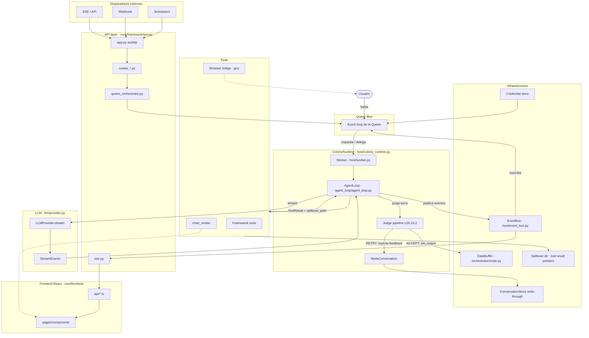

# Arquitectura del proyecto Hive

> Documento técnico de referencia sobre la arquitectura completa del framework **Hive** (también citado como *Aden Agent Framework*).
> Todas las afirmaciones se apoyan en fuentes primarias del propio repositorio (código bajo `core/framework/` y documentación en `docs/`). Cada afirmación relevante cita su archivo y, cuando aplica, la línea.

---

## Índice

1. [Función del proyecto](#1-función-del-proyecto)
2. [Arquitectura general](#2-arquitectura-general)
   - 2.1 [El modelo de swarm: Queen / Judge / Worker](#21-el-modelo-de-swarm-queen--judge--worker)
   - 2.2 [Verificación triangulada](#22-verificación-triangulada)
   - 2.3 [Reflexion loops](#23-reflexion-loops)
   - 2.4 [Pipeline de evaluación del Judge (L0/L1/L2)](#24-pipeline-de-evaluación-del-judge-l0l1l2)
   - 2.5 [Goal-driven architecture](#25-goal-driven-architecture)
   - 2.6 [Three-layer prompt onion](#26-three-layer-prompt-onion)
   - 2.7 [Tool result pointer pattern](#27-tool-result-pointer-pattern)
3. [Componentes principales](#3-componentes-principales)
4. [Relación entre componentes y flujo de datos](#4-relación-entre-componentes-y-flujo-de-datos)
5. [Discrepancias e incertidumbres](#5-discrepancias-e-incertidumbres)
6. [Fuentes](#6-fuentes)

---

## 1. Función del proyecto

Hive es un **framework para construir agentes de IA orientados a resultados (outcome-oriented) y auto-adaptativos**, que ejecutan objetivos de forma confiable en lugar de simplemente "pasar tests" (`docs/roadmap.md:3`, `docs/architecture/README.md:1`).

El problema central que ataca está formulado explícitamente como *"the Ground Truth Crisis in Agentic Systems"*: no existe un oráculo único y confiable para evaluar el trabajo de un agente. Los tests unitarios pierden matiz de calidad y se pueden "gamear" (Goodhart's Law), la confianza del modelo (log-probs) está mal calibrada, un único LLM-juez alucina, y los resultados de ejecución son no deterministas (`docs/architecture/README.md:433-446`). La consecuencia que Hive busca evitar es que los agentes se conviertan en *"optimizers of metrics rather than producers of value"* (`docs/architecture/README.md:446`).

La respuesta de diseño es un framework donde los agentes:
- se organizan como un **enjambre (swarm)** con roles diferenciados (Queen / Judge / Worker);
- verifican su trabajo por **triangulación** de múltiples señales imperfectas;
- aprenden de sus fallos mediante **reflexion loops** en vez de búsqueda costosa;
- se orientan a **objetivos de primera clase** (`Goal`) con criterios ponderados y restricciones duras.

El framework se distribuye con una interfaz de navegador (`hive open`) que reemplaza a la TUI legada, ya deprecada (`docs/roadmap.md:315`, `docs/roadmap.md:779`).

---

## 2. Arquitectura general

> **Nota sobre rutas:** la documentación en `docs/` describe el diseño usando rutas antiguas (`graph/…`, `runtime/…`). El código real vive bajo `core/framework/` con una estructura distinta (`host/`, `agent_loop/`, `orchestrator/`, `llm/`, etc.). Este documento cita el **código real**; ver [sección 5](#5-discrepancias-e-incertidumbres) para el detalle de esta divergencia.

### 2.1 El modelo de swarm: Queen / Judge / Worker

La arquitectura se organiza como un enjambre de abejas con tres roles conceptuales (`docs/architecture/README.md:150-159`, `docs/roadmap.md:185-207`):

| Rol | Función | Dónde vive en el código |
| --- | --- | --- |
| **Queen Bee** | Orquestación y supervisión. Coordina colonias/workers, recibe eventos de nodos activos vía Event Bus, y el usuario puede hablarle directamente. | `core/framework/server/queen_orchestrator.py`, `core/framework/agents/queen/` |
| **Worker Bee** | Ejecución del trabajo real como grafo de nodos. Cada nodo puede volverse el *Active Node*. | `core/framework/host/worker.py` (`Worker` en L133), `core/framework/host/colony_runtime.py` |
| **Judge** | Evaluación/verificación del trabajo del worker. | `core/framework/orchestrator/conversation_judge.py`, `core/framework/agent_loop/internals/judge_pipeline.py` |

La unidad de ejecución concreta es la **colonia** (`ColonyRuntime`, `core/framework/host/colony_runtime.py:292`), que agrupa workers, un stream de eventos (`StreamEventBus`), y su binding de configuración (`ColonyBinding`, `core/framework/host/colony_binding.py:29`). El `queen_orchestrator` construye y corre el ejecutor de la Queen, y gestiona un buzón (inbox) de escalaciones de workers con tope `MAX_PENDING_ESCALATIONS = 32` (`core/framework/server/queen_orchestrator.py:23-25`). También implementa el patrón de "pivot" para crear colonias hermanas a partir de una colonia existente vía el intercept sintético `task_create(new_colony=true)` (`core/framework/server/queen_orchestrator.py:28-67`).

El **Sub-Agent Framework** permite que un nodo padre delegue en sub-agentes especializados mediante `delegate_to_sub_agent`. Cada sub-agente corre como un `EventLoopNode` independiente, con snapshot de memoria de solo lectura, conversación fresca, herramientas filtradas y un `SubagentJudge` que auto-acepta cuando se llenan todas las output keys. Reportan progreso vía `report_to_parent` (fire-and-forget) y pueden escalar al usuario con `wait_for_response`. Las delegaciones múltiples corren en paralelo y la delegación anidada está bloqueada para evitar recursión (`docs/architecture/README.md:158`, `docs/architecture/README.md:166`). El `SubagentJudge` existe en el código: `core/framework/agent_loop/internals/judge_pipeline.py:15-39`.

### 2.2 Verificación triangulada

La tesis de investigación de Hive es que *"reliable agent behavior emerges not from a single perfect oracle, but from the convergence of multiple imperfect signals"* (`docs/architecture/README.md:450-454`). Se combinan tres señales independientes:

1. **Reglas deterministas** (rápidas, precisas, estrechas): chequeos programáticos con veredicto definitivo — violaciones de restricciones, requisitos estructurales, firmas de fallo conocidas. En Hive se expresan como `EvaluationRule` con prioridad, evaluadas antes de cualquier llamada al LLM (`docs/architecture/README.md:489-512`).
2. **Evaluación semántica** (flexible, contextual, falible): evaluación por LLM que entiende intención y contexto, con *gating* de confianza explícito (`HybridJudge`) (`docs/architecture/README.md:514-536`).
3. **Juicio humano** (autoritativo, caro, escaso): supervisión humana para decisiones de alto riesgo o inciertas, vía protocolo `HITL` con `pause_nodes`, `requires_approval` y acción `ESCALATE` (`docs/architecture/README.md:538-552`).

El orden importa por eficiencia: reglas primero (baratas y definitivas), LLM después (matiz, con gate de confianza), humano al final (autoritativo pero de alta latencia) (`docs/architecture/README.md:557-600`).

> **Incierto/aspiracional:** los ejemplos de `EvaluationRule`, `HybridJudge`, `CapabilityLevel` y `HITL` con esa forma exacta aparecen en el README como ilustración de diseño. La forma verificada en código del veredicto del juez es más acotada (ver [2.4](#24-pipeline-de-evaluación-del-judge-l0l1l2) y [sección 5](#5-discrepancias-e-incertidumbres)).

### 2.3 Reflexion loops

En lugar de búsqueda costosa (p. ej. MCTS), Hive usa **Reflexion**: feedback → reflexión → corrección (`docs/architecture/README.md:669-671`). El mecanismo concreto verificado en código:

- Cuando el juez emite un veredicto **RETRY** con feedback, ese feedback se inyecta como mensaje de usuario `[Judge feedback]: …` en la conversación; en el siguiente turno el agente ve su intento previo y la crítica, y ajusta. Esto es *in-context learning* sin reentrenar el modelo (`docs/architecture/README.md:411`).
- Cada `set_output(key, value)` persiste en el `OutputAccumulator` y se escribe *write-through* al `ConversationStore` para recuperación ante crash (`docs/architecture/README.md:409`).
- En transiciones de fase (node boundaries) se inyecta un marcador con un *reflection prompt* explícito: *"what went well in the previous phase? Are there any gaps or surprises worth noting?"* (`docs/architecture/README.md:415`).

El `AgentLoop` es el motor que corre este ciclo: llama a `LLMProvider.stream()`, procesa deltas de texto / tool calls / finish, ejecuta herramientas y realimenta resultados, y usa evaluación del juez (o el stop-reason implícito) para decidir la terminación del loop (`core/framework/agent_loop/agent_loop.py:1-10`).

### 2.4 Pipeline de evaluación del Judge (L0/L1/L2)

El pipeline real está implementado en `core/framework/agent_loop/internals/judge_pipeline.py`, en la función `judge_turn` (L42), con niveles evaluados en orden (`judge_pipeline.py:58-70`):

- **Nivel 0 — Cortocircuitos (sin evaluación):**
  - `mark_complete` → `ACCEPT` (`judge_pipeline.py:73-74`).
  - `skip_judge` en el `agent_spec` → `RETRY` con `feedback=None` (no se loguea) (`judge_pipeline.py:76-77`).
- **Nivel 1 — Custom judge (`JudgeProtocol`):** si hay un juez custom, tiene autoridad total. Recibe un contexto con `assistant_text`, `tool_calls`, estado del acumulador, iteración, resumen de conversación y `missing_keys`; su veredicto se respeta (garantizando feedback en los RETRY para logging) (`judge_pipeline.py:81-96`).
- **Nivel 2 — Juez implícito:**
  - Si hubo tool calls reales → `RETRY` (dejar seguir trabajando) (`judge_pipeline.py:101-102`).
  - Chequeo de *output keys* faltantes → `RETRY` con feedback (`judge_pipeline.py:104-110`).
  - Salvaguardas para nodos con todas las claves nullable no seteadas → `RETRY` (`judge_pipeline.py:117-124`).
  - **Nivel 2b — Chequeo de calidad consciente de conversación:** si el nodo define `success_criteria`, se llama a `evaluate_phase_completion` (`core/framework/orchestrator/conversation_judge.py:33`), un LLM rápido que lee la conversación reciente y evalúa si la fase cumplió los criterios, devolviendo un `PhaseVerdict` con `action` (`ACCEPT`/`RETRY`), `confidence` y `feedback` (`conversation_judge.py:24-31`, `judge_pipeline.py:126-143`).
  - Si todo pasa → `ACCEPT` (`judge_pipeline.py:145`).

El tipo `JudgeVerdict` real solo admite tres acciones: `Literal["ACCEPT", "RETRY", "ESCALATE"]` (`core/framework/agent_loop/internals/types.py:31-34`). El `JudgeProtocol` es un `Protocol` (`types.py:42`).

> El mapeo con las etiquetas del README (Level 0 = output keys, Level 1 = custom, Level 2 = quality; `docs/architecture/README.md:419-429`) es **conceptualmente equivalente** pero no idéntico en el detalle de los cortocircuitos. El README también describe un veredicto **REPLAN** que **no existe** en el enum del código (ver [sección 5](#5-discrepancias-e-incertidumbres)).

### 2.5 Goal-driven architecture

Los objetivos son ciudadanos de primera clase. El esquema `Goal` vive en `core/framework/orchestrator/goal.py` (nodo `Goal` en L73, confirmado por graphify). Un objetivo define (`docs/architecture/README.md:610-655`):
- **`success_criteria`**: múltiples `SuccessCriterion` ponderados (peso 0.0-1.0), con métricas `output_contains`, `output_equals`, `llm_judge`, `custom`; umbral del 90% para éxito del goal (`docs/roadmap.md:491-494`).
- **`constraints`**: `Constraint` duras o blandas (categorías: time, cost, safety, scope, quality). Una violación de restricción dura implica fallo/escalación (`docs/roadmap.md:486-490`).
- Estados del goal: `DRAFT → READY → ACTIVE → COMPLETED/FAILED` (`docs/roadmap.md:216`).

La diferencia frente a test-driven es que se optimiza para *satisfacción del objetivo* (multicriterio ponderado que captura intención) en vez de *pasar tests* (binario, gameable) (`docs/architecture/README.md:659-666`).

### 2.6 Three-layer prompt onion

El system prompt se compone en tres capas que se refrescan en cada turno (`docs/architecture/README.md:377-388`, `docs/architecture/README.md:413`):

1. **Layer 1 — Identity:** estático, nunca cambia.
2. **Layer 2 — Narrative:** reconstruido determinísticamente desde `DataBuffer.read_all()` y el *execution path* (fases completadas y valores de estado).
3. **Layer 3 — Focus:** el `system_prompt` del nodo actual.

En modo continuo, al cambiar de fase se intercambia la Layer 3 mientras las Layers 1-2 y el historial completo de conversación siguen adelante.

Verificado en código: la composición vive en `core/framework/orchestrator/prompting.py`, con `NodePromptSpec` que tiene los campos `identity_prompt`, `focus_prompt`, `narrative` (`prompting.py:34-36`). El prompt se parte en una porción **estática** (identidad, cuentas conectadas, skills) vía `build_system_prompt_static` (`prompting.py:263`) y un **sufijo dinámico** con narrativa + preámbulo + focus vía `build_system_prompt_dynamic_suffix` (`prompting.py:306-326`), para aprovechar el caché de prompt. `prompt_composer.py` es un wrapper de compatibilidad sobre `prompting.py` (`core/framework/orchestrator/prompt_composer.py:1-7`).

### 2.7 Tool result pointer pattern

Los resultados de herramientas suelen exceder el presupuesto de contexto (búsquedas web, scraping, respuestas de API grandes). Hive los persiste a disco y los reemplaza en la conversación por un **puntero compacto** que el agente puede *dereferenciar* bajo demanda con `load_data()` (`docs/architecture/README.md:172-284`). Reglas clave:

- Todo resultado de tool se guarda a un archivo `{tool_name}_{counter}.txt` cuando hay `spillover_dir` configurado (`docs/architecture/README.md:263`).
- **≤ 30KB:** contenido completo + anotación `[Saved to '…']`. **> 30KB:** preview + puntero con instrucción `load_data(...)` (`docs/architecture/README.md:267-270`).
- Los resultados de `load_data` nunca se re-spillean (evita referencias circulares); si son muy grandes se truncan con hint de paginación (`docs/architecture/README.md:272`).
- Los punteros **sobreviven a la compactación**: `compact_preserving_structure` conserva los mensajes de tool-call (ya son punteros diminutos) y spillea el texto libre a archivos `conversation_N.md` (`docs/architecture/README.md:274`).

Verificado en código: el `ToolResult` (`core/framework/llm/provider.py:69-82`) transporta `spillover_path` fuera de banda (nunca en el mensaje visible al LLM) para que la compactación pueda citar la ruta de recuperación sin re-inyectar el patrón "saved to path". La función de truncado es `truncate_tool_result`, usada por `AgentLoop._truncate_tool_result` (`core/framework/agent_loop/agent_loop.py:5631`, `agent_loop.py:6667-6705`).

---

## 3. Componentes principales

### 3.1 Agent loop — `core/framework/agent_loop/`

El corazón de ejecución. `AgentLoop` (`agent_loop.py:727`) implementa `AgentProtocol` y corre un loop de streaming multi-turno: stream del LLM → procesar deltas/tool calls/finish → ejecutar tools → realimentar resultados → juzgar → publicar eventos de ciclo de vida → persistir vía write-through al `ConversationStore` (`agent_loop.py:1-10`). Es el **god node** de mayor grado del sistema (grado 300 según graphify).

Subcomponentes destacados del paquete:
- `conversation.py`: `NodeConversation` y `ConversationStore` (historial de mensajes, resultados de tools, streaming, metadata).
- `internals/judge_pipeline.py`: pipeline del juez y `SubagentJudge` (ver [2.4](#24-pipeline-de-evaluación-del-judge-l0l1l2)).
- `internals/types.py`: `JudgeVerdict`, `JudgeProtocol`, `OutputAccumulator`, `LoopConfig` (`types.py:31-49`).
- `internals/compaction.py`: `compact`, `llm_compact`, `build_llm_compaction_prompt` (compactación de contexto).
- `prompting.py`, `reminders.py`, y una familia de "reminder sources" (`active_workers_reminder.py`, `idle_nudge.py`, `stream_stall.py`, `tool_skill_reminders.py`, etc.) que inyectan recordatorios/nudges al agente.

### 3.2 Host / stream runtime — `core/framework/host/`

Infraestructura de ejecución y coordinación de colonias/workers:
- `colony_runtime.py`: `ColonyRuntime` (L292), `ColonyConfig` (L225), `StreamEventBus` (L257), `AgentSpec`, `TriggerSpec` — el runtime que corre una colonia.
- `worker.py`: `Worker` (L133), `WorkerStatus` (L71), `WorkerInfo` (L107), `WorkerResult` (L85).
- `event_bus.py`: `EventBus` (L377), `EventType` (L102), `AgentEvent` (L301) — ver [3.4](#34-event-bus-y-eventos).
- `agent_host.py`: `AgentHost` (L73) — host de alto nivel.
- `execution_manager.py`: `ExecutionManager` (L137), `EntryPointSpec` (L102) — múltiples puntos de entrada (manual, webhook, timer, event, api).
- `stream_runtime.py`: `StreamRuntimeAdapter` (L398), `StreamDecisionTracker` (L23) — adaptación del runtime a streams.
- `webhook_server.py`: `WebhookServer` (L39), `WebhookRoute` (L22) — disparadores externos.
- `triggers.py`, `shared_state.py`, `isolation.py`, `outcome_aggregator.py`, `runtime_health.py`: estado compartido, niveles de aislamiento, agregación de outcomes y salud del runtime.

### 3.3 LLM providers — `core/framework/llm/`

Capa de abstracción de proveedores de LLM (`provider.py`):
- `LLMProvider` (ABC, `provider.py:85`) con `complete`, `acomplete` (async, con `system_dynamic_suffix` para caché) y `stream` (`provider.py:96-212`).
- Dataclasses de contrato: `LLMResponse` (con tokens, `cost_usd`, `credits`), `Tool`, `ToolUse`, `ToolResult` (`provider.py:11-82`).
- Implementaciones: `anthropic.py`, `litellm.py` (provider-agnóstico), `antigravity.py`, `mock.py`.
- Soporte: `capabilities.py`, `key_pool.py` (pool de API keys), `model_catalog.py` + `model_catalog.json`.

### 3.4 Event bus y eventos — `core/framework/host/event_bus.py` y `core/framework/llm/stream_events.py`

**Event Bus** (`event_bus.py`): sistema pub/sub para comunicación entre streams — publicar eventos de ejecución, suscribirse a eventos de otros streams y coordinar por cambios de estado compartido (`event_bus.py:1-8`). Hay un bus **global** singleton para eventos app-wide (conexión de credenciales, refresco de catálogo de tools) además de los buses **por sesión** para telemetría (`event_bus.py:64-99`). `EventType` (StrEnum, `event_bus.py:102`) cubre ciclo de vida de ejecución (`EXECUTION_STARTED/COMPLETED/FAILED/PAUSED/RESUMED`), señal de billing `PAYMENT_REQUIRED`, cambios de estado, tracking de goals (`GOAL_PROGRESS`, `GOAL_ACHIEVED`, `CONSTRAINT_VIOLATION`) y ciclo de vida de streams (`event_bus.py:102-130`). Un env var `HIVE_DEBUG_EVENTS` permite volcar cada evento publicado a JSONL (`event_bus.py:26-57`).

**Stream events** (`stream_events.py`): unión discriminada de dataclasses *frozen* que forman el contrato entre el proveedor LLM, el EventLoopNode, el event bus, la persistencia y el monitoreo (`stream_events.py:1-6`): `TextDeltaEvent`, `TextEndEvent`, `ToolCallEvent`, `ToolResultEvent`, `ReasoningStartEvent`, `ReasoningDeltaEvent`, `FinishEvent`, `StreamErrorEvent` (`stream_events.py:14-124`). `FinishEvent` transporta métricas de tokens, `cost_usd`, `credits` y `thinking_blocks` (bloques de razonamiento verbatim que los modelos reasoning exigen ver en turnos siguientes) (`stream_events.py:66-100`).

### 3.5 Tools — `core/framework/tools/` y `tools/src/`

Dos ubicaciones:
- **`core/framework/tools/`**: herramientas internas del framework — `browser_tools.py`, `queen_lifecycle_tools.py` (+ paquete `queen_lifecycle/`), `worker_monitoring_tools.py`, `tracker_tools.py`, `playbook_tools.py`, `flowchart_utils.py`, y `tool_tiers.py` (`ToolTierState`, gating por niveles de herramienta).
- **`tools/src/`**: paquetes de herramientas de mayor nivel — `chart_tools/` (ver [3.9](#39-chart-tools--toolssrcchart_tools)), `gcu/` (ver [3.8](#38-browser-bridge--toolssrcgcubrowser)), `aden_tools/`, `memory_tools/`, `terminal_tools/`.

El roadmap enumera un ecosistema amplio ya implementado (file ops, web search/scrape, data/CSV/Excel/PDF, comunicación Slack/Discord/Gmail, CRM/GitHub/HubSpot, escáneres de seguridad) bajo el árbol `tools/` (`docs/roadmap.md:329-373`).

### 3.6 Schemas — `core/framework/schemas/`

Modelos Pydantic que forman el vocabulario del sistema:
- `decision.py`: `Decision` (unidad atómica del comportamiento del agente), `Option`, `Outcome`, `DecisionEvaluation`, `DecisionType` (`decision.py:19-181`). Un `Decision` captura intención, tipo, opciones consideradas, opción elegida, razonamiento, restricciones activas, contexto y — tras ejecutar — el `Outcome` y su `DecisionEvaluation` (`decision.py:109-148`).
- `run.py`: `Run` (ejecución completa de un grafo de agente), `RunStatus` (`RUNNING/COMPLETED/FAILED/STUCK/CANCELLED`), `Problem`, `RunMetrics`, `RunSummary` (`run.py:17-259`). Un `Run` agrega decisiones, problemas y métricas, con narrativa autogenerada (`run.py:68-187`).
- `goal.py`: `Goal`, `SuccessCriterion`, `Constraint` (ver [2.5](#25-goal-driven-architecture)).
- Otros: `agent_config.py`, `checkpoint.py`, `session_state.py`.

Estos tres esquemas — **Run / Decision / Outcome** — son el ciclo de decisiones que el sistema registra para poder analizar y mejorar a los agentes (`decision.py:1-10`, `run.py:1-6`).

### 3.7 Skills / Trust — `core/framework/skills/`

Sistema de *skills* (instrucciones/capacidades empaquetadas) con: `registry.py`, `catalog.py`, `discovery.py`, `installer.py`, `manager.py`, `parser.py` (`ParsedSkill`), `authoring.py`/`skill_writer.py`, `validator.py`, `tool_gating.py` y `trust.py`.

`trust.py` implementa el **gating de confianza** (PRD AS-13): las skills a nivel de proyecto provenientes de repos no confiables requieren consentimiento explícito del usuario antes de cargar sus instrucciones en el system prompt; las skills de framework y de usuario siempre son confiables. Los repos confiables se persisten en `~/.hive/trusted_repos.json`, con bypass opt-in vía `HIVE_TRUST_PROJECT_SKILLS` y patrones de remotos propios vía `HIVE_OWN_REMOTES` (`trust.py:1-31`).

### 3.8 Browser bridge — `tools/src/gcu/browser/`

El paquete `gcu` (con `server.py`, `bridge_host.py`, `cli.py`) expone el **Beeline Bridge**: un servidor WebSocket al que se conecta una extensión de Chrome, permitiendo controlar el Chrome real del usuario vía el acceso CDP (`chrome.debugger`) de la extensión, **sin Playwright** (`tools/src/gcu/browser/bridge.py:1-19`). Ofrece operaciones por sub-agente: `create_context`, `navigate`, `click`, `type`, `snapshot` (`bridge.py:11-17`). El paquete incluye además `bridge_rpc.py`, `bridge_tools.py`, `health.py` (clasificación de bloqueadores), `identity.py`, `refs.py`, `session.py`, `telemetry.py` y subpaquetes `hooks/` y `tools/`.

> Nota: el roadmap también describe scraping con Playwright (`tools/web_scrape_tool/`) como vía alternativa/headless (`docs/roadmap.md:282-288`). El bridge de `gcu` es la vía de control del navegador *real* del usuario.

### 3.9 Chart tools — `tools/src/chart_tools/`

Herramienta de visualización. La única tool expuesta al agente es `chart_render` (`tools/src/chart_tools/tools.py:1-11`): al llamarla, renderiza el gráfico en el chat (envelope enriquecido como señal de embedding, leída por `ChartToolDetail.tsx`) y produce un PNG descargable. El envelope de resultado devuelve la spec para poder reconstruir el gráfico incluso al reabrir una sesión vieja, porque la spec queda en `events.jsonl` como resultado de la tool (`tools.py:2-11`). Módulos: `renderer.py`, `server.py`, `theme.py`, y `static/` (que contiene librerías minificadas `mermaid.min.js` y `echarts.min.js` — **estas no son arquitectura del proyecto**, son dependencias JS de terceros).

### 3.10 API layer — `core/framework/server/`

Servidor HTTP construido sobre **aiohttp** (`server/app.py:1`). El factory de la app aísla los handlers HTTP en un `ThreadPoolExecutor` dedicado (`get_request_executor`, configurable vía `HIVE_REQUEST_EXECUTOR_MAX`, default 32) para que una tool call runaway de la Queen no cuelgue la UI de colonias (`app.py:19-54`). Piezas:
- `session_manager.py`: `Session` / `SessionManager` — estado de sesión.
- `queen_orchestrator.py`: arranque y ejecución de la Queen (ver [2.1](#21-el-modelo-de-swarm-queen--judge--worker)).
- `sse.py`: server-sent events hacia el frontend.
- Un conjunto amplio de routers REST: `routes_colonies.py`, `routes_colony_workers.py`, `routes_queens.py`, `routes_queen_tools.py`, `routes_workers.py`, `routes_tasks.py`, `routes_events.py`, `routes_execution.py`, `routes_messages.py`, `routes_sessions.py`, `routes_logs.py`, `routes_credentials.py`, `routes_skills.py`, `routes_memories.py`, `routes_mcp.py`, `routes_sentinel.py`, `routes_config.py`, `routes_maintenance.py`, `routes_prompts.py`, `routes_colony_tools.py`.

### 3.11 Componentes de UI — `core/frontend/`

Frontend React + TypeScript (Vite): `main.tsx`, `App.tsx`, y carpetas `pages/`, `components/`, `context/`, `hooks/`, `layouts/`, `lib/`, `types/`, `data/`. La capa de acceso a la API vive en `core/frontend/src/api/*.ts` con un cliente base (`client.ts`), tipos (`types.ts`, que incluye `AgentEvent` en L316) y módulos por dominio: `colonies.ts`, `colonyWorkers.ts`, `queens.ts`, `tasks.ts`, `execution.ts`, `messages.ts`, `sessions.ts`, `credentials.ts`, `skills.ts`, `memories.ts`, `mcp.ts`, `sentinel.ts`, `prompts.ts`, `config.ts`, `agents.ts`. El contexto `ColonyWorkersContext.tsx` provee `useColonyWorkers()` para consumir el estado de workers de una colonia (con polling; tests en `ColonyWorkersContext.poll.test.tsx`).

### 3.12 Orchestrator — `core/framework/orchestrator/`

Aunque no se pidió explícitamente, es el núcleo que conecta goals, nodos y grafos, y aparece como dependencia de casi todo:
- `orchestrator.py`: `Orchestrator` (L115), `ExecutionResult` (L52), `EdgeSpec`, `GraphSpec`.
- `node.py`: `NodeSpec` (L85), `NodeContext` (L420), `NodeResult` (L568), `DataBuffer` (L231).
- `goal.py`: `Goal` (L73).
- `edge.py`: `GraphSpec` (L303) y tipos de arista (ALWAYS, ON_SUCCESS, ON_FAILURE, CONDITIONAL, LLM_DECIDE según `docs/roadmap.md:156-161`).
- `conversation_judge.py`, `prompting.py`, `prompt_composer.py`, `context_handoff.py`, `validator.py`, `safe_eval.py`, `node_worker.py` (`NodeWorker`, L111).

---

## 4. Relación entre componentes y flujo de datos

**Cómo fluye la información (cadena de dependencias verificada por graphify):**

- El **`AgentLoop`** (`agent_loop.py:727`) es el orquestador de bajo nivel del turno. Depende de: `Tool`, `EventBus`, `LLMProvider`, los `StreamEvent` (`FinishEvent`, `TextDeltaEvent`, `ToolCallEvent`), `ToolUse`/`ToolResult`, `NodeConversation`, `JudgeProtocol`/`JudgeVerdict` (relaciones `uses` en el grafo; god node de grado 300).
- El **`ColonyRuntime`** (`colony_runtime.py:292`) usa al `AgentLoop` para correr cada worker, y publica al `StreamEventBus`.
- El **`Orchestrator`** (`orchestrator.py:115`) usa `Goal`, `NodeSpec`, `GraphSpec`, `DataBuffer` para ejecutar el grafo; produce `ExecutionResult`.
- El **`LLMProvider`** (`provider.py:85`) es consumido por el `AgentLoop` vía `stream()`/`acomplete()`; emite `StreamEvent`s que el loop procesa.
- El **`EventBus`** recibe publicaciones del nodo activo y las reparte: la **Queen** se suscribe para visibilidad en tiempo real; el frontend consume vía SSE (`server/sse.py`) y la API REST.
- El **Judge** evalúa cada turno del worker (`judge_turn`), y en RETRY inyecta feedback en la `NodeConversation` — cerrando el **reflexion loop**.
- El ciclo de decisiones se registra como **`Decision` → `Outcome` → `DecisionEvaluation`**, agregados en un **`Run`** con sus `RunMetrics` y `RunSummary` (`schemas/decision.py`, `schemas/run.py`).

**Diagrama del flujo principal:**

---

## 5. Discrepancias e incertidumbres

Marcadas explícitamente para no inducir a error:

1. **Rutas de la documentación desactualizadas.** `docs/architecture/README.md` y `docs/roadmap.md` citan rutas como `graph/goal.py`, `runtime/event_bus.py`, `graph/conversation_judge.py`. El código real está reorganizado bajo `core/framework/` (`orchestrator/goal.py`, `host/event_bus.py`, `orchestrator/conversation_judge.py`). Las **ideas** coinciden; las **rutas** no.

2. **Veredicto `REPLAN` no existe en el código.** El README describe cuatro salidas del reflexion loop: `ACCEPT / RETRY / REPLAN / ESCALATE` (`docs/architecture/README.md:676-698`, `docs/architecture/README.md:737-749`). El tipo real `JudgeVerdict.action` es `Literal["ACCEPT", "RETRY", "ESCALATE"]` (`core/framework/agent_loop/internals/types.py:34`). `REPLAN` es, hasta lo verificado, aspiracional.

3. **Roadmap vs. estado real de Queen/Worker.** El roadmap marca "Queen Bee (Orchestrator)" y "Worker Bee (Executor)" como **no completados** (`[ ]`, `docs/roadmap.md:199-207`). Sin embargo, el código ya tiene un `queen_orchestrator.py`, un paquete `agents/queen/`, `host/worker.py` y `ColonyRuntime` funcionando. **El roadmap está retrasado respecto al código**; la implementación evolucionó a un modelo de "colonias" que el roadmap no refleja.

4. **`HybridJudge` / `EvaluationRule` / `CapabilityLevel` / `HITL` con reglas de prioridad.** Aparecen como ejemplos de diseño en el README (`docs/architecture/README.md:503-552`), pero el pipeline del juez verificado en código (`judge_pipeline.py`) implementa la verificación por output-keys + custom judge + juez de calidad por conversación, no una clase `HybridJudge` con reglas priorizadas explícitas. La verificación triangulada de tres señales es la **tesis conceptual**; su materialización exacta en el juez implícito es más simple.

5. **God nodes duplicados / ruido en el grafo.** graphify reporta un nodo `LLMProvider` en `agents/queen/queen_profiles.py:525` además del ABC real en `llm/provider.py:85`; son referencias, no dos definiciones. Los nodos `$()` y comunidades "Mermaid/ECharts Bundle" provienen de `tools/src/chart_tools/static/*.min.js` (librerías de terceros) y **no son arquitectura del proyecto** (confirmado: se ignoran).

6. **Judge sobre timer de 2 minutos.** El README describe al Judge corriendo como grafo aislado sobre un timer de 2 minutos leyendo logs vía `get_worker_health_summary` (`docs/architecture/README.md:156`, `docs/architecture/README.md:165`). En código verifiqué el juez *por turno* (`judge_pipeline.py`) y herramientas de monitoreo de workers (`core/framework/tools/worker_monitoring_tools.py`), pero **no confirmé** el timer exacto de 2 minutos en esta pasada; queda como afirmación de la documentación, no verificada línea a línea.

---

## 6. Fuentes

Documentación (fuentes primarias del repo):
- `docs/architecture/README.md` — visión de arquitectura, verificación triangulada, reflexion, pipeline del juez, goal-driven, prompt onion, tool result pointer.
- `docs/roadmap.md` — roadmap de producto, primitivas del swarm, estado de features.
- `AGENTS.md` — convenciones del repo (uso de `uv`, TUI deprecada, multi-agent safety).

Código (fuentes primarias verificadas):
- `core/framework/agent_loop/agent_loop.py` — `AgentLoop` (L727) y docstring del loop (L1-10); truncado de tool results (L5631, L6667-6705).
- `core/framework/agent_loop/internals/judge_pipeline.py` — `judge_turn` (L42), `SubagentJudge` (L15), niveles L0/L1/L2 (L58-145).
- `core/framework/agent_loop/internals/types.py` — `JudgeVerdict` (L31-34), `JudgeProtocol` (L42).
- `core/framework/orchestrator/conversation_judge.py` — `evaluate_phase_completion` (L33), `PhaseVerdict` (L24-31).
- `core/framework/orchestrator/prompting.py` — composición del prompt en 3 capas (L34-36, L263-326).
- `core/framework/orchestrator/prompt_composer.py` — wrapper de compatibilidad (L1-7).
- `core/framework/orchestrator/{orchestrator,node,goal,edge}.py` — `Orchestrator`, `NodeSpec`, `DataBuffer`, `Goal`, `GraphSpec` (vía graphify).
- `core/framework/llm/provider.py` — `LLMProvider` (L85), `LLMResponse`/`Tool`/`ToolUse`/`ToolResult` (L11-82).
- `core/framework/llm/stream_events.py` — unión discriminada de stream events (L14-124).
- `core/framework/host/event_bus.py` — `EventBus`, bus global, `EventType` (L64-130).
- `core/framework/host/colony_runtime.py`, `core/framework/host/worker.py` — runtime de colonia y worker (vía graphify: `ColonyRuntime` L292, `Worker` L133).
- `core/framework/server/app.py` — factory aiohttp y executor dedicado (L1-54).
- `core/framework/server/queen_orchestrator.py` — orquestación de la Queen, inbox de escalaciones, pivot de colonias (L1-70).
- `core/framework/server/` — routers REST y `sse.py` (listado de directorio).
- `core/framework/schemas/decision.py` — `Decision`/`Option`/`Outcome`/`DecisionEvaluation` (L19-181).
- `core/framework/schemas/run.py` — `Run`/`RunStatus`/`RunMetrics`/`RunSummary` (L17-259).
- `core/framework/skills/trust.py` — gating de confianza de skills (L1-31).
- `tools/src/gcu/browser/bridge.py` — Beeline Bridge WebSocket/CDP (L1-19).
- `tools/src/chart_tools/tools.py` — tool `chart_render` (L1-11).
- `core/frontend/src/` — frontend React y `api/*.ts` (listado de directorio).

Herramienta de navegación: knowledge graph en `graphify-out/` (`graphify query/explain/path`) usado como mapa antes de leer código.
</content>
