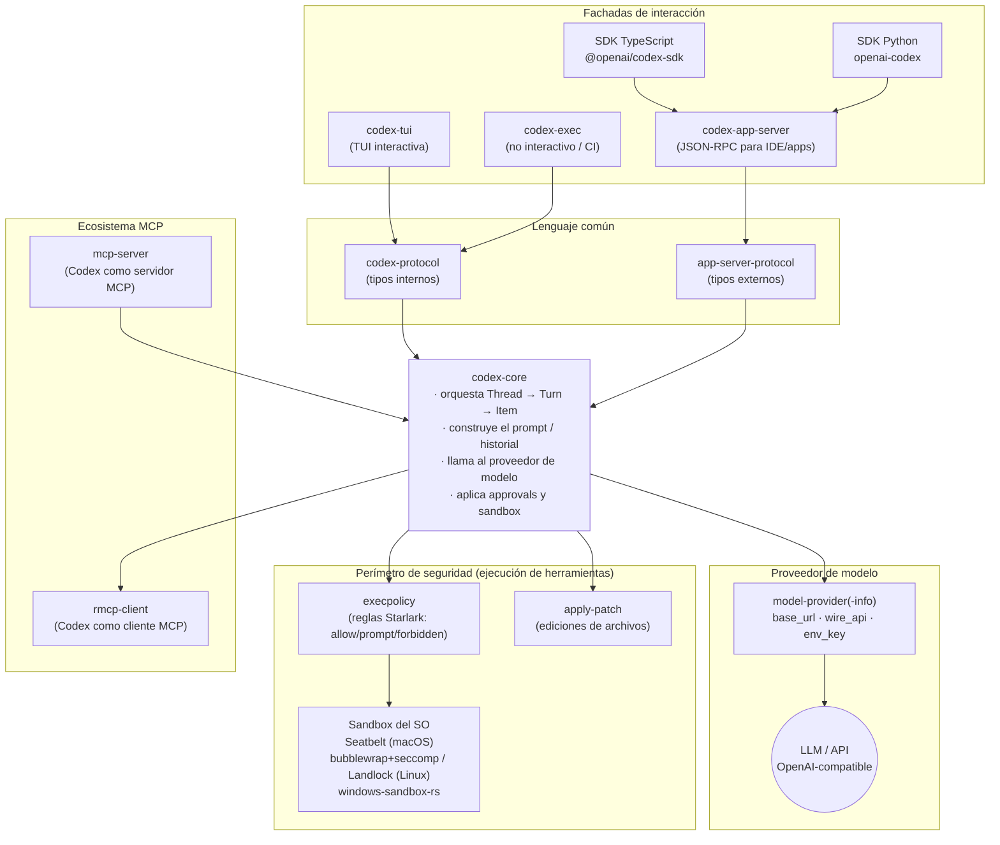
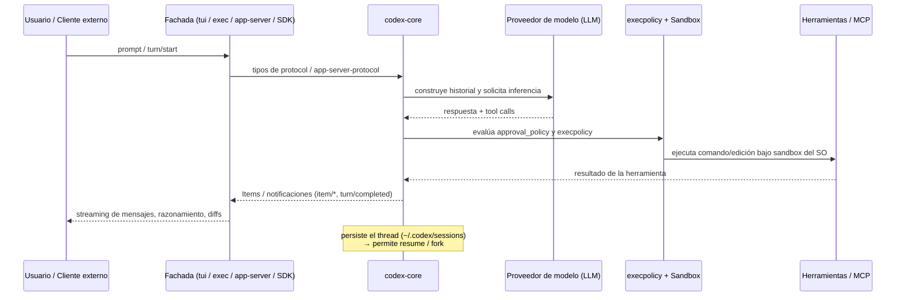

# Arquitectura del proyecto — OpenAI Codex CLI

> Documento explicativo del proyecto **completo**: qué es, para qué sirve, cómo está
> organizado, cuáles son sus componentes y cómo se relacionan entre sí.
>
> **Cómo se construyó este documento.** Se combinaron tres fuentes:
> 1. El **grafo de conocimiento** generado con graphify sobre todo el repositorio
>    (104.356 nodos · 244.197 aristas · 4.235 comunidades) — ver `graphify-out/GRAPH_REPORT.md`.
> 2. Una **investigación de fuentes primarias** (repo oficial `openai/codex`, READMEs de crates,
>    `config.schema.json`, SDKs y docs oficiales) — ver `graphify-out/research-codex.md`, donde
>    cada afirmación cita su fuente `[n]`.
> 3. Lectura directa de los archivos guía del repo (`README.md`, `AGENTS.md`, `Cargo.toml`).

---

## 1. Resumen ejecutivo

**Codex CLI** es un *coding agent* de OpenAI que corre **localmente** en la terminal del
desarrollador [1]. Inspecciona el código, hace cambios, ejecuta comandos y automatiza trabajo
repetible sin salir de la terminal [3]. El usuario mantiene el control: elige el modelo, el
esfuerzo de razonamiento, los permisos y qué comandos se aprueban.

Es **una de varias superficies** del producto Codex — CLI local (este repo), integración en IDE
(VS Code, Cursor, Windsurf), app de escritorio (`codex app`) y el agente en la nube Codex Web
(`chatgpt.com/codex`) [1]. El proyecto es open source bajo licencia **Apache-2.0** [1].

El corazón técnico está escrito en **Rust**, en un workspace Cargo llamado `codex-rs/` con
aproximadamente **90 crates**. Alrededor de ese núcleo hay SDKs (TypeScript y Python), un CLI de
distribución en npm (`codex-cli/`), documentación (`docs/`), scripts y configuración de build
con Bazel.

---

## 2. Función del proyecto

El propósito central es **conducir un modelo de lenguaje para que trabaje sobre un repositorio
real, de forma segura y controlada** [1][3]:

- **Opera sobre el repo local**: lee archivos, propone y aplica ediciones (mediante parches),
  y ejecuta las herramientas ya instaladas en la máquina.
- **Da control al usuario**: modelo, reasoning effort, políticas de permisos y aprobación por
  tarea.
- **Es scriptable**: se usa de forma interactiva (`codex`) o no interactiva (`codex exec`) para
  pipelines y CI/CD [3].
- **Es extensible e integrable**: se conecta a herramientas externas vía **MCP** y puede ser
  conducido por clientes externos (IDE, apps, SDKs) a través de un protocolo **JSON-RPC**.

---

## 3. Visión general de la arquitectura

Codex se organiza en **capas**: fachadas de interacción arriba, un motor central en el medio, y
un perímetro de seguridad + integración con el ecosistema abajo. El lenguaje común entre capas
son los **tipos de protocolo**.



Idea en una frase: **`core` es el cerebro; `tui`/`exec`/`app-server`/SDKs son las fachadas;
`protocol` y `app-server-protocol` son el lenguaje común; el sandbox + `execpolicy` son el
perímetro de seguridad; y MCP (`rmcp-client` + `mcp-server`) es el puente hacia y desde otras
herramientas** [4][5][6][7][8][9][13].

---

## 4. Componentes principales

El workspace `codex-rs/` tiene ~90 crates (los nombres de crate llevan el prefijo `codex-`; por
ejemplo, la carpeta `core/` es el crate `codex-core`) [AGENTS.md]. Se agrupan por rol:

### 4.1 El motor central

| Crate | Rol |
|-------|-----|
| **`core` (codex-core)** | Implementa la **lógica de negocio** de Codex; está pensado para ser usado por las distintas UIs escritas en Rust [4]. Resuelve la configuración, aplica el `SandboxPolicy`, ejecuta comandos/herramientas y habla con el proveedor de modelo. Es el crate más grande — tanto que `AGENTS.md` recomienda explícitamente **"resist adding code to codex-core"** y crear crates nuevos en su lugar. |
| **`core-api` / `core-plugins`** | API pública del core y su sistema de plugins (extensiones del comportamiento del motor). |
| **`context-fragments`** | Fragmentos de contexto que se inyectan al modelo; toda pieza de contexto debe ser un struct que implemente `ContextualUserFragment` y tener tamaño acotado [AGENTS.md]. |

### 4.2 Fachadas de interacción

| Crate | Rol |
|-------|-----|
| **`tui` (codex-tui)** | La **interfaz de terminal interactiva** (experiencia por defecto de `codex`), construida sobre `ratatui`. Se comunica con `core` mediante los tipos de `protocol` [5]. Módulos centrales: `chatwidget.rs` (orquestación) y `bottom_pane/chat_composer.rs` (el input del usuario). |
| **`exec` (codex-exec)** | Ejecución **no interactiva** (`codex exec`) para automatización/CI [3]. |
| **`cli` (codex-cli / codex)** | El **multitool CLI** que despacha subcomandos: `codex`, `codex exec`, `codex mcp`, `codex app-server`, `codex resume`, `codex sandbox`, `codex execpolicy`, etc. [3][7][8]. |
| **`app-server` (codex-app-server)** | La **interfaz que Codex usa para potenciar interfaces ricas** como la extensión de VS Code [6]. Expone un protocolo JSON-RPC 2.0 bidireccional (ver §7). Crates asociados: `app-server-client`, `app-server-daemon`, `app-server-transport`, `app-server-test-client`. |

### 4.3 El lenguaje común (protocolo)

| Crate | Rol |
|-------|-----|
| **`protocol` (codex-protocol)** | Define los **tipos** del protocolo, tanto internos (entre `codex-core` y `codex-tui`) como externos (para `codex app-server`). Debe tener dependencias mínimas y **evitar lógica de negocio** [5]. |
| **`app-server-protocol`** | Esquema del protocolo del app-server; se puede volcar como **TypeScript** (`codex app-server generate-ts`) o **JSON Schema**, garantizado que coincide con la versión de Codex [6]. |

### 4.4 Proveedor de modelo

| Crate | Rol |
|-------|-----|
| **`model-provider-info` / `model-provider`** | Definición serializable de proveedores de modelo: `base_url`, `env_key` (API key), `wire_api` (por defecto `responses`), cabeceras, reintentos, etc. Permite apuntar a **APIs compatibles con OpenAI** de terceros [9]. |
| **`models-manager`** | Gestión de los modelos disponibles. |
| **`chatgpt`** | Integración con la autenticación/servicios de ChatGPT [research]. |

### 4.5 Perímetro de seguridad

| Crate | Rol |
|-------|-----|
| **`execpolicy` (codex-execpolicy)** | Motor y CLI de **políticas de ejecución** basado en reglas de prefijo en sintaxis **Starlark** (`prefix_rule(...)`, `host_executable(...)`), con decisiones `allow | prompt | forbidden`; la decisión efectiva es la **más estricta** de las reglas que hacen match [8]. |
| **`linux-sandbox` (codex-linux-sandbox)** | Produce el ejecutable `codex-linux-sandbox` y la lógica de sandbox de Linux (**bubblewrap** por defecto, con **Landlock/seccomp** legacy) [7]. |
| **`windows-sandbox-rs`** | Soporte de sandbox en Windows (backend elevado y token restringido no elevado) [4]. |
| **`sandboxing`** | Abstracciones comunes de sandbox por SO. |
| **`apply-patch`** | Aplicación de **parches** (el mecanismo con que Codex edita archivos de forma controlada). |
| **`execpolicy` + `shell-command` / `shell-escalation`** | Ejecución y escalado de comandos de shell. |

### 4.6 Ecosistema MCP e integraciones

| Crate | Rol |
|-------|-----|
| **`mcp-server` (codex-mcp-server)** | Hace que Codex funcione **como servidor MCP** (`codex mcp`), registrando las herramientas **`codex`** y **`codex-reply`** [13]. |
| **`rmcp-client` / `mcp-client` / `codex-mcp`** | **Cliente MCP** que Codex usa para conectarse a servidores MCP externos, incluyendo login OAuth [9][13]. |
| **`connectors` / `hooks` / `skills`** | Conectores externos, hooks de ciclo de vida y skills (capacidades) del agente. |

### 4.7 Estado, sesiones y soporte

| Crate | Rol |
|-------|-----|
| **`rollout` / `rollout-trace` / `thread-store` / `thread-manager-sample` / `message-history` / `state`** | Persistencia de threads/sesiones e historial (permiten `resume` y `fork` de conversaciones) [6][11]. |
| **`config` / `cloud-config` / `codex-home`** | Carga y resolución de configuración (`config.toml` en `CODEX_HOME`, por defecto `~/.codex`). |
| **`login` / `aws-auth` / `keyring-store` / `secrets` / `workload-identity`** | Autenticación y manejo de credenciales. |
| **`file-search` / `file-system` / `file-watcher` / `git-utils`** | Utilidades de archivos y Git. |
| **`arg0`** | Permite que **el mismo binario** se comporte como `codex-linux-sandbox` o simule el CLI virtual `apply_patch` según `arg0`/`arg1` [4][7]. |
| **`otel` / `analytics` / `diagnostics` / `feedback`** | Observabilidad, analítica y telemetría. |
| **`http-client` / `websocket-client` / `network-proxy` / `responses-api-proxy` / `backend-client`** | Capa de red y proxies. |
| **`code-mode(-host/-protocol/-runtime)` / `cloud-tasks(-client/-mock-client)`** | Modo de ejecución de código y tareas en la nube. |

> Además del núcleo Rust, el repo incluye: **`sdk/`** (SDKs TypeScript y Python), **`codex-cli/`**
> (empaquetado npm), **`docs/`** (documentación), **`scripts/`**, **`bazel/`** (build) y
> **`third_party/`**.

---

## 5. Modelo de seguridad: sandbox + aprobaciones

Codex separa **dos ejes ortogonales**: *qué puede tocar* el agente (sandbox) y *cuándo pregunta*
antes de actuar (approval policy) [research §3].

### Modos de sandbox (`sandbox_mode`)

| Valor | Significado |
|-------|-------------|
| **`read-only`** | El agente puede inspeccionar archivos, pero no editar ni ejecutar comandos sin aprobación [10]. |
| **`workspace-write`** *(por defecto)* | Puede leer, **editar dentro del workspace** y ejecutar comandos locales rutinarios dentro de ese límite [10]. Se afina con `[sandbox_workspace_write]` (`writable_roots`, `network_access`, `exclude_slash_tmp`, `exclude_tmpdir_env_var`) [9]. Mantiene `.git` y `.codex` como solo lectura aun escribiendo en las raíces permitidas [4]. |
| **`danger-full-access`** | Sin restricciones de sandbox: elimina los límites de filesystem y red [10]. |

### Políticas de aprobación (`approval_policy` / `AskForApproval`)

| Valor | Significado |
|-------|-------------|
| **`untrusted`** | Solo comandos "known safe" que **solo leen** archivos se auto-aprueban; el resto pide aprobación [9]. |
| **`on-request`** | El modelo decide cuándo pedir aprobación; trabaja dentro del sandbox y pregunta al salir del límite [9][10]. |
| **granular** (`{ granular = ... }`) | Controles finos por categoría: `true` permite, `false` rechaza automáticamente sin mostrarlo [9]. |
| **`never`** | Nunca pide aprobación; los fallos vuelven al modelo sin escalar al usuario [9]. |

### Aplicación a nivel de SO

- **macOS** → framework **Seatbelt** vía `/usr/bin/sandbox-exec`; consume el `SandboxPolicy`
  resuelto (red y raíces de lectura/escritura) [4][10].
- **Linux** → **bubblewrap (`bwrap`)** por defecto: `PR_SET_NO_NEW_PRIVS`, filtro **seccomp** de
  red, todo como `--ro-bind / /`, raíces de escritura con `--bind`, subrutas protegidas
  (`.git`, `.codex`) reaplicadas como solo lectura, y aislamiento de namespaces
  (`--unshare-user/-pid/-net`). El path **Landlock + mount** legacy queda como fallback explícito
  (`features.use_legacy_landlock = true`). WSL2 usa bubblewrap; WSL1 no está soportado [7].
- **Windows** → `windows-sandbox-rs` (backend elevado y token restringido no elevado) [4].

El motor **`execpolicy`** complementa lo anterior decidiendo `allow`/`prompt`/`forbidden` por
comando según reglas de prefijo Starlark, tomando la severidad más estricta [8].

> ⚠️ `AGENTS.md` marca como intocables las variables de entorno `CODEX_SANDBOX_NETWORK_DISABLED_ENV_VAR`
> y `CODEX_SANDBOX_ENV_VAR`: son la base sobre la que se escribió mucho código y muchos tests.

---

## 6. Integración con MCP (Model Context Protocol)

Codex participa en MCP en **ambos roles** [research §4]:

- **Como cliente MCP** → se conecta a servidores externos declarados en `config.toml` bajo
  `mcp_servers` (crate `rmcp-client`, incluye login OAuth). Soporta transporte **stdio**
  (`command`/`args`/`env`/`cwd`) y **HTTP streamable** (`url`, headers, `bearer_token_env_var`,
  `oauth`) [9][13]. El app-server permite gestionarlos en caliente (`mcpServer/tool/call`,
  `config/mcpServer/reload`, etc.) [6].
- **Como servidor MCP** → `codex mcp` arranca el crate `mcp-server`, que registra las herramientas
  **`codex`** (iniciar sesión) y **`codex-reply`** (continuar con un `thread_id`) [13].

---

## 7. SDKs y el protocolo JSON-RPC del app-server

### Protocolo del app-server

Es la vía de bajo nivel con la que clientes externos "manejan" Codex [6]:

- **JSON-RPC 2.0 bidireccional**.
- **Transportes**: `stdio` (JSONL, por defecto), `unix://`, `ws://` (experimental) y `off`.
- **Primitivas**: **Thread** (conversación) → **Turn** (turno) → **Item** (mensajes, razonamiento,
  comando shell, edición de archivo, etc.).
- **Ciclo de vida**: `initialize` + `initialized` → `thread/start` (o `thread/resume` / `thread/fork`)
  → `turn/start` → streaming (`item/started`, `item/completed`, `item/agentMessage/delta`, …) →
  `turn/completed`; `turn/interrupt` cancela un turno en vuelo. En `turn/start` se pueden
  sobreescribir `model`, `cwd`, `sandbox`/`permissions`, `approvalPolicy`.

### SDK de TypeScript — `@openai/codex-sdk`

Envuelve la CLI `codex`: **lanza el binario e intercambia eventos JSONL por stdin/stdout**
(Node.js 18+) [11].

```typescript
import { Codex } from "@openai/codex-sdk";
const codex = new Codex();
const thread = codex.startThread();
const turn = await thread.run("Diagnose the test failure and propose a fix");
console.log(turn.finalResponse, turn.items);
```

Incluye `runStreamed()`, salida estructurada con `outputSchema`, imágenes (`local_image`),
`resumeThread(id)` y overrides de `--config` [11].

### SDK de Python — `openai-codex`

```python
from openai_codex import Codex
with Codex() as codex:
    thread = codex.thread_start()
    result = thread.run("Explain this repository in three bullets.")
    print(result.final_response)
```

`thread.run(...)` devuelve un `TurnResult` (`final_response`, items, uso de tokens); reutiliza la
autenticación existente de Codex [12].

---

## 8. Configuración

La configuración vive en `config.toml` dentro de `CODEX_HOME` (por defecto `~/.codex`). El repo
publica un `config.schema.json` **autoritativo** [9][14]:

- **Modelo**: `model`, `model_provider`, `model_reasoning_effort`.
- **Seguridad**: `approval_policy`, `sandbox_mode`, `[sandbox_workspace_write]`.
- **Proveedores de modelo** (`model_providers.<id>`): `base_url`, `env_key`, `wire_api`, headers,
  reintentos → permite APIs compatibles con OpenAI de terceros.
- **Servidores MCP** (`mcp_servers.<id>`): stdio o HTTP.
- **Perfiles** (`profiles.<name>`): agrupan overrides con nombre, seleccionables con `--profile`.
- **Confianza de proyecto** (`trust_level`) y hooks; a nivel administrado, `requirements.toml`.

Se resuelve por capas (**managed → user → project → session**) y puede leerse/escribirse en
caliente vía app-server (`config/read`, `config/value/write`, `config/batchWrite`) [6]. Si se
cambia `ConfigToml`, hay que correr `just write-config-schema` para actualizar el schema [AGENTS.md].

---

## 9. Cómo se relacionan los componentes (flujo de datos/control)



1. **Entrada** por una fachada: TUI (`codex`), no interactivo (`codex exec`), clientes JSON-RPC
   contra `app-server`, o los SDKs [3][6][11][12].
2. **Tipos de protocolo**: `protocol` (interno) y `app-server-protocol` (externo) [5][6].
3. **Motor `core`**: orquesta Thread → Turn → Item, construye el prompt, llama al **proveedor de
   modelo**, y ante tool calls aplica **approvals + execpolicy** y ejecuta bajo **sandbox** [4][7][8][9].
4. **Herramientas y MCP**: shell y edición vía `apply-patch`; servidores MCP externos vía
   `rmcp-client`; y Codex expuesto como servidor MCP (`codex mcp`) [9][13].
5. **Streaming de vuelta**: resultados como Items/notificaciones hacia la fachada, con persistencia
   del thread para `resume`/`fork` [6][11].

---

## 10. Lo que revela el grafo sobre el proyecto

El análisis con graphify (grafo no dirigido, 104.356 nodos) aporta observaciones que no saltan a
la vista leyendo un README:

### God Nodes (los nodos más conectados = abstracciones núcleo)

| # | Nodo | Aristas | Qué es |
|---|------|--------:|--------|
| 1 | `make_chatwidget_manual()` | 760 | Helper de test del TUI |
| 2 | `BaseModel` | 672 | Tipo base (schemas/SDK) |
| 3 | `start_mock_server()` | 590 | Helper de test (servidor mock) |
| 4 | `mount_sse_once()` | 313 | Helper de test (streaming SSE) |
| 5 | `make_session_and_context()` | 291 | Helper de test |
| 6 | `ChatComposer` | 229 | Input del usuario en el TUI (`tui/src/bottom_pane/chat_composer.rs`) |

**Hallazgo clave:** los nodos más conectados del proyecto entero son **helpers de testing**
(`make_chatwidget_manual`, `start_mock_server`, `mount_sse_*`). Esto confirma lo que `AGENTS.md`
predica: el codebase se apoya **masivamente en infraestructura de pruebas de integración**
(`core/suite`, `test_codex`, `mount_sse*`, `ResponseMock`). No es un detalle menor: la testabilidad
es un principio de diseño de primera clase en Codex.

### Estructura de comunidades (las 4.235 comunidades mapean a subsistemas reales)

| Comunidad | Tamaño | Subsistema |
|-----------|-------:|-----------|
| 0 | 678 | Esquema del protocolo del app-server (tipos generados) |
| 1 | 332 | Ejemplos de Turn & Thread del SDK |
| 2 / 3 / 5 / 7 | ~300 c/u | Suites de test (config, session, client, compaction) |
| 4 / 16 | ~280 / 173 | Schemas TypeScript V2 (responses / params) |
| 6 | 244 | Módulo de configuración del core |
| 9 / 14 / 17 | ~200 c/u | TUI (chat widget / composer / internals) |
| 10 | 218 | Gestor de plugins del core |
| 11 | 212 | Cliente Codex (SDK) |
| 12 | 209 | MCP tool call |
| 15 | 178 | Runtime del network proxy |

### Conexiones sorprendentes (semejanza semántica cross-file)

- Varios *code-review skills* (`.codex/skills/code-review-*`) resultan **semánticamente similares**
  a `AGENTS.md`: el contributor guide y las skills de revisión codifican las mismas reglas por
  caminos distintos.
- `Sandbox Presets (Python SDK)` ↔ `Sandbox & Approvals` (docs): el SDK y la documentación
  describen el **mismo modelo de permisos** desde dos superficies distintas — coherente con el
  diseño de "dos ejes ortogonales" de la §5.

---

## 11. Mapa mental del repositorio (nivel superior)

```
codex/
├── codex-rs/          # Núcleo en Rust (~90 crates)
│   ├── core/          # Motor (lógica de negocio)
│   ├── tui/           # Interfaz de terminal interactiva
│   ├── exec/          # Modo no interactivo (CI)
│   ├── cli/           # Multitool CLI (despacha subcomandos)
│   ├── app-server*/   # Protocolo JSON-RPC para IDE/apps
│   ├── protocol/      # Tipos internos (core ↔ tui)
│   ├── app-server-protocol/  # Tipos externos (→ TS / JSON Schema)
│   ├── model-provider*/      # Proveedores de modelo
│   ├── execpolicy/    # Políticas de ejecución (Starlark)
│   ├── linux-sandbox/ · windows-sandbox-rs/ · sandboxing/  # Sandbox por SO
│   ├── apply-patch/   # Edición de archivos por parches
│   ├── mcp-server/ · rmcp-client/  # MCP (servidor / cliente)
│   ├── rollout/ · thread-store/ · state/  # Persistencia de sesiones
│   └── config/ · login/ · otel/ · ...      # Soporte transversal
├── sdk/               # SDKs TypeScript y Python
├── codex-cli/         # Empaquetado npm (@openai/codex)
├── docs/              # Documentación
├── bazel/             # Build (Bazel)
├── scripts/ · tools/ · third_party/
└── graphify-out/      # Grafo de conocimiento + este análisis
```

---

## 12. Fuentes

Las citas `[n]` remiten a la investigación de fuentes primarias en
[`graphify-out/research-codex.md`](graphify-out/research-codex.md), que incluye las URLs completas.
Resumen:

1. `README.md` del repo — 2. `codex-rs/README.md` — 3. Docs oficiales (Codex CLI) —
4. `codex-rs/core/README.md` — 5. `codex-rs/protocol/README.md` — 6. `codex-rs/app-server/README.md` —
7. `codex-rs/linux-sandbox/README.md` — 8. `codex-rs/execpolicy/README.md` —
9. `codex-rs/core/config.schema.json` — 10. Docs oficiales (Sandboxing) — 11. `sdk/typescript/README.md` —
12. `sdk/python/README.md` — 13. `codex-rs/mcp-server` — 14. Docs oficiales (Config reference).

Adicionalmente:
- Grafo de conocimiento: [`graphify-out/GRAPH_REPORT.md`](graphify-out/GRAPH_REPORT.md) y
  `graphify-out/graph.html` (visualización interactiva).
- Guía de contribución del repo: `AGENTS.md`.
