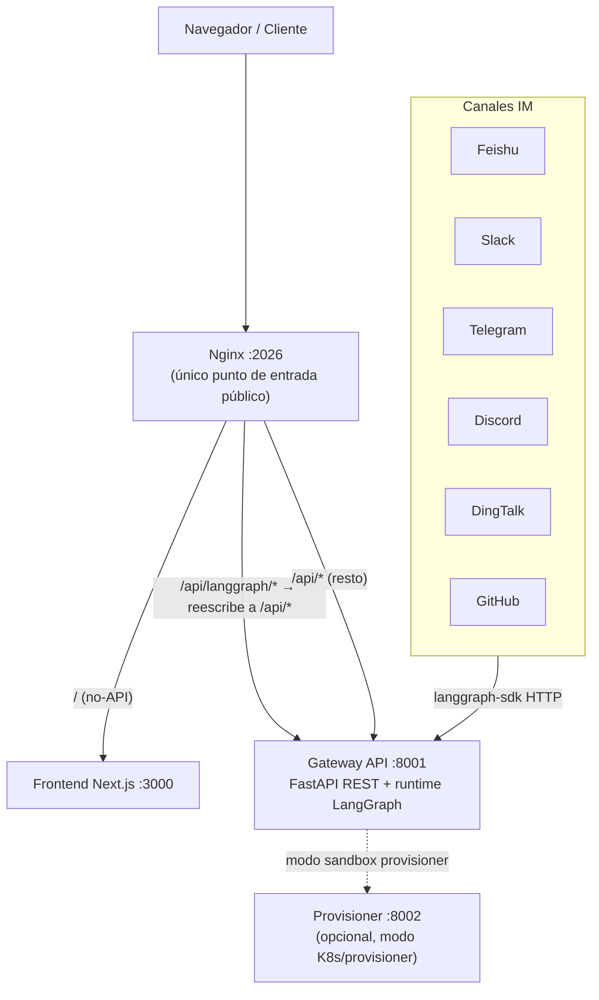
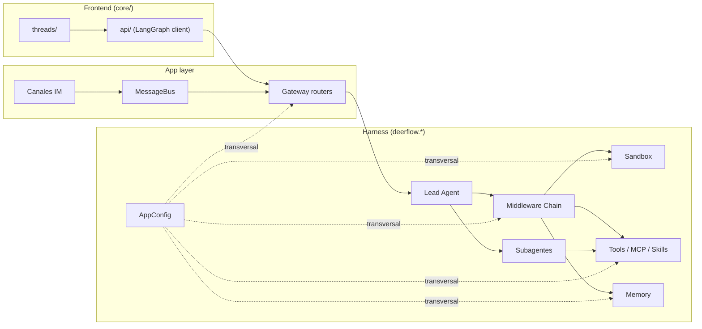

# Arquitectura de DeerFlow

> Documento generado a partir del grafo de conocimiento (`graphify-out/`) y las guías
> autoritativas del repositorio (`AGENTS.md` raíz, `backend/AGENTS.md`, `frontend/AGENTS.md`).
> Explica la función del proyecto, sus componentes y cómo se relacionan entre sí.

---

## 1. Qué es DeerFlow y para qué sirve

DeerFlow es un sistema de **súper-agente** basado en LangGraph, con arquitectura full-stack.
La idea central: un agente "líder" (lead agent) capaz de razonar durante horizontes largos,
que ejecuta código en un entorno aislado (sandbox), recuerda entre sesiones (memory),
delega trabajo en subagentes, y se extiende con herramientas (built-in, MCP y de comunidad).
Todo esto **aislado por hilo de conversación** (per-thread isolation).

El sistema se usa de tres formas:

- **Interfaz web** (Next.js) — el chat con streaming, artefactos y skills.
- **Plataformas de mensajería** (Feishu, Slack, Telegram, Discord, DingTalk, GitHub) que
  se puentean al mismo agente a través del Gateway.
- **Cliente embebido** (`DeerFlowClient`) — acceso directo en proceso, sin HTTP, usado por
  la TUI y por integraciones.

La distinción conceptual más importante es **Harness vs. App**:

- **Harness** (`deerflow.*`): el framework de agentes publicable. Contiene orquestación,
  herramientas, sandbox, modelos, MCP, skills, memoria y configuración.
- **App** (`app.*`): la aplicación no publicable. Contiene el Gateway FastAPI y los canales IM.

Regla de dependencia estricta, verificada en CI (`tests/test_harness_boundary.py`):
**App importa Harness, pero Harness nunca importa App.**

---

## 2. Topología de servicios

Un solo `make dev` (o el stack de Docker) levanta cuatro servicios cooperantes:



| Servicio        | Puerto | Rol                                                                     |
| --------------- | ------ | ---------------------------------------------------------------------- |
| **Nginx**       | `2026` | Reverse-proxy unificado — el único punto de entrada público            |
| **Gateway API** | `8001` | API REST FastAPI + runtime de agentes compatible con LangGraph         |
| **Frontend**    | `3000` | Interfaz web Next.js                                                    |
| **Provisioner** | `8002` | Opcional — solo cuando el sandbox usa modo provisioner/Kubernetes      |

Nginx es la única superficie externa: sirve el frontend, proxea `/api/langgraph/*` al runtime
LangGraph del Gateway (reescribiéndolo a las rutas nativas `/api/*`), y el resto de `/api/*`
va directo a los routers REST. Por defecto se publica solo en loopback (`127.0.0.1:2026`).

---

## 3. Mapa del repositorio (monorepo)

```
deer-flow/
├── backend/                        # Python — ver backend/AGENTS.md
│   ├── packages/extension-api/     # Contrato público de extensiones (deerflow_extension_api.*)
│   ├── packages/harness/           # Framework de agentes (import: deerflow.*)
│   └── app/                        # Gateway FastAPI + canales IM (import: app.*)
├── frontend/                       # Next.js (pnpm) — ver frontend/AGENTS.md
├── docker/                         # docker-compose, nginx, provisioner
├── skills/                         # Skills del agente: public/ (versionado), custom/ (gitignored)
├── contracts/                      # Contratos JSON entre componentes
├── scripts/                        # Orquestación invocada por el Makefile
└── docs/                           # Documentación transversal
```

La configuración vive en la **raíz del repo**: `config.yaml` (config principal) y
`extensions_config.json` (servidores MCP + skills). Ambos son gitignored y editables en runtime
vía la API del Gateway.

---

## 4. Componentes del backend

### 4.1 Sistema de agentes (`deerflow/agents/`)

- **Lead Agent** (`agents/lead_agent/agent.py`): punto de entrada `make_lead_agent(config)`,
  registrado en `langgraph.json`. Selecciona el modelo dinámicamente, arma su toolset con
  `get_available_tools()` (sandbox + built-in + MCP + comunidad + subagentes) y genera el
  system prompt con skills, memoria e instrucciones de subagentes.
- **ThreadState** (`agents/thread_state.py`): el estado del hilo. Extiende `AgentState` con
  `sandbox`, `thread_data`, `title`, `artifacts`, `todos`, `uploaded_files`, `goal`,
  `delegations`, `skill_context`, `summary_text`, etc. Usa *reducers* personalizados para
  fusionar cada canal de forma segura.

### 4.2 Cadena de middlewares — el corazón del comportamiento

El comportamiento del agente NO está en una función monolítica: es una **cadena de ~35
middlewares** ensamblados en orden estricto. Cada uno envuelve la llamada al modelo o a las
herramientas. Algunos son opcionales (se agregan solo si su condición de config/runtime se cumple).

Grupos principales (orden real, de más externo a más interno):

1. **Base compartida** (lead + subagentes): saneamiento de entrada, presupuesto de salida de
   herramientas, saneamiento de resultados remotos, directorios por hilo, uploads, adquisición
   de sandbox, manejo de tool-calls colgantes, normalización de errores de LLM,
   **autorización/guardrails**, auditoría de sandbox, gate read-before-write, progreso de
   herramientas y manejo de errores de herramientas.
2. **Solo lead**: contexto dinámico (fecha/memoria), activación de skills, política de tools de
   skills, contexto durable, summarization, todo-list (plan mode), uso de tokens, título,
   memoria, visión, routing MCP, filtro de tools diferidas, coalescing de mensajes de sistema,
   límite de subagentes, detección de loops, presupuesto de tokens.
3. **Cola terminal**: middlewares custom/extensiones, respuesta terminal, finish-reason por
   longitud/seguridad, y **clarificación** (interrumpe el grafo para pedir input humano — siempre
   al final).

> La lista exacta y el porqué de cada uno está en `backend/AGENTS.md → Middleware Chain`.

### 4.3 Sandbox (`deerflow/sandbox/`)

Interfaz abstracta `Sandbox` (`execute_command`, `read_file`, `write_file`, `list_dir`,
`glob`, `grep`). Varias implementaciones intercambiables por config:

- `LocalSandboxProvider` — ejecución en filesystem local, por hilo.
- `AioSandboxProvider` — aislamiento Docker (con store de ownership entre instancias).
- `E2BSandboxProvider`, `BoxliteProvider`, `TenkiSandboxProvider` — microVMs / aislamiento remoto.

**Sistema de rutas virtuales**: el agente ve `/mnt/user-data/{workspace,uploads,outputs}` y
`/mnt/skills`; el provider traduce a rutas físicas reales por usuario y por hilo. Los providers
de comunidad que mantienen sandboxes "tibios" comparten `WarmPoolLifecycleMixin`.

### 4.4 Subagentes (`deerflow/subagents/`)

Delegación de trabajo. Agentes built-in: `general-purpose` y `bash`. El flujo:
`task()` → `SubagentExecutor` → hilo de fondo → polling cada 5s → eventos SSE → resultado.
Política de enrutamiento **por beneficio**: delegar solo cuando el beneficio (latencia paralela,
capacidad especialista, aislamiento de contexto) supera claramente el costo. Hay tres ejes que
pueden cortar un subagente temprano (turnos, tokens, loops), todos surfaceados con `stop_reason`.

### 4.5 Herramientas, MCP y Skills

- **Tools** (`deerflow/tools/`): `get_available_tools()` ensambla tools de config, MCP, built-in
  (`present_files`, `ask_clarification`, `view_image`, `task`, etc.) y de comunidad
  (búsqueda web, fetch, browser automation, etc.).
- **MCP** (`deerflow/mcp/`): integración con servidores MCP vía `MultiServerMCPClient`.
  Inicialización lazy, caché con invalidación por firma de contenido, tareas de larga duración
  con runtime durable separado.
- **Skills** (`deerflow/skills/`): paquetes de capacidad (`SKILL.md` con frontmatter). Descubrimiento,
  carga, activación por `/skill-name`, política de tools, proyección al sandbox, y **SkillScan**
  (escáner determinístico de seguridad para archivos `.skill`).

### 4.6 Memoria (`deerflow/agents/memory/`)

Memoria persistente **por usuario**. Extracción por LLM con deduplicación de hechos, colas
debounced, almacenamiento en Markdown (backend DeerMem por defecto), recuperación FTS5/BM25,
y pases de *staleness* y *consolidación* que corren en la misma invocación de LLM que la
actualización normal. Dos modos: `middleware` (pasivo, por defecto) y `tool` (el modelo decide
cuándo buscar/agregar/actualizar). Backend remoto opcional: `openviking`.

### 4.7 Canales IM (`app/channels/`)

Puentean plataformas externas al agente vía el cliente HTTP `langgraph-sdk` (igual que el frontend).
Componentes: `message_bus.py` (pub/sub async), `store.py` (mapeo chat→thread), `manager.py`
(dispatcher central), y una implementación por plataforma. GitHub es event-driven vía webhooks.

### 4.8 Persistencia y migraciones (`deerflow/persistence/`)

Tablas de aplicación (`runs`, `threads_meta`, `feedback`, `users`, `run_events`, `channel_*`)
gestionadas por Alembic con estrategia de *bootstrap híbrido*. Las tablas del checkpointer de
LangGraph viven en la misma base pero son de LangGraph (excluidas de la vista de Alembic). El
Gateway corre `alembic upgrade head` en el arranque.

### 4.9 Sistema de configuración (`deerflow/config/`)

`config.yaml` con versionado, caché con recarga automática por firma de contenido, y una frontera
clara entre campos *hot-reloadable* (por request) y *restart-required* (infraestructura). Los
valores que empiezan con `$` se resuelven como variables de entorno.

---

## 5. Componentes del frontend

Stack: **Next.js 16, React 19, TypeScript 5.8, Tailwind CSS 4, pnpm**. Se comunica con el backend
LangGraph vía el SDK, con conversaciones por hilo y respuestas en streaming.

Capas de `src/`:

- **`app/`** — Next.js App Router (landing, showcase público, workspace/chats, agents, blog, auth, docs).
- **`components/`** — `ui/` (Shadcn, autogenerado), `ai-elements/` (Vercel AI SDK, autogenerado),
  `workspace/` (chat, artefactos, settings), `landing/`, `docs/`.
- **`core/`** — **la lógica de negocio, el corazón**: `threads/` (creación, streaming, estado),
  `api/` (cliente LangGraph singleton), `agents/`, `auth/`, `artifacts/`, `channels/`,
  `integrations/`, `i18n/`, `memory/`, `skills/`, `messages/`, `mcp/`, `models/`, y más.

**Flujo de datos** (resumido): el borrador del usuario → hooks de thread (`core/threads/hooks.ts`)
→ streaming del SDK LangGraph → eventos de stream actualizan el estado del hilo (mensajes,
artefactos, todos, goal) → TanStack Query maneja el estado del servidor → los componentes se
suscriben y renderizan.

---

## 6. Cómo se relacionan los componentes (evidencia del grafo)

El grafo de conocimiento (34.681 nodos, 80.410 aristas, 1.184 comunidades) confirma
cuantitativamente cuáles son los ejes de acoplamiento del sistema. Los **God Nodes** (nodos más
conectados) revelan las abstracciones por las que pasa todo:

| God Node          | Aristas | Qué revela                                                                 |
| ----------------- | ------- | -------------------------------------------------------------------------- |
| `HumanMessage`    | 642     | El mensaje del usuario es el eje: entra al agente, se reescribe en middlewares (contexto dinámico, durable), y atraviesa toda la cadena. |
| `AppConfig`       | 493     | La configuración es transversal: conecta config del harness con tests de auth, memoria, canales, routers del gateway, integraciones y sandbox. |
| `cn()`            | 423     | El helper de className de Tailwind — eje del frontend (toda la UI lo usa). |
| `ValueError`      | 291     | Manejo de errores omnipresente en el backend.                              |
| `MessageBus`      | 217     | El pub/sub que une **todos** los canales IM con el agente.                 |
| `SandboxConfig`   | 217     | La config de sandbox toca cada provider y cada path de ejecución.          |
| `BaseModel`       | 216     | Pydantic como columna vertebral de los esquemas.                           |
| `Skill`           | 216     | El sistema de skills, otro eje transversal.                                |

Lectura clave: `HumanMessage`, `AppConfig`, `MessageBus` y `SandboxConfig` son **puentes entre
comunidades** con alta betweenness. Tocar uno de estos tiene un radio de impacto enorme —
son los puntos donde más cuidado hay que tener al modificar.

### Relaciones estructurales principales



- **Frontend y Canales IM** son dos clientes del **mismo** runtime: ambos hablan con el Gateway
  vía el SDK LangGraph. El frontend por HTTP directo; los canales a través del `MessageBus`.
- **El Gateway** traduce requests en runs de LangGraph que ejecutan al **Lead Agent**.
- **El Lead Agent** delega su comportamiento a la **cadena de middlewares**, que a su vez usa
  **sandbox**, **tools**, **memory** y (si conviene) **subagentes**.
- **`AppConfig`** es el hilo que cose todo el sistema: cada capa lo lee para decidir su comportamiento.

---

## 7. Comandos rápidos

```bash
# Stack completo (desde la raíz)
make dev            # Gateway + Frontend + Nginx con hot-reload → http://localhost:2026
make stop

# Backend (dentro de backend/)
cd backend && make dev      # Gateway API con reload (:8001)
cd backend && make test     # Suite de tests
cd backend && make lint     # ruff check

# Frontend (dentro de frontend/)
cd frontend && pnpm dev     # Dev server con Turbopack (:3000)
cd frontend && pnpm check   # Lint + type check (antes de commitear)
```

---

## 8. Dónde seguir

- Backend en profundidad → [`backend/AGENTS.md`](backend/AGENTS.md)
- Frontend en profundidad → [`frontend/AGENTS.md`](frontend/AGENTS.md)
- Orientación del monorepo → [`AGENTS.md`](AGENTS.md)
- Grafo navegable → `graphify-out/graph.html` · reporte → `graphify-out/GRAPH_REPORT.md`
- Consultas al grafo → `graphify query "<pregunta>"`, `graphify path "<A>" "<B>"`, `graphify explain "<concepto>"`
