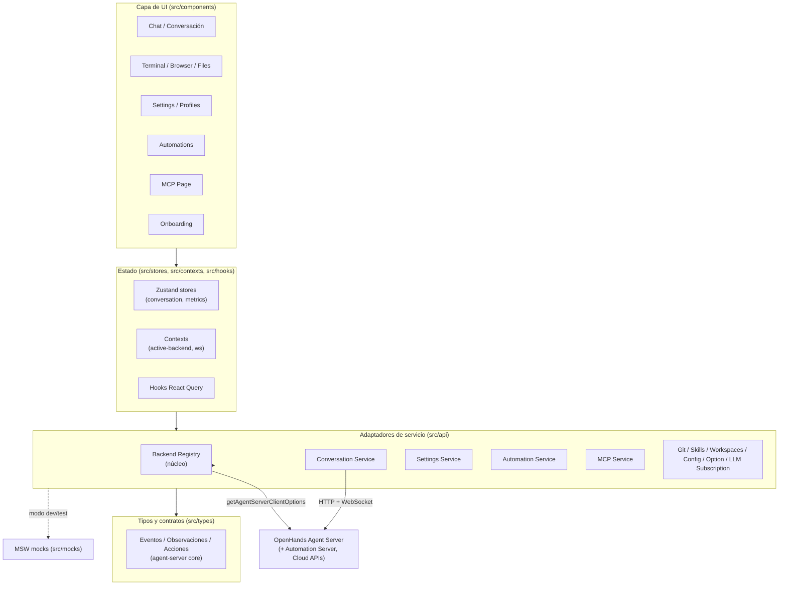

# Documentación del proyecto — OpenHands Agent Canvas

> Documento generado a partir del grafo de conocimiento de **graphify**
> (`graphify-out/graph.json`: 7.986 nodos · 23.265 aristas · 298 comunidades)
> y contrastado con las fuentes primarias del repositorio: `package.json` y `docs/architecture.md`.

---

## 1. Función del proyecto

**Agent Canvas** (`@openhands/agent-canvas`, v1.12.0) es el **frontend en React + TypeScript de OpenHands**: una interfaz visual para **ejecutar y monitorear agentes de IA de programación** contra el **OpenHands Agent Server**, en entornos locales, remotos u hospedados (cloud).

Descripción oficial del paquete:
> *"Agent Canvas UI for OpenHands - run AI coding agents with a visual interface"*

### Qué SÍ hace (responsabilidades)

- Renderiza la conversación del agente, la terminal, el browser, los archivos, la configuración y la UI de automatizaciones.
- Gestiona el estado del frontend: conversaciones, selección de backend, settings, perfiles y metadata local.
- Traduce las acciones de la UI en llamadas a la API del **OpenHands Agent Server**.
- Se empaqueta de dos formas: como **aplicación standalone** y como **librería** (entrypoints embebibles en apps host).

### Qué NO hace (fronteras del sistema)

- **No ejecuta** las acciones del agente por sí mismo (eso vive en el Agent Server).
- **No provee** el sandbox ni el aislamiento del workspace.
- **No hospeda** credenciales de proveedores LLM fuera del backend configurado.
- **No corre** automatizaciones programadas/por evento sin un backend de automatización.

En una frase: **Agent Canvas es la capa de presentación y orquestación de UI; el trabajo real lo hace el Agent Server.**

---

## 2. Stack tecnológico

| Área | Tecnología |
|---|---|
| UI / Framework | React 19, React Router 7 (framework mode), TypeScript 6 |
| Build / Dev | Vite 8, `@react-router/dev` |
| Estilos | TailwindCSS 4, `class-variance-authority`, `tailwind-merge`, HeroUI |
| Estado servidor | TanStack Query 5 (React Query) |
| Estado cliente | Zustand 5 + React Contexts |
| Comunicación | `@openhands/typescript-client`, Axios, socket.io-client (WebSocket) |
| Editor / Terminal | Monaco Editor, xterm.js |
| Internacionalización | i18next / react-i18next |
| Telemetría | PostHog (`posthog-js`) |
| Desktop | Electron 42 (+ electron-builder) |
| Testing | Vitest, Testing Library, Playwright (E2E), MSW (mocks), Stryker (mutación) |

---

## 3. Arquitectura general

Agent Canvas es una **arquitectura frontend por capas**, organizada por responsabilidad, donde el **registro de backends** actúa como núcleo transversal del que dependen casi todos los subsistemas.



### 3.1 Servicios de runtime (backends)

- **Backend primario:** OpenHands **Agent Server** (protocolo ACP — Agent Client Protocol). Agent Canvas puede conectarse a **varias instancias** y **cambiar entre ellas** desde la UI.
- **Servicios opcionales:**
  - **Ingress**: enruta tráfico de frontend, Agent Server y automatización detrás de un único origen local.
  - **Automation Server**: corridas de agente programadas o disparadas por evento.
  - **OpenHands Cloud APIs**: sandbox hospedado y flujos de organización.

Los launchers exponen la info de servicios vía `/server_info.runtime_services`, y el frontend la reenvía a las nuevas conversaciones como *agent context suffix* para que el agente use las URLs correctas.

### 3.2 Módulos del código fuente

| Carpeta | Responsabilidad |
|---|---|
| `src/api/` | Adaptadores de servicio: Agent Server, cloud, settings, git, skills, automations, backend registry, MCP, workspaces. |
| `src/components/` | UI de rutas y features: conversation, chat, browser, files, settings, backends, automation, onboarding, providers, sidebar, terminal. |
| `src/hooks/` | Hooks reutilizables de React Query, estado y features. |
| `src/stores/` | Stores Zustand para estado de conversación y UI. |
| `src/contexts/` | React Contexts (backend activo, WebSocket de conversación). |
| `src/types/` | Tipos y contratos: eventos/observaciones/acciones del Agent Server, settings, workspace, MCP. |
| `src/i18n/` | Recursos de traducción y bundles generados. |
| `src/mocks/` | Handlers MSW para modo mock y tests. |
| `bin/` y `scripts/` | CLI y launchers del stack de desarrollo. |
| `electron/` | Shell de la app de escritorio. |

### 3.3 Modos de ejecución

| Comando | Propósito |
|---|---|
| `npm run dev` | Stack local completo: agent-server + backend de automatización (vía `uvx`), Vite dev server e ingress proxy. El agente tiene acceso al filesystem del host → usar solo en entornos confiables. |
| `npm run dev:minimal` | Solo agent-server + Vite dev server (sin automatización). |
| `npm run dev:static` | Igual que `dev` pero sirviendo un build de producción del frontend. |
| `npm run dev:mock` | Frontend contra mocks MSW (desarrollo de UI y tests). |
| `npm run build` | Build de la app standalone. |
| `npm run build:lib` | Build de los entrypoints de librería para embeber componentes. |

---

## 4. Componentes principales

Los **"god nodes"** que el grafo detecta (los nodos más conectados = tus abstracciones centrales) revelan cuáles son los verdaderos pilares del sistema:

| # | Componente | Aristas | Rol |
|---|---|---|---|
| 1 | `cn()` | 551 | Utilidad de clases CSS (tailwind-merge). Usada por casi toda la UI → bridge entre comunidades. |
| 2 | `useActiveBackend()` | 164 | Hook que expone el backend activo. Núcleo del multi-backend. |
| 3 | `getActiveBackend()` | 115 | Lectura del backend activo desde el registro. |
| 4 | `getAgentServerClientOptions()` | 108 | Construye las opciones del cliente para hablar con el Agent Server. |
| 5 | `Backend` (tipo) | 105 | Contrato de un backend (local/cloud). Importado por medio sistema. |
| 6 | `useConversationStore` | 93 | Store Zustand de la conversación actual. |
| 7 | `useActiveConversation()` | 91 | Hook de la conversación activa. |
| 8 | `__resetActiveStoreForTests()` | 82 | Reset del store para tests. |
| 9 | `setRegisteredBackends()` | 81 | Registra el conjunto de backends disponibles. |
| 10 | `Provider` | 81 | Composición de providers de React. |

### Subsistemas funcionales (comunidades del grafo)

El grafo agrupa el código en **298 comunidades**. Las más relevantes por función:

- **Backend Registry** (`src/api/backend-registry/`) — El corazón. Define `Backend`, el *active store* (`active-store.ts`), el contexto (`active-backend-context.tsx`) y la selección por URL. Casi todo importa de acá.
- **Conversation / Chat** — UI de chat (`ChatInterface`, `CustomChatInput`), scroll, mensajes, y el servicio de conversación (`conversation-service.api.ts`).
- **Core Event / Observation / Action Types** — Sistema de tipos del Agent Server: `BaseEvent`, `Observation`, `Action`, y los *type guards* (`isUserMessageEvent()`, `isExecuteBashObservationEvent()`, etc.).
- **Settings / LLM Profiles / Agent Profiles** — Configuración de settings, perfiles de LLM y de agente, incluyendo subscripción y routing de LLM.
- **Automations** — Dashboard, cards, servicio, manifiestos y recomendaciones de automatizaciones.
- **MCP** (Model Context Protocol) — Servicio (`mcp-service.api.ts`), configuración (`mcp-config.ts`), y health checks.
- **Telemetry** — PostHog, banners de consentimiento y hooks de sincronización.
- **Files / Browser / Terminal** — Viewer de archivos, integración del browser y terminal (xterm).
- **Providers / Themes / i18n** — Composición de contexto, theming y traducciones.
- **Mocks (MSW) / E2E / Scripts** — Infraestructura de testing y launchers del stack.

---

## 5. Relación entre componentes

### 5.1 El eje central: el Backend Registry

El grafo lo deja clarísimo: `Backend`, `useActiveBackend()`, `getActiveBackend()` y `setRegisteredBackends()` están entre los nodos más conectados de todo el proyecto. Esto significa que **la selección de backend es transversal**: la UI de chat, settings, automations, telemetría, MCP y git **todas** dependen de saber cuál es el backend activo.

```
active-backend-context.tsx ──imports──> Backend (types.ts)
active-store.ts            ──imports──> Backend
conversation-service.api.ts ──imports──> Backend
automation-service.api.ts   ──imports──> Backend
agent-server-client-options ──imports──> Backend
telemetry-consent-banner.tsx──imports──> Backend
... (+85 más)
```

### 5.2 Flujo de una conversación (UI → Agent Server)

```
Chat UI (components/features/chat)
   │  usa hooks
   ▼
Hooks (React Query) + useConversationStore (Zustand)
   │
   ▼
conversation-service.api.ts  ──llama──>  getAgentServerClientOptions()
   │                                         │
   │                                         ▼
   │                                  Backend activo (registry)
   ▼
OpenHands Agent Server  (HTTP + WebSocket vía socket.io-client)
   │
   ▼
Eventos / Observaciones tipados (src/types/agent-server/core)
   │  filtrados por type guards (isXEvent / isXObservation)
   ▼
Render en la UI (mensajes, terminal, browser, files)
```

El **WebSocket** (`conversation-websocket-context.tsx`) mantiene el stream de eventos en vivo; los *type guards* (comunidad "Conversation Event Guards" / "Agent-Server Type Guards") discriminan cada evento entrante para renderizarlo con el componente adecuado.

### 5.3 Relaciones de grupo (hyperedges detectadas)

graphify infirió estas relaciones de grupo que atraviesan varios archivos:

- **ACP Agent Conversation Flow** — `README agent-canvas` + `docs/architecture` + `docs/ACP_AGENTS` describen juntos el flujo de conversación con agentes ACP.
- **Containerized ACP Credential Flow** — el ejemplo `acp-docker` (compose + lookup de secrets) alimenta `buildStartConversationRequest()`.
- **Agent Canvas Helm Deployment Stack** — StatefulSet, Service, ServiceAccount, RBAC e Ingress despliegan el stack en Kubernetes.
- **DefenseClaw Security Integration** — guardrail proxy + codeguard integrados con el Agent Server.
- **Release Pipeline** — workflows de release (release-please) + publicación en npm/docker/desktop disparada por tags.

### 5.4 Ciclos de importación (deuda técnica a vigilar)

El grafo detectó algunos **import cycles** que conviene tener en el radar:

- `settings/index.ts` → sí mismo (barrel self-reference).
- `llm-profiles/index.ts` → `llm-settings-local-view.tsx` → `routes/llm-settings.tsx` → vuelta al inicio (3 archivos).
- `conversation-file-upload.api.ts` → `workspace-upload-path.ts` → `agent-server-conversation-service.api.ts` → vuelta (3 archivos).
- Ciclo de 5 archivos alrededor de `conversation-websocket-context.tsx` → `child-conversation-launch.ts` → `custom-toast-handlers.tsx` → `utils.ts` → `status.ts` → vuelta.

> Estos ciclos no rompen el build (los barrels y el bundler los toleran), pero son señales de acoplamiento que dificultan el testeo aislado y el tree-shaking. Vale la pena romperlos extrayendo los tipos/utilidades compartidas a un módulo hoja.

---

## 6. Empaquetado y distribución

- Paquete npm: **`@openhands/agent-canvas`**.
- Expone:
  - El binario **`agent-canvas`** (`bin/agent-canvas.mjs`) para lanzar un stack local.
  - Un **build standalone** de la app.
  - **Entrypoints de librería**: `browser`, `conversation`, `files`, `settings`, `sidebar`, `terminal`, `i18n`.
- Releases por tag → workflow *Publish to npm* con trusted publishing y provenance.

---

## 7. Calidad y seguridad

**Quality gates (CI):**
- `npm run lint` → typecheck + ESLint + Prettier.
- `npm test` → tests unitarios y de componentes (Vitest).
- `npm run build` y `npm run build:lib` → builds standalone y de librería.
- `npm pack --dry-run` → verificación del paquete.
- E2E opcionales (Playwright, incluyendo modo *mock-llm*).
- Testing de mutación con Stryker.

**Postura de seguridad:**
La operación local puede dar al agente acceso al workspace del usuario. El README y la guía de self-hosting recomiendan **modo sandbox con Docker** para uso en laptop, y hardening estándar (auth, HTTPS, firewall, scoping del workspace) para despliegues self-hosted.

---

## 8. Documentación de referencia del repo

- `docs/architecture.md` — fronteras del sistema, modos de runtime, quality gates.
- `docs/ACP_AGENTS.md` — onboarding de agentes externos (Claude Code, Codex, Gemini CLI).
- `docs/DEVELOPMENT.md` — guía de desarrollo.
- `docs/SELF_HOSTING.md` — guía de self-hosting.
- `docs/TESTING_MATRIX.md` — matriz de testing.
- `graphify-out/GRAPH_REPORT.md` — reporte completo del grafo de conocimiento.
- `graphify-out/graph.html` — grafo interactivo navegable.

---

*Para explorar relaciones puntuales del grafo: `graphify query "<pregunta>"`, `graphify path "<A>" "<B>"`, `graphify explain "<concepto>"`.*
