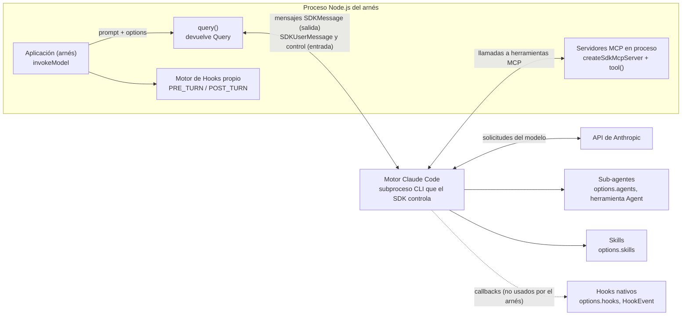
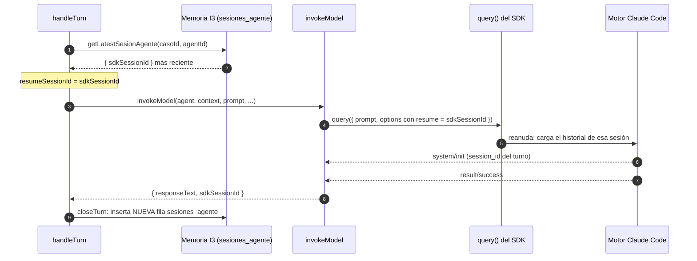
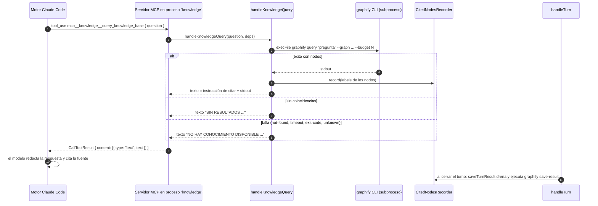
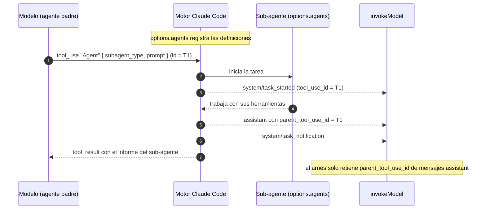
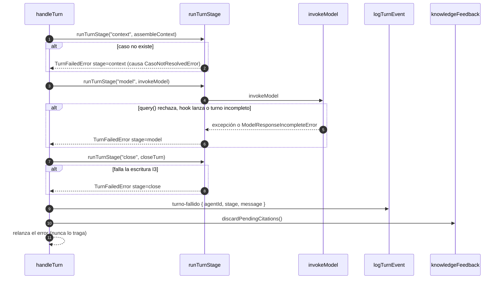

# Referencia del Claude Agent SDK: arquitectura, tipos de mensaje y flujos de comunicación

Documento de referencia del objetivo específico 4 de la propuesta de pasantía: "Investigar sobre el funcionamiento exacto del Claude Agent SDK, mensajes y flujos principales". Cubre el entregable "documentar de forma esquemática la arquitectura, los tipos de mensajes y los flujos de comunicación requeridos por el SDK".

## 0. Alcance, método y versión

**Regla de este documento.** Toda afirmación sobre el SDK se respalda con las definiciones de tipos instaladas; toda afirmación sobre el uso que el arnés hace del SDK se respalda con el código fuente. Lo que no pudo confirmarse se marca como "no verificado" (sección 9.2).

**Convenciones de cita.**

- `sdk.d.ts:N` es la línea `N` de `node_modules/@anthropic-ai/claude-agent-sdk/sdk.d.ts` (8 447 líneas).
- `sdk-tools.d.ts:N` es la línea `N` del archivo homónimo del mismo paquete.
- Las rutas `src/...:N` son relativas a la raíz del repositorio. Los archivos del turno están en `src/core/turn-selector/`; se abrevian por su nombre (`invoke-model.ts`, `handle-turn.ts`, `assemble-context.ts`, `close-turn.ts`, `turn-error.ts`, `dispatch-delegation.ts`).

**Versión instalada.** `@anthropic-ai/claude-agent-sdk` **0.3.248** (`node_modules/@anthropic-ai/claude-agent-sdk/package.json:3`; `package-lock.json:47-48`). El `package.json` del proyecto declara `^0.3.248` (línea 22), mientras que la propuesta de pasantía fija la versión 0.3.221; el texto de la propuesta no es un archivo de texto del repositorio y no pudo contrastarse, de modo que ese valor se toma del enunciado de la tarea. Todo el catálogo siguiente corresponde a 0.3.248 y puede diferir de 0.3.221 (el propio tipo advierte que la unión crece con el tiempo, `sdk.d.ts:4396-4397`).

**Archivos de tipos del paquete** (`package.json` del SDK, campo `types`: `sdk.d.ts`): `sdk.d.ts` (API principal), `sdk-tools.d.ts` (entradas y salidas de las herramientas integradas, por ejemplo `AgentInput`), `bridge.d.ts` y `browser-sdk.d.ts` (no examinados para este documento).

---

## 1. Arquitectura del SDK

### 1.1 Componentes y relaciones



### 1.2 Explicación

| Componente | Qué es según los tipos | Respaldo |
|---|---|---|
| Aplicación | El código que llama a `query()`. En el arnés es `invokeModel`. | `invoke-model.ts:448-514` |
| `query()` | Función que recibe `{ prompt, options }` y devuelve un objeto `Query`. | `sdk.d.ts:2742-2745` |
| Motor de Claude Code | El SDK controla un proceso de Claude Code (la "CLI"): `SDKMessage` se define como "todo mensaje conversacional e informativo que la CLI emite en su flujo de salida"; `Query.close()` "termina el proceso subyacente" y "el subproceso de la CLI"; existen opciones para elegir su ejecutable (`pathToClaudeCodeExecutable`), el tiempo de ejecución (`executable`: `bun`, `deno`, `node`) y para reemplazar el arranque del proceso (`spawnClaudeCodeProcess`). Por ello el bucle del agente (modelo, herramientas, sesiones) vive en ese proceso y no en la aplicación. | `sdk.d.ts:4396-4399`, `2731-2739`, `1812-1815`, `1519-1523`, `2176-2195`; `README.md:21` (menciona el "native CLI binary") |
| API de Anthropic | El motor la invoca; el SDK expone sus fallas (`api_retry`, "cuando una solicitud a la API falla con un error reintentable") y el origen de la credencial (`apiKeySource`). | `sdk.d.ts:3083-3095`, `4857-4860` |
| Servidores MCP en proceso | `createSdkMcpServer` "permite definir herramientas personalizadas que se ejecutan en el mismo proceso"; `tool()` define cada herramienta con nombre, descripción, esquema Zod y manejador asíncrono que devuelve `CallToolResult`. Se registran en `options.mcpServers` como `McpSdkServerConfigWithInstance`. También existen servidores externos `stdio`, `sse` y `http`. | `sdk.d.ts:498-506`, `8234`, `1098-1105` |
| Sub-agentes | `options.agents` los define "programáticamente" y "se invocan mediante la herramienta Agent"; `AgentInput` es la entrada de esa herramienta (`description`, `prompt`, `subagent_type`, ...). | `sdk.d.ts:1418-1432`, `38-100`; `sdk-tools.d.ts:654-691` |
| Skills | `options.skills` habilita skills de la sesión principal (`'all'` o lista de nombres); `AgentDefinition.skills` las precarga en el contexto de un agente. | `sdk.d.ts:2053-2075`, `65-67` |
| Hooks nativos | `options.hooks` acepta callbacks por `HookEvent` (31 eventos, sección 5). El motor envía una solicitud de control `hook_callback` al cliente cuando el evento ocurre. | `sdk.d.ts:1586`, `4266-4276` |
| Sesiones | `resume`, `continue`, `sessionId`, `forkSession` y `persistSession` (por defecto `true`, escribe en `~/.claude/projects/`). | `sdk.d.ts:1892`, `1450`, `1898`, `1565`, `1664-1671` |

**Dos modos de entrada.** `prompt` puede ser `string` (un solo turno) o `AsyncIterable<SDKUserMessage>` (entrada en streaming, `sdk.d.ts:2743`). Los métodos de control de `Query` "solo se soportan cuando se usa streaming de entrada y salida" (`sdk.d.ts:2427-2430`). El arnés usa siempre `string` (`invoke-model.ts:199-202`, `479`), por lo que no utiliza esos métodos.

---

## 2. `query()`: firma y ciclo de vida

### 2.1 Firma

```ts
export declare function query(_params: {
    prompt: string | AsyncIterable<SDKUserMessage>;
    options?: Options;
}): Query;
```

Fuente: `sdk.d.ts:2742-2745`. La función no está documentada con comentario propio en los tipos.

### 2.2 Valor devuelto: `Query`

`Query` "extiende `AsyncGenerator` y tiene métodos, por lo que no es serializable" (`sdk.d.ts:2421-2425`): `interface Query extends AsyncGenerator<SDKMessage, void>`. Es decir, se consume con `for await (const message of query(...))`, cada elemento es un `SDKMessage` y el valor final del generador es `void`.

Métodos de control declarados (26), todos en `sdk.d.ts`:

| Método | Línea | Método | Línea |
|---|---|---|---|
| `interrupt()` | 2439 | `readFile(path, options?)` | 2610 |
| `setPermissionMode(mode)` | 2446 | `reloadPlugins()` | 2620 |
| `setMcpPermissionModeOverride(serverName, mode)` | 2463 | `reloadSkills()` | 2626 |
| `setModel(model?)` | 2473 | `accountInfo()` | 2632 |
| `setMaxThinkingTokens(n, display?)` (obsoleto: usar `thinking`) | 2496 | `rewindFiles(userMessageId, options?)` | 2641 |
| `applyFlagSettings(settings)` | 2519 | `seedReadState(path, mtime)` | 2654 |
| `initializationResult()` | 2528 | `reconnectMcpServer(serverName)` | 2668 |
| `reinitialize()` | 2554 | `toggleMcpServer(serverName, enabled)` | 2676 |
| `supportedCommands()` | 2560 | `setMcpServers(servers)` | 2705 |
| `supportedModels()` | 2566 | `streamInput(stream)` | 2712 |
| `supportedAgents()` | 2572 | `stopTask(taskId)` | 2717 |
| `mcpServerStatus()` | 2578 | `backgroundTasks(toolUseId?)` | 2730 |
| `getContextUsage()` | 2585 | `close()` | 2739 |

Además de los 26 métodos, `Query` hereda los de `AsyncGenerator` (`next`, `return`, `throw`).

### 2.3 Ciclo de vida y cierre

1. **Inicio.** El motor emite `system/init` "al inicio de cada turno, normalmente antes de cualquier otro mensaje de ese turno" (`sdk.d.ts:4850-4852`).
2. **Durante el turno.** Mensajes `assistant`, `user` (con `tool_result`), y los demás tipos del catálogo (sección 3). Con `includePartialMessages`, también `stream_event` (`sdk.d.ts:1712-1716`).
3. **Fin de turno.** "La CLI emite exactamente un mensaje `result` por turno, después de los mensajes `assistant`, `user` y `stream_event` de ese turno; tratarlo como la señal de turno completo (mensajes informativos como notificaciones de tareas, cambios de estado de sesión o sugerencias de prompt pueden seguir después)" (`sdk.d.ts:4711`). El propio tipo documenta que la sugerencia de prompt llega después de `result` y que hay que seguir iterando para recibirla (`sdk.d.ts:1866-1867`).
4. **Terminación del generador.** "En modo de prompt único (sin streaming de entrada) el proceso termina después del turno" (`sdk.d.ts:4711`); con `prompt` como `string` el generador se completa entonces. Los tipos no enuncian literalmente la condición de finalización del generador; esa lectura se infiere de la cita anterior (ver 9.2).
5. **Aborto.** `Query.close()` "termina forzosamente la consulta y limpia todos los recursos, incluidas solicitudes pendientes, transportes MCP y el subproceso de la CLI; después no se reciben más mensajes" (`sdk.d.ts:2731-2739`). `options.abortController` cancela la consulta y libera recursos (`sdk.d.ts:1388-1392`).
6. **Motivo de terminación.** `result.terminal_reason` (`TerminalReason`, `sdk.d.ts:8203`) informa "por qué terminó el bucle de la consulta".

---

## 3. Catálogo de tipos de mensaje: `SDKMessage`

La unión está declarada en `sdk.d.ts:4399` y su comentario advierte: "los consumidores deben ignorar los tipos y subtipos que no reconozcan: el conjunto crece con el tiempo" (`sdk.d.ts:4396-4398`).

**Composición.** La unión tiene **39 miembros** (más una unión interna: `SDKResultMessage` agrupa dos formas, éxito y error, con cuatro subtipos de error). De los 39, **28 son `type: 'system'`** con un `subtype` distinto y **11 tienen otro `type`**. Todos incluyen `uuid` y `session_id`; solo en `SDKUserMessage` ambos son opcionales (`sdk.d.ts:5098-5099`). El tipo `SDKKeepAliveMessage` (`type: 'keep_alive'`, `sdk.d.ts:4342-4344`) existe pero **no forma parte** de la unión.

### 3.1 Mensajes con `type` propio (11)

| # | Tipo TypeScript | `type` (y `subtype`) | Campos clave | Cuándo se emite / condición | Línea |
|---|---|---|---|---|---|
| 1 | `SDKAssistantMessage` | `assistant` | `message` (objeto `BetaMessage` de la API de Mensajes: `id`, `model`, `content`, `stop_reason`, `usage`), `parent_tool_use_id: string \| null`, `error?` (`SDKAssistantMessageError`), `uuid`, `session_id`; opcionales: `aborted`, `supersedes`, `subagent_type`, `task_description`, `timestamp` | Un mensaje por bloque de contenido completado: varios consecutivos pueden compartir `message.id`, con `stop_reason` nulo y `usage` no final (la razón de parada y el uso totales llegan en `result`). `parent_tool_use_id` es no nulo cuando lo produjo un sub-agente lanzado por ese `tool_use` | 3097-3157 |
| 2 | `SDKUserMessage` | `user` | `message` (`MessageParam`, rol `user`), `parent_tool_use_id`, `isSynthetic?`, `tool_use_result?`, `priority?`, `origin?`, `shouldQuery?`, `uuid?`, `session_id?` | El cliente escribe uno para enviar un prompt (inicia un turno); la CLI los emite para contenido de rol `user` que agrega ella misma, principalmente los bloques `tool_result` que responden a los `tool_use` del asistente | 5056-5108 |
| 3 | `SDKUserMessageReplay` | `user` con `isReplay: true` | Mismos campos que `SDKUserMessage`, con `uuid` y `session_id` obligatorios y `file_attachments?` | Los tipos no documentan cuándo se emite (ver 9.2) | 5110-5153 |
| 4 | `SDKResultMessage` = `SDKResultSuccess` \| `SDKResultError` | `result` (`subtype` en 3.3) | Ver 3.3 | Uno por turno, después de los mensajes del turno | 4710-4759, 4671-4708 |
| 5 | `SDKPartialAssistantMessage` | `stream_event` | `event` (`BetaRawMessageStreamEvent`: `message_start`, `content_block_start`, `content_block_delta`, `content_block_stop`, `message_delta`, `message_stop`), `parent_tool_use_id`, `ttft_ms?`, `user_message_uuid?`, `uuid`, `session_id` | Solo cuando se piden mensajes parciales (`includePartialMessages`, `--include-partial-messages`); el mensaje `assistant` completo sigue después | 4541-4558 |
| 6 | `SDKToolProgressMessage` | `tool_progress` | `tool_use_id`, `tool_name`, `parent_tool_use_id`, `elapsed_time_seconds`, `task_id?`, `heartbeat?`, `subagent_type?`, `subagent_retry?` | Progreso de una herramienta en ejecución; el tipo no documenta la condición de emisión | 5026-5045 |
| 7 | `SDKToolUseSummaryMessage` | `tool_use_summary` | `summary`, `preceding_tool_use_ids` | Resumen de un grupo de usos de herramienta; el tipo no documenta la condición de emisión | 5047-5054 |
| 8 | `SDKAuthStatusMessage` | `auth_status` | `isAuthenticating`, `output: string[]`, `error?` | Estado de un flujo de autenticación; sin más documentación | 3161-3168 |
| 9 | `SDKRateLimitEvent` | `rate_limit_event` | `rate_limit_info` (`status`: `allowed`, `allowed_warning`, `rejected`; `resetsAt?`, `rateLimitType?`, `utilization?`, sobreuso, etc.) | "Cuando cambia la información de límites de tasa" (suscriptores de claude.ai) | 4635-4669 |
| 10 | `SDKPromptSuggestionMessage` | `prompt_suggestion` | `suggestion` | Solo con `promptSuggestions: true`: a lo sumo uno por turno, después de `result`; suprimido en el primer turno, tras errores de API y en modo plan | 4625-4633, 1861-1877 |
| 11 | `SDKConversationResetMessage` | `conversation_reset` | `new_conversation_id` | Emitido por `/clear`, salida del modo plan y flujos de sesión nueva | 4210-4218 |

### 3.2 Mensajes `type: 'system'` (28), por `subtype`

| # | Tipo TypeScript | `subtype` | Campos clave | Cuándo se emite / condición | Línea |
|---|---|---|---|---|---|
| 12 | `SDKSystemMessage` | `init` | `session_id`, `model`, `cwd`, `tools: string[]`, `mcp_servers: {name, status}[]`, `slash_commands`, `skills`, `plugins`, `agents?`, `permissionMode`, `apiKeySource`, `claude_code_version`, `output_style`, `betas?`, `capabilities?`, `effort?`, `uuid` | Metadatos de sesión "al inicio de cada turno, normalmente antes que cualquier otro mensaje de ese turno" | 4850-4913 |
| 13 | `SDKCompactBoundaryMessage` | `compact_boundary` | `compact_metadata` (`trigger`: `manual`/`auto`, `pre_tokens`, `post_tokens?`, `duration_ms?`, `preserved_segment?`, `preserved_messages?`) | Marca el punto de una compactación de contexto | 3205-3238 |
| 14 | `SDKStatusMessage` | `status` | `status`: `'compacting' \| 'requesting' \| null`, `permissionMode?`, `compact_result?` (`success`/`failed`), `compact_error?` | Cambios de estado (compactación, solicitud en curso) | 4836-4848 |
| 15 | `SDKAPIRetryMessage` | `api_retry` | `attempt`, `max_retries`, `retry_delay_ms`, `error_status: number \| null`, `error` | Una solicitud a la API falló con un error reintentable y se reintentará tras una espera; `error_status` es nulo en errores de conexión sin respuesta HTTP | 3082-3095 |
| 16 | `SDKControlRequestProgressMessage` | `control_request_progress` | `request_id`, `status`: `'started' \| 'api_retry'`, contadores de reintento opcionales | Progreso de una solicitud de control larga iniciada por el cliente (hoy solo `side_question`) | 4100-4114 |
| 17 | `SDKModelRefusalFallbackMessage` | `model_refusal_fallback` | `trigger: 'refusal'`, `direction`, `scope?`, `original_model`, `fallback_model`, `request_id`, `retracted_message_uuids?`, `content` | El modelo primario terminó con `stop_reason` "refusal" y el turno se reintenta una vez en el modelo de respaldo | 4473-4508 |
| 18 | `SDKModelRefusalNoFallbackMessage` | `model_refusal_no_fallback` | `original_model`, `request_id`, `api_refusal_category?`, `content` | El modelo terminó con "refusal" y no se reintenta (sin modelo de respaldo configurado o enrutamiento por categoría que lo rechaza) | 4510-4524 |
| 19 | `SDKLocalCommandOutputMessage` | `local_command_output` | `content` | Salida de un comando slash local (por ejemplo `/voice`, `/usage`) | 4346-4355 |
| 20 | `SDKHookStartedMessage` | `hook_started` | `hook_id`, `hook_name`, `hook_event` | Ciclo de vida de hooks; con `includeHookEvents: true` para todos los eventos; los de `SessionStart` y `Setup` se emiten siempre | 4306-4314, 1702-1711 |
| 21 | `SDKHookProgressMessage` | `hook_progress` | `hook_id`, `hook_name`, `hook_event`, `stdout`, `stderr`, `output` | Igual que el anterior | 4278-4289 |
| 22 | `SDKHookResponseMessage` | `hook_response` | `hook_id`, `hook_name`, `hook_event`, `output`, `stdout`, `stderr`, `exit_code?`, `outcome`: `success`/`error`/`cancelled` | Igual que el anterior | 4291-4304 |
| 23 | `SDKPluginInstallMessage` | `plugin_install` | `status`: `started`/`installed`/`failed`/`completed`, `name?`, `error?` | Progreso de instalación de plugins en modo headless (`CLAUDE_CODE_SYNC_PLUGIN_INSTALL`) | 4612-4623 |
| 24 | `SDKTaskStartedMessage` | `task_started` | `task_id`, `tool_use_id?`, `description`, `subagent_type?`, `is_backgrounded?`, `spawn_depth?`, `task_type?`, `workflow_name?`, `prompt?` | Inicio de una tarea (incluye sub-agentes lanzados por la herramienta de tareas) | 4959-4993 |
| 25 | `SDKTaskProgressMessage` | `task_progress` | `task_id`, `tool_use_id?`, `description`, `subagent_type?`, `usage` (`total_tokens`, `tool_uses`, `duration_ms`), `last_tool_name?`, `summary?` | Progreso de una tarea; `summary` solo con `agentProgressSummaries: true` | 4937-4957, 1878-1887 |
| 26 | `SDKTaskUpdatedMessage` | `task_updated` | `task_id`, `patch` (`status`, `description`, `end_time`, `error`, `is_backgrounded`, ...) | Cambio parcial del estado de una tarea; el cliente fusiona el parche | 4995-5012 |
| 27 | `SDKTaskNotificationMessage` | `task_notification` | `task_id`, `tool_use_id?`, `status`: `completed`/`failed`/`stopped`, `output_file`, `summary`, `usage?` | Fin de una tarea | 4915-4935 |
| 28 | `SDKBackgroundTasksChangedMessage` | `background_tasks_changed` | `tasks: {task_id, task_type, description, ambient?}[]` | Cada vez que cambia el conjunto de tareas en segundo plano; semántica de reemplazo del conjunto completo | 3170-3190 |
| 29 | `SDKThinkingTokensMessage` | `thinking_tokens` | `estimated_tokens`, `estimated_tokens_delta` | Estimación en vivo de tokens de razonamiento (progreso aproximado, no facturación) | 5014-5024 |
| 30 | `SDKSessionStateChangedMessage` | `session_state_changed` | `state`: `idle`/`running`/`requires_action` | Cambio de estado de sesión; `idle` es la señal autoritativa de fin de turno | 4807-4816 |
| 31 | `SDKWorkerShuttingDownMessage` | `worker_shutting_down` | `reason` | Apagado ordenado del proceso trabajador cuando quien lo apaga da un motivo | 5155-5167 |
| 32 | `SDKCommandsChangedMessage` | `commands_changed` | `commands: SlashCommand[]` | Lista completa de comandos slash tras un cambio a mitad de sesión; el cliente reemplaza su caché | 3194-3203 |
| 33 | `SDKNotificationMessage` | `notification` | `key`, `text`, `priority`, `color?`, `timeout_ms?` | Notificación de texto del bucle | 4526-4539 |
| 34 | `SDKFilesPersistedEvent` | `files_persisted` | `files: {filename, file_id}[]`, `failed: {filename, error}[]`, `processed_at` | Persistencia de archivos; sin más documentación | 4238-4252 |
| 35 | `SDKMemoryRecallMessage` | `memory_recall` | `mode`: `select`/`synthesize`, `memories: {path, scope, content?}[]` | El supervisor de memoria incorpora memorias relevantes al turno | 4371-4394 |
| 36 | `SDKElicitationCompleteMessage` | `elicitation_complete` | `mcp_server_name`, `elicitation_id` | Un servidor MCP confirma que terminó una elicitación en modo URL | 4226-4236 |
| 37 | `SDKPermissionDeniedMessage` | `permission_denied` | `tool_name`, `tool_use_id`, `agent_id?`, `decision_reason_type?`, `decision_reason?`, `message` | Una llamada a herramienta se deniega automáticamente sin aviso interactivo (clasificador, modo `dontAsk`, regla de denegación, o sin `canUseTool`); es consultivo: `result.permission_denials` es el registro autoritativo | 4566-4592 |
| 38 | `SDKMirrorErrorMessage` | `mirror_error` | `error`, `key: {projectKey, sessionId, subpath?}` | Falla al espejar transcripciones a un `SessionStore` tras reintentos | 4457-4471 |
| 39 | `SDKInformationalMessage` | `informational` | `content`, `level`: `info`/`notice`/`suggestion`/`warning`, `tool_use_id?`, `prevent_continuation?` | Aviso de texto genérico del bucle (retroalimentación de hooks, salida de comandos slash) | 4316-4337 |

### 3.3 El mensaje `result`

`SDKResultMessage = SDKResultSuccess | SDKResultError` (`sdk.d.ts:4713`). Es "el resultado de un turno"; el subtipo `success` "lleva el texto final del asistente en `result` o, con `is_error` verdadero, el texto de error cuando el turno terminó por un error de API; los subtipos de error dicen por qué el turno se detuvo antes de tiempo" (`sdk.d.ts:4711`).

| Aspecto | `SDKResultSuccess` (`sdk.d.ts:4715-4759`) | `SDKResultError` (`sdk.d.ts:4671-4708`) |
|---|---|---|
| `type` / `subtype` | `result` / `success` | `result` / `error_during_execution`, `error_max_turns`, `error_max_budget_usd`, `error_max_structured_output_retries` |
| `is_error` | `boolean` (puede ser `true` aun con `subtype: 'success'`) | `boolean` |
| Texto | `result: string` | **No tiene `result`**; tiene `errors: string[]` |
| `num_turns`, `duration_ms`, `duration_api_ms` | Sí | Sí |
| `usage` | `NonNullableUsage`: solo el bucle principal | Igual |
| Costo | `total_cost_usd`: costo estimado acumulado en USD de la llamada a `query()` | Igual |
| `modelUsage` | `Record<string, ModelUsage>`: totales por modelo, incluye sub-agentes; "el campo correcto para contabilidad de tokens y costo" | Igual |
| `permission_denials` | `SDKPermissionDenial[]` | Igual |
| `stop_reason` | `string \| null` | `string \| null` |
| `terminal_reason?` | `TerminalReason` | Igual |
| `session_id`, `uuid` | Sí | Sí |
| Solo en éxito | `api_error_status?`, `structured_output?`, `deferred_tool_use?`, métricas de latencia (`ttft_ms?`, etc.) | — |

Valores de `TerminalReason` (`sdk.d.ts:8203`): `blocking_limit`, `rapid_refill_breaker`, `prompt_too_long`, `image_error`, `model_error`, `api_error`, `malformed_tool_use_exhausted`, `aborted_streaming`, `aborted_tools`, `stop_hook_prevented`, `hook_stopped`, `tool_deferred`, `max_turns`, `background_requested`, `completed`, `budget_exhausted`, `structured_output_retry_exhausted`, `tool_deferred_unavailable`, `turn_setup_failed`.

### 3.4 Qué recibe el consumidor por defecto y qué requiere una opción

| Mensaje | Condición documentada en los tipos |
|---|---|
| `stream_event` | Requiere `includePartialMessages: true` (`sdk.d.ts:1712-1716`, `4541-4543`) |
| `hook_started`, `hook_progress`, `hook_response` | Requieren `includeHookEvents: true`, salvo los eventos `SessionStart` y `Setup`, que siempre se emiten (`sdk.d.ts:1702-1711`) |
| `prompt_suggestion` | Requiere `promptSuggestions: true` (`sdk.d.ts:1861-1877`) |
| `assistant` / `user` con texto y razonamiento de sub-agentes | Por defecto solo se emiten los bloques `tool_use` / `tool_result` de sub-agentes; con `forwardSubagentText: true` se reenvía la conversación completa (`sdk.d.ts:1717-1723`) |
| `summary` en `task_progress` | Requiere `agentProgressSummaries: true` (`sdk.d.ts:1878-1887`) |
| `plugin_install` | Depende de la variable de entorno `CLAUDE_CODE_SYNC_PLUGIN_INSTALL` (`sdk.d.ts:4612`) |
| `mirror_error` | Solo aplica con `sessionStore` (`sdk.d.ts:4457-4459`) |
| Resto (`system/init`, `assistant`, `user`, `result`, `status`, `api_retry`, `compact_boundary`, `task_*`, `permission_denied`, `rate_limit_event`, etc.) | Los tipos no los condicionan a una opción; su emisión efectiva no se verificó en ejecución (9.2) |

---

## 4. Opciones relevantes (`Options`)

`Options` está declarado en `sdk.d.ts:1387-2196`. La columna "Arnés" indica si `toQueryOptions` (`invoke-model.ts:368-403`) la establece.

| Opción | Qué hace según los tipos | Arnés | Línea `sdk.d.ts` |
|---|---|---|---|
| `resume` | Identificador de sesión a reanudar; carga su historial | Sí, solo si el contexto trae `resumeSessionId` (`invoke-model.ts:386-388`) | 1892 |
| `continue` | Continúa la conversación más reciente del directorio actual; excluyente con `resume` | No | 1450 |
| `sessionId` | Fija el identificador de la sesión (UUID válido); no combinable con `continue`/`resume` salvo con `forkSession` | No | 1898 |
| `forkSession` | Al reanudar, bifurca a un nuevo identificador en lugar de continuar | No | 1565 |
| `agents` | Define sub-agentes: `Record<string, AgentDefinition>` | Sí: el agente del turno más los cuatro sub-agentes registrados (`invoke-model.ts:378-381`) | 1432 |
| `agent` | Nombre del agente del hilo principal: se aplican su prompt de sistema, restricciones de herramientas y modelo | Sí (`invoke-model.ts:377`) | 1416 |
| `allowedTools` | Herramientas autoaprobadas sin pedir permiso; **no restringe** las disponibles ("para restringir usar `tools`") | Sí, solo si la lista del agente no está vacía (`invoke-model.ts:390-392`) | 1440 |
| `disallowedTools` | Herramientas eliminadas del contexto del modelo | No | 1460 |
| `tools` | Conjunto base de herramientas integradas (`string[]`, `[]` las desactiva todas, o preset `claude_code`) | No (la restricción se hace vía `agents[id].tools`, ver 4.1) | 1496 |
| `mcpServers` | Servidores MCP (`stdio`, `sse`, `http`, `sdk`) | Sí, solo si el llamador lo pasa (`invoke-model.ts:394-396`) | 1793 |
| `settingSources` | Qué configuración del sistema de archivos cargar (`user`, `project`, `local`); omitida = todas; `[]` = aislamiento; "debe incluir `project` para cargar archivos CLAUDE.md" | Sí, siempre `["project"]` (`invoke-model.ts:192`, `382`) | 2052 |
| `skills` | Skills habilitadas de la sesión principal (`'all'` o lista); omitida no equivale a "skills apagadas"; es un filtro de contexto, no un aislamiento | Sí, siempre presente, incluso `[]` (`invoke-model.ts:383`) | 2075 |
| `systemPrompt` | Cadena, arreglo de bloques o preset `claude_code` con `append` | No: el prompt viaja en `agents[id].prompt` (`invoke-model.ts:284`) | 2159 |
| `model` | Modelo de Claude a usar | No en el nivel raíz: viaja en `agents[id].model` (`invoke-model.ts:286`) | 1798 |
| `cwd` | Directorio de trabajo de la sesión (por defecto `process.cwd()`) | Sí, solo si se pasa (`invoke-model.ts:398-400`) | 1454 |
| `permissionMode` | `default`, `acceptEdits`, `bypassPermissions`, `plan`, `dontAsk`, `auto` | No (queda el valor por defecto) | 1824, 2234 |
| `canUseTool` | Manejador de permisos por herramienta | No | 1445 |
| `maxTurns` | Máximo de turnos de conversación antes de detener la consulta | No | 1763 |
| `maxBudgetUsd` | Presupuesto máximo; al excederlo devuelve `error_max_budget_usd` | No | 1768 |
| `hooks` | Callbacks por `HookEvent` (`Partial<Record<HookEvent, HookCallbackMatcher[]>>`) | No (sección 5) | 1586 |
| `includePartialMessages` | Emite `stream_event` | No | 1716 |
| `includeHookEvents` | Emite `hook_started`/`hook_progress`/`hook_response` | No | 1711 |
| `forwardSubagentText` | Reenvía texto y razonamiento de sub-agentes | No | 1723 |
| `persistSession` | `false` desactiva la persistencia en disco (por defecto `true`) | No | 1671 |
| `outputFormat` | Salida estructurada con esquema JSON | No | 1811 |
| `thinking`, `effort` | Configuración de razonamiento y esfuerzo | No | 1736, 1749 |
| `abortController` | Cancela la consulta | No | 1392 |
| `env`, `executable`, `pathToClaudeCodeExecutable`, `spawnClaudeCodeProcess` | Entorno, tiempo de ejecución, ejecutable y arranque del proceso de Claude Code | No | 1516, 1523, 1815, 2195 |
| `strictMcpConfig` | Usa solo los servidores de `mcpServers` y de `agents`, ignorando `.mcp.json`, ajustes de usuario y plugins | No | 2101 |
| `plugins`, `settings`, `sandbox` | Plugins locales, ajustes adicionales y aislamiento de ejecución de comandos | No | 1856, 2017, 1999 |

### 4.1 Cómo se restringen las herramientas en el arnés

`toSdkAgentDefinition` mapea el agente propio al `AgentDefinition` del SDK con cinco campos: `description`, `prompt` (desde `systemPrompt`), `tools` (desde `allowedTools`), `model` y `skills` (`invoke-model.ts:281-289`). El tipo `AgentDefinition` (`sdk.d.ts:38-100`) exige `description` y `prompt`, y describe `tools` como "lista de herramientas permitidas; si se omite, hereda todas las del padre" (`sdk.d.ts:44`). El código explica por qué no usa `Options.allowedTools` para restringir (corrección "Fix 1", `invoke-model.ts:106-142`): ese campo solo autoaprueba. El arnés usa **ambos** campos con propósitos distintos: `agents[id].tools` restringe y `Options.allowedTools` autoaprueba (`invoke-model.ts:303-310`).

---

## 5. Hooks nativos del SDK

### 5.1 Eventos disponibles (`HookEvent`)

`HookEvent` (`sdk.d.ts:868`; la constante `HOOK_EVENTS` en `sdk.d.ts:849` lista los mismos valores) define **31 eventos**. La agrupación siguiente es orientativa y editorial: los tipos no clasifican los eventos.

| Grupo | Eventos |
|---|---|
| Herramientas | `PreToolUse`, `PostToolUse`, `PostToolUseFailure`, `PostToolBatch`, `PermissionRequest`, `PermissionDenied` |
| Prompt y turno | `UserPromptSubmit`, `UserPromptExpansion`, `Stop`, `StopFailure`, `MessageDisplay` |
| Sesión | `SessionStart`, `SessionEnd`, `Setup`, `InstructionsLoaded`, `ConfigChange`, `CwdChanged`, `FileChanged`, `DirectoryAdded` |
| Compactación | `PreCompact`, `PostCompact` |
| Sub-agentes y tareas | `SubagentStart`, `SubagentStop`, `TeammateIdle`, `TaskCreated`, `TaskCompleted` |
| MCP | `Elicitation`, `ElicitationResult` |
| Otros | `Notification`, `WorktreeCreate`, `WorktreeRemove` |

Forma de un hook: `HookCallback = (input: HookInput, toolUseID, { signal }) => Promise<HookJSONOutput>` (`sdk.d.ts:854-856`), agrupado por `HookCallbackMatcher { matcher?, hooks, timeout? }` (`sdk.d.ts:861-866`). `HookInput` es una unión discriminada por `hook_event_name` (`sdk.d.ts:870`). El motor invoca el hook mediante una solicitud de control `hook_callback` (`sdk.d.ts:4266-4276`).

### 5.2 El arnés no los usa

- `toQueryOptions` no establece `options.hooks` (`invoke-model.ts:376-384`, y ningún otro sitio de `src/` referencia `options.hooks`).
- El comentario de diseño lo declara: "post-turn hook dispatch, not SDK native `options.hooks`: el Motor de Hooks es un motor independiente en proceso, deliberadamente desacoplado del sistema de hooks nativo del SDK"; los hooks propios se invocan como llamadas de función una vez consumidos los mensajes del turno, y no hay "ningún caso de uso real" de los hooks nativos todavía, por lo que integrarlos sería especulativo (`invoke-model.ts:81-89`). El propio módulo del motor reconoce que mapear sus puntos a hooks nativos "es una decisión que le corresponde al Spec Author en el hito que la necesite" (`src/core/hooks/hook-engine.ts:5-16`).
- El motor propio es un registro en memoria con dos puntos, `PRE_TURN` y `POST_TURN` (`hook-engine.ts:39`), que ejecuta los manejadores en orden de registro, esperando cada uno; si uno lanza, propaga la excepción y no ejecuta los siguientes (`hook-engine.ts:94-102`, `23-31`). En el arranque se registran un manejador real para cada punto, ambos de registro en bitácora (`src/core/startup/bootstrap.ts:90-99`).
- Los datos de cada punto: `PRE_TURN` recibe `{ casoId, agentId }`; `POST_TURN` recibe además `sdkSessionId` y `responseText` (`invoke-model.ts:469-473`, `501-507`).

### 5.3 Correspondencia aproximada con eventos nativos

Solo se propone donde los tipos la respaldan. Ninguna es una equivalencia exacta.

| Punto propio | Evento nativo más cercano | Justificación en los tipos | Diferencia principal |
|---|---|---|---|
| `PRE_TURN` | `UserPromptSubmit` | Su entrada lleva `prompt` y `source`, cuyo valor `sdk` designa "punto de entrada no interactivo (`-p` / Agent SDK)" (`sdk.d.ts:8390-8398`) | El nativo corre dentro del motor tras recibir el prompt; `PRE_TURN` corre antes de llamar a `query()` |
| `POST_TURN` | `Stop` | Su entrada lleva `last_assistant_message`, "texto del último mensaje del asistente antes de detenerse" (`sdk.d.ts:8065-8082`) | El nativo puede realimentar al modelo (`additionalContext`, `sdk.d.ts:8084-8090`); `POST_TURN` solo observa y corre en la aplicación, después de verificar el resultado |

Los demás eventos nativos (por ejemplo `PreToolUse`, `SubagentStart`) no tienen contraparte propia y no se proponen equivalencias.

---

## 6. Qué consume el arnés de verdad

El bucle está en `invoke-model.ts:479-492`; el resto de los mensajes no tiene rama y se descarta.

| Mensaje del SDK | Condición exacta en el código | Acción | Línea |
|---|---|---|---|
| `system` / `init` | `message.type === "system" && message.subtype === "init"` | Guarda `sdkSessionId = message.session_id` (se sobrescribe si llegara otro `init`) | `invoke-model.ts:480-481` |
| `result` / `success` con `is_error` falso | `message.type === "result" && message.subtype === "success" && !message.is_error` | Guarda `responseText = message.result` | `invoke-model.ts:482-487` |
| `assistant` con `parent_tool_use_id` no nulo | `message.type === "assistant" && message.parent_tool_use_id !== null` | Guarda `parentToolUseId` (el último visto); se devuelve en `InvokeModelResult.parentToolUseId` solo si existe | `invoke-model.ts:488-491`, `509-513` |
| Todo lo demás | No hay rama `else` | Ignorado: `assistant` con `parent_tool_use_id` nulo, `user`, `stream_event`, los 27 `system` restantes, `result` de error o con `is_error: true`, `tool_progress`, `rate_limit_event`, etc. | `invoke-model.ts:479-492` |

Condiciones de cierre del turno (`invoke-model.ts:494-514`):

1. Si al terminar el bucle falta `sdkSessionId` o `responseText`, se lanza `ModelResponseIncompleteError` con los faltantes (`invoke-model.ts:494-499`, clase en `249-257`). El mensaje distingue solo entre "no se recibió session_id (mensaje system/init)" y "no se recibió texto de respuesta (mensaje result/success)" (`invoke-model.ts:252-253`).
2. Tres situaciones convergen en el mismo error, según la documentación del propio módulo: un `result` con subtipo distinto de `success` (por ejemplo `error_max_turns`), ausencia total de `result`, y un `result/success` con `is_error: true`, cuyo texto es el error de la API y no una respuesta (`invoke-model.ts:156-170`, `233-248`). La justificación del filtro `is_error` coincide con la documentación del SDK (`sdk.d.ts:4711`).
3. Solo si ambos valores existen se dispara `POST_TURN` y se devuelve `{ responseText, sdkSessionId }` (más `parentToolUseId` si existe) (`invoke-model.ts:501-513`).
4. Una excepción de `queryFn` (o del generador) se propaga sin envolver desde `invokeModel` (`invoke-model.ts:98-104`); quien la envuelve es `runTurnStage` (sección 7.5).

El texto de la respuesta se toma de `result.result` y no de concatenar los mensajes `assistant`, porque el SDK emite un mensaje por bloque completado (`invoke-model.ts:59-72`; coincide con `sdk.d.ts:3098`).

---

## 7. Flujos de comunicación

### 7.1 Turno nuevo (sin `resume`)

```mermaid
sequenceDiagram
    autonumber
    participant H as handleTurn
    participant M as Memoria I3 (SQLite)
    participant I as invokeModel
    participant HE as Motor de Hooks propio
    participant Q as query() del SDK
    participant C as Motor Claude Code
    participant A as API de Anthropic

    H->>M: assembleContext: getCasoById, getLatestSesionAgente
    M-->>H: caso; sin sesión previa del agente
    Note over H: resumeSessionId es undefined
    H->>I: invokeModel(agent, context, prompt, hooks, ...)
    I->>I: toQueryOptions (sin options.resume)
    I->>HE: triggerHook PRE_TURN {casoId, agentId}
    I->>Q: query({ prompt, options })
    Q->>C: arranca el turno
    C->>A: solicitud al modelo
    C-->>I: system/init (session_id)
    C-->>I: assistant / user / otros (ignorados)
    C-->>I: result/success (is_error falso, result)
    Note over I: fin del bucle for await
    I->>HE: triggerHook POST_TURN {casoId, agentId, sdkSessionId, responseText}
    I-->>H: { responseText, sdkSessionId }
    H->>M: closeTurn: updateCaso + createSesionAgente (fila nueva)
    H-->>H: logTurnEvent turno-completado
```

Respaldo: `handleTurn` resuelve el agente y encadena tres etapas envueltas en `runTurnStage` (`handle-turn.ts:235-242`); `assembleContext` devuelve `resumeSessionId: undefined` cuando el agente no tiene sesión en el caso (`assemble-context.ts:146-161`, doc en `93-104`); `PRE_TURN` se dispara antes de `query()` (`invoke-model.ts:461-473`); `POST_TURN` después de consumir todos los mensajes y verificar (`invoke-model.ts:501-507`); `closeTurn` actualiza el caso e inserta una fila nueva en `sesiones_agente` (`close-turn.ts:135-142`). Un fallo de un manejador de hook dentro de `invokeModel` cuenta como fallo de la etapa `model` (`hook-engine.ts:99-101`; `handle-turn.ts:239-241`).

### 7.2 Turno reanudado (`resume`)



Respaldo: `assembleContext` copia `sesionAgente?.sdkSessionId` a `resumeSessionId` (`assemble-context.ts:156-160`); `toQueryOptions` lo traduce a `options.resume` (`invoke-model.ts:386-388`); el SDK "carga el historial de conversación de la sesión especificada" (`sdk.d.ts:1889-1892`). La sesión vigente es la fila más reciente por `created_at` (`ORDER BY created_at DESC, rowid DESC LIMIT 1`, `src/adapters/memory/repository.ts:243`). El cierre siempre inserta y nunca actualiza (`close-turn.ts:22-28`, `135-142`). El aislamiento por agente proviene de que la búsqueda es por `casoId` + `agentId` (`assemble-context.ts:141-145`).

Sobre el identificador: sin `forkSession`, la reanudación "continúa" la sesión previa (`sdk.d.ts:1561-1565`), pero los tipos no afirman que el `session_id` del `init` coincida con el reanudado (ver 9.2); el arnés guarda el que informe el `init` de cada turno.

### 7.3 Consulta de conocimiento (herramienta MCP)



Respaldo:

- Registro: `createKnowledgeAdapter` crea el servidor con `createSdkMcpServer({ name, version, timeout, tools: [tool(...)] })` y devuelve `mcpServers: { [nombre]: servidor }` (`src/adapters/knowledge/index.ts:91-114`, `146-149`); `handleTurn` lo reenvía a `invokeModel` como `mcpServers` (`handle-turn.ts:189`, `233`, `239-241`), que lo coloca en `options.mcpServers` (`invoke-model.ts:394-396`). El `timeout` corresponde al campo documentado por el SDK (`sdk.d.ts:527-531`).
- Nombre visto por el modelo: `mcp__knowledge__query_knowledge_base` (servidor `knowledge`, herramienta `query_knowledge_base`; `src/core/knowledge/knowledge-contract.ts:16-27`), listado en `allowedTools` del agente conversacional (`src/core/agents/definitions.ts:158`), lo que la autoaprueba (`definitions.ts:98-106`).
- Manejador: la función de `tool()` llama `handleKnowledgeQuery(args.question, toolDeps)` (`index.ts:111`). Esa función nunca lanza ni rechaza (`src/adapters/knowledge/knowledge-tool.ts:11-15`, `60-97`). Ejecuta `runQuery` (`knowledge-tool.ts:79`), que corre `graphify query <pregunta> --graph <ruta> --budget <n>` con `execFile` con arreglo de argumentos, sin shell y con límite de tiempo (`src/adapters/knowledge/graphify-cli.ts:87-88`, `106-118`, `15-22`).
- Resultados: sin nodos, texto "SIN RESULTADOS" (`knowledge-tool.ts:33-34`, `89-92`); con nodos, se registran en el `CitedNodesRecorder` y se devuelve la instrucción de citar más el `stdout` (`knowledge-tool.ts:30-31`, `94-96`); ante una falla, el texto degradado por motivo (`knowledge-tool.ts:36-58`, `80-85`).
- Cierre del ciclo: `handleTurn` llama `saveTurnResult` después de `closeTurn` y fuera de `runTurnStage` (`handle-turn.ts:263-281`); `saveTurnResult` drena el registrador y, si hubo nodos, ejecuta `graphify save-result` (`index.ts:116-136`, `graphify-cli.ts:91-98`, `126-137`).
- Cita de la fuente: el prompt del agente ordena citar `src` y `loc` (`definitions.ts:130-134`).

### 7.4 Sub-agentes

**Qué ofrece el SDK.** `options.agents` registra definiciones que el modelo puede invocar con la herramienta `Agent` (`sdk.d.ts:1418-1432`), cuya entrada es `AgentInput` (`description`, `prompt`, `subagent_type?`, `model?`, `run_in_background?`, ...; `sdk-tools.d.ts:654-691`). La actividad de un sub-agente se rastrea con estas señales:

| Señal | Dónde | Significado |
|---|---|---|
| `parent_tool_use_id` no nulo | `assistant`, `user`, `stream_event`, `tool_progress` | El mensaje se produjo dentro de un sub-agente lanzado por ese `tool_use` (`sdk.d.ts:3097-3098`, `3106`, `4550`, `5030`, `5065`) |
| `task_started`, `task_progress`, `task_notification`, `task_updated` | `system` | Ciclo de vida de la tarea, con `tool_use_id?` y `subagent_type?` (`sdk.d.ts:4959-5012`, `4915-4935`) |
| `subagent_type`, `task_description` | `assistant`, `user` | Tipo y descripción del sub-agente que produjo el mensaje (`sdk.d.ts:3127-3134`, `5100-5107`) |
| Hooks `SubagentStart` / `SubagentStop` | `HookEvent` | Con `agent_id` y `agent_type` (`sdk.d.ts:8092-8125`) |

Por defecto solo se reenvían los bloques `tool_use` / `tool_result` de sub-agentes; el texto completo requiere `forwardSubagentText` (`sdk.d.ts:1717-1723`). El informe final de un sub-agente vuelve al padre como resultado de la herramienta (`sdk.d.ts:5068`).



**Qué hace realmente el arnés (aclaración de honestidad).**

1. `toQueryOptions` registra en `options.agents` al agente del turno **y** a los cuatro sub-agentes (`planner`, `developer`, `reviewer`, `validador-solicitudes`) en cada turno (`invoke-model.ts:378-381`; roles en `definitions.ts:267-334`, registro en `348-353`, lista en `368-370`).
2. El agente conversacional **no tiene la herramienta para delegar**: su `allowedTools` es `[herramienta de conocimiento, "Skill", herramienta de consultas]` (`definitions.ts:158`); ninguna cadena `"Agent"` ni `"Task"` aparece en el código no de pruebas de `src/`, y el comentario de diseño lo confirma: ningún rol agrega `Agent`/`Task`, lo que impide estructuralmente que un sub-agente delegue a su vez (`definitions.ts:336-347`; también `invoke-model.ts:1-21`).
3. La delegación del arnés **no pasa por una `tool_use` del modelo**: la orquesta el propio arnés. `despacharDelegacion` resuelve el rol, arma el texto de la tarea, crea la fila de delegación **antes** de invocar, llama `deps.invocar(...)` y completa la fila **después** con la sesión y el resultado del sub-agente (`dispatch-delegation.ts:168-266`); `despacharCadena` encadena eslabones en orden, tomando la salida de texto (nunca la sesión) del paso anterior (`dispatch-delegation.ts:268-300`). `invocar` se cablea sobre `invokeModel` con `resumeSessionId: undefined` explícito, de modo que el sub-agente **corre como agente del hilo principal** (`options.agent = <id del rol>`) con contexto propio y acotado, sin el historial del padre (`src/main.ts:491-499`; `src/build-on-activity.ts:278-334`; puerto en `src/core/agents/subagents.ts:99-128`).
4. Consecuencia: `parentToolUseId` casi nunca se puebla en la práctica; el código lo admite: su ausencia "es el caso común de todo turno que este hito maneja" (`invoke-model.ts:217-229`). Se propaga hasta el registro de bitácora `delegacion-completada` cuando existe (`dispatch-delegation.ts:249-257`).
5. La vista de bloques del vault y el escenario 3 del ARC42 describen la delegación como "el modelo devuelve una tool call de delegación"; ese es el diseño objetivo. El código actual no la ejecuta por esa vía (punto 3).

### 7.5 Ruta de error



| Falla | Dónde nace | Cómo se clasifica | Respaldo |
|---|---|---|---|
| `caso` inexistente al ensamblar el contexto | `CasoNotResolvedError` | Etapa `context` | `assemble-context.ts:151-154`; `handle-turn.ts:238` |
| `queryFn` lanza o su generador rechaza | Excepción del SDK | Etapa `model` (se propaga sin envolver desde `invokeModel`, `runTurnStage` la envuelve) | `invoke-model.ts:98-104`; `turn-error.ts:75-81` |
| Respuesta incompleta (sin `init`, sin `result/success`, subtipo de error o `is_error: true`) | `ModelResponseIncompleteError` | Etapa `model`; `POST_TURN` **no** se dispara (el lanzamiento precede a `invoke-model.ts:507`), pero `PRE_TURN` sí se disparó (`invoke-model.ts:473`) | `invoke-model.ts:494-499` |
| Un manejador de `PRE_TURN`/`POST_TURN` lanza | Excepción del manejador | Etapa `model`; los manejadores restantes no se ejecutan | `hook-engine.ts:99-101` |
| Falla la escritura de cierre | Excepción de `updateCaso`/`createSesionAgente` | Etapa `close`: la respuesta ya se produjo y `POST_TURN` ya se disparó, pero el turno se marca fallido | `close-turn.ts:135-142`; `handle-turn.ts:242` |

Tratamiento común: `TurnStage` es `"context" | "model" | "close"` (`turn-error.ts:50`); `TurnFailedError` conserva `stage` y `cause` (`turn-error.ts:52-64`). En el `catch`, `handleTurn` registra `turno-fallido` con `{ agentId, stage, message }`, vacía las citas pendientes del conocimiento sin persistirlas y relanza el error (`handle-turn.ts:284-304`). `resolveTurn` corre fuera de `runTurnStage` porque su única falla es inalcanzable tras el arranque (`handle-turn.ts:25-33`).

---

## 8. Lo que el arnés no maneja

Todo lo siguiente llega al bucle del arnés cuando el SDK lo emite y se descarta, porque `invoke-model.ts:479-492` no tiene rama para ello.

| No manejado | Evidencia | Por qué es aceptable hoy | Riesgo o límite |
|---|---|---|---|
| `stream_event` (streaming parcial) | `includePartialMessages` no se establece (`invoke-model.ts:376-384`); los tipos exigen esa opción (`sdk.d.ts:4541-4543`) | El turno es unitario y la TUI muestra la respuesta completa (`HandleTurnResult`, `handle-turn.ts:208-213`) | No hay respuesta incremental |
| Mensajes `user` (incluidos los `tool_result`) | No hay rama para `type === "user"` | El resultado final llega en `result.result`; las herramientas MCP del arnés son internas | No se audita el contenido de los resultados de herramientas |
| `assistant` sin `parent_tool_use_id` (texto del modelo) | El texto se toma de `result` (`invoke-model.ts:59-72`) | Evita depender del encuadre por bloque (`sdk.d.ts:3098`) | Ninguno funcional |
| Subtipos de error de `result` | Solo se acepta `success` (`invoke-model.ts:482`) | Todo turno sin respuesta útil produce el mismo `ModelResponseIncompleteError` (`invoke-model.ts:233-248`) | Se pierden `subtype`, `errors`, `terminal_reason` y `stop_reason` en el mensaje de error; el diagnóstico exige más contexto |
| `usage`, `total_cost_usd`, `modelUsage`, `num_turns` | `InvokeModelResult` solo tiene `responseText`, `sdkSessionId` y `parentToolUseId?` (`invoke-model.ts:205-230`) | El MVP no define metas de costo por turno | El costo y el uso no son observables por turno |
| `permission_denials` y `permission_denied` | No hay rama; el arnés no define `canUseTool` (`invoke-model.ts:376-403`) | Las herramientas no listadas en `allowedTools` quedan sin autoaprobar; sin `canUseTool`, las decisiones "preguntar" son terminales (`sdk.d.ts:4566-4568`) | Una herramienta denegada no deja rastro en la bitácora del arnés |
| `api_retry`, `rate_limit_event`, `status`, `compact_boundary` | No hay rama | El motor gestiona los reintentos y la compactación | No se observan reintentos ni límites de tasa |
| `task_*`, `tool_progress`, `hook_*`, `notification`, `informational` y el resto de `system` | No hay rama | No se usan estas capacidades del SDK | Ninguno mientras no se habiliten |
| Métodos de control de `Query` | `QueryFn` solo exige `AsyncIterable<SDKMessage>` (`invoke-model.ts:48-57`, `199-202`); `prompt` es `string` (`invoke-model.ts:479`) | Los métodos de control solo se soportan con entrada en streaming (`sdk.d.ts:2427-2430`) | No hay `interrupt()` ni cancelación de un turno en curso |

---

## 9. Fuentes y verificación

### 9.1 Fuentes por afirmación

**Tipos del SDK** (`node_modules/@anthropic-ai/claude-agent-sdk/`):

| Tema | Archivo y líneas |
|---|---|
| Versión instalada | `package.json:3`; `package-lock.json:47-48` (raíz del repo) |
| `query()` | `sdk.d.ts:2742-2745` |
| `Query` y métodos | `sdk.d.ts:2421-2740` |
| `SDKMessage` (unión) | `sdk.d.ts:4396-4399` |
| Definiciones de cada variante | Columna "Línea" de las tablas 3.1 y 3.2 |
| `result` (éxito y error) | `sdk.d.ts:4671-4759`, `8203` |
| `Options` | `sdk.d.ts:1387-2196` |
| `AgentDefinition`, `AgentInfo` | `sdk.d.ts:35-118` |
| `PermissionMode` | `sdk.d.ts:2234` |
| `HookEvent`, `HOOK_EVENTS`, `HookCallback`, `HookCallbackMatcher`, `HookInput` | `sdk.d.ts:849`, `854-870`, `868` |
| Hooks `Stop`, `UserPromptSubmit`, `SubagentStart`, `SubagentStop`, `SessionStart` | `sdk.d.ts:8065-8090`, `8390-8398`, `8092-8125`, `5246-5252` |
| `createSdkMcpServer`, `tool()` | `sdk.d.ts:498-531`, `8234` |
| Tipos de servidor MCP | `sdk.d.ts:1068-1107`, `1187`, `1204` |
| `AgentInput` (herramienta `Agent`) | `sdk-tools.d.ts:654-691` |

**Código del arnés** (rutas relativas a la raíz del repositorio):

| Tema | Archivo y líneas |
|---|---|
| Mapeo a `Options`, restricción de herramientas, comentario sobre hooks nativos | `src/core/turn-selector/invoke-model.ts:81-89`, `106-171`, `281-289`, `368-403` |
| Bucle de mensajes y errores | `src/core/turn-selector/invoke-model.ts:479-514`, `233-257` |
| Composición del turno | `src/core/turn-selector/handle-turn.ts:228-305` |
| Lectura de sesión a reanudar | `src/core/turn-selector/assemble-context.ts:146-161` |
| Escritura de cierre | `src/core/turn-selector/close-turn.ts:127-143` |
| Etapas y errores del turno | `src/core/turn-selector/turn-error.ts:50-81` |
| Motor de hooks propio | `src/core/hooks/hook-engine.ts:39`, `94-102`; registro en `src/core/startup/bootstrap.ts:90-99` |
| Agentes y sub-agentes | `src/core/agents/definitions.ts:120-160`, `267-353` |
| Delegación | `src/core/turn-selector/dispatch-delegation.ts:168-300`; `src/core/agents/subagents.ts:99-128`; `src/main.ts:491-499`; `src/build-on-activity.ts:278-334` |
| Conocimiento (MCP) | `src/adapters/knowledge/index.ts:73-150`; `knowledge-tool.ts:17-97`; `graphify-cli.ts:87-137`; `src/core/knowledge/knowledge-contract.ts:16-27` |
| Persistencia de sesiones | `src/adapters/memory/repository.ts:243` |

### 9.2 No verificado

1. **Texto de la propuesta (versión 0.3.221).** No existe como archivo de texto en el repositorio; el valor se toma del enunciado de la tarea. No se comparó el catálogo con esa versión.
2. **Emisión efectiva en ejecución.** El catálogo describe los tipos declarados; no se ejecutó `query()` para observar qué mensajes llegan realmente. En particular, no se verificó qué subconjunto de los 39 tipos recibe hoy un turno del arnés; la columna de la sección 3.4 refleja solo las condiciones que los tipos documentan.
3. **Condición de finalización del generador.** Los tipos dicen que en modo de prompt único "el proceso termina después del turno" (`sdk.d.ts:4711`); que el generador se complete en ese momento se infiere, no está enunciado.
4. **`SDKUserMessageReplay`.** Los tipos no dicen cuándo se emite.
5. **Identificador de sesión al reanudar.** No se verificó si el `session_id` del `system/init` de un turno con `resume` coincide con el identificador reanudado. El arnés guarda una fila nueva por turno con el que informe el `init` (`close-turn.ts:135-142`).
6. **`tools: []` en `AgentDefinition`.** El agente `validador-solicitudes` declara `allowedTools: []` (`definitions.ts:332`) y el mapeo lo envía como `tools: []` (`invoke-model.ts:285`). Los tipos documentan que un `[]` en `Options.tools` desactiva todas las herramientas integradas (`sdk.d.ts:1490`), pero para `AgentDefinition.tools` solo dicen que omitirlo hereda las del padre (`sdk.d.ts:44`); el efecto de `[]` en esa posición no está documentado.
7. **Carga de `CLAUDE.md`.** `settingSources: ["project"]` cumple la condición documentada "debe incluir `project` para cargar archivos CLAUDE.md" (`sdk.d.ts:2050`); si el `cwd` del turno hace que se carguen los `CLAUDE.md` del repositorio en el contexto del agente conversacional no se comprobó.
8. **Origen de `Skill` en `tools`.** El comentario de `definitions.ts:140-147` afirma que se verificó en vivo que `Skill` debe figurar en la lista `tools` aunque exista `skills`; ese ensayo no se reprodujo aquí.

### 9.3 Discrepancias entre comentarios del código y los tipos instalados

| Comentario | Realidad verificada |
|---|---|
| "El único agente registrado tiene `allowedTools: []`, así que no hay nada que interceptar" (`invoke-model.ts:87-89`), y un texto análogo en `assemble-context.ts:24-30` | Obsoleto: `CONVERSATIONAL_AGENT` tiene `allowedTools` con tres entradas (`definitions.ts:158`) |
| "Ese paquete ni siquiera es una dependencia del proyecto todavía" (`hook-engine.ts:20-21`, `definitions.ts:9-11`) | Obsoleto: `package.json:22` lo declara e `invoke-model.ts:173-178` lo importa |
| Referencias de línea del SDK en comentarios (`Options.tools` ~1496, `Options.agent` ~1416, `skills` 2058-2059) | Vigentes en 0.3.248 (`sdk.d.ts:1496`, `1416`, `2058-2059`) |
| Nombre calificado `mcp__<server>__<tool>` atribuido a `sdk.d.ts:48` (`knowledge-contract.ts:23`) | La línea 48 solo menciona los patrones `mcp__server`, `mcp__server__*`, `mcp__*` en `disallowedTools`; respalda el formato, no lo define |
