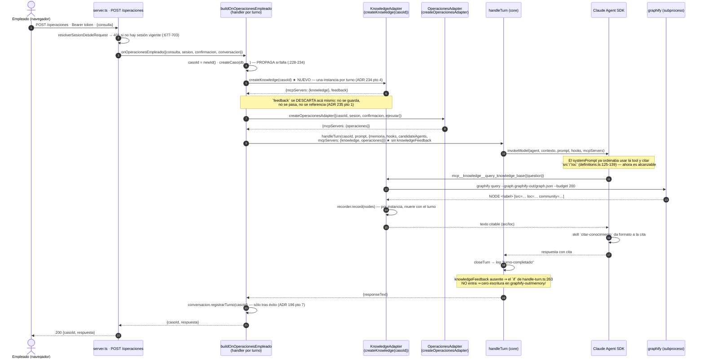

# Diseño técnico: el chat web del empleado alcanza la base de conocimiento interna

**Change**: `conocimiento-chat-empleado` · **Propuesta**: `openspec/changes/conocimiento-chat-empleado/proposal.md` (ADR 234-236, R1-R8, RD-112/113).

**Numeración**: este diseño **desarrolla** ADR **234, 235 y 236** —ya abiertos y fijados por la propuesta— y **resuelve RD-112 y RD-113**. ★ **No abre ningún ADR nuevo ni ninguna RD nueva**: los rangos **237+** y **RD-114+** pertenecen a los tres changes hermanos que se escriben en paralelo (`consulta-solicitud-propia`, `visibilidad-a2a-entrante-chat`, `consulta-kpi-a2a-chat`). Las dos colisiones de trazabilidad conocidas —la histórica **ADR 174-187/RD-94** y la doble asignación **227/228** (`ergonomia-canal-empleado` v3.11 vs. `devolucion-sin-token-dos-personas` v3.12)— **no se reabren y no se empeoran**: este diseño no cita 227/228 como fundamento de ninguna decisión propia, y cuando el código vivo las menciona (`build-on-operaciones-empleado.ts:121,186,194`) **esas líneas no se tocan**.

> **Nota de proceso**: este ejecutor no tiene herramienta de shell (sólo `Read`/`Edit`/`Write`/`Grep`/`Glob`), así que **no pudo correrse `graphify query`** pese al hook del repo. Misma nota y mismo criterio que `operaciones-negocio-conversacionales`, `autorizacion-empleado`, `chat-web-empleado`, `aprobacion-conversacional-hitl`, `ergonomia-canal-empleado` y la propia propuesta de este change ya dejaron escritos. **Toda afirmación de abajo está verificada por `Read`/`Grep`/`Glob` con archivo:línea en ESTA fase** — releída del fuente sobre `hito/v3.12-devolucion-sin-token-dos-personas`, no heredada del reporte de exploración ni de la propuesta.

---

## 0. Hallazgos de esta fase — cinco cosas que la propuesta no pudo ver

Ninguno cambia una decisión del checkpoint. Cuatro **abaratan** la implementación; el quinto **cambia el orden de las tareas**.

### 0.1 ★ El costo de R7 está sobreestimado: `createKnowledge` requerido cuesta **una línea**, no diez sitios de llamada

La propuesta estimó que hacer `createKnowledge` requerido "toca ~10 sitios de llamada" (**R7**) y lo dejó como el argumento en contra de la opción recomendada. **Verificado por `Grep` sobre `build-on-operaciones-empleado.test.ts`: hay 21 invocaciones de `makeBaseDeps(...)` (`:217,235,253,269,288,303,320,338,356,376,398,458,541,594,619,643,690,714,737,796,864`), y las 21 pasan por el MISMO helper** declarado en `:186-200`. Ninguna construye un `BuildOnOperacionesEmpleadoDeps` literal por su cuenta.

Y por `Grep` sobre todo `src/`: los únicos consumidores del tipo son `main.ts:501` y ese helper. `main.test.ts` **no construye deps** — espía `buildOnOperacionesEmpleado` con `vi.fn(actual)` (`:71-74`) y deja correr el `main.ts` real, así que hereda el campo nuevo sin tocar una línea.

**Consecuencia**: el campo requerido cuesta **una línea dentro de `makeBaseDeps`** más una fábrica de doble de ~6 líneas. **El argumento de R7 se disuelve y la recomendación de la propuesta (REQUERIDO) queda sin contrapeso.** Se ejecuta en **RD-112** (§6).

### 0.2 ★ El doble de `KnowledgeAdapter` que RD-112 pedía inventar **ya existe, literal, en el repo**

RD-112 pedía definir "forma del doble de `KnowledgeAdapter` en `makeBaseDeps` para que **ningún test toque el binario `graphify` real**". No hay nada que diseñar: `build-on-a2a-entrante.test.ts:470-473` ya lo escribió, y es de tres líneas:

```ts
const createKnowledge = (): KnowledgeAdapter => ({
  mcpServers: { [KNOWLEDGE_MCP_SERVER_NAME]: {} as never },
  feedback: { saveTurnResult: vi.fn(), discardPendingCitations: vi.fn() },
});
```

**Nunca invoca `createKnowledgeAdapter`**, así que no hay `execFile`, no hay `resolveGraphifyConfig`, no hay subproceso. Se copia verbatim. §6 lo fija.

### 0.3 ★ `knowledgeFeedback` es **opcional** en `HandleTurnDeps` — el invariante negativo del ADR 235 se afirma sobre la **ausencia de la clave**, no sobre un `undefined`

Verificado: `HandleTurnDeps.knowledgeFeedback?: KnowledgeFeedbackPort` (`handle-turn.ts:199`) y el consumo es `if (knowledgeFeedback !== undefined)` (`:263`). Con `exactOptionalPropertyTypes: true` (tsconfig del repo, `openspec/config.yaml:4`), **no pasar la clave deja el objeto literalmente sin la propiedad**, no con valor `undefined`.

**Consecuencia para RD-112**: la aserción correcta es `expect(deps).not.toHaveProperty("knowledgeFeedback")` sobre `mockedHandleTurn.mock.calls[0]?.[2]` — **nunca** un `toBeUndefined()` sobre `deps.knowledgeFeedback`, que pasaría igual si alguien pasara `knowledgeFeedback: undefined` explícito, y **nunca** un `toContain` sobre el texto del archivo (la propuesta lo exigió explícitamente en RD-112, y con razón: un test que lee su propio fuente se rompe con cualquier refactor y no prueba comportamiento).

### 0.4 ★ Construir el `KnowledgeAdapter` **no toca el binario ni el disco** — por eso el precedente "sin `try/catch`" es el correcto, y no por descuido

La propuesta no lo analizó y es lo que define el manejo de fallo. Verificado leyendo `adapters/knowledge/index.ts:73-150` completo:

| Paso de `createKnowledgeAdapter` | ¿Puede fallar? | Verificación |
|---|---|---|
| `resolveGraphifyConfig()` | **No, por contrato escrito**: *"Never throws — this adapter's configuration is best-effort by design"* | `knowledge/config.ts:27-32,96-105` — sólo lee `process.env` y aplica defaults |
| `createCitedNodesRecorder()` | No — estructura en memoria | `index.ts:81` |
| `createSdkMcpServer({...})` | In-process, sin puerto, sin subproceso, sin FS | `index.ts:91-114` |
| `execFile` de `graphify` | **No ocurre acá**: sólo dentro del handler de la tool (`runGraphifyQuery`, `:87`) y de `saveTurnResult` (`:130`), o sea **durante** el turno, no al construir | `index.ts:87,111,130` |

**Conclusión**: un fallo de `createKnowledge(casoId)` es estructuralmente casi imposible, y si ocurriera sería un bug de programación, no una condición de entorno. **Por eso este diseño NO envuelve la llamada en `try/catch`** — exactamente como `buildOnSoporte` (`build-on-soporte.ts:110`, línea desnuda entre `buildSoportePrompt` y `handleTurn`). El precedente de `build-on-a2a-entrante.ts:173` **parece** distinto porque la llamada vive dentro de un `try`, pero ese `try` no es defensa del conocimiento: es el `try` de **todo** `ejecutarTurno`, que existe porque ese handler **nunca puede rechazar** (contrato del módulo, `:135-136`) ya que corre sin `await` y un rechazo sería un `unhandledRejection`. **Acá hay un caller esperando la promesa** (`server.ts:729-745`), así que propagar es correcto y el módulo ya lo declara: *"PROPAGA `TurnFailedError`"* (`build-on-operaciones-empleado.ts:36-38`). §3 pto 5 lo fija con su consecuencia HTTP exacta.

### 0.5 ★ La evidencia del "antes" (**R1**) hay que capturarla **antes de escribir el rojo**, o se pierde

La propuesta exige *"la captura del comportamiento ANTES del cambio"* como criterio de éxito (**R1**), pero no dijo **cuándo**. Es un orden de tareas, no un detalle: una vez cableado el servidor, el comportamiento anterior **no se puede volver a observar** sin revertir el código o levantar el arnés desde un commit viejo. **Instrucción para `sdd-tasks`: la captura del "antes" es la TAREA 1 del hito, anterior al rojo de TDD, y no toca ni una línea de código.** §10.4.

---

## 1. Qué NO se reabre acá

Fijado por la propuesta y consumido como dado: el conocimiento entra por `mcpServers` del turno y **no** como operación de `OPERACIONES_NEGOCIO` (**ADR 234**); el turno **no** cablea `knowledgeFeedback` (**ADR 235**); el change **no** introduce filtrado del vault por rol ni auditoría de consultas (**ADR 236**); la tool `consultas` **queda colgante a propósito** y no se cablea; `allowedTools`, los dos prompts y la skill `citar-conocimiento` **no se tocan**.

Y las dos reglas duras de `AGENTS.md` atraviesan todo: **`src/core/` nunca importa de `src/adapters/*`**, y **ningún adaptador se comunica directamente con otro adaptador**. ★ **Este change no agrega ni un import en ninguna de las dos direcciones prohibidas** — §4.3 lo verifica archivo por archivo. Tampoco toca el resto del stack no negociable: sin SQLite nuevo (cero migraciones), sin Ink, sin A2A, y con `vitest` + TDD estricto (§10).

---

## 2. Estado actual vs. estado deseado del wiring

### 2.1 Lo que recibe hoy `buildOnOperacionesEmpleado`

`BuildOnOperacionesEmpleadoDeps` declara **catorce** campos (`build-on-operaciones-empleado.ts:89-109`): `db`, `memory`, `hooks`, `ventasConfig`, `notifier`, `baseUrlPublica`, `riesgoCredito?`, `reporteStore?`, `registro?`, `despacharDeps`, `newId?`, `newToken?`, `now?`, `logDeps?`. **Ninguno es de conocimiento** — verificado campo por campo.

El handler devuelto arma **un solo** servidor MCP por turno y se lo pasa a `handleTurn`:

```ts
// build-on-operaciones-empleado.ts:240-271 (HOY)
const operacionesAdapter = createOperacionesAdapter({ casoId, sesion: input.sesion, confirmacion: input.confirmacion, ejecutar });
// …
const result = await handleTurn(casoId, prompt, {
  memory: memoriaConversacional,
  hooks,
  candidateAgents,
  ...(logDeps ? { logDeps } : {}),
  mcpServers: operacionesAdapter.mcpServers,   // ← un solo servidor
});                                             // ← sin knowledgeFeedback
```

Y `main.ts:501-512` lo construye **sin** `createKnowledge`, pese a que la variable está en scope desde `main.ts:269` y ya alimenta a `buildOnSoporte` (`:406`) y a `buildOnA2AEntrante` (`:683`).

### 2.2 Comparación de los cuatro turnos del arnés

| Turno | Composition root | `mcpServers` | `knowledgeFeedback` | Autenticación |
|---|---|---|---|---|
| TUI (mensaje libre) | `build-on-submit.ts` | conocimiento | sí | sesión de terminal |
| `POST /soporte` | `build-on-soporte.ts:112-119` | conocimiento | **sí** | ★ **ninguna** (`server.ts:551-583`, sin `esAutorizado`) |
| A2A entrante | `build-on-a2a-entrante.ts:176-187` | conocimiento + consultas | **sí** | token de servicio, agente de tercero |
| **`POST /operaciones` (chat de empleado)** | `build-on-operaciones-empleado.ts:265-271` | **sólo operaciones** | **no** | `Bearer <token>` de sesión vigente (`server.ts:677-703`) |

★ **La fila de abajo es la anomalía que este change corrige — en la columna de `mcpServers` únicamente.** La columna de `knowledgeFeedback` **se conserva distinta a propósito** (ADR 235, §4): es la única fila cuyo `answer` puede contener `clienteId`, montos y `ventaId`.

### 2.3 Estado deseado — el diff de producción completo

```ts
// 1) build-on-operaciones-empleado.ts — import (molde build-on-soporte.ts:39)
import type { KnowledgeAdapter } from "./adapters/knowledge/index.js";

// 2) BuildOnOperacionesEmpleadoDeps, campo REQUERIDO, inmediatamente después de `hooks` (:92)
  /**
   * La MISMA fábrica por `casoId` que `main.ts` ya reparte a la TUI, a
   * `/soporte`, a los webhooks y al turno A2A entrante — un `KnowledgeAdapter`
   * por turno (ADR 234 pto 3), nunca uno por proceso. De lo que devuelve, este
   * módulo consume SÓLO `mcpServers`: `feedback` NO se cablea (ADR 235).
   */
  readonly createKnowledge: (casoId: string) => KnowledgeAdapter;

// 3) destructuring (:163) — se agrega `createKnowledge`
const { db, memory, hooks, ventasConfig, notifier, baseUrlPublica, createKnowledge, despacharDeps, logDeps } = deps;

// 4) dentro del handler, DESPUÉS de createCaso, junto a `prompt`/`candidateAgents` (:237-238)
const knowledge = createKnowledge(casoId);

// 5) handleTurn (:270) — unión exacta, y NINGÚN knowledgeFeedback
  mcpServers: { ...knowledge.mcpServers, ...operacionesAdapter.mcpServers },
```

```ts
// 6) main.ts:501-512 — UNA línea; la variable ya está en scope desde :269
const onOperacionesEmpleado = buildOnOperacionesEmpleado({
  db,
  memory,
  hooks,
  createKnowledge,   // ★ conocimiento-chat-empleado, ADR 234 — MISMA fábrica que `onSoporte` (:406)
                     //   y que el turno A2A entrante (:683). Sólo `mcpServers`: el feedback
                     //   NO se cablea en este canal (ADR 235).
  ventasConfig,
  // … el resto sin cambio
});
```

**Total: ~7 líneas de código ejecutable + ~10 de doc-comment de deps** (§9).

### 2.4 El doc-comment R3 — reemplazo literal, para que `sdd-apply` no improvise

`build-on-operaciones-empleado.ts:25-34` dice hoy que este módulo **NO** recibe `createKnowledge` y que la tool *"sería inalcanzable en runtime"*. **Tras el change eso es falso**, así que reescribirlo no es higiene cosmética: es impedir que el archivo mienta sobre sí mismo. Texto de reemplazo:

```
 * `mcpServers` es la UNIÓN EXACTA de dos servidores construidos POR TURNO: el
 * de la tool `operaciones` (`adapters/operaciones/index.ts`, vía
 * `createOperacionesAdapter`) y el de conocimiento (`adapters/knowledge/index.ts`,
 * vía `createKnowledge(casoId)` — `conocimiento-chat-empleado`, ADR 234). El
 * "gap conocido R3" que este doc-comment declaraba —la tool de conocimiento
 * listada en `allowedTools` por el spread de `CONVERSATIONAL_AGENT` pero sin
 * servidor registrado para este turno, o sea inalcanzable en runtime— queda
 * CERRADO. La frontera de autorización sigue siendo `mcpServers` por turno,
 * nunca `allowedTools` (ADR 176): `mcp__consultas__consultar_negocio` sigue
 * listada y sigue SIN servidor, deliberadamente.
 *
 * `knowledgeFeedback` NO se pasa, a diferencia de `buildOnSoporte` y
 * `buildOnA2AEntrante` (ADR 235): `feedback.saveTurnResult` escribe
 * `graphify-out/memory/*.md`, que `POST /soporte` sirve SIN autenticación y que
 * el turno A2A entrante sirve a terceros — cablearlo convertiría este canal
 * autenticado, cuyo `answer` puede traer `clienteId`, montos y `ventaId`, en
 * escritor de un almacén público. Hay un test que FALLA si alguien lo "completa"
 * por simetría. El `CitedNodesRecorder` es por instancia de `KnowledgeAdapter`
 * (`adapters/knowledge/index.ts:81`) y acá hay una por turno: no drenarlo no
 * filtra nada entre turnos.
```

---

## 3. ADR 234 — el conocimiento entra por `mcpServers` del turno, no por el contrato de operaciones

**Contexto.** El chat de empleado autenticado es el único de los cuatro turnos del arnés sin acceso a la base de conocimiento interna, mientras su `systemPrompt` le promete la tool al modelo (`definitions.ts:125-139`, releído en esta fase) y su `allowedTools` la lista (`:158`, heredada por spread en `:258`). Hay exactamente dos formas de cerrarlo: **registrar el servidor MCP que ya existe**, o **crear una operación `consultar_conocimiento`** dentro de `OPERACIONES_NEGOCIO`.

**Decisión: se registra el servidor MCP en el turno**, con estas cinco propiedades:

1. **La frontera de autorización es `mcpServers`, no `allowedTools`** — decisión tomada en ADR 176 y escrita en el propio código: *"Que figure en `allowedTools` no la vuelve alcanzable: la frontera real es `mcpServers` por turno"* (`definitions.ts:154-157`, verbatim). ★ **Lo único que este change concede es registrar el servidor. `allowedTools` no cambia ni una entrada** (§7).
2. **La unión es exacta y con test**: `Object.keys(mcpServers).sort()` === `["knowledge", "operaciones"]` — nombres verificados en el fuente, no supuestos: `KNOWLEDGE_MCP_SERVER_NAME = "knowledge"` (`core/knowledge/knowledge-contract.ts:17`) y `OPERACIONES_MCP_SERVER_NAME` (`core/operaciones/operaciones-contract.ts:29`). **Nunca `consultas`** (`CONSULTAS_MCP_SERVER_NAME`, `core/agents/consultas-negocio-tool.ts`). Molde literal del test de "UNIÓN EXACTA" de `build-on-a2a-entrante.test.ts:467-509`, incluida su nota *"Igualdad de CONJUNTO, nunca `contains`"* (`:499`).
3. **Orden del spread: conocimiento primero, operaciones después** — `{ ...knowledge.mcpServers, ...operacionesAdapter.mcpServers }`, idéntico a `build-on-a2a-entrante.ts:185`. **No hay colisión posible de claves** (`"knowledge"` ≠ `"operaciones"`, verificado en las dos constantes), así que el orden no cambia el resultado; se fija igual **para que el diff sea comparable línea a línea con su precedente** y para que, si algún día dos adaptadores colisionaran, la regla escrita sea *"el último gana, y el último es el servidor propio del canal"*. RD-112 lo cierra (§6 pto 2).
4. **Un `KnowledgeAdapter` por turno, nunca uno por proceso.** `createKnowledge(casoId)` se llama **dentro** del handler devuelto, con el `casoId` que ese handler ya crea (`:223`) — la misma fábrica por `casoId` que `main.ts:250-256` reparte al resto del arnés. **R1 de Hito 3 (instancia única compartida) no se reintroduce.** Importa además por el `CitedNodesRecorder`, que es **por instancia** (`adapters/knowledge/index.ts:81`): un turno no puede heredar las citas del anterior. Tiene test propio (§10.2).
5. **Fallo al construir el servidor: propaga, sin `try/catch`** (§0.4). El handler ya declara *"PROPAGA `TurnFailedError`"* (`:36-38`), y `server.ts:737-756` traduce cualquier rechazo a **`502 {"error":"error interno"}`** sin filtrar el mensaje. La única consecuencia observable sería una fila en `casos` sin turno asociado —el `createCaso` (`:228-234`) ya corrió— y **eso no es nuevo**: pasa hoy con cualquier fallo de `handleTurn`, y es idéntico a `buildOnSoporte`, que también llama `createKnowledge` después de `createCaso` (`build-on-soporte.ts:100-110`). ★ **Envolver esta línea en un `try/catch` "por las dudas" sería peor**: degradaría silenciosamente el turno a un chat sin conocimiento, que es exactamente el estado que este change viene a eliminar, y lo haría invisible.

**Alternativas consideradas**:

| Opción | Por qué se rechaza |
|---|---|
| **Operación `consultar_conocimiento` en `OPERACIONES_NEGOCIO`** | Rechazo **arquitectónico**, no de esfuerzo: el dispatcher es núcleo (`core/operaciones/ejecutar-operacion.ts`) y `AGENTS.md` prohíbe que importe adaptadores, así que haría falta un `KnowledgePort` en `core/` + un delegador + una fila en las tres tablas de `validar-operacion.ts` + un campo `question` de **texto libre** en el zod plano del adaptador, rompiendo el invariante *"sólo identificadores estructurados"* que hoy sólo `motivo` excepciona (RD-106). Sube el conteo 10→11, obliga a un delta de `herramienta-operaciones-negocio` y **serializa este change contra los tres hermanos**. Todo eso **para duplicar una tool que ya existe y que los otros tres turnos ya usan** |
| **Cablearlo en `CONVERSATIONAL_AGENT`** | **Inaplicable**, verificado releyendo: `CONVERSATIONAL_AGENT` es un `AgentDefinition` (`definitions.ts:120-160`) y no tiene campo `mcpServers`; los servidores viven en `HandleTurnDeps` (`handle-turn.ts:189`). No hay dónde ponerlo |
| **`createKnowledge` en el closure de construcción, instanciando UNA vez fuera del handler** | Sería una línea menos y **reintroduce R1 de Hito 3**: un `CitedNodesRecorder` compartido entre todos los turnos del proceso. El `casoId` ni siquiera existe en ese scope (`:223`) |
| **`createKnowledge` opcional con default** | RD-112 lo rechaza por escrito (§6 pto 1) |

**Consecuencias**: ~7 líneas de código ejecutable en dos archivos, ~10 de doc-comment. Cero núcleo, cero contrato de operaciones, cero migraciones, cero dependencias. El costo de tests es **una línea en `makeBaseDeps` más una fábrica de doble de seis** (§0.1), no los diez sitios de llamada que temía R7.

---

## 4. ADR 235 — el chat **no** cablea `knowledgeFeedback`

**Contexto.** `KnowledgeAdapter` devuelve `{ mcpServers, feedback }` (`adapters/knowledge/index.ts:60-64,146-149`). Los otros dos composition roots que lo consumen pasan **los dos** campos a `handleTurn` (`build-on-soporte.ts:117-118`, `build-on-a2a-entrante.ts:185-186`). La simetría invita a hacer lo mismo acá. **La respuesta es no, y el motivo es de seguridad.**

Los hechos, reverificados en esta fase:

- `feedback.saveTurnResult` ejecuta `graphify save-result --question … --answer … --nodes …` **sólo si el modelo citó al menos un nodo** (`index.ts:120-131`: `recorder.drain()`, corte en `nodes.length === 0`).
- Eso deja archivos en `graphify-out/memory/*.md` — **39 hoy**, recontados por `Glob` en esta fase.
- **Esos archivos ya son nodos consultables del grafo**, y el grafo es lo que sirven `POST /soporte` (**sin autenticación**: el único `esAutorizado` vive en la rama de `/ventas`, `server.ts:386`) y el turno A2A entrante (hacia agentes de terceros).
- El `question` persistido es **el prompt completo**, no la pregunta del empleado: `handle-turn.ts:265-268` pasa `question: prompt`. **La evidencia está en los nombres de archivo del vault**, reverificada por `Glob`: `query_20260905_163414_sos_el_agente_de_soporte_al_cliente_de_este_produc.md`, `query_20260910_025909_sos_el_agente_que_atiende_una_solicitud_recibida_p.md`. Se nombran con el boilerplate, no con la consulta.
- El `answer` se guarda hasta `MAX_ANSWER_CHARS = 4_000` (`index.ts:43,127`), y en el chat de empleado un `answer` puede contener `clienteId`, montos, `ventaId` y detalle de solicitudes internas: es el canal que ejecuta las diez operaciones de negocio.

**Decisión**:

1. **`handleTurn` en este turno no recibe `knowledgeFeedback`.** Se cablea **sólo** `mcpServers`. Como el campo es opcional (`handle-turn.ts:199`), omitirlo es legal por tipo y **el consumo queda estructuralmente apagado**: `if (knowledgeFeedback !== undefined)` (`:263`) nunca entra. **No hay rama muerta ni flag: hay una clave ausente.**
2. **El motivo queda escrito en el doc-comment** (§2.4), para que no se "arregle" en un refactor distraído: cablearlo convertiría una conversación **autenticada** en escrituras dentro de un almacén servido **sin autenticación**. Es una **fuga cruzada de canal autenticado a canal público, mediada por el vault**; que sea indirecta la hace peor, porque nadie la ve en el diff del chat.
3. **No drenar el recorder no filtra nada entre turnos.** El `CitedNodesRecorder` es por instancia (`index.ts:81`) y acá hay una instancia por turno (ADR 234 pto 4): muere con el turno, junto con el servidor MCP. ★ **No hace falta llamar `discardPendingCitations` por higiene** — y llamarlo sería peor que inútil: obligaría a pasar `knowledge.feedback` a algún lado, que es justo lo que esta decisión prohíbe.
4. **Invariante negativo con test** (§10.2): una aserción que **falla si el turno pasa `knowledgeFeedback`**. Un comentario se borra; un test no.
5. **Consecuencia aceptada y escrita**: el chat **no alimenta** el vault. Las consultas de conocimiento del empleado no quedan como memoria reutilizable. Es el precio, y es el correcto: el canal que sí alimenta el vault (`/soporte`) es el que no tiene datos de negocio en su respuesta.
6. ★ **Corolario verificable en la prueba manual, que la propuesta no pidió y este diseño agrega**: como `saveTurnResult` nunca se invoca, el log del turno **no puede** traer `conocimiento-guardado` ni `conocimiento-sin-consulta` (los dos únicos eventos que emite el feedback, `index.ts:123,131,134`), y `graphify-out/memory/` **tiene que quedar con exactamente los mismos archivos antes y después** del turno de prueba. **Es la verificación end-to-end del ADR 235, cuesta un `ls` y va a la evidencia** (§10.4).

**Alternativas consideradas**:

| Opción | Por qué se rechaza |
|---|---|
| Cablear el feedback igual que `buildOnSoporte` | Ptos 2 y 5. Es el "arreglo obvio" que **R4** predice y que el test del pto 4 bloquea |
| Cablearlo con un `question` saneado (sólo la consulta, sin boilerplate) | Arregla el problema del **nombre de archivo**, no el del `answer` — que es el que filtra datos de negocio. Y exigiría cambiar la firma de `saveTurnResult` o el prompt: núcleo y contrato compartido con los otros tres turnos. **Si el stakeholder lo quiere, es su propio change** |
| Cablearlo y limpiar el vault a mano si aparece un dato sensible | Inviable y peor: los `.md` ya escritos **son nodos del grafo**; revertir el código no los borra (§11 pto 3) |
| Un vault particionado por canal | **Inexistente**: `adapters/knowledge/config.ts:11-25,96-105` no tiene noción de identidad, rol ni partición — sólo `bin`, `graphPath`, `budget`, `queryTimeoutMs`. Inventar particiones para habilitar el feedback es construir un sistema nuevo para resolver un problema que se resuelve no haciendo nada |

---

## 5. ADR 236 — sin filtrado del vault por rol, y dicho explícito

**Contexto.** "¿Un empleado cualquiera debería poder consultar todo el vault desde el chat?" es la pregunta que aparece sola al leer el diff. Dejarla implícita sería peor que contestarla mal.

**Decisión**:

1. **No se agrega filtrado por rol, identidad ni partición.** El turno del chat verá **exactamente el mismo vault** que ven hoy la TUI y `POST /soporte`.
2. **El motivo es de proporción, verificado**: `POST /soporte` sirve el vault **sin ninguna autenticación** (`handleSoporte`, `server.ts:551-583`, sin `esAutorizado`), mientras el chat exige `Bearer <token>` de sesión vigente y devuelve `401` antes de invocar nada (`server.ts:677-703`, y su propio doc-comment: *"`onOperacionesEmpleado` JAMÁS se invoca"* sin sesión, `:677`). **Tras este change, el canal autenticado expone estrictamente MENOS conocimiento que el que ya está expuesto al público anónimo.** Filtrar por rol acá, dejando `/soporte` abierto, sería teatro de seguridad.
3. **Sin auditoría de consultas de conocimiento**, coherente con los otros tres turnos: ninguno escribe fila en `registro_acciones_empleado` por consultar el vault — `handleTurn` no conoce ese puerto, y el único escritor del chat es `ejecutarOperacion` por operación de negocio. **Este change no estrena esa asimetría**, y si quisiera hacerlo tendría que meter el `RegistroAccionesEmpleadoPort` en un camino que hoy no lo tiene: alcance filtrado.
4. ★ **Lo que sí hace este change es dejar la pregunta escrita, no resuelta**: **¿el vault es público por diseño?** Es una postura **preexistente** —la decidió v1.3 al abrir `/soporte` sin auth, no este change— y merece su propio análisis. Queda como punto 3 del checkpoint.
5. ★ **Matiz que este diseño agrega, verificado leyendo el vault**: entre los 39 archivos de `graphify-out/memory/` hay dos llamados `query_20260912_032234_cuál_es_el_código_secreto_de_verificación_qa.md` y `query_20260912_032447_…` — o sea que el vault **ya fue sondeado deliberadamente** buscando secretos, por el propio proceso de verificación del arnés. **Eso refuerza el pto 2, no lo debilita**: el canal por el que se hizo ese sondeo es el anónimo, y sigue abierto con o sin este change.

**Alternativas consideradas**: filtrar el vault por rol sólo en el chat (**rechazada**, pto 2); bloquear H1 hasta resolver la postura del vault (**rechazada**: bloquear un canal autenticado por una exposición que ya existe en un canal anónimo no reduce riesgo — sólo mantiene rota una funcionalidad).

---

## 6. RD-112 resuelta — forma exacta del wiring y de su doble en tests

La propuesta difirió cuatro preguntas concretas. Las cuatro, con su verificación:

1. **¿`createKnowledge` requerido u opcional? → REQUERIDO, sin default.** La recomendación de la propuesta queda ratificada y, con §0.1, **sin contrapeso de costo**: son dos líneas de test, no diez sitios. El argumento de fondo es el mismo que ya aplican `buildOnSoporte` (`build-on-soporte.ts:56`) y `buildOnA2AEntrante` (`build-on-a2a-entrante.ts:130`): **un opcional silencioso reintroduce exactamente el bug que este change cierra, pero sin el doc-comment que antes lo declaraba.** Un `createKnowledge?` con default significaría que olvidarlo en `main.ts` compila y corre — y el chat volvería a tener la tool inalcanzable, sin que ningún test ni ningún lector se enteren. ★ **Contraste deliberado con `reporteStore?`/`registro?`/`riesgoCredito?` de este mismo tipo**: esos son opcionales porque su ausencia tiene un **comportamiento definido y equivalente** (default inline idéntico al de `build-on-comando-empleado.ts`, `:178-185`; o A2A apagado). La ausencia de conocimiento **no** tiene comportamiento equivalente: tiene un canal roto.
2. **Orden del spread y colisión de claves → `{ ...knowledge.mcpServers, ...operacionesAdapter.mcpServers }`**, molde `build-on-a2a-entrante.ts:185`. **No hay colisión posible** (claves `"knowledge"` y `"operaciones"`, verificadas en `knowledge-contract.ts:17` y `operaciones-contract.ts:29`); si algún día la hubiera, **gana el último spread, que es el servidor propio del canal**. El test de igualdad de conjunto (§10.2) detecta cualquier pérdida de clave sin depender de esta regla.
3. **Doble de `KnowledgeAdapter` en `makeBaseDeps` → copiado verbatim de `build-on-a2a-entrante.test.ts:470-473`** (§0.2), que **nunca invoca `createKnowledgeAdapter`** y por lo tanto **nunca puede tocar el binario `graphify`**. Forma exacta:

   ```ts
   // BaseDepsOverrides (:178-184) gana un campo:
   readonly createKnowledge?: (casoId: string) => KnowledgeAdapter;

   function fakeKnowledge(): KnowledgeAdapter {
     return {
       mcpServers: { [KNOWLEDGE_MCP_SERVER_NAME]: {} as never },
       feedback: { saveTurnResult: vi.fn(), discardPendingCitations: vi.fn() },
     };
   }

   // dentro de makeBaseDeps (:186-200), UNA línea:
   createKnowledge: overrides.createKnowledge ?? (() => fakeKnowledge()),
   ```

   ★ **`fakeKnowledge` devuelve el `feedback` completo aunque el módulo no lo consuma**: el doble implementa el contrato entero del puerto, no una versión recortada a lo que hoy se usa. Si mañana alguien cablea el feedback, el doble no es la razón por la que el test pasa — la razón la da el invariante negativo del pto 4.
4. **Forma del test de ausencia de `knowledgeFeedback` → sobre el ARGUMENTO de `handleTurn`, nunca sobre el texto del archivo**, y con `not.toHaveProperty` (§0.3):

   ```ts
   const deps = mockedHandleTurn.mock.calls[0]?.[2];
   expect(deps).toBeDefined();
   expect(deps).not.toHaveProperty("knowledgeFeedback");
   ```

---

## 7. `allowedTools`, `systemPrompt` y la skill `citar-conocimiento`: **qué cambia — nada**

Verificado leyendo en esta fase, no asumido:

| Superficie | Estado verificado | ¿Cambia? |
|---|---|---|
| `CONVERSATIONAL_AGENT.allowedTools` | `[KNOWLEDGE_TOOL_QUALIFIED_NAME, "Skill", CONSULTAS_TOOL_QUALIFIED_NAME]` — **tres** entradas, `operaciones` **NO** está (`definitions.ts:158`) | **No** |
| `construirAgenteEmpleadoOperaciones().allowedTools` | `[...CONVERSATIONAL_AGENT.allowedTools, OPERACIONES_TOOL_QUALIFIED_NAME]` — **cuatro** (`definitions.ts:258`) | **No** |
| `CONVERSATIONAL_AGENT.systemPrompt` | Ya le dice al modelo que tiene `mcp__knowledge__query_knowledge_base` y que **cite `src` y `loc`** (`definitions.ts:125-139`) | **No** — tras el change deja de mentir, sin tocar una letra |
| `INSTRUCCION_OPERACIONES_EMPLEADO` | No menciona conocimiento (`definitions.ts:207-242`); texto duplicado a propósito y pineado por `definitions.test.ts` | **No** |
| `buildOperacionesEmpleadoPrompt` (prompt sintético del turno) | ★ **`Grep` de `conocimiento|knowledge` sobre `core/ventas/soporte-prompt.ts`: CERO coincidencias** | **No** — §7.1 |
| `.claude/skills/citar-conocimiento/SKILL.md` | Leída entera: **agnóstica del canal**, opera sobre líneas `NODE … [src=… loc=…]` "que ya están en el contexto del turno", **no corre ninguna herramienta**, y se auto-descubre por `core/skills/descubrir-skills.ts` + `skills-habilitadas.ts` sin registro en código ni por canal | **No** |

★ **La skill es la pieza que hace que el change entregue *citas* y no sólo *acceso*.** Su `description` dispara cuando *"el turno ya tiene resultados del vault"*; hoy, en el chat, esa condición **nunca se cumple**. Tras el change se cumple, y la skill —sin un byte de diff— produce el formato `(docs/politicas.md, L10)` que el criterio de éxito exige. **Es el argumento más fuerte de que no hace falta tocar ningún prompt.**

### 7.1 Una inconsistencia menor que se deja intacta, y por qué

El `systemPrompt` del agente menciona el conocimiento; el **prompt sintético del turno** (`buildOperacionesEmpleadoPrompt`) no lo menciona. Queda así a propósito: los dos textos están **duplicados deliberadamente** entre `definitions.ts` y `soporte-prompt.ts` (criterio sostenido, reafirmado en ADR 233 pto 1) y **pineados con igualdad por `definitions.test.ts` y `soporte-prompt.test.ts`**. Agregar una línea "ya que estamos" costaría tocar dos textos pineados, dos tests y un delta de spec **para decirle al modelo algo que su `systemPrompt` ya le dice con más detalle**. ★ **No es un defecto que este change deba cerrar; es alcance que no se filtra.**

---

## 8. Diagrama de secuencia — un turno del chat con una consulta de conocimiento



**Camino de falla**, para que quede explícito: si `graphify` no está instalado o el grafo no existe, **el turno no falla** — la tool devuelve su texto de "no hay conocimiento disponible" y el `systemPrompt` ya instruye *"decíselo explícitamente al empleado en vez de inventar una respuesta"* (`definitions.ts:134-136`). Si fallara `createKnowledge` (§0.4: casi imposible), el rechazo propaga y `server.ts:752-755` responde **502** sin filtrar el mensaje.

---

## 9. Archivos a tocar — reconciliación contra el *Affected Areas* de la propuesta

| Archivo | Acción | Prod | Test/Docs | Qué cambia exactamente | ¿Coincide con la propuesta? |
|---|---|---|---|---|---|
| `src/build-on-operaciones-empleado.ts` | Modified | **~7** | — | `import type { KnowledgeAdapter }` (1), campo requerido en `BuildOnOperacionesEmpleadoDeps` (1 + ~6 de doc), `createKnowledge` en el destructuring (`:163`), `const knowledge = createKnowledge(casoId)` (1), `mcpServers` unión (`:270`, 1 línea reemplazada) | ✅ Sí |
| `src/build-on-operaciones-empleado.ts` (doc-comment R3) | Modified | ~20 | — | `:25-34` reemplazado por el texto literal de §2.4 (dos párrafos: unión exacta + por qué no hay feedback) | ✅ Sí — **obligatorio** |
| `src/main.ts` | Modified | **~4** | — | `createKnowledge,` en el objeto de `:501-512` + 3 líneas de comentario. Variable ya en scope (`:269`) | ✅ Sí |
| `src/build-on-operaciones-empleado.test.ts` | Modified | — | **~90** | Doc de módulo (`:9-11`) invertido; imports de `KNOWLEDGE_MCP_SERVER_NAME`/`CONSULTAS_MCP_SERVER_NAME`/`KnowledgeAdapter`; `fakeKnowledge()` (~6); 2 líneas en `BaseDepsOverrides`/`makeBaseDeps`; `:265-280` **invertido**; 3 tests nuevos (§10.2) | ✅ Sí — y **más barato** que R7 (§0.1) |
| `src/main.test.ts` | Modified | — | ~8 | Test de wiring: `buildOnOperacionesEmpleado` recibe `createKnowledge`. Molde literal del test de `credenciales` (`:137-145`) | ⚠️ **Adición de esta fase** — la propuesta no lo listaba (§10.3) |
| `docs/progreso/v3.13-conocimiento-chat-empleado/verificacion-manual-tarea-N.md` | New | — | ~70 | Antes y después (**R1**) + prueba del ADR 235 (§10.4). Molde `v3.12-…/verificacion-manual-tarea-27.md` | ✅ Sí |
| `openspec/changes/conocimiento-chat-empleado/specs/turno-empleado-autenticado/spec.md` | New | — | — | **Lo escribe `sdd-spec`, no este diseño.** Criterios que debe cumplir: §12 (RD-113) | ✅ Sí |
| ★ `src/core/**` | **Sin cambio** | **0** | — | **Invariante duro.** §4.3 abajo | ✅ Sí |
| ★ `src/core/agents/definitions.ts`, `src/core/ventas/soporte-prompt.ts` | **Sin cambio** | **0** | — | §7, verificado leyendo y por `Grep` | ✅ Sí |
| ★ `.claude/skills/citar-conocimiento/SKILL.md` y toda `.claude/skills/**` | **Sin cambio** | **0** | — | §7: agnóstica del canal, auto-descubierta | ✅ Sí |
| ★ `src/adapters/knowledge/**` | **Sin cambio** | **0** | — | Se consume tal cual: ni `index.ts`, ni `config.ts`, ni `DEFAULT_BUDGET`, ni `graphify-cli.ts` | ✅ Sí |
| ★ `src/adapters/web/server.ts`, rutas, payloads, CSP, `chat-client.ts`, `chat-page.ts` | **Sin cambio** | **0** | — | El contrato de `POST /operaciones` no cambia: entra `{consulta}`, sale `{casoId, respuesta}` | ✅ Sí |
| ★ `operaciones-contract.ts`, `validar-operacion.ts`, `ejecutar-operacion.ts`, `adapters/operaciones/index.ts` | **Sin cambio** | **0** | — | `OPERACIONES_NEGOCIO` sigue con **diez** (`operaciones-contract.ts:71-82`, pineado en `operaciones-contract.test.ts:54-67`). **Es lo que desacopla este change de los tres hermanos** | ✅ Sí |
| ★ Esquema / migraciones | **Sin cambio** | **0** | — | Cero migraciones: la próxima libre sigue siendo **`0015`** | ✅ Sí |
| ★ `package.json` | **Sin cambio** | **0** | — | Cero dependencias nuevas, criterio sostenido desde v3.2 | ✅ Sí |
| ★ `docs/ARC42_…md`, `README.md`, `docs/progreso/guia-verificacion-casos-de-uso.md` | **Sin cambio** (con una pregunta) | **0** | — | Ningún documento afirma que el chat no tenga conocimiento. La guía marca el caso 8 como **TUI** y sin tildar (`:249,367`) — ★ actualizarla es **opcional** y va al checkpoint (§13), no se fuerza acá | ⚠️ Precisión de esta fase |

**Total estimado**: **~31 líneas de producción** (incluido el doc-comment), **~98 de test**, ~70 de evidencia ⇒ **≈ 200 líneas de diff**. Muy por debajo del presupuesto de 400 (**R8**): **una sola PR**, sin `size:exception` y sin necesidad de slices.

### 9.1 La frontera hexagonal, verificada línea por línea

★ **`src/core/` no gana ni un import, ni directo ni transitivo.** El único import nuevo del change es `import type { KnowledgeAdapter } from "./adapters/knowledge/index.js"` **en `src/build-on-operaciones-empleado.ts`**, que **no es `src/core/` ni `src/adapters/`**: es el composition root del turno, vive en `src/` por diseño y su propio module doc lo declara (*"vive en `src/`, no dentro de ningún adaptador ni de `core/`, porque importa TANTO de `src/core/*` COMO de `src/adapters/memory/repository.ts`"*, `:5-10`). El archivo **ya importa de `adapters/memory` y `adapters/operaciones`** (`:57-58`), así que el import nuevo no estrena ninguna dirección. **Precedente idéntico y verificado**: `build-on-soporte.ts:39` importa exactamente el mismo tipo.

Y la segunda regla tampoco se roza: **ningún adaptador habla con otro**. El adaptador de conocimiento y el de operaciones **no se conocen** — los dos son construidos por separado por el composition root, y lo único que los pone en contacto es un literal de objeto (`{ ...a, ...b }`) que el SDK consume. **Si un día uno importara al otro, ese spread es el lugar donde se vería.**

---

## 10. Estrategia de tests — TDD estricto (rojo → verde → refactor)

`AGENTS.md`: *"TDD obligatorio (red → green → refactor) para toda tarea con lógica de negocio"*. `openspec/config.yaml`: `strict_tdd: true`, `test_command: npm test`.

### 10.1 El rojo inicial, y por qué es un rojo de verdad

**El test que hay que invertir es `build-on-operaciones-empleado.test.ts:265-280`**, hoy en verde afirmando **lo contrario** de lo que el change quiere:

```ts
it("pasa mcpServers con la tool de operaciones registrada (nunca la de conocimiento)", …)
expect(Object.keys(deps?.mcpServers ?? {})).toEqual([OPERACIONES_MCP_SERVER_NAME]);   // :276
```

★ **Este es el caso más limpio de TDD que puede haber: el rojo no hay que inventarlo, hay que descubrirlo — ya está escrito y hay que darlo vuelta.** El commit del rojo tiene que ser **visible y separado** del verde (`Success Criteria` de la propuesta).

**El rojo tiene dos mitades, y las dos cuentan**:

1. **Rojo de runtime**: la aserción invertida (`["knowledge","operaciones"]`) falla contra el código de hoy, que sólo registra uno.
2. ★ **Rojo de compilación**: apenas `makeBaseDeps` intente pasar `createKnowledge`, **`npm run typecheck` falla** porque el campo todavía no existe en el tipo. **Instrucción para `sdd-apply`: el rojo se declara con `npm test` Y `npm run typecheck`, los dos.** Es la prueba de que el campo es requerido y no opcional (§6 pto 1).

También hay que invertir el **doc de módulo** del test (`:9-11`), que hoy afirma *"nunca la de conocimiento — `BuildOnOperacionesEmpleadoDeps` no recibe `createKnowledge`"*. Va en el mismo commit que la aserción: un doc que contradice al test de abajo es exactamente el defecto que este change está cerrando en el fuente.

### 10.2 Los tests, uno por uno

| # | Capa | Qué prueba | Cómo | Estado inicial |
|---|---|---|---|---|
| 1 ★ | Unit | **Unión EXACTA**: `Object.keys(deps.mcpServers).sort()` === `[KNOWLEDGE_MCP_SERVER_NAME, OPERACIONES_MCP_SERVER_NAME].sort()`. Igualdad de **conjunto**, nunca `toContain` | `:265-280` invertido; molde `build-on-a2a-entrante.test.ts:498-502` | **ROJO** |
| 2 ★ | Unit | **Nunca `consultas`**: `expect(deps.mcpServers).not.toHaveProperty(CONSULTAS_MCP_SERVER_NAME)`, escrito contra la constante real (`core/agents/consultas-negocio-tool.ts`), **nunca un string literal** | Mismo `it` que el 1, molde `build-on-a2a-entrante.test.ts:505` | **ROJO** con el 1 |
| 3 ★★ | Unit | **NO se pasa `knowledgeFeedback`** (ADR 235 pto 4): `expect(deps).not.toHaveProperty("knowledgeFeedback")`. **Es el criterio con consecuencia de seguridad de este change** | `it` nuevo; §6 pto 4 | ★ **Nace VERDE** — ver 10.2.1 |
| 4 ★ | Unit | **Una instancia por turno, con el `casoId` del turno** (ADR 234 pto 4): un espía `createKnowledge` recibe **exactamente una** llamada por invocación del handler, con el `casoId` de ese turno (`"caso-1"`); **dos** invocaciones ⇒ dos llamadas con `casoId` **distintos** | `it` nuevo con `vi.fn()` y `newId: makeCounterNewId("caso")` | **ROJO** |
| 5 | Unit no-regresión | **`candidateAgents` sigue teniendo UN elemento** y el prompt sigue saliendo de `buildOperacionesEmpleadoPrompt` — el change no toca el agente ni el prompt (§7) | `:231-263`, **ya existen, no se tocan** | Verde, reverificar |
| 6 | Unit no-regresión | **Orden `createCaso` → `handleTurn`** y **propagación de `TurnFailedError`**: la línea nueva se mete entre medio y no puede alterarlos | `:208-229`, `:282-297`, **ya existen** | Verde, reverificar |
| 7 | Unit | **Ningún test toca el binario `graphify`**: el doble de §6 pto 3 nunca invoca `createKnowledgeAdapter` | Revisión de diff, más el hecho de que `fakeKnowledge` no importa el adaptador real | — |

#### 10.2.1 ★ El test 3 nace verde — y hay que decirlo, no disimularlo

El invariante negativo del ADR 235 **pasa hoy**, antes de escribir una línea, porque hoy no se pasa `knowledgeFeedback` a nadie. **Eso no es una violación de TDD**: el rojo del ciclo lo aportan los tests 1, 2 y 4. El test 3 es un **invariante negativo de regresión** —molde ADR 98 pto 4 / ADR 232, ya usado en este repo— cuyo valor es que **falle en el futuro**, el día que alguien "complete" el wiring por simetría (**R4**, el riesgo más probable del change).

★ **Pero un test que nunca se vio fallar no prueba que tenga dientes.** Instrucción para `sdd-apply`, y criterio para el Reviewer: **verificar el test 3 por mutación manual** — agregar temporalmente `knowledgeFeedback: knowledge.feedback` al `handleTurn`, confirmar que el test **falla**, revertir. **La evidencia de esa mutación (salida del `npm test` en rojo) va en el cuerpo del commit o en `docs/progreso/`.** Sin eso, es una aserción decorativa.

### 10.3 Test de composición en `main.ts` (adición de esta fase)

`main.ts` **no tiene hoy ninguna cobertura del wiring de conocimiento** (lo anotó la exploración, B.7). Con este change, el olvido que el change cierra **podría volver por `main.ts`** sin que ningún test del repo se entere: `build-on-operaciones-empleado.test.ts` prueba el módulo, no quién lo llama.

`main.test.ts` ya espía `buildOnOperacionesEmpleado` con `vi.fn(actual)` (`:71-74`) y ya tiene el molde exacto de la aserción (`expect(comandoMock.mock.calls[0]?.[0].credenciales).toBeDefined()`, `:144`):

```ts
it("pasa createKnowledge a buildOnOperacionesEmpleado (conocimiento-chat-empleado, ADR 234)", async () => {
  await import("./main.js");
  const { buildOnOperacionesEmpleado } = await import("./build-on-operaciones-empleado.js");
  const operacionesMock = vi.mocked(buildOnOperacionesEmpleado);
  expect(operacionesMock).toHaveBeenCalledTimes(1);
  expect(operacionesMock.mock.calls[0]?.[0].createKnowledge).toBeDefined();
});
```

**Ocho líneas, cero mocks nuevos.** ★ **Variante más fuerte, opcional**: afirmar que es la **MISMA** fábrica que recibe `buildOnSoporte` (`toBe`, molde del test de `reporteStore`, `:117-135`). Cuesta un `vi.mock` nuevo de `./build-on-soporte.js` (~4 líneas) y prueba *"una fábrica, cinco consumidores"* en vez de sólo *"está"*. **Recomendación: la versión corta es obligatoria; la fuerte queda a criterio de `sdd-tasks` según presupuesto.**

### 10.4 Verificación manual — lo único que los tests no pueden dar

**Tres cosas se verifican sólo a mano**, y las tres van a `docs/progreso/v3.13-conocimiento-chat-empleado/` (molde `v3.12-devolucion-sin-token-dos-personas/verificacion-manual-tarea-27.md`):

1. ★ **El "ANTES" (R1) — TAREA 1 DEL HITO, ANTES DEL ROJO** (§0.5). Con el código de hoy, desde el **chat web** (no la TUI), preguntar algo del vault (p. ej. *"¿cuál es la política de reembolsos de la empresa?"* — hay memoria de esa consulta exacta por TUI: `graphify-out/memory/query_20260912_035037_cuál_es_la_política_de_reembolsos_de_la_empresa.md`) y **capturar la respuesta textual**. La hipótesis es que el modelo no ve la tool y contesta de memoria **sin cita**, pero **no está confirmada** (R1): si el SDK hiciera otra cosa —un error visible al empleado, por ejemplo— **es un hallazgo que vuelve al Spec Author antes de seguir**, porque cambiaría el diagnóstico del gap.
2. **El "DESPUÉS"**: la **misma** pregunta, en el **mismo** canal, contestada **con cita de `src` real** (y `loc` cuando exista), en el formato de la skill `citar-conocimiento`. Se adjunta el `casoId` para correlacionar con el log del turno.
3. ★ **La prueba en vivo del ADR 235** (§4 pto 6), que es barata y cierra el criterio de seguridad end-to-end:
   - `graphify-out/memory/` tiene **exactamente los mismos archivos antes y después** del turno de prueba (**39 hoy**, recontados por `Glob` en esta fase) — se adjunta el conteo de las dos corridas;
   - el log del turno **no** contiene `conocimiento-guardado` **ni** `conocimiento-sin-consulta` (los dos únicos eventos del feedback, `adapters/knowledge/index.ts:123,131,134`), mientras **sí** contiene `operaciones-caso-creado` y `turno-completado`.

★ **Criterio de éxito, explícito para que nadie lo confunda (R2)**: el entregable es *"la tool es alcanzable y la respuesta cita una fuente real"*, **no** *"la respuesta es buena"*. Si la cita aparece pero el contenido es pobre, **el change está cumplido** y el problema es la calidad de recuperación (`DEFAULT_BUDGET = 200`, `adapters/knowledge/config.ts:20`), que es otro change. La guía ya marca el caso 8 como *"fallo pero funciona un poquito"* **en la TUI, que ya tiene la tool cableada** (`docs/progreso/guia-verificacion-casos-de-uso.md:367`).

---

## 11. Migración y rollback

**Sin migración.** Cero tablas, columnas, índices, backfill y estado de proceso nuevo. **La próxima migración libre sigue siendo `0015`, sin consumir.**

1. **El change es puramente aditivo y revertible con un `git revert`**: cero dependencias, cero contrato HTTP tocado, cero esquema.
2. **Revertir = quitar el campo de deps, la línea de instanciación, el spread y la línea de `main.ts`.** El turno vuelve a `mcpServers: operacionesAdapter.mcpServers` y el chat vuelve **exactamente** a la conducta de hoy (tool listada e inalcanzable). Nada más lo consume: `KnowledgeAdapter` es un tipo que el archivo importa y nadie más lee desde acá.
3. ★ **No hay rollback de datos posible ni necesario — y eso es consecuencia directa del ADR 235.** Como el chat **no** cablea el feedback, este change **no escribe ni un byte** en `graphify-out/memory/`. Si se hubiera cableado, revertir el código **no** revertiría los `.md` ya escritos: habría que borrarlos a mano **y regenerar el grafo**, porque esos archivos ya son nodos consultables. **Un change sin feedback es un change con rollback limpio; con feedback, no lo sería.**
4. **La instancia por turno se va con el turno** (ADR 234 pto 4): no queda singleton, ni recorder vivo, ni subproceso colgado. El servidor MCP es in-process y muere con el handler.
5. **Reversión parcial segura**: revertir sólo `main.ts` deja el tipo requerido sin proveedor ⇒ **falla el `typecheck`, no el runtime**. ★ **Es la propiedad que compra el campo requerido (§6 pto 1): no existe un estado intermedio silencioso.**

---

## 12. RD-113 resuelta — criterios que el delta de `turno-empleado-autenticado` DEBE cumplir

★ **Las specs las escribe `sdd-spec` en paralelo; este diseño no las redacta ni las toca.** Lo que RD-113 difirió a esta fase son los **criterios verificados** que ese delta tiene que satisfacer. Los cinco, con la verificación que los respalda:

1. **El requirement vigente `### Requirement: CONVERSATIONAL_AGENT.allowedTools tiene exactamente tres entradas…` (base `operaciones-negocio-conversacionales/specs/turno-empleado-autenticado/spec.md:40-47`) está DESACTUALIZADO y hay que corregirlo, no sólo agregarle vecinos.** Dice *"la tool de conocimiento, la tool de `operaciones`, y `"Skill"`"*. **Reverificado en esta fase (`definitions.ts:158,258`)**: `CONVERSATIONAL_AGENT.allowedTools` tiene **tres** entradas y son `[conocimiento, "Skill", consultas]` — ★ **`operaciones` NO está ahí**; quien tiene cuatro es la variante `construirAgenteEmpleadoOperaciones()`, que agrega `operaciones` por spread.
2. **El estado se fija POR SUPERFICIE**: base = 3 (`conocimiento`, `"Skill"`, `consultas`), variante de operaciones = 4 (las tres anteriores + `operaciones`). Dos afirmaciones separadas, nunca una sola que promedie las dos.
3. **La garantía que sí importa se conserva intacta y sin relajar**: **ninguna entrada es `Bash`/`Read`/`Write`/`Edit`**, en **ninguna** de las dos superficies. Corregir un conteo no puede aflojar una prohibición.
4. **Lo ADDED, en positivo y en negativo**, con escenarios Given/When/Then y RFC 2119 (`openspec/config.yaml:37-39`):
   - el turno de empleado autenticado **SHALL** registrar el servidor de conocimiento en los `mcpServers` que llegan a `handleTurn`, junto al de operaciones, como **unión exacta**;
   - el turno **SHALL NOT** registrar el servidor `consultas` (sigue listada en `allowedTools` y sigue sin servidor: es lo que hace de `mcpServers` la frontera real, ADR 176);
   - el turno **SHALL NOT** pasar `knowledgeFeedback` a `handleTurn` (ADR 235).
5. **`allowedTools` no cambia como consecuencia de este change.** El delta **describe** el estado real (que estaba mal escrito desde que `consultas-negocio-a2a-entrante` metió `CONSULTAS_TOOL_QUALIFIED_NAME` en la lista base, v3.8); **no autoriza nada nuevo**. ★ Esa distinción tiene que ser legible en el texto del delta, porque es la diferencia entre *"corregimos una spec vieja"* y *"ampliamos permisos"*.

★ **Instrucción para `sdd-spec`**: reverificar `definitions.ts:158,258` por `Read` antes de redactar, y reverificar por `Glob` el catálogo de `spec.md` antes de fijar nombres de capability (la propuesta contó **80** archivos; el número creció en cada change de esta serie). **Ninguna capability nueva** (§Capabilities de la propuesta).

---

## 13. Riesgos nuevos que el diseño descubrió

Continúa desde **R8** (techo de la propuesta).

| # | Riesgo | Prob. | Tratamiento |
|---|---|---|---|
| **R9** ★ | **El test del ADR 235 nace verde y nadie comprueba que tenga dientes.** Un `not.toHaveProperty` que nunca se vio fallar puede estar mirando el objeto equivocado (p. ej. `calls[0][1]` en vez de `calls[0][2]`) y **pasaría igual con el bug presente** | **Media** | §10.2.1: **verificación por mutación manual obligatoria** —agregar el feedback, ver el rojo, revertir— con la salida en rojo adjunta al commit o a `docs/progreso/`. ★ **Para el Reviewer: si no hay evidencia de la mutación, el criterio de seguridad del change NO está demostrado** |
| **R10** ★ | **La evidencia del "antes" (R1) se pierde por orden de tareas.** Una vez cableado el servidor, el comportamiento previo no se puede volver a observar sin revertir o levantar el arnés desde un commit viejo | **Alta si se ignora** | §0.5 / §10.4 pto 1: **la captura del "antes" es la tarea 1 del hito, anterior al rojo de TDD**. Instrucción directa para `sdd-tasks` |
| **R11** ★ | **La hipótesis de R1 se cae**: el SDK, ante una tool listada sin servidor, podría hacer algo distinto de "el modelo no la ve" — por ejemplo un error visible al empleado. Entonces el gap que la propuesta diagnosticó **no era el que se creía**, aunque el fix siga siendo correcto | **Baja-Media** | El fix (registrar el servidor) es correcto en cualquiera de los dos mundos, así que **no bloquea la implementación**. Pero el hallazgo **vuelve al Spec Author** para corregir el diagnóstico escrito en la propuesta y en el delta de spec, en vez de quedar sólo en una captura |
| **R12** | **El wiring se pierde por `main.ts`, no por el módulo.** `build-on-operaciones-empleado.test.ts` prueba el módulo; nadie probaba quién lo llama | **Baja** | §10.3: test de composición en `main.test.ts` (8 líneas, molde existente). ★ **Y el campo REQUERIDO (§6 pto 1) lo convierte en error de compilación antes que en bug de runtime** — el test es el cinturón, el tipo es los tirantes |

Los riesgos **R1-R8** de la propuesta siguen vigentes tal cual; este diseño **no los reabre** y aporta mecanismo a tres: **R4** (test del pto 4 del ADR 235 + doc-comment de §2.4), **R7** (disuelto por §0.1) y **R8** (≈200 líneas ⇒ una sola PR, §9).

---

## 14. Decisiones que quedan para el checkpoint humano

- [ ] ★ **ADR 235 — no cablear `knowledgeFeedback`.** Con feedback, una consulta del empleado en el canal **autenticado** termina como archivo en `graphify-out/memory/`, que hoy sirve `POST /soporte` **sin autenticación** (`server.ts:551-583`) y el turno A2A entrante hacia terceros. Este diseño lo ejecuta con un test de regresión y lo verifica end-to-end contando archivos del vault (§10.4 pto 3). **Si preferís cablearlo, tiene que quedar escrito como excepción deliberada** — no colarse por simetría con `buildOnSoporte`.
- [ ] ★ **ADR 236 — ¿el vault es público por diseño?** Postura **preexistente** (la decidió v1.3 al abrir `/soporte` sin auth), que este change **no** cambia y **no** resuelve. Tras el fix, el canal autenticado expone estrictamente **menos** que el anónimo. ★ **Dato nuevo de esta fase**: el vault ya fue sondeado buscando secretos (`graphify-out/memory/query_20260912_032234_cuál_es_el_código_secreto_de_verificación_qa.md`), por el propio proceso de verificación. ¿Se acepta como pregunta abierta con change propio, o querés que se abra ya?
- [ ] ★ **RD-112 — `createKnowledge` REQUERIDO.** La propuesta lo recomendaba con la reserva de **R7** ("~10 sitios de llamada"). **Verificado en esta fase: las 21 invocaciones pasan por UN helper, así que cuesta una línea** (§0.1). ¿Ratificás requerido, sabiendo que el beneficio es que olvidarlo en `main.ts` **no compile** (§11 pto 5)?
- [ ] **§10.2.1 / R9 — verificación por mutación del test de seguridad.** Es trabajo manual extra (agregar el feedback, ver el rojo, revertir) y no queda en el diff final, sólo en la evidencia. ¿Se exige como parte del entregable, o alcanza con el test escrito?
- [ ] **§10.3 — alcance del test en `main.test.ts`.** Corto (`toBeDefined`, 8 líneas, sin mocks nuevos) u obligado más fuerte (`toBe` contra la fábrica de `buildOnSoporte`, +4 líneas de `vi.mock`). Recomendación: **el corto**.
- [ ] **§9 — la guía de casos de uso queda SIN CAMBIO.** El caso 8 está documentado como **TUI** y sin tildar (`docs/progreso/guia-verificacion-casos-de-uso.md:249,367`). Tras este change el caso también se puede hacer por chat. ★ **Este diseño NO la toca** (y además el archivo hoy figura **sin trackear** en `git status`, **R6**). ¿Querés que el hito agregue un caso 8b de chat, o se deja para cuando el humano commitee las guías?
- [ ] **Numeración y secuencia.** Este diseño **desarrolla ADR 234-236** y **resuelve RD-112/113**, sin abrir nada nuevo: 237+ y RD-114+ son de los hermanos. Confirmá `v3.13.0`, la rama `hito/v3.13-conocimiento-chat-empleado` (**creada después del checkpoint, nunca antes**) y el orden de merge: **v3.12 primero** (**R5** — los dos changes tocan `build-on-operaciones-empleado.ts` y `main.ts`). Y, de paso: **¿qué se hace con la colisión ADR 227-228** que detectó la propuesta? Este change no la reabre ni la empeora, pero sigue siendo deuda de trazabilidad contra la exigencia del tutor.
- [ ] **§9 — una sola PR.** ≈200 líneas totales (~31 de producción), muy por debajo del presupuesto de 400: **sin slices y sin `size:exception`**.
