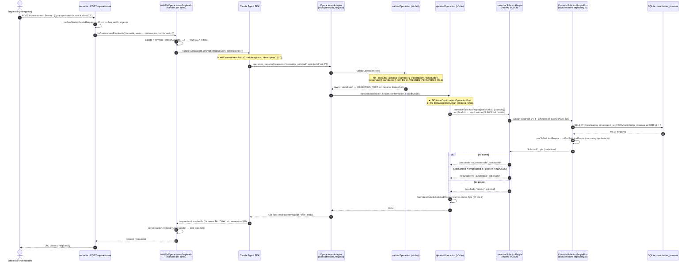

# Diseño técnico: `consultar_solicitud` — el solicitante ve el estado y el desenlace de SU solicitud interna desde el chat

**Change**: `consulta-solicitud-propia` · **Propuesta**: `openspec/changes/consulta-solicitud-propia/proposal.md` (ADR 237-239, R1-R5, RD-114/115).

**Numeración**: este diseño **desarrolla** ADR **237, 238 y 239** —abiertos y fijados por la propuesta— y **resuelve RD-114 y RD-115**. ★ **No abre ningún ADR nuevo.** Los rangos **234-236 / RD-112-113** son de `conocimiento-chat-empleado`, **240-242 / RD-116-117** de `visibilidad-a2a-entrante-chat` y **243-246 / RD-118-120** de `consulta-kpi-a2a-chat` — reverificado por `Grep` sobre todo el repo en esta fase: las únicas citas de 237-239 y RD-114/115 son la propia propuesta de este change, y no existe ninguna cita de ADR 234-246 en `src/**` ni en `docs/**`. **Techo real reconfirmado: ADR 233 y RD-111.**

**Dos colisiones de trazabilidad conocidas, que este diseño NO reabre y NO empeora**: la histórica **ADR 174-187 / RD-94**, y la doble asignación **ADR 227/228** entre `ergonomia-canal-empleado` (v3.11) y `devolucion-sin-token-dos-personas` (v3.12). ★ **Este diseño sí se apoya en el ADR 227 de v3.12 como precedente, así que lo cita SIEMPRE por archivo** — `openspec/changes/devolucion-sin-token-dos-personas/design.md` §3, "ADR 227 (RD-108)", pto 3 — nunca por número suelto. Es deuda de trazabilidad ajena; desambiguarla al citar cuesta tres palabras y no reabre nada.

> **Nota de proceso**: este ejecutor **no tiene herramienta de shell** (sólo `Read`/`Edit`/`Write`/`Grep`/`Glob`), así que **no pudo correrse `graphify query`** pese al hook del repo. Misma nota y mismo criterio que ya dejaron escritos `ergonomia-canal-empleado`, `devolucion-sin-token-dos-personas`, `conocimiento-chat-empleado` y la propia propuesta de este change. **Toda afirmación de abajo está verificada por `Read`/`Grep`/`Glob` con archivo:línea EN ESTA FASE**, releída del fuente sobre `hito/v3.12-devolucion-sin-token-dos-personas` — no heredada del reporte de exploración ni de la propuesta.

---

## 0. Hallazgos de esta fase — seis cosas que la propuesta no pudo ver

Ninguno cambia una decisión del checkpoint. Dos **corrigen** afirmaciones de la propuesta, uno **agrega una decisión** que hay que tomar, y tres **ordenan el trabajo**.

### 0.1 ★ Corrección: `validar-operacion.ts` tiene **CUATRO** tablas, no tres — y la cuarta **no recibe fila**

La propuesta dice *"las tres tablas de `validar-operacion.ts`"* (Affected Areas, y §C.5 pto 4 de la exploración). **Verificado leyendo el archivo entero: son cuatro.**

| # | Tabla | Línea | ¿`consultar_solicitud` agrega fila? |
|---|---|---|---|
| 1 | `CAMPOS_POR_OPERACION` | `:25-45` | **Sí** — `["operacion", "solicitudId"]` |
| 2 | `CAMPOS_REQUERIDOS_POR_OPERACION` | `:48-59` | **Sí** — `[]` |
| 3 | `CAMPOS_NUMERICOS_POR_OPERACION` | `:86-97` | **Sí** — `[]` |
| 4 | `VALORES_PERMITIDOS_POR_OPERACION` | `:114-118` | ★ **NO** |

La cuarta sólo tiene tres filas hoy (`resolver_decision_venta.decision`, `resolver_solicitud.accion`, `resolver_reembolso.accion`) y **`consultar_venta` tampoco está ahí** — `consultar_solicitud` no tiene ningún campo enum-like, así que agregarle una fila sería ruido. **Y no hace falta acordarse**: hay un test estructural que lo vigila en las dos direcciones (`validar-operacion.test.ts:360-367`), y es **genérico sobre `CAMPOS_ENUM_LIKE = ["accion","decision"]`**, no una lista de operaciones — con lo cual **pasa sin tocarlo**. Lo mismo hizo v3.12 (`devolucion-sin-token-dos-personas/design.md:446`: *"Nada en `VALORES_PERMITIDOS_*`"*).

**Consecuencia para `sdd-tasks`**: "tres tablas" en la propuesta es correcto como *cantidad de filas a escribir*, incorrecto como *cantidad de tablas del archivo*. La tarea debe decir **"las tres primeras tablas de las cuatro"**, para que nadie agregue la cuarta fila ni la busque en vano.

### 0.2 ★ El solicitante ya puede leer solicitudes **AJENAS** con `detalle` completo — esto recalibra el riesgo de la proyección y **elimina el delta dudoso**

La propuesta dejó abierto si `solicitud-interna-hitl` necesita delta, con el criterio *"sólo si algún requirement vigente afirma que la única lectura del solicitante son las pendientes"*. **Verificado leyendo la versión vigente** (`openspec/changes/aprobacion-conversacional-hitl/specs/solicitud-interna-hitl/spec.md:7-41`) y la de `cancelacion-solicitud-interna` (`operaciones-negocio-conversacionales/specs/…:7-29`): **ningún requirement dice eso.** Los dos están redactados sobre **resolver** y **cancelar**, nunca sobre visibilidad del solicitante.

★ **Y hay algo más fuerte, que cambia el encuadre del riesgo**: el requirement vigente dice, textual, que `resolver_solicitud` **sin `solicitudId`** *"SHALL seguir devolviendo el listado global de solicitudes pendientes de toda la organización, con `solicitante`/`detalle` completos, sin filtro de dueño ni de rol — ver la solicitud no requiere rol elevado, sólo resolverla"* (`:9`, escenario en `:38-41`). O sea: **hoy, cualquier empleado con sesión ya lee el `detalle` de solicitudes ajenas.**

**Consecuencia, y es la que importa**: `consultar_solicitud` **expone estrictamente MENOS** que una capability que ya está aprobada y en producción — lee **sólo lo propio**, y lo único que agrega sobre lo ya visible es el **desenlace** (`estado` resuelto, `dictamen`, `resueltaPor`, `resueltaAt`) **de solicitudes del propio actor**. Eso no relaja el diseño: la lista blanca y el gate se mantienen enteros (ADR 238/239). Lo que hace es dejar por escrito que **el riesgo marginal de este change es bajo por comparación, no por optimismo**.

**Veredicto de delta**: **`solicitud-interna-hitl` NO lleva delta** y `cancelacion-solicitud-interna` tampoco. `sdd-spec` **debe reverificar leyendo**, pero la carga de la prueba se invierte: forzar un delta acá sería inventar un requirement para poder modificarlo.

### 0.3 ★ Decisión que la propuesta no vio: `SOLICITUD_ESTADOS` **no existe en el núcleo** — vive privado en un archivo de la TUI

El wiring necesita traducir la fila del adaptador (`tipo`/`estado` como `string` suelto) al tipo del puerto (uniones literales), igual que `toPortVentaPropia` (`build-on-operaciones-empleado.ts:123-132`). Para ventas eso es trivial porque **`VENTA_ESTADOS` es una constante exportada del contrato del núcleo** (`src/core/ventas/ventas-contract.ts:36-43`, con `VentaEstado = (typeof VENTA_ESTADOS)[number]` en `:44`).

**Para solicitudes NO existe el equivalente.** `src/core/solicitudes/solicitudes-contract.ts:41-50` declara las cuatro constantes y arma `SolicitudEstado` como **unión manual escrita a mano**, sin array. El array existe, pero **privado y en otro archivo**: `const SOLICITUD_ESTADOS = [...]` en `src/build-on-comando-empleado.ts:363-368`, sin `export`, usado sólo por `toPortSolicitud` (`:394-401`).

Es un accidente histórico, no una decisión: lo escribió `comando-cancelar-solicitud` cuando el único traductor de filas era la TUI. **Ahora aparece un segundo traductor y hay que decidir dónde vive el vocabulario.** Se resuelve en **RD-114** (§6).

### 0.4 ★ El molde que copiamos tiene una constante **declarativa**: `LIMITE_LISTADO_VENTAS_PROPIAS` nunca se pasa en runtime

`Grep` sobre todo el repo: `LIMITE_LISTADO_VENTAS_PROPIAS` aparece en su declaración (`consulta-venta-contract.ts:25`), en un doc-comment (`:55`), en un comentario del adaptador (`repository.ts:934`) y en su test (`consulta-venta-contract.test.ts:45-46,59`). **En ningún camino de producción se pasa como `limite`**: `consultarVentaPropia` llama `listarDeVendedor({ vendedorId })` sin límite (`consultar-venta-propia.ts:51`) y el adaptador aplica su propio `?? 20` duplicado literal (`repository.ts:942`).

**No es un bug, y copiarlo tal cual es lo correcto** — pero hay que decirlo para que nadie "arregle" la asimetría en el review: la constante del núcleo es el **valor declarado del contrato** (lo que el puerto promete), y el `?? 20` del adaptador es la **implementación** de esa promesa, duplicada a propósito porque `src/adapters/*` no importa `src/core/*` (regla dura de `AGENTS.md`, y el archivo lo documenta en `repository.ts:934-936`). Lo que mantiene los dos números honestos es el test de la constante, no el wiring. **Se replica idéntico** (§6, RD-114 pto 3).

### 0.5 El doc-comment obsoleto de `operaciones-contract.ts:9` tiene un **hermano** en el archivo de al lado

La propuesta ya lista `operaciones-contract.ts:9` (*"las SEIS operaciones del contrato"*, obsoleto desde v3.6) y `:39` (*"Las seis operaciones del contrato"*, mismo error). **Verificado en esta fase: hay un tercero, en `validar-operacion.ts:151-153`** — un comentario de la guarda de `noUncheckedIndexedAccess` que dice *"tienen las mismas seis claves"*. Con este change serán **once**.

Van los tres en el mismo commit, por el mismo motivo que la propuesta da para el primero: **el archivo se toca igual, y un doc que miente sobre el conteo es exactamente el defecto que este change está corrigiendo en README y arc42.** Coste: tres palabras.

### 0.6 ★ El rojo inicial **no es uno solo**: hay dos, y caen en PRs distintas

La propuesta dice *"el rojo inicial es el `toHaveLength(10)` de `operaciones-contract.test.ts`"* (Success Criteria). **Correcto, pero ese rojo pertenece a la PR #2.** La PR #1 (contrato + núcleo + SQL) **no toca `OPERACIONES_NEGOCIO`** — si su rojo fuera el del conteo, habría que adelantar la operación a la PR #1 y el corte se deshace.

**El rojo de la PR #1 es de TIPO, no de aserción**: el primer test del contrato no compila porque `SolicitudPropia`/`ConsultaSolicitudPropiaPort` todavía no existen. Es el mismo "mejor rojo posible" que v3.12 declaró para `VentaPropia` (`devolucion-sin-token-dos-personas/design.md:487`).

**Instrucción para `sdd-apply`**, y criterio para el Reviewer: **el rojo se declara con `npm test` Y `npm run typecheck`, en las dos PRs.** Detalle en §13.1.

---

## 1. Qué NO se reabre acá

Fijado por la propuesta y consumido como dado: el lector es un **puerto nuevo**, nunca una ampliación de `SolicitudStorePort`/`listarSolicitudesPendientes` (**ADR 237**); el gate de propiedad vive en el **núcleo** y `no_autorizada` es distinguible de `no_encontrada` (**ADR 238**); la proyección es **explícita y por lista blanca** (**ADR 239**). Fuera de alcance y sin tocar: `cancelar_solicitud_interna` en ninguno de sus aspectos, la visibilidad de solicitudes ajenas, la auditoría de esta lectura, las migraciones, y los prompts/`INSTRUCCION_OPERACIONES_EMPLEADO` (duplicados a propósito y pineados por tests).

Y las reglas duras de `AGENTS.md` atraviesan todo: **`src/core/` nunca importa de `src/adapters/*`** y **ningún adaptador habla con otro adaptador**. ★ **Este change no agrega ni un import en ninguna de las dos direcciones prohibidas** — §12.1 lo verifica archivo por archivo. Tampoco toca el resto del stack no negociable: SQLite sin migración nueva, sin Ink, sin A2A, con `vitest` + TDD estricto (§13).

---

## 2. Estado actual vs. estado deseado

### 2.1 Las cuatro lecturas de `solicitudes_internas` que existen HOY

Reverificadas leyendo el fuente en esta fase:

| # | Quién lee | Puerto / función | Estados que devuelve | Escopado por identidad | Dónde |
|---|---|---|---|---|---|
| 1 | `cancelar_solicitud_interna` sin id | `SolicitudStorePort.listarSolicitudesPendientes({solicitanteId})` | ★ **sólo `pendiente_aprobacion_humana`** | **Sí**, por `solicitanteId` (ADR 144) | `solicitudes-contract.ts:104-108` → `repository.ts:2273-2300` |
| 2 | `resolver_solicitud` sin id | el **mismo** puerto, **sin** `solicitanteId` | ★ **sólo `pendiente_aprobacion_humana`** | **No** — listado global, `detalle` completo, sin rol (§0.2) | `ejecutar-operacion.ts:425-436` |
| 3 | A2A entrante | `ConsultaSolicitudesPort.listarPendientes()` | ★ **sólo pendientes** | **No** | `core/…/consulta-solicitudes-contract.ts` |
| 4 | Resolución (CAS) | `aprobar/rechazar/cancelarSolicitud` | n/a (escriben) | n/a | `solicitudes-contract.ts:115-121` |

★ **Las tres lecturas leen el MISMO literal de estado.** El literal `estado = 'pendiente_aprobacion_humana'` va **fijo dentro del SQL, sin parametrizar**, y el comentario del repo explica por qué y con qué costo ya pagado:

```sql
-- repository.ts:2283-2292 (HOY, y no se toca)
-- `estado = '…'` queda como literal FIJO y sin envolver: es el predicado
-- que usa `idx_solicitudes_estado`, y envolverlo en `(@x IS NULL OR …)`
-- lo inutilizaría — lección ya pagada en `listPropuestasCambio` (:2370).
SELECT <SOLICITUD_SELECT_COLUMNS>
  FROM solicitudes_internas
 WHERE estado = 'pendiente_aprobacion_humana'
   AND (@solicitudId IS NULL OR id = @solicitudId)
   AND (@solicitanteId IS NULL OR solicitante_id = @solicitanteId)
 ORDER BY created_at
 LIMIT @limite
```

**Conclusión del estado actual, sin adornos**: en cuanto una solicitud se resuelve, **desaparece de las tres lecturas** y su `dictamen`, su `resueltaPor` y su `resueltaAt` quedan escritos en la base sin ningún camino de negocio que los muestre al autor. El caso *"¿me aprobaron la excepción que pedí el martes?"* **no tiene respuesta hoy**.

### 2.2 Estado deseado

Una **quinta** lectura, ortogonal a las cuatro: `ConsultaSolicitudPropiaPort`, **sin filtro de estado**, **escopada al solicitante** (en el listado) y **sin escopar** (en la búsqueda por id, para que el gate del núcleo pueda distinguir "ajena" de "no existe"). Las cuatro anteriores **no cambian una línea**.

### 2.3 El mapa de piezas

```
POST /operaciones (Bearer de sesión)
  └─ buildOnOperacionesEmpleado           src/build-on-operaciones-empleado.ts
       ├─ consultaSolicitudPropia ◄── closure inline sobre repository.ts  ★ NUEVO
       │    └─ toPortSolicitudPropia (narrowing tipo/estado)              ★ NUEVO
       └─ ejecutarOperacion                src/core/operaciones/ejecutar-operacion.ts
            └─ case consultar_solicitud ──► consultarSolicitudPropia      ★ NUEVO (núcleo puro)
                 (0 escrituras, 0 ranura, 0 fila de auditoría)
                      └─► ConsultaSolicitudPropiaPort ──► SolicitudPropia ★ lista blanca
                                                              ▲
                              src/adapters/memory/repository.ts ★ NUEVO
                              SOLICITUD_PROPIA_SELECT_COLUMNS
                              buscarSolicitudPropiaPorId / listSolicitudesPropiasDeSolicitante
                              ★ listSolicitudesInternas NO SE TOCA
```

---

## 3. ADR 237 — puerto de lectura **nuevo**, no ampliación de `SolicitudStorePort`

**Contexto.** La lectura que hace falta —*"cualquier estado, sólo mías"*— está a un parámetro de distancia de la que ya existe: `listarSolicitudesPendientes({solicitanteId})` devuelve exactamente la forma correcta, filtrada por el dueño correcto, con el estado equivocado. Agregarle un `estado?` es **la tentación obvia** y hay que cerrarla por escrito, porque el argumento a favor ("reusar código") es real y el argumento en contra vive en dos ADRs viejos que nadie lee al abrir el archivo.

**Decisión: un puerto de lectura aparte, `ConsultaSolicitudPropiaPort`, en `src/core/solicitudes/consulta-solicitud-propia-contract.ts`**, con cuatro propiedades:

1. **`SolicitudStorePort` no gana ni un método ni un parámetro, y `listarSolicitudesPendientes` no cambia una letra.** Ese puerto sirve **caminos de escritura con CAS** (`aprobarSolicitud`/`rechazarSolicitud`/`cancelarSolicitud`, `:115-121`) y su listado es el *input* de esos caminos: el conjunto "lo que se puede resolver" es, por construcción, "lo pendiente". Meterle un estado variable convierte un lector de precondición en un lector genérico, y **cualquier bug futuro del listado pasa a poder tocar un camino de dinero**.

2. **El literal de estado en el SQL es una decisión de índice, con costo ya pagado y documentado en el propio código** (`repository.ts:2283-2286`, citado verbatim en §2.1): envolverlo en `(@x IS NULL OR …)` inutiliza `idx_solicitudes_estado`, *"lección ya pagada en `listPropuestasCambio`"*. ★ **No es un argumento de estilo: es una regresión de performance ya observada en este repo, escrita por quien la sufrió.** ADR 38 (`v1.4.0`) y ADR 132 la fijaron como regla — *"nunca un lector por id sin filtro de estado"* — y `solicitudes-contract.ts:96-98` la cita en el doc del método.

3. **El precedente está aceptado y es de hace tres semanas.** El mismo conflicto —"necesito leer por id sin filtro de estado, y ADR 38 lo prohíbe"— lo resolvió v3.12 para ventas con **un puerto de lectura aparte**: `openspec/changes/devolucion-sin-token-dos-personas/design.md` §3 ("ADR 227 (RD-108)") pto 3, ejecutado en `src/core/ventas/consulta-venta-contract.ts:49-61`. ★ **Este ADR no inventa una excepción: aplica una que ya se discutió, se aprobó y está en producción**, a un dominio donde el argumento es *más* fuerte (allá el puerto ampliable era `VentaStorePort`, con CAS; acá es `SolicitudStorePort`, también con CAS, y además con el agravante de que el índice está documentado).

4. **Cero migraciones y cero esquema.** Lee la tabla `solicitudes_internas` de la migración `0008`, tal cual está. **Verificado por `Glob` en esta fase: la última migración es `0014_justificaciones_devolucion.ts` y la próxima libre sigue siendo `0015`, sin consumir.**

**Alternativas consideradas**:

| Opción | Qué costaría | Por qué se rechaza |
|---|---|---|
| **Agregar `estado?` a `listarSolicitudesPendientes`** | ~6 líneas, cero archivos nuevos | Pto 2 (mata el índice, regresión ya vivida) + pto 1 (un lector de precondición de escritura se vuelve genérico). ★ **Y renombrarlo a `listarSolicitudes` arrastraría los 6 llamadores y los tests de los tres caminos de CAS: el diff "barato" deja de serlo en el segundo archivo** |
| **Método nuevo `listarSolicitudesDeSolicitante` DENTRO de `SolicitudStorePort`** | ~10 líneas, sin archivo nuevo | No mata el índice, pero **mezcla una lectura de consulta con un puerto de escritura**: todo consumidor del puerto (incluidos los tres caminos de CAS y sus dobles de test) pasa a tener que implementar un método que no usa. El doble de `SolicitudStorePort` en `ejecutar-operacion.test.ts` crece para **todas** las operaciones de solicitud, no sólo la nueva |
| **Reusar `ConsultaSolicitudesPort`** (el del A2A entrante) | Cero código nuevo | **Inaplicable, verificado**: `listarPendientes()` no recibe argumentos, no está escopado por identidad y devuelve sólo pendientes. Las tres cosas que este caso de uso necesita son las tres que ese puerto no tiene |
| **Reusar `listarSolicitudesPendientes` y "completar" el resto con otra lectura** | — | Peor que todas: dos consultas, dos formas de fila, y el bug de "una solicitud recién resuelta aparece dos veces o ninguna" esperando en la juntura |

**Consecuencias**: un archivo de contrato nuevo (~55 líneas), dos funciones de lectura nuevas en `repository.ts` (~70 con doc), y **una query duplicada**. A cambio: `idx_solicitudes_estado` sigue sirviendo a sus tres lectores, los tres caminos de CAS quedan con `git diff` vacío —y eso es **verificable, es un Success Criterion de la propuesta**— y el puerto nuevo puede evolucionar sin arrastrar consumidores de escritura.

---

## 4. ADR 238 — el gate de propiedad vive en el **núcleo**, y "ajena" es distinguible de "no encontrada"

**Contexto.** Hay dos lugares donde se puede decidir *"esta solicitud no es tuya"*: en el `WHERE` del SQL (falla cerrada, imposible de esquivar) o en el núcleo, comparando `solicitanteId` con el empleado del turno. La elección determina **qué ve el usuario cuando se equivoca de id**.

**Decisión**:

1. **`buscarPorId(solicitudId)` NO filtra por solicitante.** Devuelve la fila exista de quien exista, o `undefined`. Molde literal: `ConsultaVentaPropiaPort.buscarPorId` (`consulta-venta-contract.ts:50-54`) y su implementación (`repository.ts:906-911`), que tampoco filtra.

2. **El gate vive en `consultarSolicitudPropia`**, dentro de `src/core/solicitudes/`, en tres líneas calcadas de `consultar-venta-propia.ts:54-64`:

   ```ts
   const solicitud = consulta.buscarPorId(input.solicitudId);
   if (solicitud === undefined) return { resultado: "no_encontrada", solicitudId: input.solicitudId };
   if (solicitud.solicitanteId !== input.empleadoId) return { resultado: "no_autorizada", solicitudId: input.solicitudId };
   return { resultado: "detalle", solicitud };
   ```

3. **El dispatcher NO reimplementa el gate — y hay test mecánico.** `ejecutar-operacion.ts` delega íntegro y **nunca compara `solicitanteId` con `empleadoId`**. Molde exacto, verificado leyéndolo: `ejecutar-operacion.test.ts:1389-1395` hace `expect(source).not.toMatch(/vendedorId\s*===\s*[\w.]*empleadoId/)` sobre el fuente del dispatcher. ★ **El análogo tiene dientes hoy mismo**: `Grep` de `solicitanteId` sobre `ejecutar-operacion.ts` devuelve **una sola ocurrencia**, y es una asignación (`:959`, `solicitanteId: input.sesion.empleadoId` al crear). No hay ninguna comparación, así que el regex nace limpio y **falla el día que alguien mueva el gate al dispatcher**.

4. **`no_autorizada` ≠ `no_encontrada`, y el llamador ve la diferencia.** Textos, alineados letra por letra con `consultar_venta` (`ejecutar-operacion.ts:885-888`):

   | Rama | Texto (`consultar_solicitud`) | Texto vigente (`consultar_venta`, para comparar) |
   |---|---|---|
   | `no_encontrada` | `No encontré ninguna solicitud ${id}.` | `No encontré ninguna venta ${id}.` |
   | `no_autorizada` | `La solicitud ${id} no es tuya: no puedo mostrarte su estado.` | `La venta ${id} no es tuya: no puedo mostrarte su estado.` |

   ★ **Ni una ni otra revela un solo dato de la solicitud ajena** — ni `tipo`, ni `detalle`, ni `solicitanteId`, ni `estado`. Lo único que se filtra es **la existencia del id**, que es el punto siguiente.

5. **Trade-off declarado, no escondido: distinguir las dos ramas revela que un id ajeno EXISTE.** Un empleado que probara ids al azar podría, en principio, mapear qué ids existen. **Tres mitigaciones, todas verificadas, no supuestas**:
   - los ids son `randomUUID` (`build-on-operaciones-empleado.ts:164`, `newId = deps.newId ?? randomUUID`): **no son enumerables ni secuenciales**, así que el oráculo devuelve "no existe" con probabilidad ~1 para cualquier id que el atacante no tenga ya;
   - **el mismo argumento ya está aceptado dos veces en este repo**: ADR 126 lo aceptó para `cancelar_solicitud_interna` (`no_es_dueno` vs `no_encontrada`, y su alternativa rechazada 3 es exactamente la opción de colapsarlas), y el ADR 227 de v3.12 lo reaceptó para `consultar_venta` (`devolucion-sin-token-dos-personas/design.md:129,132` — riesgo residual **R14**, declarado y aceptado);
   - lo que el oráculo revela —"existe una solicitud con ese id"— es **estrictamente menos** que lo que `resolver_solicitud` sin id ya entrega a cualquier empleado: el listado global de pendientes **con `solicitante` y `detalle` completos** (§0.2).

**Alternativas consideradas**:

| Opción | Costo | Por qué se rechaza |
|---|---|---|
| **Filtrar `solicitante_id` en el `WHERE` del lector por id** | Falla cerrada en SQL, imposible de esquivar por refactor | ★ Hace **indistinguibles** "ajena" y "no existe" ⇒ **viola un Success Criterion explícito de la propuesta** (`:139`), y **le miente al usuario sobre su propio error de tipeo**: quien se equivoca en un dígito de su propio id recibe "no existe" y busca en el lugar equivocado. Además mueve una **regla de dominio al adaptador**, donde no hay test de negocio que la vigile |
| **Colapsar las dos ramas en el núcleo** (buscar sin filtro, devolver `no_encontrada` en ambos casos) | Cero SQL | Mismo defecto de UX sin la ventaja de falla-cerrada del anterior: la información **sí** está en memoria, sólo se decide no usarla. Es la peor de las tres |
| **Devolver `no_autorizada` con el `tipo` de la solicitud ajena** ("es una solicitud de vacaciones de otro") | Cero | Filtra datos ajenos para mejorar un mensaje de error. Rechazada sin matices |

**Consecuencias**: el núcleo queda con las cuatro ramas del `Result` y **cero escrituras en cualquiera de ellas**; el adaptador queda sin ninguna regla de negocio; y el riesgo residual del oráculo de existencia queda **declarado, no resuelto** — ver **R6** (§16).

---

## 5. ADR 239 — proyección explícita `SolicitudPropia`, por lista blanca de columnas

**Contexto.** La tabla `solicitudes_internas` tiene **doce** columnas (`repository.ts:2133-2134`, verificado): `id, caso_id, solicitante_id, tipo, detalle, estado, dictamen, dictaminada_at, resuelta_por, resuelta_at, created_at, updated_at`. **No hay token, no hay credencial, no hay secreto** — a diferencia de `ventas`, donde ADR 227 tenía que sacar `token_confirmacion` porque exponerlo **auto-aprobaba devoluciones** (`devolucion-sin-token-dos-personas/design.md:104`). ★ **Acá no hay nada de ese calibre, y el diseño tiene que decirlo en vez de fingir un riesgo para justificar un mecanismo.**

**Entonces, ¿por qué mantener la lista blanca?** Por tres motivos que sobreviven a la ausencia de secreto:

- **la lista es la proyección**: cuando el conjunto de columnas es explícito y revisable en una constante, la pregunta del review es *"¿alguna de estas once sobra?"* —contestable en diez segundos— en vez de *"¿qué trae `SELECT *` hoy y qué va a traer cuando alguien agregue una columna?"*;
- **es a prueba de futuro, y ese futuro tiene nombre**: la próxima migración que agregue una columna a `solicitudes_internas` (p. ej. un adjunto, un comentario interno del validador, un campo de RRHH) **entraría sola** a la respuesta del chat si la consulta fuera `SELECT *`. Con lista blanca, entrar cuesta una línea y un review;
- **mantiene la forma del repo**: `VENTA_PROPIA_SELECT_COLUMNS` (`repository.ts:865-866`) es el precedente, y es **exportada únicamente para su test mecánico**, con esa restricción escrita en el doc (`:861-863`).

**Decisión**:

1. **Tipo nuevo `SolicitudPropia`**, en el contrato nuevo del núcleo. **Once campos, uno menos que columnas** (§5.1). La garantía es **estructural** (no hay campo donde poner lo excluido) **y de SQL** (la columna no se selecciona) — las dos capas, igual que `VentaPropia`.

2. **Constante `SOLICITUD_PROPIA_SELECT_COLUMNS` en `repository.ts`**, exportada **sólo** para el test mecánico, con el mismo doc-comment restrictivo que `VENTA_PROPIA_SELECT_COLUMNS`:

   ```ts
   /** ★ `SOLICITUD_SELECT_COLUMNS` MENOS `updated_at` (ADR 239): la proyección de lectura propia no
    *  incluye metadatos de fila. Exportada ÚNICAMENTE para el test mecánico de lista blanca —
    *  nunca para uso en runtime fuera de este módulo. */
   const SOLICITUD_PROPIA_SELECT_COLUMNS =
     "id, caso_id, solicitante_id, tipo, detalle, estado, dictamen, dictaminada_at, resuelta_por, resuelta_at, created_at";
   ```

3. **`rowToSolicitudPropia` propia, que NO reusa `rowToSolicitud`** (`repository.ts:2136-2151`): esa función escribe `updatedAt`, y reusarla obligaría a borrar el campo después de construirlo — la exclusión volvería a ser disciplina en vez de SQL. Mismo criterio y mismo motivo que `rowToVentaPropia` no reusa `rowToVenta` (`:883`).

4. **El tipo de fila SQL se reusa por `Omit`, no se duplica**: `type SolicitudPropiaSqlRow = Omit<SolicitudInternaSqlRow, "updated_at">`. ★ Esto tiene dientes: si mañana alguien agrega una columna a `SolicitudInternaSqlRow` y la mete en `SOLICITUD_PROPIA_SELECT_COLUMNS` sin actualizar `SolicitudPropia`, el mapper no compila.

### 5.1 Campo por campo — qué entra, qué no, y por qué

| Campo (núcleo) | Columna | ¿Entra? | Justificación |
|---|---|---|---|
| `solicitudId` | `id` | **Sí** | Sin él, el listado no es accionable: es lo que el empleado usa para volver a consultar o para cancelar. Se llama `solicitudId` y no `id` por el mismo criterio que `VentaPropia.ventaId` (`consulta-venta-contract.ts:36`) |
| `solicitanteId` | `solicitante_id` | **Sí** | ★ **Sólo para que el gate del ADR 238 lo compare DENTRO del núcleo.** El dispatcher no lo lee, y hay test mecánico (§13.2 #8). Molde literal: `VentaPropia.vendedorId` y su doc (`:28-30`) |
| `casoId` | `caso_id` | **Sí** | Correlaciona la solicitud con su caso HITL y con las filas de `registro_acciones_empleado`. Es un id opaco, no un dato de persona. Mismo criterio que `VentaPropia.casoId`, y **ya se le muestra al autor al crear** (`ejecutar-operacion.ts:195`: `Solicitud ${id} creada (caso ${casoId})`) |
| `tipo` | `tipo` | **Sí** | Un empleado puede tener varias en curso; sin `tipo` el listado no se distingue. Narrowed a `SolicitudTipo` (RD-114) |
| `detalle` | `detalle` | **Sí** | ★ **Texto que escribió el propio empleado.** Cero riesgo nuevo: es su input, devuelto a él. Ya se lo muestra el listado de `cancelar_solicitud_interna` (`ejecutar-operacion.ts:435`) |
| `estado` | `estado` | **Sí** | ★ **Es el punto del change.** Los cuatro valores (`solicitudes-contract.ts:41-45`). Narrowed a `SolicitudEstado` (RD-114) |
| `dictamen?` | `dictamen` | **Sí** — decisión **asumida**, ver §5.2 | El "¿y qué dijeron?" de la mitad del caso de uso |
| `dictaminadaAt?` | `dictaminada_at` | **Sí** | Sin ella, "hay dictamen" no tiene cuándo. Viene gratis con el dictamen y no agrega superficie: es un timestamp |
| `resueltaPor?` | `resuelta_por` | **Sí, como id** — decisión **asumida**, ver §5.2 | Hace accionable la respuesta ("preguntale a quien lo resolvió"). ★ **Nunca nombre ni email**: la columna guarda el `empleadoId` y no hay join |
| `resueltaAt?` | `resuelta_at` | **Sí** | Cierra la pregunta "¿cuándo?". Es el par natural de `estado` resuelto |
| `createdAt` | `created_at` | **Sí** | *"Pedí una excepción hace dos días"* — es el ancla temporal del caso de uso del Intent |
| — | `updated_at` | ★ **NO** | **Único campo excluido**, y la exclusión es deliberada: es **metadato de fila**, no un hecho de negocio. Todo lo que el empleado podría querer saber de él ya está en `dictaminadaAt`/`resueltaAt`, que son **semánticos**. Mostrar `updatedAt` invita a la pregunta "¿por qué cambió el martes si nadie la resolvió?" —cuya respuesta es un detalle de implementación del CAS— y **convierte un dato interno en una promesa de producto**. ★ Además es lo que le da dientes al test mecánico: sin ninguna exclusión, "lista blanca" y `SELECT *` serían indistinguibles |

★ **`detalle` y `dictamen` son texto libre de largo arbitrario** — eso no es un problema de seguridad (son propios), pero sí de **formato del turno**: ver RD-115 (§7), que por eso separa el formato del listado del formato del detalle.

### 5.2 Las dos decisiones del checkpoint que este diseño **asume**, y qué cuesta cambiarlas

La propuesta las dejó abiertas (*Qué necesita el checkpoint*, pto 3) con una recomendación. **Este diseño asume la recomendación y la deja visible, no la esconde.**

| Decisión | Asumido | Sustento verificado | ★ Costo de darla vuelta en el checkpoint |
|---|---|---|---|
| **¿Se muestra el `dictamen` completo?** | **SÍ** | **No es un canal nuevo**: el dictamen ya se le muestra al solicitante en el momento de crear la solicitud — `ejecutar-operacion.ts:191-195`, texto literal `Dictamen: ${solicitud.dictamen}` / `Sin dictamen: la validación automática no se pudo completar.`. Ocultarlo acá sería incoherente con lo que el mismo canal ya hace | **Bajo, y acotado a 3 sitios**: sacar un campo de la interfaz, una columna de la lista blanca y una línea del formateador. **Si se decide ANTES de la PR #1, cuesta ~10 líneas.** Si se decide después de la PR #2, además hay que tocar el delta de spec y un test de formato |
| **¿Se muestra `resueltaPor`?** | **SÍ, como id opaco** | Es el dato que vuelve accionable la respuesta. `resuelta_por` guarda el `empleadoId`, y este change **no agrega ningún join a nombres** — la superficie es la misma clase de id que `casoId`, que el empleado ya ve. ★ Nota: en una **cancelación propia**, `resueltaPor` es **el propio autor** (ADR 131, `solicitudes-contract.ts:67`): ahí no expone a nadie | **Idéntico al anterior** — mismos 3 sitios. ★ **Si el checkpoint dice "estado + fecha y nada más"**, caen `dictamen`, `dictaminadaAt` y `resueltaPor` juntos: ~20 líneas y **el change no pierde su razón de ser** (el `estado` resuelto sigue siendo invisible hoy) |

★ **El corte en dos PRs está pensado exactamente para esto** (§12.2): la PR #1 se puede mergear **sin** que la decisión esté tomada, porque nada de lo que expone es observable desde el chat.

**Alternativas consideradas**:

| Opción | Por qué se rechaza |
|---|---|
| **`SELECT *` + descartar campos en el mapper de JS** | La exclusión pasa a ser disciplina: el test mecánico se degrada de *"la consulta no nombra la columna"* —verificable sobre una constante— a *"nadie escribió `.updatedAt`"*. Mismo argumento textual del ADR 227 de v3.12 (`design.md:118`) |
| **Reusar `SolicitudInterna` del núcleo como proyección** | Tiene los doce campos y **es el tipo de los caminos de escritura**: cualquier campo que una migración futura le agregue entra solo al chat. Además ata la forma de la respuesta de lectura a la forma del CAS |
| **Proyección mínima (`solicitudId`, `estado`, `resueltaAt`)** | Es una de las opciones del checkpoint (§5.2), no un rechazo técnico. Se deja disponible y costeada |
| **Devolver `resueltaPor` resuelto a nombre/email** | Agrega un join, expone datos de otro empleado y estrena un camino de PII que hoy no existe en este canal. **Fuera de alcance sin discusión** |

---

## 6. RD-114 resuelta — narrowing de la fila, dónde vive el vocabulario, y la forma del límite

RD-114 es *"la forma exacta de la traducción fila → puerto y del techo del listado"*. Cuatro preguntas, las cuatro con su verificación:

1. ★ **¿Dónde vive `SOLICITUD_ESTADOS`? → se PROMUEVE al contrato del núcleo** (§0.3).

   `toPortSolicitudPropia` necesita validar `tipo`/`estado` contra el vocabulario antes de angostar. `SOLICITUD_TIPOS` ya está exportado del núcleo (`solicitudes-contract.ts:30`); `SOLICITUD_ESTADOS` **no existe ahí** — vive privado en `build-on-comando-empleado.ts:363-368`.

   **Decisión: mover el array a `src/core/solicitudes/solicitudes-contract.ts`**, junto a las cuatro constantes que ya viven ahí, y derivar el tipo de él:

   ```ts
   // solicitudes-contract.ts — reemplaza la unión manual de :46-50
   export const SOLICITUD_ESTADOS = [
     SOLICITUD_ESTADO_PENDIENTE, SOLICITUD_ESTADO_APROBADA,
     SOLICITUD_ESTADO_RECHAZADA, SOLICITUD_ESTADO_CANCELADA,
   ] as const;
   export type SolicitudEstado = (typeof SOLICITUD_ESTADOS)[number];
   ```
   y que `build-on-comando-empleado.ts` lo **importe** en vez de declararlo (borra `:362-368`, agrega un símbolo al import existente).

   **Por qué, y no la alternativa barata**: es **exactamente la forma que ya tiene ventas** — `VENTA_ESTADOS` en el contrato del núcleo (`ventas-contract.ts:36-43`) con `VentaEstado = (typeof VENTA_ESTADOS)[number]` (`:44`), y `toPortVentaPropia` en el archivo raíz importándolo. Y tiene un beneficio **verificable, no estético**: hoy el array y la unión son dos listas paralelas escritas a mano en archivos distintos, así que **agregar un quinto estado y olvidarse del array compila y pasa los tests**, dejando `toPortSolicitud` rechazando en runtime un estado legítimo. Derivar el tipo del array vuelve eso **imposible de compilar**.

   | Alternativa | Costo | Veredicto |
   |---|---|---|
   | Exportar `SOLICITUD_ESTADOS` desde `build-on-comando-empleado.ts` | **Una palabra** (`export`) | ★ **Es la más barata, y por eso queda como plan B explícito** (§17). Se rechaza porque consagra que un **vocabulario de dominio** viva en un archivo raíz de la TUI, y porque no cierra la divergencia array↔unión. El import ya existiría igual (`build-on-operaciones-empleado.ts:169` ya importa `createSolicitudStore` de ese archivo) |
   | Redeclarar una tercera copia en `build-on-operaciones-empleado.ts` | ~7 líneas | **Rechazada**: tres copias del mismo vocabulario, dos de ellas en archivos raíz |
   | Tipar la proyección con `estado: string` y no angostar | −15 líneas | **Rechazada**: el núcleo perdería el `switch` exhaustivo sobre estados y la proyección dejaría de ser un contrato. Es la puerta de atrás del ADR 239 |

2. **¿Qué error lanza el narrowing? → `SolicitudTipoEstadoInvalidoError`, el que ya existe y ya está exportado** (`build-on-comando-empleado.ts:380-385`). **No se declara una variante propia.** Es el mismo criterio que usó v3.12, verificado: `toPortVentaPropia` reusa `VentaEstadoInvalidoError` de `build-on-venta.ts` en vez de declarar una suya (`build-on-operaciones-empleado.ts:117-127`, doc-comment explícito). ★ **Consecuencia útil: una fila corrupta produce el MISMO error por los dos traductores**, así que el operador ve un solo síntoma y no dos.

3. **¿Constante de límite propia o reuso de `LIMITE_LISTADO_SOLICITUDES`? → propia: `LIMITE_LISTADO_SOLICITUDES_PROPIAS = 20`**, en el contrato nuevo.

   `LIMITE_LISTADO_SOLICITUDES = 20` ya existe (`solicitudes-contract.ts:53`) — pero es **el techo del listado de pendientes**, el que alimenta `cancelar_solicitud_interna` y `resolver_solicitud`. **El patrón vigente del repo es una constante por LECTOR, no por dominio**, y eso está verificado sobre el caso más parecido: ventas ya tenía `LIMITE_LISTADO_ESCALACIONES` y v3.12 **igual** creó `LIMITE_LISTADO_VENTAS_PROPIAS` con el mismo valor (`consulta-venta-contract.ts:24-25`, ADR 208 pto 5). Compartir la constante ataría dos techos que pueden divergir por razones legítimas (uno acota una cola de trabajo, el otro un historial personal).

   ★ **Y replica la asimetría declarativa de §0.4, a propósito**: la constante del núcleo es el **valor declarado del contrato**, el `?? 20` del adaptador es su implementación duplicada (`src/adapters/*` no importa `src/core/*`), y **lo que los mantiene sincronizados es el test de la constante, no el wiring**. Va escrito en el doc-comment de la constante y en el del lector, para que nadie lo "arregle" en review.

4. ★ **¿El listado lleva filtro por `estados`? → NO. Se aparta del molde, a propósito.**

   `ConsultaVentaPropiaPort.listarDeVendedor` tiene `estados?: readonly VentaEstado[]` (`consulta-venta-contract.ts:56-60`) **porque tiene dos consumidores con necesidades distintas**: `consultar_venta` lista todos los estados y `solicitar_devolucion` lista sólo `confirmada` (ADR 227 pto 4 y 7 de v3.12).

   **Acá hay un solo consumidor y lista los cuatro estados.** Copiar el parámetro costaría, verificado leyendo la implementación de ventas: la cláusula dinámica, el `construirPlaceholdersEstadosIn` y el bind variable (`repository.ts:922-951`) — **~14 líneas de SQL dinámico para un parámetro que nadie pasa**. Sin él, la consulta es **una sola sentencia preparada, estática**:

   ```sql
   SELECT <SOLICITUD_PROPIA_SELECT_COLUMNS>
     FROM solicitudes_internas
    WHERE solicitante_id = @solicitanteId
    ORDER BY created_at DESC
    LIMIT @limite
   ```

   ★ **Y el argumento "por si algún día"** no aplica: si un consumidor futuro necesitara filtrar por estado, agregar un parámetro **opcional** a un puerto con **un** consumidor es un diff de ~15 líneas sin romper a nadie. Construir el SQL dinámico hoy es pagar por adelantado una complejidad que además **no está cubierta por ningún test de negocio** (nadie la ejercería).

   **Orden `created_at DESC`**: lo último que el empleado pidió es lo primero que quiere ver. ★ **Es el orden OPUESTO al de `listSolicitudesInternas`** (`repository.ts:2291`, `ORDER BY created_at` ascendente) **y la diferencia es correcta, no un descuido**: aquella es una **cola de trabajo** (lo más viejo primero, para que no se pudra); ésta es un **historial personal** (lo más reciente primero). Mismo `DESC` que `listVentasPropiasDeVendedor` (`:955`). **Va escrito en el doc-comment del lector nuevo**, porque dos funciones vecinas con órdenes opuestos es exactamente lo que alguien "unifica" en un refactor distraído.

---

## 7. RD-115 resuelta — la superficie del dispatcher: formato, textos y el `dictamen` largo

RD-115 es *"qué ve exactamente el empleado"*. El dispatcher traduce el `Result` del núcleo a texto, como todas las demás operaciones.

1. ★ **El listado y el detalle NO comparten formateador** — y acá me aparto del molde de `consultar_venta`.

   `ejecutarConsultarVenta` usa **el mismo** `formatearLineaVentaPropia` para las dos ramas (`ejecutar-operacion.ts:884,890`). Funciona porque **todos** los campos de `VentaPropia` son cortos y acotados (ids, un plan, un monto, un estado, dos fechas). **`SolicitudPropia` no**: `detalle` y `dictamen` son **texto libre de largo arbitrario** — `detalle` lo escribe el empleado y `dictamen` lo redacta un subagente validador, sin tope declarado en ninguna de las dos columnas (TEXT sin CHECK, migración `0008`).

   Con un solo formateador, un listado de 20 solicitudes podría meter **20 dictámenes completos** en el contexto del turno. Eso no es un riesgo de seguridad: es **degradación de la respuesta y del presupuesto de tokens**, y el usuario ve un muro.

   **Decisión**:

   ```ts
   /** Una línea por solicitud propia — molde `formatearLineaVentaPropia`. ★ SIN `dictamen` ni
    *  `detalle` completo: los dos son texto libre sin tope y un listado de 20 los multiplicaría. */
   function formatearLineaSolicitudPropia(s: SolicitudPropia): string   // listado
   /** Multilínea: la línea de arriba + `detalle`, + `dictamen` si existe, + quién/cuándo la resolvió. */
   function formatearDetalleSolicitudPropia(s: SolicitudPropia): string // detalle
   ```

   Forma exacta del listado (una línea, molde `formatearLineaVentaPropia`, `:752-757`):

   ```
   - solicitud <solicitudId> (<tipo>) | estado <estado> | creada <createdAt> | caso <casoId>
   ```

   Forma exacta del detalle:

   ```
   solicitud <solicitudId> (<tipo>) | estado <estado> | creada <createdAt> | caso <casoId>
   Detalle: <detalle>
   Dictamen: <dictamen>                          ← sólo si existe; si no, se OMITE la línea
   Resuelta por <resueltaPor> el <resueltaAt>.   ← sólo si existe
   ```

   ★ **Cuando no hay dictamen, la línea se OMITE — no se escribe "sin dictamen".** Es una diferencia deliberada con el texto de creación (`ejecutar-operacion.ts:194`, que sí dice *"Sin dictamen: la validación automática no se pudo completar."*): **ahí** la ausencia es información inmediata y accionable ("tu solicitud entró sin validar"); **acá**, días después y en un listado, es ruido que el modelo tiende a convertir en excusa. La ausencia sigue siendo observable —el campo no está— y la spec puede afirmarlo.

2. **Los cuatro textos, literales** (dos ya fijados en §4 pto 4):

   | Rama | Texto |
   |---|---|
   | `listado` con items | `items.map(formatearLineaSolicitudPropia).join("\n")` |
   | `listado` vacío | `No tenés solicitudes internas registradas.` |
   | `no_encontrada` | `No encontré ninguna solicitud ${solicitudId}.` |
   | `no_autorizada` | `La solicitud ${solicitudId} no es tuya: no puedo mostrarte su estado.` |
   | `detalle` | `formatearDetalleSolicitudPropia(solicitud)` |

   ★ **"No tenés solicitudes internas registradas"** (no "pendientes"): el texto vigente de `cancelar_solicitud_interna` dice *"No tenés solicitudes pendientes para cancelar."* (`:485`) y **son mensajes distintos que significan cosas distintas** — confundirlos le haría creer al empleado que no tiene historial cuando sólo no tiene pendientes.

3. **Sin confirmación y sin auditoría, en TODAS las ramas.**
   - **Confirmación**: la operación **no toca `ConfirmacionOperacionPort`** — ni `estaConfirmada`, ni `marcarPendiente`, ni `consumir`. Test calcado del vigente de `consultar_venta` (`ejecutar-operacion.test.ts:1380-1387`).
   - **Auditoría**: **ninguna fila en `registro_acciones_empleado`**, en ninguna rama. `registro-acciones-contract.ts` **no gana ningún literal de `comando` ni de `resultado`**. Es el criterio vigente y ya está escrito en la spec: *"`consultar_venta`, siempre de sólo lectura, […] SHALL NOT escribir fila de auditoría"* (`devolucion-sin-token-dos-personas/specs/herramienta-operaciones-negocio/spec.md:49`, escenario en `:53-54`). ★ **Y acá el argumento es más fuerte todavía**: son datos que el propio empleado escribió, leídos por él mismo.

4. **`EjecutarOperacionDeps.consultaSolicitudPropia` es REQUERIDO** (nunca opcional), como `consultaVentaPropia` (`ejecutar-operacion.ts:117-118`) y `reporteStore` (`:111-116`): la opcionalidad, si hiciera falta, vive en `BuildOnOperacionesEmpleadoDeps`, resuelta a una instancia concreta antes de despachar. Acá no hace falta: el closure se construye siempre sobre `db`. ★ **El beneficio es que olvidar el wiring en el composition root NO COMPILA**, en vez de producir un `undefined` en runtime.

---

## 8. Contratos de interfaz

```ts
// src/core/solicitudes/consulta-solicitud-propia-contract.ts — NUEVO
// Importa SÓLO de ./solicitudes-contract.js (vocabulario ya establecido). Molde:
// src/core/ventas/consulta-venta-contract.ts — un puerto de LECTURA aparte,
// sin ninguna de las escrituras con CAS de `SolicitudStorePort` (ADR 237).
import type { SolicitudEstado, SolicitudTipo } from "./solicitudes-contract.js";

/**
 * Tope del listado sin argumento. Constante por LECTOR, no por dominio
 * (patrón vigente, ADR 208 pto 5): `LIMITE_LISTADO_SOLICITUDES` es el techo de
 * la cola de PENDIENTES y puede divergir de éste por razones legítimas.
 * ★ Valor DECLARADO del contrato: el adaptador duplica el 20 literal porque
 * `src/adapters/*` no importa `src/core/*` — lo que los mantiene sincronizados
 * es el test de esta constante, no el wiring (RD-114 pto 3).
 */
export const LIMITE_LISTADO_SOLICITUDES_PROPIAS = 20;

/**
 * Proyección de una solicitud interna PROPIA (ADR 239). Once campos: las doce
 * columnas de `solicitudes_internas` MENOS `updated_at` (metadato de fila, no
 * hecho de negocio). La garantía es ESTRUCTURAL (no hay campo donde ponerlo) Y
 * de SQL (`SOLICITUD_PROPIA_SELECT_COLUMNS` no lo nombra).
 */
export interface SolicitudPropia {
  readonly solicitudId: string;
  /** Para el gate del ADR 238, DENTRO del núcleo. El dispatcher no lo lee (test mecánico). */
  readonly solicitanteId: string;
  readonly casoId: string;
  readonly tipo: SolicitudTipo;
  readonly detalle: string;
  readonly estado: SolicitudEstado;
  /** `undefined` = el subagente validador no corrió o falló — la ausencia es la traza del fallo. */
  readonly dictamen?: string;
  readonly dictaminadaAt?: string;
  /** ★ `empleadoId` opaco, NUNCA nombre ni email (ADR 239). En una cancelación propia es el propio autor (ADR 131). */
  readonly resueltaPor?: string;
  readonly resueltaAt?: string;
  readonly createdAt: string;
}

export interface ConsultaSolicitudPropiaPort {
  /**
   * Por id, SIN filtro de solicitante: el gate de alcance vive en el núcleo
   * (ADR 238) y "ajena" tiene que ser distinguible de "no existe".
   * `undefined` si no existe.
   */
  buscarPorId(solicitudId: string): SolicitudPropia | undefined;
  /**
   * TODOS los estados del solicitante. ★ SIN filtro por `estados`, a propósito
   * (RD-114 pto 4): un solo consumidor, que los quiere todos — el parámetro
   * obligaría a SQL dinámico que nadie ejercería.
   * Orden `createdAt` DESC (historial, no cola de trabajo).
   * Default de `limite`: `LIMITE_LISTADO_SOLICITUDES_PROPIAS`.
   */
  listarDeSolicitante(filtro: {
    readonly solicitanteId: string;
    readonly limite?: number;
  }): readonly SolicitudPropia[];
}
```

```ts
// src/core/solicitudes/consultar-solicitud-propia.ts — NUEVO
// Hermano exacto de src/core/ventas/consultar-venta-propia.ts: PURO y SÍNCRONO,
// sin `await`, CERO ESCRITURAS en cualquier rama — no importa ningún puerto de
// escritura, sólo `ConsultaSolicitudPropiaPort`. Cero auditoría.
import { type ConsultaSolicitudPropiaPort, type SolicitudPropia } from "./consulta-solicitud-propia-contract.js";

export interface ConsultarSolicitudPropiaDeps {
  readonly consulta: ConsultaSolicitudPropiaPort;
}

export type ConsultarSolicitudPropiaResult =
  | { readonly resultado: "listado"; readonly items: readonly SolicitudPropia[] }
  | { readonly resultado: "no_encontrada"; readonly solicitudId: string }
  | { readonly resultado: "no_autorizada"; readonly solicitudId: string }
  | { readonly resultado: "detalle"; readonly solicitud: SolicitudPropia };

export function consultarSolicitudPropia(
  input: { readonly solicitudId?: string; readonly empleadoId: string },
  deps: ConsultarSolicitudPropiaDeps,
): ConsultarSolicitudPropiaResult;
```

```ts
// src/core/operaciones/operaciones-contract.ts — SIGUE SIN IMPORTS
/**
 * `consulta-solicitud-propia`, ADR 237/238/239 — de sólo lectura, escopada al
 * solicitante propio: estado y desenlace de una solicitud interna puntual
 * (cualquiera de los cuatro estados, con su dictamen y su resolución) o, sin
 * id, el listado de las propias. UNDÉCIMA entrada del contrato. SIN `accion`
 * (no es una elección de operación) y SIN `confirmado` (no consume ninguna
 * ranura de confirmación) — mismo criterio que `consultar_venta`.
 */
export const OPERACION_CONSULTAR_SOLICITUD = "consultar_solicitud";

export interface OperacionConsultarSolicitud {
  readonly operacion: typeof OPERACION_CONSULTAR_SOLICITUD;
  readonly solicitudId?: string;
}

// OPERACIONES_NEGOCIO: se agrega AL FINAL, tras OPERACION_CONSULTAR_VENTA ⇒ 11 entradas.
// OperacionNegocio: se agrega `| OperacionConsultarSolicitud` al final de la unión.
```

```ts
// src/adapters/memory/repository.ts — sin importar NADA de src/core/*
type SolicitudPropiaSqlRow = Omit<SolicitudInternaSqlRow, "updated_at">;

/** camelCase, SIN `updatedAt`. No confundir con `SolicitudRow` (doce campos) ni con
 *  `SolicitudPropia` del núcleo — este módulo no conoce `src/core/*` (ADR 239). */
export interface SolicitudPropiaRow { /* once campos, `tipo`/`estado` como string suelto */ }

export function buscarSolicitudPropiaPorId(db, solicitudId: string): SolicitudPropiaRow | undefined;
export function listSolicitudesPropiasDeSolicitante(
  db, filtro: { readonly solicitanteId: string; readonly limite?: number },
): readonly SolicitudPropiaRow[];
```

★ **Tres invariantes de estos bloques, para el Reviewer**: (a) el contrato nuevo del núcleo **no importa nada** fuera de `./solicitudes-contract.js`; (b) `repository.ts` **no gana ningún import de `src/core/*`** (el `20` y los nombres de estado van duplicados literales, como ya hace todo el archivo); (c) `operaciones-contract.ts` **sigue sin un solo import** — hay un test que lo pinea, y `sdd-apply` debe reverificarlo.

---

## 9. Wiring — los cinco puntos de contacto, y el conteo 10 → 11

| # | Archivo | Qué cambia exactamente |
|---|---|---|
| 1 | `src/core/operaciones/operaciones-contract.ts` | 1 constante + 1 interfaz + 1 entrada al final de `OPERACIONES_NEGOCIO` (`:71-82`) + 1 miembro al final de `OperacionNegocio` (`:196-206`). **Más los dos doc-comments "SEIS" de `:9` y `:39`** (§0.5) |
| 2 | `src/core/operaciones/validar-operacion.ts` | **Una fila en las tres primeras tablas de las cuatro** (§0.1): `consultar_solicitud: ["operacion","solicitudId"]` (`:25-45`), `[]` (`:48-59`), `[]` (`:86-97`). ★ **Nada en `VALORES_PERMITIDOS_POR_OPERACION`.** Más el doc "seis claves" de `:151-153` |
| 3 | `src/core/operaciones/ejecutar-operacion.ts` | `ejecutarConsultarSolicitud` (~30) + 2 formateadores (~20, RD-115 pto 1) + 1 `case` en el `switch` (`:991` es el último hoy) + `consultaSolicitudPropia` requerido en `EjecutarOperacionDeps` (~4, junto a `:118`). ★ **Cero lógica de alcance** |
| 4 | `src/adapters/operaciones/index.ts` | ★ **SÓLO `OPERACIONES_TOOL_DESCRIPTION`** (`:114-135`). **El zod plano NO cambia**: `solicitudId: z.string().optional()` ya está (`:74`) y `z.enum(OPERACIONES_NEGOCIO)` (`:68`) crece solo. **Verificado leyendo el schema entero** |
| 5 | `src/build-on-operaciones-empleado.ts` | `toPortSolicitudPropia` (~10, molde `toPortVentaPropia` `:123-132`) + closure inline `consultaSolicitudPropia` (~7, molde `:186-193`) + 1 línea en `ejecutarDeps` (`:201-218`) |

★ **`src/main.ts` NO se toca**: el closure se construye dentro de `buildOnOperacionesEmpleado` sobre el `db` que ya recibe, igual que `consultaVentaPropia`. **Es la diferencia territorial con `conocimiento-chat-empleado`**, que sí toca `main.ts` (§*Dependencies*).

### 9.1 Dónde está escrito el conteo — inventario completo, verificado por `Grep` en esta fase

| Sitio | Qué dice hoy | Acción | ¿Verificado literal? |
|---|---|---|---|
| `src/core/operaciones/operaciones-contract.ts:71-82` | 10 entradas | **11** | ✅ leído |
| `src/core/operaciones/operaciones-contract.test.ts:54-67` | `toEqual([…10…])` + `toHaveLength(10)`, título *"enumera DIEZ operaciones"* | **11** + título | ✅ leído — ★ **es el rojo inicial de la PR #2** |
| `README.md:328` | *"la herramienta `operaciones` llega a **diez** operaciones"* | **once** | ✅ leído |
| `docs/ARC42_Harness_Empresarial.md:611` | *"dos operaciones nuevas en la herramienta `operaciones` (diez en total)"* | **once** | ✅ leído |
| `operaciones-contract.ts:9` y `:39` | *"las SEIS operaciones"* / *"Las seis operaciones"* | **once** | ✅ leído (§0.5) |
| `validar-operacion.ts:151-153` | *"tienen las mismas seis claves"* | **once** | ✅ leído (§0.5) |
| `openspec/…/herramienta-operaciones-negocio/spec.md:9` (versión v3.12) | *"Operaciones del contrato (diez)"* | delta **once** | ✅ leído — **lo escribe `sdd-spec`** |

★ **`Grep` de `toHaveLength(10)` sobre todo `src/`: dos coincidencias, y sólo una es de este contrato** (la otra es `adapters/git/git-cli.test.ts:178`, diez constructores de argv, **ajena**). **`Grep` de `OPERACIONES_NEGOCIO`: tres sitios, `adapters/operaciones/index.ts:68` (el `z.enum`, crece solo), la declaración y su test.** No hay ningún otro test que fije el número — `validar-operacion.test.ts` y `ejecutar-operacion.test.ts` **no cuentan operaciones**, verificado.

★ **Ningún prompt afirma el conteo**: `INSTRUCCION_OPERACIONES_EMPLEADO` y `buildOperacionesEmpleadoPrompt` no lo mencionan. **No se tocan** (duplicados a propósito y pineados por `definitions.test.ts`/`soporte-prompt.test.ts`). La `description` de la skill nueva es lo que dispara la selección, no el prompt.

---

## 10. La skill conversacional nueva — esbozo, no redacción

`.claude/skills/consultar-solicitud/SKILL.md`, **auto-descubierta** (`core/skills/descubrir-skills.ts` + `skills-habilitadas.ts`, sin registro en código y sin `allowedTools` nuevo). **Molde exacto**: `.claude/skills/consultar-venta/SKILL.md`, leída entera en esta fase (42 líneas, 5 secciones). **Este diseño NO la escribe** — la escribe `sdd-apply`.

**Contenido que debe tener**:
- **`description` (frontmatter) — es lo único que dispara la selección, y tiene que ser DISCRIMINANTE.** Hay **tres** skills vecinas sobre solicitudes internas, con estas descripciones vigentes (verificadas por `Grep` sobre `.claude/skills/*/SKILL.md`):

  | Skill | `description` vigente | Se dispara cuando el empleado… |
  |---|---|---|
  | `solicitud-interna` | *"Cuando el empleado quiera **crear** una solicitud interna (vacaciones, gasto…)"* | quiere **pedir** algo |
  | `cancelar-solicitud` | *"Cuando el empleado quiera **retirar o cancelar** una solicitud interna propia que ya envió"* | quiere **deshacer** |
  | `resolver-solicitud` | *"Cuando el empleado quiera **aprobar o rechazar** una solicitud interna **de otro** empleado"* | quiere **decidir sobre ajena** |
  | ★ **`consultar-solicitud`** (nueva) | *"Cuando el empleado quiera **saber en qué quedó** una solicitud interna **propia** —si se la aprobaron o rechazaron, qué dijo el dictamen y cuándo—, o ver el listado de las suyas. Operación de **sólo lectura**, sin confirmación."* | quiere **enterarse** |

  ★ **`consultar-solicitud` y `cancelar-solicitud` son las dos que más se pueden confundir**, porque las dos son "sobre una solicitud propia que ya existe". La `description` tiene que apoyarse en el verbo del empleado (*saber/ver/en qué quedó* vs. *retirar/cancelar/dar de baja*) — **es el mismo riesgo que v3.12 declaró como R18** para el par `devolucion-conversacional`/`solicitar-devolucion`, y que ahí se resolvió con descripciones que **se nombran mutuamente**. Se replica: una frase de desambiguación cruzada.
- **Tres secciones de cuerpo**, molde `consultar-venta`: *Con `solicitudId` conocido* (`{ operacion: "consultar_solicitud", solicitudId }`), *Sin `solicitudId`* (listado), *Solicitud ajena* (la herramienta distingue "ajena" de "no existe": comunicar tal cual, **sin inventar una causa que la herramienta no dio**).
- **Sección *Herramientas***: la única necesaria es `mcp__operaciones__operacion_negocio`. **Nunca `Read`, `Bash`, `Write` ni `Edit`.**
- ★ **Una instrucción propia, que `consultar-venta` no necesita**: *"mostrá el `dictamen` tal cual, sin resumirlo ni interpretarlo"*. El dictamen lo redactó un subagente validador y **es el juicio sobre la solicitud del empleado** — que el modelo lo parafrasee es la forma más fácil de que este change entregue una versión suavizada o endurecida de lo que el validador dijo (**R8**, §16).

**`cancelar-solicitud`, `solicitud-interna` y `resolver-solicitud` NO se tocan.** Ampliar una de ellas en vez de crear la nueva **se rechaza**: la `description` es lo que dispara la selección, y una descripción que cubre dos intenciones opuestas ("cancelar o consultar") las vuelve ambiguas a las dos.

---

## 11. Diagrama de secuencia — un turno del chat consultando una solicitud propia resuelta



**Rama de listado** (sin `solicitudId`): `N` llama `listarDeSolicitante({ solicitanteId: empleadoId })` —**sin `limite`**, el adaptador aplica su `?? 20` (§0.4)— y `D` mapea con `formatearLineaSolicitudPropia`, o devuelve *"No tenés solicitudes internas registradas."* si viene vacío.

**Camino de falla**: si `toPortSolicitudPropia` encuentra una fila con `tipo`/`estado` fuera del vocabulario, lanza `SolicitudTipoEstadoInvalidoError` (RD-114 pto 2). **No hace falta manejarlo acá**: `ejecutarOperacion` envuelve todo el `switch` en un `try/catch` que traduce cualquier excepción a `DEGRADED_TEXT` (`ejecutar-operacion.ts:904,999`, `adapters/operaciones/index.ts:59-60`) — *"no se aplicó nada"*, que es **literalmente cierto** en una operación de sólo lectura.

---

## 12. Archivos a tocar — con estimación para `sdd-tasks`

Estimaciones **calibradas contra la tabla real de v3.12** (`devolucion-sin-token-dos-personas/design.md:439-448`), no contra intuición.

| Archivo | Acción | Prod | Test | Qué cambia | PR |
|---|---|---|---|---|---|
| `src/core/solicitudes/consulta-solicitud-propia-contract.ts` | **New** | ~55 | ~45 | `SolicitudPropia` (11 campos), `ConsultaSolicitudPropiaPort`, `LIMITE_LISTADO_SOLICITUDES_PROPIAS` | **#1** |
| `src/core/solicitudes/consultar-solicitud-propia.ts` | **New** | ~55 | ~130 | Listado / no_encontrada / no_autorizada / detalle + gate (ADR 238). Cero escrituras | **#1** |
| `src/core/solicitudes/solicitudes-contract.ts` | Modified | ~8 | ~10 | `SOLICITUD_ESTADOS` exportado + `SolicitudEstado` derivado (RD-114 pto 1) | **#1** |
| `src/build-on-comando-empleado.ts` | Modified | **~−6** | 0 | Borra el array privado `:362-368`, lo importa del núcleo. **Nada más** | **#1** |
| `src/adapters/memory/repository.ts` | Modified | ~70 | ~90 | `SOLICITUD_PROPIA_SELECT_COLUMNS`, `SolicitudPropiaSqlRow` (`Omit`), `SolicitudPropiaRow`, `rowToSolicitudPropia`, 2 lectores. ★ **`listSolicitudesInternas` NO se toca** | **#1** |
| `src/core/operaciones/operaciones-contract.ts` | Modified | ~20 | ~20 | 1 constante + 1 interfaz + unión a **11** + 2 docs "SEIS" | **#2** |
| `src/core/operaciones/validar-operacion.ts` | Modified | ~6 | ~30 | 1 fila × 3 tablas + 1 doc. ★ **Nada en la cuarta** | **#2** |
| `src/core/operaciones/ejecutar-operacion.ts` | Modified | ~55 | ~130 | `ejecutarConsultarSolicitud` + 2 formateadores + `case` + campo de `Deps`. ★ **Territorio compartido con los 3 hermanos (R1)** | **#2** |
| `src/build-on-operaciones-empleado.ts` | Modified | ~18 | ~15 | `toPortSolicitudPropia` + closure inline + 1 línea de `ejecutarDeps` | **#2** |
| `src/adapters/operaciones/index.ts` | Modified | ~6 | ~15 | ★ **Sólo `OPERACIONES_TOOL_DESCRIPTION`** — el zod no cambia | **#2** |
| `.claude/skills/consultar-solicitud/SKILL.md` | **New** | ~55 | — | Auto-descubierta. ★ `description` discriminante (§10, **R7**) | **#2** |
| `README.md:328`, `docs/ARC42_…md:611` | Modified | ~8 | — | "diez" → "once" | **#2** |
| `docs/progreso/v3.14-consulta-solicitud-propia/verificacion-manual-tarea-N.md` | **New** | — | ~80 | Evidencia (§13.4). Molde `v3.12-…/verificacion-manual-tarea-27.md` | **#2** |
| `openspec/changes/consulta-solicitud-propia/specs/**` | **New** | — | — | **Lo escribe `sdd-spec`, no este diseño** (§15) | **#2** |
| ★ `src/adapters/memory/migrations/**` | **Sin cambio** | **0** | — | **Cero migraciones. Próxima libre: `0015`, sin consumir** (verificado por `Glob`) | — |
| ★ `SolicitudStorePort`, `listarSolicitudesPendientes`, `listSolicitudesInternas`, `crear/aprobar/rechazar/cancelarSolicitud` | **Sin cambio** | **0** | — | ★ **Success Criterion de la propuesta (`:141`): si aparecen en el diff, el ADR 237 se violó** | — |
| ★ `src/core/auth/sesion.ts`, `autorizacion-resolucion.ts`, `rol-empleado`, `registro-acciones-contract.ts` | **Sin cambio** | **0** | — | Ni eje de rol nuevo, ni literal de auditoría nuevo | — |
| ★ `src/main.ts`, `src/adapters/web/**`, `definitions.ts`, `soporte-prompt.ts`, `package.json` | **Sin cambio** | **0** | — | Ni ruta, ni payload, ni prompt, ni dependencia | — |

**Total estimado: ~350 de producción + ~500 de test + ~90 de docs/evidencia ≈ 940 líneas.**

### 12.1 La frontera hexagonal, verificada archivo por archivo

★ **`src/core/` no gana ni un import de `src/adapters/*`.** Los dos archivos nuevos del núcleo importan **sólo** de `src/core/solicitudes/`; `ejecutar-operacion.ts` gana un `import type` de `../solicitudes/consulta-solicitud-propia-contract.js` (núcleo → núcleo, exactamente como ya importa `../ventas/consulta-venta-contract.js`); `operaciones-contract.ts` **sigue sin un solo import**.

★ **`src/adapters/memory/repository.ts` no gana ni un import de `src/core/*`.** El `20` y los nombres de columna van duplicados literales, como todo el archivo (`:934-936` lo documenta).

★ **Ningún adaptador habla con otro.** El único puente es el closure de `src/build-on-operaciones-empleado.ts`, que es el **composition root** del turno —vive en `src/`, no en `core/` ni en `adapters/`, y su module doc lo declara— y que **ya importa de `adapters/memory` y de `build-on-comando-empleado.ts`** (`:169`). ★ **Este change no estrena ninguna dirección de import.**

### 12.2 Corte en PRs encadenadas — el presupuesto de 400 y el forecast honesto

★ **Corrección al alza sobre la propuesta.** La propuesta estimó **450-520** en dos slices (`proposal.md:150-158`); este diseño estima **~940**. El delta **no es alcance nuevo** —la superficie es idéntica— sino **volumen de tests**, calibrado contra la tabla real de archivos de v3.12 en vez de una intuición: allá, el análogo `consultar-venta-propia.ts` costó **60 de producción y 130 de test** (`design.md:440`) y el dispatcher **130/230** (`:447`). ★ **La propuesta tampoco se contradice a sí misma por error: v3.12 tiene la MISMA inconsistencia entre su tabla de archivos (~2.100 líneas) y su tabla de slices (~1.590), y este diseño elige la tabla de archivos porque es la que tiene granularidad verificable.**

**Lo importante: el corte de la propuesta SOBREVIVE.** Dos PRs, las dos por debajo de 400:

| PR | Contenido | ~Líneas | Verificación autónoma | Rollback |
|---|---|---|---|---|
| **#1 — lectura** | Contrato + caso de uso puro + `SOLICITUD_ESTADOS` al núcleo + SQL + todos sus tests | **~375** | ★ **Rojo #1, de TIPO**: `SolicitudPropia`/`ConsultaSolicitudPropiaPort` no existen ⇒ no compila. Ajena ≠ no encontrada. Lista blanca sin `updated_at`. `git diff` **vacío** de `listSolicitudesInternas` | `git revert`. El puerto queda **sin consumidor**: nada observable se degrada |
| **#2 — superficie** | Operación 11 + validar + dispatcher + wiring + `description` + skill + README/arc42 + evidencia manual | **~325 + ~80 de evidencia** | ★ **Rojo #2, de ASERCIÓN**: `toHaveLength(10)` de `operaciones-contract.test.ts:67`. Cero ranura, cero fila de auditoría, conteo sincronizado | `git revert` ⇒ vuelve a **diez** operaciones y el puerto queda huérfano pero inerte |

★ **Por qué el corte es correcto y no arbitrario**: **la PR #1 no cambia NADA observable desde el chat** —el puerto nace sin consumidor— así que **se puede mergear sin que el checkpoint haya cerrado la decisión de proyección** de §5.2. Es exactamente el argumento del *Approach* de la propuesta (`:70`), y ahora además está costeado.

★ **Las dos NO son intercambiables ni fusionables**: la #2 consume `ConsultaSolicitudPropiaPort` de la #1, y fusionarlas da **~780**, casi el doble del presupuesto.

★ **Tercera PR opcional, si el checkpoint quiere margen**: sacar de la #2 el bloque de docs (README + arc42 + evidencia manual, **~90**, mecánico y sin código) la deja en **~325 netos**. **Recomendación: no hace falta** — la #2 ya entra en presupuesto, y separar la evidencia del código que evidencia es peor para el review.

---

## 13. Estrategia de tests — TDD estricto (rojo → verde → refactor)

`AGENTS.md`: *"TDD obligatorio (red → green → refactor) para toda tarea con lógica de negocio"*. `openspec/config.yaml`: `strict_tdd: true`, `test_command: npm test`, `type_checker: npm run typecheck`.

### 13.1 Los dos rojos, y por qué hay dos

| PR | Rojo | Naturaleza | Cómo se declara |
|---|---|---|---|
| **#1** | El primer test del contrato importa `SolicitudPropia`/`ConsultaSolicitudPropiaPort`, **que no existen** | ★ **de TIPO** — no compila | `npm run typecheck` **falla**. Es el mejor rojo posible (mismo criterio que v3.12 para `VentaPropia`, `design.md:487`) |
| **#2** | `operaciones-contract.test.ts:55-67`: `toEqual([…10…])` + `toHaveLength(10)` | **de ASERCIÓN** — compila y falla | `npm test` **falla** en ese `it`. ★ **No hay que inventarlo: ya está escrito, hay que darlo vuelta** (más el título, que dice *"enumera DIEZ operaciones"*) |

★ **Instrucción para `sdd-apply`, y criterio para el Reviewer: el rojo se declara con `npm test` Y `npm run typecheck`, en las DOS PRs.** En la #1, `npm test` puede reportar "0 failed" cuando lo que falla es la compilación — y un rojo que no se ve no es un rojo. **El commit del rojo va separado del verde** en las dos.

### 13.2 Los tests, uno por uno

| # | Capa | Qué prueba | Cómo | PR | Estado inicial |
|---|---|---|---|---|---|
| 1 | Unit (contrato) | `SolicitudPropia` **no tiene** `updatedAt` ni ningún campo fuera de los once; `LIMITE_LISTADO_SOLICITUDES_PROPIAS` es 20 | Aserción sobre las claves de un literal tipado + sobre la constante. Molde `consulta-venta-contract.test.ts:45-46` | #1 | ★ **ROJO de tipo** |
| 2 | Unit (núcleo, puro) | Las **cuatro ramas**: sin id ⇒ `listado`; `buscarPorId → undefined` ⇒ `no_encontrada`; `solicitanteId ≠ empleadoId` ⇒ `no_autorizada`; coincide ⇒ `detalle` | Doble en memoria del puerto (objeto literal con `vi.fn()`), **sin BD**. Molde `consultar-venta-propia.test.ts` | #1 | **ROJO** |
| 3 ★★ | Unit (núcleo) | **Ajena ≠ no encontrada** (ADR 238, Success Criterion `:139`): dos casos distintos ⇒ dos `resultado` distintos, y **ninguno de los dos filtra un solo dato de la ajena** | El doble devuelve una solicitud con `solicitanteId: "otro"`; se asierta el `resultado` **y** que el objeto devuelto no trae `tipo`/`detalle`/`estado` | #1 | **ROJO** |
| 4 ★ | Unit (núcleo) | **CERO escrituras y CERO auditoría en cualquier rama**: el módulo no importa ningún puerto de escritura | Test mecánico sobre la **fuente** del módulo: no contiene `StorePort`, `registrarAccion`, `aprobar`, `rechazar`, `cancelar`. Molde `ejecutar-operacion.test.ts:747,1080` | #1 | **ROJO** |
| 5 ★★ | Integration (adaptador) | **Lista blanca**: `SOLICITUD_PROPIA_SELECT_COLUMNS` **no contiene `updated_at`**, **no contiene `*`**, y contiene exactamente las once esperadas | Aserción sobre la constante exportada. ★ **Éste es el test que la propuesta exige en `:140` y el que le da sentido a excluir `updated_at`** | #1 | **ROJO** |
| 6 | Integration (adaptador) | Los **cuatro estados** se leen: se crean 4 solicitudes, se resuelven 3 por los caminos reales, y las 4 aparecen en `listSolicitudesPropiasDeSolicitante` | `openDatabase(":memory:")` + `createSolicitudStore(db)`, molde **verificado** en `build-on-operaciones-empleado.test.ts:778-792` | #1 | **ROJO** |
| 7 | Integration (adaptador) | Orden `created_at DESC`, tope por defecto 20, y **`buscarSolicitudPropiaPorId` encuentra una AJENA** (no filtra por dueño) | Misma BD `:memory:` | #1 | **ROJO** |
| 8 ★★ | Unit mecánico (dispatcher) | **El dispatcher NO reimplementa el gate**: la fuente de `ejecutar-operacion.ts` no contiene `solicitanteId === …empleadoId` ni el inverso | `expect(source).not.toMatch(/solicitanteId\s*===\s*[\w.]*empleadoId/)`. ★ **Molde literal verificado: `:1389-1395`.** Hoy hay **una sola** ocurrencia de `solicitanteId` en el archivo y es una asignación (`:959`) ⇒ **el regex nace limpio y con dientes** | #2 | Nace verde — ver 13.3 |
| 9 ★ | Unit (dispatcher) | **Cero ranura de confirmación**: `estaConfirmada`/`marcarPendiente`/`consumir` **no se llaman** en ninguna rama | Molde literal verificado: `:1380-1387` | #2 | **ROJO** |
| 10 ★ | Unit (dispatcher) | **Cero fila de auditoría**: `registro.registrarAccion` no se llama, con y sin `solicitudId`, en las cuatro ramas | `vi.fn()` en el doble de `RegistroAccionesEmpleadoPort` + `not.toHaveBeenCalled()` | #2 | **ROJO** |
| 11 | Unit (dispatcher) | Los **cinco textos** de §7 pto 2, literales; y que el **listado NO contiene el `dictamen`** mientras el **detalle SÍ** (RD-115 pto 1) | Un `dictamen` largo y reconocible en el doble; `expect(textoListado).not.toContain(dictamen)` | #2 | **ROJO** |
| 12 ★★ | Unit (contrato) | **`OPERACIONES_NEGOCIO` tiene 11 entradas**, en orden, con `consultar_solicitud` al final | `:55-67` actualizado | #2 | ★ **ROJO — el de la propuesta** |
| 13 | Unit (validación) | `consultar_solicitud` acepta `{}` y `{solicitudId}`, **rechaza cualquier clave extra** (`ventaId`, `accion`, `empleadoId`, `solicitanteId`) | Molde de las filas vecinas en `validar-operacion.test.ts` | #2 | **ROJO** |
| 14 | Unit (validación) | ★ El test estructural de `VALORES_PERMITIDOS_POR_OPERACION` (`:360-367`) **sigue en verde sin tocarlo** | Reverificar, no modificar | #2 | Verde |
| 15 | Unit (wiring) | `toPortSolicitudPropia` angosta `tipo`/`estado` y **lanza `SolicitudTipoEstadoInvalidoError`** ante una fila corrupta | Molde del test de `toPortVentaPropia` | #2 | **ROJO** |
| 16 ★ | Unit (borde MCP) | **El zod plano NO cambia**: `OPERACIONES_TOOL_ZOD_SCHEMA` sigue teniendo exactamente las mismas claves, y `operacion` acepta `"consultar_solicitud"` por el `z.enum` | `Object.keys(shape)` antes/después + parse | #2 | Parcial |

### 13.3 El test 8 nace verde — y hay que decirlo, no disimularlo

El invariante mecánico del ADR 238 **pasa hoy**, antes de escribir una línea, porque hoy el dispatcher no compara `solicitanteId` con nada. **Eso no viola TDD**: el rojo del ciclo lo aportan los tests 9-13. El 8 es un **invariante negativo de regresión** —mismo molde que `:1389` ya usa para `consultar_venta`— cuyo valor es **fallar en el futuro**, el día que alguien "optimice" moviendo el gate al dispatcher.

★ **Pero un test que nunca se vio fallar no prueba que tenga dientes.** **Instrucción para `sdd-apply`, y criterio para el Reviewer: verificar el test 8 por mutación manual** — agregar temporalmente `if (solicitud.solicitanteId === input.sesion.empleadoId)` en el dispatcher, confirmar que el test **falla**, revertir. **La salida en rojo va en el cuerpo del commit o en `docs/progreso/`.** Sin eso, es una aserción decorativa. (Mismo criterio que `conocimiento-chat-empleado` fijó para su ADR 235 en su §10.2.1.)

### 13.4 Verificación manual — lo único que los tests no pueden dar

Tres cosas se verifican **sólo a mano**, y las tres van a `docs/progreso/v3.14-consulta-solicitud-propia/` (molde: `docs/progreso/v3.12-devolucion-sin-token-dos-personas/verificacion-manual-tarea-27.md`, **verificado que existe**):

1. ★ **Que el modelo elija la skill correcta.** Ningún test cubre la selección de skill por `description` — es del SDK. **Cuatro frases, cuatro resultados esperados**: *"¿me aprobaron la solicitud sol-7?"* ⇒ `consultar_solicitud`; *"quiero cancelar sol-7"* ⇒ `cancelar_solicitud_interna`; *"necesito pedir tres días"* ⇒ `crear_solicitud_interna`; *"¿qué solicitudes tengo?"* ⇒ `consultar_solicitud` sin id. ★ **Éste es el entregable que más puede fallar y el único que no tiene red** (**R7**).
2. **El caso de uso del Intent, end-to-end, con los tres desenlaces**: una solicitud **aprobada**, una **rechazada** (las dos con su `dictamen` y su `resueltaPor` visibles) y el intento sobre una **ajena** (⇒ `no_autorizada`, **sin un solo dato de la ajena en la respuesta**). Success Criteria `:138-139,145`. **Requiere dos cuentas** — misma precondición operativa que v3.12 (R5b del arc42).
3. **Que la lectura no deja rastro**: `SELECT COUNT(*) FROM registro_acciones_empleado` **idéntico antes y después** del turno de consulta. ★ **Es la verificación end-to-end del "cero auditoría", cuesta una query y va a la evidencia.**

---

## 14. Migración y rollback

**Sin migración.** Cero tablas, columnas, índices, backfill y estado de proceso nuevo. ★ **La próxima migración libre sigue siendo `0015`, sin consumir** — verificado por `Glob`: la última es `0014_justificaciones_devolucion.ts`.

1. **La operación SÓLO LEE.** No hay rollback de datos posible ni necesario: no hay ni un byte escrito por este change en ninguna tabla.
2. **Revertir la PR #2** devuelve el contrato a **diez** operaciones y deja el puerto nuevo **huérfano pero inerte**. El chat pierde la función; **nada más se degrada**. Las conversaciones previas no se rompen: el transcripto del SDK es texto.
3. **Revertir las dos PRs** vuelve exactamente a v3.12 + v3.13. ★ **Con una excepción que hay que decir**: la promoción de `SOLICITUD_ESTADOS` al núcleo (RD-114 pto 1) toca `build-on-comando-empleado.ts`, que **no es territorio de este change**. Si hubiera que revertir sólo una parte, ese commit es **independiente y auto-contenido** (mover un array + un import) y **puede quedarse**: no depende de nada del change y mejora el tipo `SolicitudEstado` por su cuenta. **Instrucción para `sdd-tasks`: que sea su propia tarea y su propio commit, el primero de la PR #1.**
4. ★ **Orden inverso obligatorio si ya salió un hermano de la serie.** `OPERACIONES_NEGOCIO` es **una sola lista `as const`** y `OperacionNegocio` **una sola unión**: revertir este change con `visibilidad-a2a-entrante-chat` (doce) ya mergeado deja el array en once con una unión de doce ⇒ **no compila**. **Se revierten en orden inverso al de merge** (R1 de la propuesta).
5. **Reversión parcial segura**: revertir sólo el wiring de `build-on-operaciones-empleado.ts` deja `EjecutarOperacionDeps.consultaSolicitudPropia` requerido sin proveedor ⇒ **falla el `typecheck`, no el runtime**. ★ **Es la propiedad que compra el campo requerido (§7 pto 4): no existe un estado intermedio silencioso.**

---

## 15. Criterios que los deltas de spec DEBEN cumplir — instrucción para `sdd-spec`

★ **Las specs las escribe `sdd-spec` en paralelo; este diseño no las redacta ni las toca.** Lo que sigue son los **criterios verificados** que esos archivos tienen que satisfacer.

1. **Capability nueva `consulta-solicitud-empleado`.** Molde literal: `openspec/changes/devolucion-sin-token-dos-personas/specs/consulta-venta-empleado/spec.md`. **Reverificar por `Glob` el catálogo antes de fijar el nombre** — la propuesta contó 79 `spec.md` y el número crece con cada change de esta serie.
2. **Delta de `herramienta-operaciones-negocio`, con bloque `Previously`.** Versión vigente **confirmada por lectura en esta fase**: `devolucion-sin-token-dos-personas/specs/herramienta-operaciones-negocio/spec.md`, que dice *"Operaciones del contrato (diez)"* en `:9`. Tres puntos:
   - **Purpose: diez → once**, con `consultar_solicitud` nombrada y su capability;
   - el requirement de **enumeración de schemas**;
   - el requirement de **auditoría** (`:49`): agregar `consultar_solicitud` a la enumeración de lecturas que **SHALL NOT** escribir fila, junto a `consultar_venta` y los modos listado. ★ **Reusar la redacción vigente, no inventar una nueva** — `:53-54` ya tiene el escenario molde.
3. ★ **`solicitud-interna-hitl` NO lleva delta, y `cancelacion-solicitud-interna` tampoco** (§0.2). **Verificado leyendo las dos versiones vigentes**: ningún requirement afirma que la única lectura del solicitante sean las pendientes; los dos están redactados sobre *resolver* y *cancelar*. **Reverificar leyendo, pero la carga de la prueba está invertida: forzar un delta acá sería inventar un requirement para poder modificarlo.**
4. **Escenarios Given/When/Then y RFC 2119** (`openspec/config.yaml:37-39`). Los **cinco** que este diseño considera obligatorios, con su respaldo:
   - el solicitante **SHALL** poder consultar por id una solicitud propia **en cualquiera de los cuatro estados** (`solicitudes-contract.ts:41-45`), incluido el desenlace;
   - sin id, **SHALL** obtener el listado de las propias, **orden `createdAt` DESC**, tope 20;
   - una solicitud **ajena SHALL** devolver un resultado **distinguible** de "no encontrada", y **SHALL NOT** exponer ningún dato de la ajena;
   - la operación **SHALL NOT** escribir fila de auditoría **ni** consumir ranura de confirmación, en **ninguna** rama;
   - la proyección **SHALL** ser exactamente los once campos de §5.1 y **SHALL NOT** incluir `updated_at` ni ninguna columna futura por defecto.
5. ★ **Lo que el delta NO debe decir**: que este change amplía lo que un empleado puede ver de **otros**. **No lo hace** — expone estrictamente menos que `resolver_solicitud` sin id, que ya está aprobado (§0.2). Esa distinción tiene que ser legible, porque es la diferencia entre *"agregamos una lectura propia"* y *"ampliamos visibilidad"*.

---

## 16. Riesgos nuevos que el diseño descubrió

Continúan desde **R5** (techo de la propuesta). Los **R1-R5** siguen vigentes tal cual; este diseño no los reabre y aporta mecanismo a dos: **R4** (presupuesto — §12.2 revisa el forecast al alza pero **conserva las dos PRs**) y **R5** (conteo desincronizado — §9.1 da el inventario completo verificado por `Grep`).

| # | Riesgo | Prob. | Tratamiento |
|---|---|---|---|
| **R6** ★ | **Oráculo de existencia**: distinguir `no_autorizada` de `no_encontrada` revela que un id ajeno existe | **Baja** | ADR 238 pto 5. **Declarado y aceptado, no resuelto** — ids `randomUUID` no enumerables, precedente doble (ADR 126 y ADR 227 de v3.12, que lo aceptó como su R14), y **lo que revela es estrictamente menos que el listado global de `resolver_solicitud`** (§0.2) |
| **R7** ★★ | **La skill nueva compite con `cancelar-solicitud`**: las dos son "sobre una solicitud propia que ya existe", y **ningún test cubre la selección de skill** — es del SDK | **Media-alta** | §10: `description` construida sobre el **verbo del empleado**, con desambiguación cruzada explícita (molde R18 de v3.12 para `devolucion-conversacional`/`solicitar-devolucion`). §13.4 pto 1: **las cuatro frases de prueba son parte del entregable**. ★ **Para el Reviewer: sin esa evidencia, el entregable funcional NO está demostrado** — que los tests pasen no prueba que el modelo elija la operación correcta |
| **R8** ★ | **El modelo parafrasea el `dictamen`**: el dictamen es el juicio del validador sobre la solicitud del empleado, y una versión "resumida" puede suavizarlo o endurecerlo sin que nadie lo note | **Media** | §10: instrucción explícita en la skill (*"mostrá el dictamen tal cual, sin resumirlo ni interpretarlo"*) + §13.2 test 11 (el detalle **contiene** el dictamen literal). ★ **Residual declarado: la skill instruye, no garantiza** — es el SDK quien redacta. Si el checkpoint quiere garantía, la única forma es **no mostrar el dictamen** (§5.2), no un test mejor |
| **R9** | **La promoción de `SOLICITUD_ESTADOS` toca `build-on-comando-empleado.ts`**, archivo grande y ajeno al alcance de este change | **Baja** | §14 pto 3: **tarea propia, commit propio, primero de la PR #1**, auto-contenido y revertible por separado. Cambio mecánico (mover un array, agregar un import) y **el `typecheck` lo cubre entero**. ★ **Plan B costeado**: si el checkpoint prefiere diff mínimo, exportar el array donde está cuesta **una palabra** (§17) |
| **R10** ★ | **El forecast de la propuesta (450-520) está ~50% por debajo del de esta fase (~940)**, y `sdd-tasks` podría planificar contra el número viejo | **Alta si se ignora** | §12.2: el delta es **volumen de test**, no alcance, y está calibrado contra la tabla real de archivos de v3.12 (`design.md:439-448`). **El corte en dos PRs sobrevive** (~375 / ~325+80). **Instrucción directa para `sdd-tasks`: usar la tabla de §12, no la estimación de la propuesta** |
| **R11** | **Territorio compartido con los tres hermanos** (R1 de la propuesta) se materializa en **`ejecutar-operacion.ts`**, el archivo más grande de los cinco que toca | **Alta si corren en paralelo** | Ya mitigado por serialización (R1). ★ **Lo que este diseño agrega: el `case` nuevo va AL FINAL del `switch`** (tras `:991`) y la entrada **al final** de `OPERACIONES_NEGOCIO` — así los tres hermanos hacen `append` en el mismo lugar y el rebase es un conflicto trivial de una línea, no un merge de tres ramas entrelazadas |

---

## 17. Decisiones que quedan para el checkpoint humano

- [ ] ★ **§5.2 — `dictamen` y `resueltaPor`: este diseño ASUME que SÍ** (la recomendación de la propuesta, pto 3). Sustento: el dictamen **ya se le muestra al solicitante al crear** (`ejecutar-operacion.ts:191-195`, texto literal) y `resueltaPor` es un **id opaco**, sin join a nombres. ★ **Costo de darla vuelta: ~10-20 líneas en 3 sitios, y la PR #1 se puede mergear igual porque no expone nada observable** (§12.2). **Si preferís "estado + fecha y nada más", queda escrito como decisión, no como omisión** — y el change no pierde su razón de ser.
- [ ] ★ **RD-114 pto 1 — promover `SOLICITUD_ESTADOS` al núcleo.** Beneficio verificable: `SolicitudEstado` pasa a derivarse del array, así que **agregar un quinto estado y olvidarse del array deja de compilar** — hoy compila y falla en runtime. Costo: ~8 líneas en `solicitudes-contract.ts` y **−6** en `build-on-comando-empleado.ts`, archivo fuera del alcance nominal del change (**R9**). ★ **Plan B si querés diff mínimo: exportar el array donde está, una palabra.** ¿Cuál?
- [ ] ★ **RD-114 pto 4 — el listado NO lleva filtro por `estados`**, apartándose del molde de `ConsultaVentaPropiaPort`. Motivo: un solo consumidor que los quiere todos; copiar el parámetro son **~14 líneas de SQL dinámico que nadie ejercería** (`repository.ts:922-951`). Agregarlo después, si hiciera falta, cuesta ~15 líneas sin romper a nadie. ¿Lo ratificás?
- [ ] **RD-115 pto 1 — listado y detalle con formateadores DISTINTOS**, a diferencia de `consultar_venta` que usa uno solo. Motivo: `detalle` y `dictamen` son texto libre **sin tope**, y 20 dictámenes completos inundan el turno. ¿De acuerdo, o preferís un formateador único con truncado?
- [ ] ★ **§12.2 / R10 — el forecast sube de 450-520 a ~940**, por volumen de test calibrado contra la tabla real de v3.12. **El corte en dos PRs se mantiene y las dos entran en 400** (~375 / ~325). ¿Confirmás las dos PRs encadenadas, o querés la tercera opcional de docs (~90) para dejar margen?
- [ ] **§13.3 / §13.4 — trabajo manual que no queda en el diff**: la **mutación** del test 8 (agregar el gate al dispatcher, ver el rojo, revertir) y las **cuatro frases** de selección de skill (**R7**). Las dos van a `docs/progreso/`. ¿Se exigen como parte del entregable, o alcanza con los tests escritos?
- [ ] **§0.2 — sin delta en `solicitud-interna-hitl`.** Ningún requirement vigente afirma que la única lectura del solicitante sean las pendientes; forzar un delta sería inventar uno para modificarlo. ★ **Dato nuevo de esta fase que conviene que veas igual**: el requirement vigente dice que `resolver_solicitud` sin id devuelve *"el listado global de solicitudes pendientes de toda la organización, con `solicitante`/`detalle` completos, sin filtro de dueño ni de rol"* (`aprobacion-conversacional-hitl/specs/solicitud-interna-hitl/spec.md:9`). **Este change no lo toca y expone mucho menos que eso — pero es una postura preexistente que quizá quieras revisar en su propio change.**
- [ ] **Numeración y secuencia.** Este diseño **desarrolla ADR 237-239** y **resuelve RD-114/115**, sin abrir nada nuevo; 234-236 son de H1, 240+ de los otros dos hermanos. Techo reconfirmado por `Grep`: **ADR 233 / RD-111**. Confirmá `v3.14.0`, la rama `hito/v3.14-consulta-solicitud-propia` (**creada después del checkpoint, nunca antes** — `AGENTS.md`) y el orden de merge: **v3.12 mergeado y tageado** (**R2, bloqueante duro**) → `conocimiento-chat-empleado` (v3.13, toca `build-on-operaciones-empleado.ts` y `main.ts`; **sin solapamiento funcional**, sólo territorial) → **éste**.
