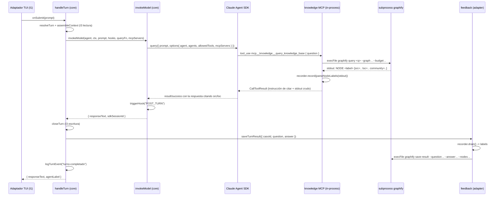
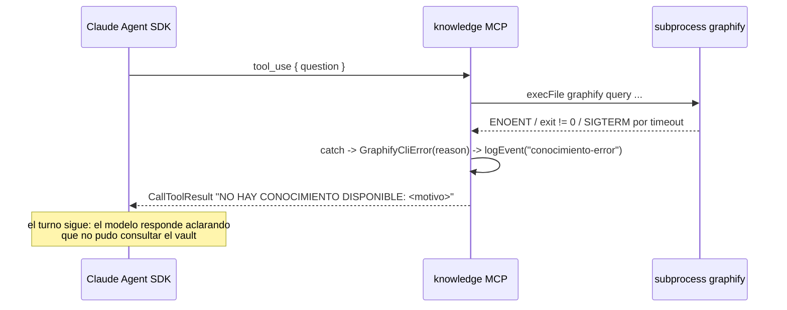

# Diseño técnico: Hito 2 — Consulta de conocimiento (v1.1.0)

**Entra con**: [`proposal.md`](proposal.md) (aprobada) · [`exploration.md`](exploration.md) (verificada en vivo) · [arc42](../../../docs/ARC42_Harness_Empresarial.md) Caja Negra 3 / I2 / Escenario de ejecución 2 · [`AGENTS.md`](../../../AGENTS.md) (reglas no negociables).

**Alcance de este documento**: el *cómo* arquitectónico — ADRs, componentes, firmas exactas, flujo de datos, fronteras. No es la lista de tareas (eso es `tasks.md`) ni el contrato de requisitos (eso es `specs/`).

---

## 1. Resumen de la arquitectura elegida

Un adaptador nuevo (`src/adapters/knowledge/`) que expone la CLI de Graphify al modelo como **un servidor MCP in-process** con una sola tool, más un **puerto de feedback** que el núcleo invoca al cerrar el turno. El núcleo no aprende nada nuevo sobre Graphify: aprende que existe *un nombre de tool de conocimiento* (constante de contrato en `src/core/knowledge/`) y *un puerto que guarda el resultado del turno* (interfaz, sin implementación).

```
                          composition root (src/main.ts)
                                      │
              ┌───────────────────────┼───────────────────────┐
              │                       │                       │
      createKnowledgeAdapter    buildOnSubmit           startTui (I1)
              │                       │
    ┌─────────┴─────────┐             │
    │ mcpServers        │             ▼
    │ feedback (puerto) │      handleTurn (core)
    └─────────┬─────────┘        │        │
              │                  │        └── closeTurn (I3) ──▶ feedback.saveTurnResult()
              │                  │                                        │
              │                  ▼                                        │
              │           invokeModel (core) ── options.mcpServers ──┐     │
              │                                                      │     │
              └──────────────────────────────────────────────────────┴─────┘
                                       │
                              src/adapters/knowledge/
                              (MCP tool handler + CLI wrapper + recorder)
                                       │
                                 subprocess `graphify`
```

Ninguna flecha va de `src/core/` a `src/adapters/*`. Las dos flechas que cruzan la frontera nacen en el composition root (única excepción documentada en `AGENTS.md` y en el module doc de `main.ts`).

---

## 2. Decisiones de arquitectura (ADR)

Numeración continúa la del arc42 (`ADR 1`: entrega incremental, `ADR 2`: monolito modular). Se usa el mismo formato: **Contexto / Decisión / Alternativas consideradas / Consecuencias**. Al cerrar el hito, estos ADRs se copian a `docs/ARC42_Harness_Empresarial.md`, sección *Decisiones de Diseño*.

### ADR 3: Servidor MCP in-process vs. servidor MCP por stdio

**Contexto**. El arc42 define I2 como "un servidor MCP propio que envuelve la CLI de Graphify" (Caja Negra 3), pero **no especifica transporte ni proceso de sistema operativo**. La exploración verificó contra `node_modules/@anthropic-ai/claude-agent-sdk/sdk.d.ts` que `Options.mcpServers` (línea 1793) acepta cuatro formas de `McpServerConfig`, entre ellas `McpSdkServerConfigWithInstance` (línea 1098) — un servidor que corre en el mismo proceso Node, construible con `createSdkMcpServer()` (línea 506) y `tool()` (línea 8234), ambos re-exportados por el paquete que ya está en `package.json`. La decisión afecta cuántos procesos se spawnean por consulta, si hay dependencias nuevas, y — decisivo con TDD estricto activo (`openspec/config.yaml: strict_tdd: true`) — si el handler de la tool se puede testear sin hablar el protocolo MCP.

**Decisión**. Servidor MCP **in-process**: `createSdkMcpServer({ name: "knowledge", tools: [tool(...)], timeout })` registrado en `options.mcpServers["knowledge"]`. El único subproceso real por consulta es `graphify` mismo. Se descarta `McpStdioServerConfig`.

La lógica del handler vive en una función propia, `handleKnowledgeQuery(question, deps)`, **framework-free** (no recibe nada de MCP, no importa `@modelcontextprotocol/sdk`); `tool()` solo la envuelve. Esa separación es lo que hace la decisión barata de revertir: si un hito futuro necesita el aislamiento de proceso, se escribe un entrypoint stdio nuevo que llama a la misma función, sin tocar el handler.

**Alternativas consideradas**:

- **Servidor MCP separado por stdio** (`McpStdioServerConfig`, lectura literal de "servidor MCP propio"): rechazada — duplica el límite de proceso por consulta (server MCP + `graphify` adentro), exige un entrypoint nuevo con ciclo de vida spawn/kill que hoy nadie pide, agrega `@modelcontextprotocol/sdk` como dependencia directa, y obliga a testear el handler a través del protocolo por stdio o a duplicar la lógica en una función aparte igual — es decir, paga todos los costos y termina en la misma separación de función que el approach in-process consigue gratis. El aislamiento de proceso que aporta no protege de nada concreto en este hito: el handler no evalúa código ni acepta entrada de terceros, solo spawnea un binario con argv fijo.
- **Sin MCP: llamar `graphify` desde el núcleo antes de invocar el modelo** (inyectar los resultados en el contexto ensamblado): rechazada — contradice el arc42 (I2 es explícitamente un servidor MCP) y, peor, hace la consulta *incondicional*: cada turno pagaría el subproceso aunque el empleado solo diga "gracias". Como tool, el modelo decide cuándo consultar, que es exactamente el comportamiento que el Escenario de ejecución 2 describe.

**Consecuencias**:

- No hay aislamiento de proceso entre el handler y el harness. Se compensa con la regla dura de que `handleKnowledgeQuery` **nunca lanza** (sección 7): un `try/catch` total que traduce cualquier falla a un `CallToolResult` de texto, mismo criterio que `createFileLogWriter` ya aplica para fallas de escritura de log.
- Aparece una dependencia declarada nueva: `zod` (ver ADR 3.1). El compromiso de la propuesta ("sin `@modelcontextprotocol/sdk` en `package.json`") se mantiene: su tipo `CallToolResult` se satisface estructuralmente, sin importarlo.
- El servidor MCP es un objeto vivo, no serializable, construido una vez por corrida del proceso. Eso empuja el wiring al composition root (sección 6) y obliga a que `toQueryOptions` reciba los `mcpServers` en vez de fabricarlos (sección 5.1).

### ADR 3.1 (sub-decisión): `zod` pasa a ser dependencia declarada

**Contexto**. `tool()` tipa su tercer parámetro como `AnyZodRawShape` (`sdk.d.ts:122, 8234`), así que el `inputSchema` de la tool tiene que construirse con Zod (`{ question: z.string()... }`). `node_modules/zod@4.4.3` existe hoy, pero **no** porque este repo lo declare: `@anthropic-ai/claude-agent-sdk` lo lista como **peerDependency** (`^4.0.0`), junto con `@modelcontextprotocol/sdk` (`^1.29.0`) y `@anthropic-ai/sdk`. npm 7+ las auto-instala, y por eso están ahí. Depender de un peer no declarado es exactamente el tipo de acoplamiento invisible que se rompe en el próximo `npm ci` con otra resolución.

**Decisión**. Agregar `"zod": "^4.4.3"` a `dependencies` de `package.json`. `@modelcontextprotocol/sdk` **no** se declara: no se importa en ningún archivo nuestro (el tipo `CallToolResult` se cumple estructuralmente devolviendo `{ content: [{ type: "text", text }] }`).

**Alternativas consideradas**:

- **Usar zod sin declararlo**: rechazada — funciona hoy por hoisting accidental, no por contrato.
- **Declarar también `@modelcontextprotocol/sdk` "por prolijidad"**: rechazada — la propuesta lo puso explícitamente fuera de alcance y no hay ningún import nuestro que lo justifique. Se declara lo que se usa.

**Consecuencias**. Se declara una dependencia que en la práctica ya estaba instalada; el diff de `node_modules` es nulo. La propuesta decía "ninguna dependencia nueva" — es una **corrección de este diseño sobre la propuesta**, no un cambio de alcance, y debe pasar por el checkpoint humano como tal.

### ADR 4: Otorgar una tool implica auto-aprobarla (`options.allowedTools`)

**Contexto**. Hallazgo de este diseño, no anticipado por la exploración ni por la propuesta. El arreglo "Fix 1" de `invoke-model.ts` (Hito 1) documenta que `Options.allowedTools` **no restringe** el toolset — es la lista de tools "auto-allowed without prompting" (`sdk.d.ts:1434`) — y que quien restringe es `Options.agents[id].tools`. La consecuencia inversa nunca se evaluó: con `permissionMode` en su default (`'default'` — "Standard permission behavior, prompts for dangerous operations", `sdk.d.ts:1818`), una tool *disponible pero no pre-aprobada* dispara un pedido de permiso. Este harness corre headless bajo una TUI de Ink: **no hay ningún canal por el que un humano apruebe un tool call**. Habilitar la tool solo en `agents[id].tools` la dejaría colgada o denegada, y el síntoma en la demo sería idéntico al de "el modelo no quiso consultar" — indistinguible y carísimo de diagnosticar.

**Decisión**. `toQueryOptions` setea, además de `options.agents[id].tools`, un `options.allowedTools` con **la misma lista** `agent.allowedTools`, cuando no está vacía. Se establece la regla: **en este harness, otorgar una tool a un agente en `definitions.ts` es auto-aprobarla en producción.** `definitions.ts` queda como el único gate de esa decisión de seguridad — que es exactamente el rol que su propio module doc ya se adjudica ("Granting tool access... is a security decision that should not be made ahead of need").

**Alternativas consideradas**:

- **Solo `agents[id].tools`, sin `allowedTools`**: rechazada — deja el turno a merced de un prompt de permiso que nadie puede contestar.
- **`permissionMode: 'bypassPermissions'`**: rechazada — requiere `allowDangerouslySkipPermissions` y desactiva el control para *todas* las tools, presentes y futuras, en vez de para la lista explícita que el agente tiene otorgada. Más ancho que lo necesario.
- **`canUseTool` (callback de permisos) auto-aprobando**: rechazada por ahora — es la puerta correcta cuando exista una política real de permisos (v2, con subagentes y A2A, donde sí habrá tools peligrosas). Hoy sería un callback que siempre dice "sí": la misma semántica que `allowedTools`, con más maquinaria.

**Consecuencias**. La lista `allowedTools` de un `AgentDefinition` deja de ser puramente descriptiva y pasa a tener efecto de seguridad directo. Se documenta en el JSDoc del campo en `definitions.ts`. Si un hito futuro necesita aprobación humana por tool call, `canUseTool` es el punto de extensión y este ADR es lo que hay que reabrir.

---

## 3. Componentes

### 3.1 Núcleo — `src/core/knowledge/knowledge-contract.ts` (nuevo)

Lo único que el núcleo sabe sobre I2. Sin imports (ni del SDK, ni de Node, ni de adaptadores).

```ts
/** Nombre del servidor MCP en `options.mcpServers`. */
export const KNOWLEDGE_MCP_SERVER_NAME = "knowledge";

/** Nombre de la tool dentro de ese servidor. */
export const KNOWLEDGE_TOOL_NAME = "query_knowledge_base";

/**
 * Nombre calificado que ve el modelo (`mcp__<server>__<tool>`, sdk.d.ts:48).
 * Es lo que va en `AgentDefinition.allowedTools`.
 */
export const KNOWLEDGE_TOOL_QUALIFIED_NAME =
  `mcp__${KNOWLEDGE_MCP_SERVER_NAME}__${KNOWLEDGE_TOOL_NAME}` as const;

/**
 * Cierre del loop de feedback (I2, escritura). Implementado por
 * `src/adapters/knowledge/`, inyectado desde el composition root.
 *
 * CONTRATO: nunca rechaza. Una falla del adaptador se loguea adentro y se
 * traga — el turno ya entregó su respuesta al empleado.
 */
export interface KnowledgeFeedbackPort {
  saveTurnResult(input: {
    readonly casoId: string;
    readonly question: string;
    readonly answer: string;
  }): Promise<void>;
}
```

**Por qué el nombre de la tool vive en el núcleo y no en el adaptador**: `definitions.ts` (núcleo) necesita el nombre calificado y no puede importar del adaptador. La dirección inversa sí es legal (`AGENTS.md`: la regla prohíbe `core → adapters`, no `adapters → core`), y el adaptador ya importa de `src/core/` en otros bloques. Así queda **una sola fuente de verdad**: si el nombre del servidor cambia, el toolset del agente y el registro MCP cambian juntos, por construcción y no por convención.

**Por qué `KnowledgeFeedbackPort` vive acá y no dentro de `handle-turn.ts`**: el precedente del repo es "el puerto se define en el módulo del núcleo que lo consume" (`MemoryContextPort` en `assemble-context.ts`, `MemoryWritePort` en `close-turn.ts`). Acá el consumidor es `handleTurn`, pero el puerto pertenece conceptualmente a la misma capacidad que la constante de la tool (I2), y `handle-turn.ts` es un módulo grande, estable y ya revisado que conviene tocar lo mínimo. Un módulo `src/core/knowledge/` de ~30 líneas que agrupa *todo lo que el núcleo sabe de conocimiento* es más legible que dispersar dos constantes y una interfaz en tres archivos existentes.

### 3.2 Adaptador — `src/adapters/knowledge/`

Cinco archivos, cada uno con una responsabilidad y su `*.test.ts` colocado (estilo del repo).

| Archivo | Exporta | Responsabilidad |
|---|---|---|
| `config.ts` | `GraphifyConfig`, `resolveGraphifyConfig`, constantes de default | Traduce env → configuración tipada. Función pura. |
| `graphify-cli.ts` | `ExecFileFn`, `defaultExecFile`, `GraphifyCliError`, `runGraphifyQuery`, `runGraphifySaveResult`, `buildQueryArgs`, `buildSaveResultArgs` | Único lugar que spawnea procesos. |
| `cited-nodes.ts` | `parseNodeLabels`, `CitedNodesRecorder`, `createCitedNodesRecorder`, `MAX_CITED_NODES` | Parseo de labels + acumulador por turno. Sin I/O. |
| `knowledge-tool.ts` | `KnowledgeToolDeps`, `handleKnowledgeQuery`, `KnowledgeToolTextResult` | Lógica del handler MCP, framework-free. Nunca lanza. |
| `index.ts` | `createKnowledgeAdapter`, `KnowledgeAdapter` | Fachada: arma servidor MCP + puerto de feedback compartiendo un recorder. Lo único que importa el composition root. |

El registro MCP (`createSdkMcpServer` + `tool`) vive dentro de `index.ts`, junto al wiring — no merece archivo propio: son ~15 líneas cuya única lógica es traducir la función pura del handler al shape del SDK.

#### `config.ts`

```ts
export interface GraphifyConfig {
  readonly bin: string;
  readonly graphPath: string;
  readonly budget: number;
  readonly queryTimeoutMs: number;
}

export const DEFAULT_GRAPHIFY_BIN = "graphify";
export const DEFAULT_GRAPH_PATH = "graphify-out/graph.json";
export const DEFAULT_BUDGET = 200;
export const DEFAULT_QUERY_TIMEOUT_MS = 15_000;
/** Ver §8. No configurable por env, a propósito. */
export const SAVE_RESULT_TIMEOUT_MS = 5_000;
/** Margen sobre `queryTimeoutMs` para el timeout de tool-call de MCP. Ver §8. */
export const MCP_TIMEOUT_MARGIN_MS = 5_000;

export function resolveGraphifyConfig(
  env: NodeJS.ProcessEnv = process.env,
): GraphifyConfig;
```

`resolveGraphifyConfig` es **pura y recibe el env como parámetro** (default `process.env`): los tests pasan un objeto literal en vez de mutar el env global del proceso de test. Un valor numérico ausente, vacío, no numérico o ≤ 0 cae al default en silencio — la configuración de un adaptador best-effort no es lugar para tirar en el arranque.

**Dónde se carga el `.env`**: `config.ts` hace `import "../../core/config/env.js"` (side-effect import). `env.ts` sigue siendo el punto único de carga de dotenv, y el adaptador queda correcto sin depender de que un entrypoint futuro se acuerde de importarlo primero. La alternativa —agregar `getGraphifyConfig()` a `env.ts`— se rechaza: metería conocimiento de Graphify (binario, ruta del grafo, budget) dentro de `src/core/`, donde no pinta nada. `getAnthropicApiKey()` está ahí por el orden crítico de carga que su propio doc explica, no como precedente para volcar toda la config de adaptadores en el núcleo.

> Nota de orden: `main.ts` mantiene `import "./core/config/env.js"` como su **primer** import (restricción crítica ya documentada ahí). El import del adaptador de conocimiento —que arrastra el SDK— va después, como todos los demás.

#### `graphify-cli.ts`

```ts
export type ExecFileFn = (
  file: string,
  args: readonly string[],
  options: { readonly timeout: number },
) => Promise<{ readonly stdout: string; readonly stderr: string }>;

export const defaultExecFile: ExecFileFn;   // promisify(execFile) de node:child_process

export type GraphifyFailureReason = "not-found" | "timeout" | "exit-code" | "unknown";

export class GraphifyCliError extends Error {
  readonly reason: GraphifyFailureReason;
  readonly cause: unknown;
  constructor(reason: GraphifyFailureReason, command: string, cause: unknown);
}

export function buildQueryArgs(question: string, config: GraphifyConfig): readonly string[];
export function buildSaveResultArgs(
  input: { question: string; answer: string; nodes: readonly string[] },
): readonly string[];

/** Devuelve el stdout crudo. Lanza `GraphifyCliError` ante cualquier falla. */
export function runGraphifyQuery(
  question: string,
  config: GraphifyConfig,
  execFileFn?: ExecFileFn,
): Promise<string>;

/** Best-effort desde el punto de vista del caller, pero acá sí lanza `GraphifyCliError`. */
export function runGraphifySaveResult(
  input: { question: string; answer: string; nodes: readonly string[] },
  config: GraphifyConfig,
  execFileFn?: ExecFileFn,
): Promise<void>;
```

Argv (formato de `query` **confirmado en vivo** por la exploración):

```
graphify query <question> --graph <graphPath> --budget <budget>
graphify save-result --question <q> --answer <a> --nodes <label1> <label2> ...
```

**`execFile` con array de argumentos, nunca `exec`/`shell: true`** — decisión de seguridad, no de estilo: `question` es texto libre escrito por el empleado y viaja a un argv. Con shell, un `"; rm -rf ..."` o un `$(...)` se interpreta; con `execFile` y `shell: false`, es un argumento opaco. Ningún caso de uso de este hito necesita shell.

Opciones fijas del `defaultExecFile`: `{ timeout, maxBuffer: 10 * 1024 * 1024, windowsHide: true }`. El `maxBuffer` explícito (10 MB) sube el default de 1 MB de Node: un `--budget` alto contra un grafo grande puede pasarse, y el síntoma sería un `ENOBUFS` opaco.

Clasificación de errores (lo que hace útil a `GraphifyCliError`):

| Señal del error crudo | `reason` | Causa típica |
|---|---|---|
| `code === "ENOENT"` | `not-found` | binario `graphify` ausente del PATH |
| `killed === true` o `signal === "SIGTERM"` | `timeout` | superó `queryTimeoutMs` |
| `code` numérico ≠ 0 | `exit-code` | `graph.json` inexistente, argumentos inválidos |
| cualquier otra cosa | `unknown` | red de seguridad |

Mismo criterio que `repository.ts` ya aplica con `isSqliteConstraintError`: el error crudo del driver no cruza la frontera del adaptador.

#### `cited-nodes.ts`

```ts
export const MAX_CITED_NODES = 20;

/** Extrae los labels de las líneas `NODE <label> [src=... loc=... community=...]`. */
export function parseNodeLabels(stdout: string): readonly string[];

export interface CitedNodesRecorder {
  record(labels: readonly string[]): void;
  /** Devuelve lo acumulado y limpia. Idempotente: una segunda llamada devuelve `[]`. */
  drain(): readonly string[];
}

export function createCitedNodesRecorder(): CitedNodesRecorder;
```

`parseNodeLabels` reconoce `/^NODE\s+(.+?)\s+\[/` por línea, con fallback `/^NODE\s+(.+?)\s*$/` para líneas sin bloque de metadatos. Deduplica preservando el orden y corta en `MAX_CITED_NODES`.

**Esto no contradice "no se parsea a JSON" de la propuesta**: lo que se devuelve al modelo sigue siendo el **stdout crudo, tal cual**. El parseo es interno y su único consumidor es el argumento `--nodes` de `save-result`. El núcleo nunca ve un label.

**Supuesto de secuencialidad del recorder** (verificado, no asumido): el recorder es un buffer mutable sin clave de turno. Es correcto porque (a) `main.ts` crea exactamente **un `caso` por corrida del proceso**, y (b) `App.tsx` bloquea la entrada en modo raw mientras hay un turno pendiente (`pendingRef`, cuyo module doc dice explícitamente que impide "a second `onSubmit` call to start before the first resolves"). Los turnos son estrictamente secuenciales. Si un hito futuro habilita turnos concurrentes o múltiples casos por proceso, **este recorder es lo primero que se rompe** — queda anotado en §10.

#### `knowledge-tool.ts`

```ts
export interface KnowledgeToolTextResult {
  readonly content: readonly [{ readonly type: "text"; readonly text: string }];
}

export interface KnowledgeToolDeps {
  /** Correlación (Concepto Transversal 3). El composition root ya lo conoce. */
  readonly casoId: string;
  readonly config: GraphifyConfig;
  readonly recorder: CitedNodesRecorder;
  readonly runQuery: (question: string, config: GraphifyConfig) => Promise<string>;
  readonly logEvent: (event: string, fields?: Readonly<Record<string, unknown>>) => void;
}

/** NUNCA lanza ni rechaza. Toda falla se traduce a texto degradado. */
export function handleKnowledgeQuery(
  question: string,
  deps: KnowledgeToolDeps,
): Promise<KnowledgeToolTextResult>;
```

Tres ramas de salida, un solo bloque `text` en todas:

1. **Hay resultados** — línea de instrucción + `\n\n` + stdout crudo:
   > `INSTRUCCIÓN: respondé usando solo estos resultados del vault y CITÁ la fuente (src, y loc cuando exista) de cada dato que uses. Si no alcanzan para responder, decilo.`
2. **Sin coincidencias** (exit 0, cero líneas `NODE`):
   > `SIN RESULTADOS: la base de conocimiento no devolvió coincidencias. Decíselo al empleado en vez de inventar una respuesta.`
3. **Degradado** (`GraphifyCliError` o cualquier throw inesperado):
   > `NO HAY CONOCIMIENTO DISPONIBLE: <motivo legible>. Respondé con lo que tengas de la conversación y aclará explícitamente que no pudiste consultar la base de conocimiento.`

`recorder.record(parseNodeLabels(stdout))` corre solo en la rama 1.

`logEvent` se inyecta ya cerrado sobre el `casoId` y el `LogTurnEventDeps` — el adaptador **no** decide el destino del log ni reimplementa `logTurnEvent`, solo lo llama (ver §9). Un adaptador puede importar de `src/core/`, pero inyectarlo mantiene el handler testeable sin tocar el archivo real de log.

#### `index.ts` (fachada)

```ts
export interface KnowledgeAdapter {
  /** Listo para `HandleTurnDeps.mcpServers` / `options.mcpServers`. */
  readonly mcpServers: NonNullable<Options["mcpServers"]>;
  readonly feedback: KnowledgeFeedbackPort;
}

export function createKnowledgeAdapter(deps: {
  readonly casoId: string;
  readonly logEvent: (event: string, fields?: Readonly<Record<string, unknown>>) => void;
  readonly config?: GraphifyConfig;      // default: resolveGraphifyConfig()
  readonly execFileFn?: ExecFileFn;      // default: defaultExecFile — el seam de los tests
}): KnowledgeAdapter;
```

Adentro: crea **un** `CitedNodesRecorder` compartido, construye el servidor MCP con `createSdkMcpServer({ name: KNOWLEDGE_MCP_SERVER_NAME, version: "1.0.0", timeout: config.queryTimeoutMs + MCP_TIMEOUT_MARGIN_MS, tools: [tool(KNOWLEDGE_TOOL_NAME, "<descripción para el modelo>", { question: z.string().describe("...") }, (args) => handleKnowledgeQuery(args.question, toolDeps))] })`, y construye `feedback` como un objeto de un método que dren el recorder y llama `runGraphifySaveResult`.

Que el recorder sea privado de la fachada es lo que permite que `KnowledgeFeedbackPort` no mencione nodos: el núcleo pide "guardá el resultado de este turno", el adaptador sabe qué citó.

**`feedback.saveTurnResult` — algoritmo exacto** (nunca rechaza):

1. `const nodes = recorder.drain()` — **siempre primero**, incluso si después se sale temprano: un turno no puede heredar los nodos del anterior.
2. Si `nodes.length === 0` → `logEvent("conocimiento-sin-consulta")` y `return` (la propuesta: "si el turno no consultó conocimiento, no se invoca").
3. `answer` se trunca a `MAX_ANSWER_CHARS` (4000) antes de ir al argv.
4. `await runGraphifySaveResult(...)` dentro de `try/catch`; éxito → `logEvent("conocimiento-guardado", { nodes: nodes.length })`; falla → `logEvent("conocimiento-guardado-fallido", { reason })` y nada más.

El truncado y el `MAX_CITED_NODES` no son cosmética: la demo corre en Windows 11, donde el largo total de la línea de comandos tiene tope duro (~32 KB). Una respuesta larga más 200 labels lo alcanza, y el modo de falla sería un `ENAMETOOLONG` intermitente y confuso.

---

## 4. Flujo de datos

### 4.1 Turno que consulta conocimiento (Escenario de ejecución 2)



### 4.2 Degradación (binario ausente / `graph.json` inexistente / timeout)



El turno completa. No hay `TurnFailedError`, no hay excepción no capturada, no hay `TurnStage` nueva.

---

## 5. Cambios exactos al núcleo

### 5.1 `src/core/turn-selector/invoke-model.ts`

**Firma nueva** — parámetro opcional agregado al final, sin romper ningún call site de Hito 1:

```ts
export async function invokeModel(
  agent: AgentDefinition,
  context: AssembledContext,
  prompt: string,
  hookEngine: HookEngine,
  queryFn: QueryFn = query,
  mcpServers?: Options["mcpServers"],   // ← nuevo
): Promise<InvokeModelResult>
```

```ts
function toQueryOptions(
  agent: AgentDefinition,
  context: AssembledContext,
  mcpServers?: Options["mcpServers"],   // ← nuevo
): Options {
  const options: Options = {
    agent: agent.id,
    agents: { [agent.id]: toSdkAgentDefinition(agent) },
  };

  if (context.resumeSessionId !== undefined) {
    options.resume = context.resumeSessionId;
  }

  // ADR 4: otorgar es auto-aprobar. Sin esto, `permissionMode: 'default'`
  // pide una aprobación que en una TUI headless nadie puede dar.
  if (agent.allowedTools.length > 0) {
    options.allowedTools = [...agent.allowedTools];
  }

  if (mcpServers !== undefined) {
    options.mcpServers = mcpServers;
  }

  return options;
}
```

Se mantiene la construcción incremental (asignar después de crear el objeto, en vez de incluir siempre la clave): con `exactOptionalPropertyTypes: true`, `mcpServers: undefined` es un error de tipo distinto de omitir la propiedad — el mismo patrón que `resume` ya usa y que su comentario actual explica.

**Alternativa rechazada — migrar `invokeModel` a objeto `deps`** (`invokeModel(agent, context, prompt, hooks, { queryFn, mcpServers })`, al estilo `HandleTurnDeps`): es la firma más linda a largo plazo, pero obliga a reescribir todos los call sites y todas las aserciones de `invoke-model.test.ts`, un archivo ya revisado y aprobado en Hito 1. El costo se paga en churn de tests bajo TDD estricto sin ganancia funcional, y el problema que un objeto `deps` resuelve (varios colaboradores parecidos en orden posicional) ya está resuelto **una capa más arriba**: `HandleTurnDeps` es donde el composition root nombra sus dependencias. Dos parámetros opcionales, ambos "colaborador inyectado con default real", es un costo aceptable. Si un tercero aparece, se hace la migración.

### 5.2 `src/core/turn-selector/handle-turn.ts`

Dos campos opcionales nuevos en `HandleTurnDeps`:

```ts
export interface HandleTurnDeps {
  // ... memory, hooks, candidateAgents, queryFn, logDeps (sin cambios)

  /** Reenviado tal cual a `invokeModel`. Omitir = turno sin conocimiento (comportamiento Hito 1). */
  readonly mcpServers?: Options["mcpServers"];

  /** Cierre del loop I2. Omitir = no se invoca `save-result`. */
  readonly knowledgeFeedback?: KnowledgeFeedbackPort;
}
```

`Options` se importa `import type` desde el SDK — `invoke-model.ts` ya establece (y justifica en su module doc) que importar el paquete del SDK no viola la regla hexagonal, que aplica al árbol `src/adapters/` de este repo, no a paquetes npm de terceros.

En el cuerpo, dos cambios:

```ts
const result = await runTurnStage("model", () =>
  invokeModel(agent, context, prompt, hooks, queryFn, mcpServers),
);
await runTurnStage("close", () => closeTurn(memory, context, agent, result, CASO_ESTADO_ACTIVO));

// Cierre del loop I2 — DESPUÉS de closeTurn y FUERA de runTurnStage: es
// best-effort por contrato y jamás debe producir un TurnFailedError.
if (knowledgeFeedback !== undefined) {
  await knowledgeFeedback.saveTurnResult({
    casoId,
    question: prompt,
    answer: result.responseText,
  });
}
```

**Por qué acá y no en el hook `POST_TURN`.** El `HookEngine` era el candidato obvio: ya existe, ya se dispara post-turno, y `HookContext` ya lleva `casoId`/`responseText`. Se rechaza por tres razones concretas:

1. **Momento equivocado**: `triggerHook("POST_TURN")` corre *dentro* de `invokeModel`, o sea dentro de `runTurnStage("model", ...)` y **antes** de la escritura I3 de `closeTurn`. "Cierre de turno" significa después del cierre, no en el medio de la etapa del modelo.
2. **Etapa mal atribuida**: si algo se escapara del handler, `runTurnStage` lo etiquetaría como falla de etapa `"model"` — un `TurnFailedError` mintiendo sobre qué falló.
3. **Contrato débil**: `HookContext` es `Readonly<Record<string, unknown>>` a propósito. El handler tendría que hacer narrowing en runtime de campos que el compilador no garantiza. Un puerto tipado es lo que el resto del núcleo ya usa para hablar con adaptadores (`MemoryContextPort`, `MemoryWritePort`, `CloseTurnDeps`), y es literalmente el patrón que la tarea pide.

`await` (y no fire-and-forget): una promesa colgando sobreviviría al `waitUntilExit()` de la TUI y al `db.close()` de `main.ts`, dejando un subproceso huérfano al salir — y sería imposible de testear determinísticamente. El costo es que un `save-result` lento retrasa el render de la respuesta; se acota con `SAVE_RESULT_TIMEOUT_MS = 5 s` (§8).

### 5.3 `src/core/agents/definitions.ts`

```ts
import { KNOWLEDGE_TOOL_QUALIFIED_NAME } from "../knowledge/knowledge-contract.js";

const CONVERSATIONAL_AGENT: AgentDefinition = {
  id: CONVERSATIONAL_AGENT_ID,
  systemPrompt:
    "Sos el agente conversacional de un arnés empresarial. Tu rol es sostener " +
    "una conversación clara y coherente con el empleado, manteniendo el " +
    "contexto de la sesión en curso. Tenés acceso a la base de conocimiento " +
    "interna de la empresa mediante la herramienta " +
    "`mcp__knowledge__query_knowledge_base`: usala siempre que la pregunta " +
    "involucre políticas, procesos, documentación o cualquier dato propio de " +
    "la organización, en vez de responder de memoria. Cuando la uses, CITÁ " +
    "SIEMPRE la fuente (el `src` del resultado, y el `loc` cuando exista) " +
    "dentro de tu respuesta. Si la herramienta no devuelve conocimiento " +
    "disponible, decíselo explícitamente al empleado en vez de inventar una " +
    "respuesta. Todavía no tenés delegación a otros agentes.",
  allowedTools: [KNOWLEDGE_TOOL_QUALIFIED_NAME],
  model: DEFAULT_AGENT_MODEL,
};
```

Tres cosas cambian, todas obligatorias:

- `allowedTools: []` → `[KNOWLEDGE_TOOL_QUALIFIED_NAME]`. Vía la constante, nunca el literal — así el nombre del servidor MCP no puede desincronizarse entre el registro y el toolset.
- El system prompt hoy **afirma lo contrario de lo que va a ser cierto** ("Todavía no tenés acceso a herramientas, base de conocimiento ni delegación"). Dejarlo sería instruir al modelo a no usar la tool que le acabamos de dar.
- La instrucción de citar se pone **en los dos lados** (system prompt y output de la tool). Es redundancia deliberada: el criterio de aceptación del hito es que la fuente aparezca en el texto renderizado, y esa es la única palanca que tenemos sobre un modelo no determinista.

La "Nota de alcance — herramientas" del module doc se reescribe: pasa de "sin tools a propósito" a "una tool, con el caso de negocio que la justifica (I2), y con la consecuencia de seguridad del ADR 4 anotada".

### 5.4 `src/core/logging/turn-logger.ts`

**Sin cambios de código.** `logTurnEvent(casoId, event, fields, deps)` ya acepta cualquier `event: string` y cualquier `fields`. La propuesta hablaba de "extender `logTurnEvent`"; el diseño confirma que no hace falta tocar el módulo — los eventos nuevos (§9) son datos, no una extensión del contrato. Se agrega, a lo sumo, una línea al module doc listando los eventos del adaptador de conocimiento como consumidores de la convención.

---

## 6. Wiring en el composition root

`createKnowledgeAdapter` se llama **una sola vez por corrida del proceso**, dentro de `startHarness()` en `src/main.ts`, junto a `openDatabase`/`createCaso` — después de crear el `caso`, porque necesita su `id` para la correlación de logs y para el recorder.

```ts
// src/main.ts, dentro de startHarness(), tras crear `caso`:
const knowledge = createKnowledgeAdapter({
  casoId: caso.id,
  logEvent: (event, fields) => logTurnEvent(caso.id, event, fields),
});
return { agents, hooks, memory, caso, db, knowledge };
```

Queda dentro del `try` de `startHarness`: si `resolveGraphifyConfig` fallara, es un error de arranque y ya tiene su reporte legible.

`buildOnSubmit` crece dos parámetros opcionales que reenvía a `handleTurn`, con el mismo patrón de spread condicional que ya usa para `logDeps` (obligatorio con `exactOptionalPropertyTypes`):

```ts
export function buildOnSubmit(
  casoId: string,
  memory: MemoryPort,
  hooks: ReturnType<typeof bootstrapHarness>["hooks"],
  agents: ReturnType<typeof bootstrapHarness>["agents"],
  logDeps?: LogTurnEventDeps,
  knowledge?: KnowledgeAdapter,          // ← nuevo, opcional
): SubmitPromptHandler
```

```ts
return handleTurn(casoId, prompt, {
  memory,
  hooks,
  candidateAgents: agents,
  ...(logDeps ? { logDeps } : {}),
  ...(knowledge
    ? { mcpServers: knowledge.mcpServers, knowledgeFeedback: knowledge.feedback }
    : {}),
});
```

Un solo parámetro `knowledge` en vez de dos sueltos: `mcpServers` y `feedback` son las dos mitades del **mismo** adaptador y comparten el recorder. Pasarlos por separado invita a que alguien inyecte uno sin el otro — y un `mcpServers` sin su `feedback` acumula nodos que nadie drena.

`main.ts` pasa `buildOnSubmit(caso.id, memory, hooks, agents, undefined, knowledge)`. `undefined` explícito en `logDeps` mantiene el default real (archivo), tal como hoy.

**Fronteras**: `src/main.ts` y `src/build-on-submit.ts` son los únicos archivos que importan `src/adapters/knowledge/`. Ninguno de los dos adaptadores (TUI, memoria, conocimiento) importa a otro. La regla no negociable se mantiene intacta.

---

## 7. Manejo de errores

**Decisión: error propio del adaptador (`GraphifyCliError`) + resolución completa dentro del handler MCP. `turn-error.ts` no se toca.**

Las dos cosas, no una u otra — la exploración planteaba la disyuntiva y la respuesta es que operan en capas distintas:

- **`GraphifyCliError` (adaptador, `graphify-cli.ts`)**: existe para que el handler distinga *por qué* falló y produzca un mensaje de degradación útil ("no está instalado" ≠ "tardó demasiado" ≠ "el grafo no existe") y un log con `reason` estructurado. Sin él, el handler solo podría decir "algo falló", y el binario ausente y el timeout serían indistinguibles en `data/harness.log`. Mismo rol que `CasoNotFoundError` en `repository.ts`: traducir el error crudo del driver a vocabulario del dominio del adaptador.
- **Resolución completa en el handler (`knowledge-tool.ts`)**: `handleKnowledgeQuery` es un `try/catch` total. Captura `GraphifyCliError` **y** cualquier throw inesperado, y devuelve siempre un `CallToolResult`. `GraphifyCliError` nunca cruza la frontera MCP.

Por qué **no** se toca `turn-error.ts`:

- `TurnStage` (`"context" | "model" | "close"`) modela **etapas del turno**. La consulta a conocimiento no es una etapa: pasa *adentro* de `"model"`, como tool call que el modelo dispara dentro del loop de `queryFn`. Agregar `"knowledge"` al union describiría mal la secuencia real.
- `TurnFailedError` significa **el turno abortó**. Una consulta de conocimiento fallida *no* aborta el turno — el criterio de aceptación exige lo contrario: el turno completa con una respuesta degradada. Convertir la falla en `TurnFailedError` rompería el entregable, no lo protegería.
- El contrato que `turn-error.ts` le promete a la TUI ("un solo tipo de error para manejar") sigue intacto: la TUI nunca ve un error de conocimiento, porque no hay ninguno que ver.

**Cadena de garantías (tres eslabones, cada uno testeado):**

| Capa | Garantía | Se rompe si |
|---|---|---|
| `runGraphifyQuery` | Toda falla sale como `GraphifyCliError` con `reason` | un error nuevo cae en `unknown` — aceptable, es la red de seguridad |
| `handleKnowledgeQuery` | **Nunca** lanza ni rechaza; siempre `CallToolResult` | nada; el `catch` es total |
| `feedback.saveTurnResult` | **Nunca** rechaza | nada; el `catch` es total |

Los dos "nunca" son cláusulas de contrato con test propio (§10), no comentarios optimistas.

---

## 8. Timeouts y configuración

La exploración dejó el timeout como riesgo abierto ("hard wall-clock sin extensión por progreso"). Decisión:

| Valor | Default | Origen | Justificación |
|---|---|---|---|
| `GRAPHIFY_TIMEOUT_MS` → `queryTimeoutMs` | **15 000 ms** | env var, con default en `config.ts` | Una `graphify query` interactiva contra el `graphify-out/graph.json` de este repo responde en el orden de cientos de ms (medido en la exploración). 15 s da ~10× de margen para grafos bastante más grandes, y sigue estando dentro de lo que un usuario tolera con un spinner en pantalla. Es env var porque el tamaño del corpus es un hecho del entorno, no del código. |
| timeout de tool-call MCP | `queryTimeoutMs + 5 000` | derivado, `MCP_TIMEOUT_MARGIN_MS` | **Tiene que ser mayor que el del subproceso.** Si MCP cortara primero, el modelo recibiría un error de protocolo en vez de nuestro texto "NO HAY CONOCIMIENTO DISPONIBLE", y la degradación diseñada en §7 no se ejercitaría nunca. El margen garantiza que nuestro `catch` gana la carrera. (`sdk.d.ts:1089`: valores < 1000 ms se ignoran; 20 s está muy por encima.) |
| `SAVE_RESULT_TIMEOUT_MS` | **5 000 ms**, constante | constante de módulo, **no** env var | `save-result` es best-effort y no produce nada que el empleado vea, pero sí está en el camino crítico del render de una respuesta ya ganada. 5 s es el techo de retraso aceptable. No es env var a propósito: es un presupuesto de UX, no un hecho del entorno — la lista de env vars de la propuesta se respeta tal cual. |
| `GRAPHIFY_BUDGET` | 200 | env var | Mismo valor que la exploración corrió en vivo. |
| `GRAPHIFY_BIN` | `"graphify"` | env var | Acepta ruta absoluta (ver riesgo Windows, §11). |
| `GRAPHIFY_GRAPH_PATH` | `"graphify-out/graph.json"` | env var | Relativo a `process.cwd()`, igual que `data/harness.db`. |

---

## 9. Logging (Concepto Transversal 3)

Se reusa `logTurnEvent`, siempre con el `casoId` del turno. Eventos nuevos:

| Evento | Cuándo | Campos |
|---|---|---|
| `conocimiento-consulta-inicio` | antes del subproceso | `questionLength` (no la pregunta: puede traer datos del empleado) |
| `conocimiento-consulta-ok` | tras stdout | `durationMs`, `nodes` |
| `conocimiento-consulta-vacia` | exit 0, cero nodos | `durationMs` |
| `conocimiento-consulta-error` | `GraphifyCliError` o throw | `reason`, `durationMs` |
| `conocimiento-sin-consulta` | cierre, recorder vacío | — |
| `conocimiento-guardado` | `save-result` ok | `nodes` |
| `conocimiento-guardado-fallido` | `save-result` falla | `reason` |

Se loguea `questionLength`, no `question`: el vault y las preguntas de los empleados pueden contener información sensible, y `data/harness.log` es un archivo plano sin rotación ni control de acceso. Los `src`/`loc` sí van implícitos en `nodes` (un conteo, no los labels) por el mismo motivo.

---

## 10. Estrategia de testing

TDD estricto activo. **Ningún test del suite por defecto ejecuta el binario `graphify` ni lee `graphify-out/graph.json`** — el seam es `ExecFileFn`, inyectable en toda la cadena (`createKnowledgeAdapter → runGraphifyQuery/runGraphifySaveResult → defaultExecFile`).

### Unitarios (fakes, en `npm test`)

| Archivo | Casos clave |
|---|---|
| `config.test.ts` | defaults con env vacío · override por env · numérico inválido/≤0 → default |
| `graphify-cli.test.ts` | argv exacto de `query` y de `save-result` · `timeout` propagado · ENOENT→`not-found`, `killed`→`timeout`, exit≠0→`exit-code`, resto→`unknown` · **nunca `shell: true`** |
| `cited-nodes.test.ts` | parseo de un fixture con el **stdout literal de la corrida en vivo** de la exploración · líneas sin `[...]` · dedupe · corte en `MAX_CITED_NODES` · `drain()` limpia y es idempotente |
| `knowledge-tool.test.ts` | rama con resultados (instrucción presente + stdout crudo intacto + recorder cargado) · rama vacía · rama degradada por cada `reason` · **`execFn` que lanza síncrono → resuelve igual** · eventos logueados con `casoId` |
| `index.test.ts` | nombre del server = `KNOWLEDGE_MCP_SERVER_NAME` · `timeout` = query + margen · `feedback` con recorder vacío no llama la CLI · con nodos llama con el argv esperado · CLI que rechaza → `saveTurnResult` resuelve igual · **drena aunque falle** (el turno siguiente no hereda nodos) |
| `invoke-model.test.ts` (+) | `mcpServers` ausente → options idénticas a Hito 1 (regresión) · presente → aparece en `options.mcpServers` · `allowedTools` se puebla desde `agent.allowedTools` (ADR 4) y se omite si está vacío |
| `definitions.test.ts` (+) | `allowedTools` contiene el nombre calificado · system prompt ya **no** afirma que no hay base de conocimiento · menciona la instrucción de citar |
| `handle-turn.test.ts` (+) | `knowledgeFeedback` se llama **después** de `closeTurn`, con `question`=prompt y `answer`=responseText · omitido → turno idéntico a Hito 1 · si un turno falla antes del cierre, no se llama |
| `build-on-submit.test.ts` (+) | `knowledge` omitido → `handleTurn` recibe deps sin las claves nuevas · presente → recibe ambas mitades juntas |

### Integración real (opt-in, fuera del gate de CI)

Un solo archivo, `src/test/integration/graphify-cli.integration.test.ts`, envuelto en `describe.skipIf(!process.env.GRAPHIFY_INTEGRATION)`:

- corre `graphify query` **real** contra el `graphify-out/graph.json` **real** de este repo,
- afirma que el stdout matchea el formato que `parseNodeLabels` espera y que devuelve ≥ 1 label.

Su razón de ser es acotada y honesta: el parseo es la única pieza cuya corrección depende de un formato de salida externo que puede cambiar de versión a versión de Graphify. Un fake nunca detecta esa deriva. Está apagado por default porque `openspec/config.yaml` declara `layers.integration: false` y porque el binario no se puede exigir en CI. El humano lo corre durante la verificación manual del entregable, y su salida sirve de evidencia para `docs/progreso/v1.1-consulta-conocimiento/`.

`save-result` **no** se cubre con test de integración: escribiría en el estado real de `graphify-out/` del repo. Su verificación es manual, dentro del end-to-end.

### Verificación manual (entregable del hito)

1. Los 3 casos de uso del plan (política interna · consulta gerencial con historial · onboarding), cada uno mostrando `src`/`loc` en la respuesta renderizada.
2. `GRAPHIFY_BIN=binario-que-no-existe npm run dev` → el turno completa con la respuesta degradada, sin stack trace.
3. `GRAPHIFY_GRAPH_PATH=ruta/inexistente.json` → ídem, con `reason: "exit-code"`.
4. `data/harness.log` muestra los eventos de §9 correlacionados por el mismo `casoId`.

---

## 11. Riesgos, supuestos y decisiones que el Implementer debe verificar antes de codear

| # | Riesgo / supuesto | Impacto | Acción |
|---|---|---|---|
| R1 | **La forma exacta de `graphify save-result` no está verificada en vivo** (la exploración solo verificó `query`). El argv de §3.2 es el que asume el plan. | Medio — el loop de feedback no cerraría, pero es best-effort: se loguea `conocimiento-guardado-fallido` y el turno no se ve afectado. | **Primera tarea del Implementer**: correr `graphify save-result --help` y ajustar `buildSaveResultArgs` (función pura, aislada exactamente para esto). Si la forma real difiere, es un cambio de una función y su test, no de diseño. |
| R2 | **Windows y los binarios `.cmd`**: si `graphify` se instala como shim `.cmd`/`.bat`, `execFile` con `shell: false` falla con `EINVAL` (endurecimiento de Node post-CVE-2024-27980). La demo corre en Windows 11. | Alto para la demo — la consulta degradaría *siempre*, con el mismo síntoma que "no instalado". | Verificar en el entorno de demo antes de la tarea de wiring. Mitigación sin resignar seguridad: apuntar `GRAPHIFY_BIN` al ejecutable real (ruta absoluta) o correr la demo donde `graphify` sea un ejecutable de verdad. **No se habilita `shell: true`**: metería la pregunta del empleado en una línea de shell (§3.2). |
| R3 | El modelo recibe las fuentes pero no las cita. | Alto — es el criterio de aceptación del hito. | Instrucción duplicada (system prompt + output de la tool). Si en la verificación manual falla, se ajusta el texto de la instrucción; es un cambio de string, no de arquitectura. |
| R4 | El recorder asume turnos secuenciales y un `caso` por proceso. | Bajo hoy (verificado: `pendingRef` en `App.tsx` + un `createCaso` por corrida). Alto el día que haya concurrencia. | Documentado en el module doc de `cited-nodes.ts` como precondición explícita. El día que se rompa, el recorder pasa a estar keyado por turno. |
| R5 | `zod` como dependencia declarada nueva contradice la letra de la propuesta ("ninguna dependencia nueva"). | Bajo — ya está instalada como peer. | Explícito en ADR 3.1; requiere OK del checkpoint humano. |
| R6 | `allowedTools` (ADR 4) cambia la postura de seguridad del harness. | Medio — decisión real, no detalle. | ADR 4 formal; JSDoc en `definitions.ts`; se copia al arc42 al cerrar el hito. |
| R7 | `save-result` en el camino crítico agrega hasta 5 s antes del render. | Bajo | Acotado por `SAVE_RESULT_TIMEOUT_MS`. Si en la práctica molesta, la salida es una cola out-of-band, no bajar el timeout. |

---

## 12. Trazabilidad — diseño ↔ criterios de aceptación de la propuesta

| Criterio (`proposal.md`) | Dónde lo resuelve este diseño |
|---|---|
| Responde citando `src`/`loc` | §3.2 (instrucción en el output de la tool) + §5.3 (system prompt) |
| 3 casos de uso, mismo adaptador | §5.3 (un solo agente, una sola tool) + §10 (verificación manual) |
| Degrada sin excepción no capturada | §7 (cadena de tres garantías) + §4.2 + §8 (margen del timeout MCP) |
| `save-result` tras responder, sin afectar el turno | §5.2 (después de `closeTurn`, fuera de `runTurnStage`) + §3.2 (contrato "nunca rechaza") |
| Logs correlacionados por `casoId` | §9 + §3.2 (`logEvent` inyectado ya cerrado sobre `casoId`) |
| Tests sin tocar el binario real | §10 (seam `ExecFileFn`; integración real opt-in y apagada por default) |
| Sin `TurnStage` nueva | §7 |
| Sin `@modelcontextprotocol/sdk` en `package.json` | ADR 3.1 (solo `zod`; `CallToolResult` se cumple estructuralmente) |
| Rollback | Quitar `KNOWLEDGE_TOOL_QUALIFIED_NAME` de `allowedTools` y no pasar `knowledge` en `buildOnSubmit`. Ambas mitades del adaptador quedan inertes; el turno vuelve a ser exactamente el de Hito 1 (cubierto por los tests de regresión de §10). |
